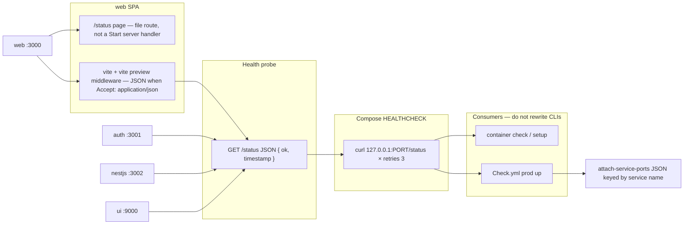

# App health signals and ports

## Target architecture



**Naming / invariants:**

| Current | After | Notes |
|---------|-------|--------|
| web `WEB_PORT` 3001 | **3000** | `play.fivenines.com:3000` |
| auth `AUTH_PORT` 3007 | **3001** | `auth.fivenines.com:3001`; issuer URLs follow |
| nestjs `NESTJS_PORT` 3006 | **3002** | `api.fivenines.com:3002` |
| ui `UI_PORT` 3004 | **9000** | Storybook |
| prod host `5004` / `5006` | **same as container** | 1:1 published ports |
| `/status` nest + auth only | **all four HTTP apps** | JSON `{ ok: true, timestamp }`; **web also has a visible status page** |
| CI curl warn / missing port warn | **3 attempts then fail** | Missing map entry is a fail |

**Dependency / policy rules:**

- Do **not** edit `tools/scripts/container/setup.tsx` or `check.tsx` unless checkup proves Docker `Health.Status` still never becomes `healthy` after HEALTHCHECK fixes.
- `container check` keeps reading Compose health (intershell `getServiceHealth`). Reliability comes from HEALTHCHECK + `/status`, not extra CLI retries.
- CI port JSON is a **signal**: `bun run ci attach-service-ports` must emit `{ "<compose-service>": <hostPort> }` that `jq --arg service` can read. If `EntityCompose.getPortMappings()` cannot resolve `${VAR:-default}`, parse/substitute in `attach-service-ports.tsx` — do not change Intershell.
- `/status` JSON must not require Postgres, JWT, or Storybook UI. Process-up only (matches today’s nest/auth). Nest/auth still need Postgres **to boot**; prod compose includes **postgres**.
- **Web is an SPA:** no TanStack Start `server.handlers` / API route. Status **page** is `src/routes/status.tsx`. Probe JSON is Vite `configureServer` + `configurePreviewServer` when `Accept` includes `application/json`.
- Prod compose healthchecks must use a binary that exists in the image (`curl` on Bun Alpine runners; nginx for ui). Do not keep `wget` unless the image actually ships it.
- Host CORS / cookie / JWKS / Vite origins stay HTTP `*.fivenines.com` with the **new** ports. Postgres stays **5432**.
- CI HTTP probes **skip postgres** (only `web`, `auth`, `nestjs`, `ui`).

**Health JSON (HTTP apps):** `{ "ok": true, "timestamp": "<ISO-8601>" }` — same as nest/auth today. Probe: `curl -sf -H 'Accept: application/json' http://127.0.0.1:$PORT/status` then grep `"ok":true` (tolerate optional space after `:`). Nest/auth ignore Accept and always JSON.

**Web status page:** file route `/status` (human UI: ok + timestamp, process-up). Do not call Nest. Do not use a Start server route.

---

## Phase 1 — Reliable `/status` + port cutover + prod compose coverage

**Goal:** Local `container setup` / `container check` and GitHub `Check.yml` production-service test fail closed on app health; published ports are 1:1 and documented.

**Hard constraints (phase 1 only):**

- Must: `/status` JSON on web, auth, nestjs, ui (dev + prod-shaped). Web: **status page** + Vite JSON probe.
- Must: Compose HEALTHCHECK `retries: 3`, probe `127.0.0.1:${PORT}/status` with `Accept: application/json` (not service DNS `http://nestjs:…`).
- Must: CI retries that HTTP probe **3** times per **HTTP** affected service, then **fails** the job. Skip `postgres`. Missing port map for web/auth/nestjs/ui is a fail.
- Must: Port remap everywhere env/compose/CORS/JWKS/Vite/tests that encode the old ports.
- Must: Prod `docker-compose.yml` includes **postgres**, **ui**, **nestjs**, **web**, **auth**. Nest/auth `depends_on` postgres healthy; `DATABASE_URL` / `AUTH_DATABASE_URL` use hostname `postgres`. 1:1 published HTTP ports. `x-fivenines-package` on app services only.
- Must not: Change `container/setup.tsx` or `container/check.tsx` as the primary fix.
- Must not: Change Postgres port, cookie names, or hostname set (`play` / `auth` / `api`).
- Must not: TanStack Start server/API route for web `/status`. Must not make Nest `/status` live under `/api`.

### Mechanical changes

| From | To | Notes |
|------|-----|-------|
| (none) | `apps/web/src/routes/status.tsx` | SPA **status page** (ok + timestamp). Tests via existing web RTL patterns. |
| (none) | Vite plugin on `apps/web/vite.config.ts` | `configureServer` + `configurePreviewServer`: `GET /status` + `Accept: application/json` → JSON body. Browsers without that Accept get the SPA page. |
| (none) | Storybook Vite middleware `/status` | `packages/ui/.storybook/main.ts` `viteFinal` — JSON (no Storybook “page” required) |
| `packages/ui/nginx.conf` | add `location = /status` | JSON for prod Storybook image |
| (none) | `apps/web/Dockerfile`, `apps/auth/Dockerfile` | Mirror nestjs prune/build/runner; `curl` on Bun runners; web `CMD` is `vite preview` |
| prod compose | add `postgres`, `web`, `auth` | Postgres like dev (`pg_isready`); nest/auth wait on it |

### Code/config surfaces (builder-workflow)

- `.github/workflows/Check.yml` — production service probe: resolve port from `service-ports`, `GET /status`, 3 attempts, fail job; drop warn-only path for known compose services.
- `tools/scripts/ci/attach-service-ports.tsx` — stable JSON map; load compose env defaults (`.env` / `.env.sample`) so `${NESTJS_PORT:-3002}` resolves; unit test against `docker-compose.yml`.
- `docker-compose.dev.yml`, `docker-compose.yml` — ports, HEALTHCHECK, env `PORT` / `*_PORT`, CORS/JWKS/API URLs, `x-fivenines-package` on new prod services.
- `.env.sample`, `apps/web/.env.sample`, `apps/auth/.env.sample`, `apps/nestjs/.env.sample`, `packages/ui/.env.sample`
- App listen defaults: `apps/web/package.json` / `vite.config.ts`, `packages/ui/.storybook/main.ts`, `packages/ui/scripts/dev-storybook.ts`, nest/auth `PORT` samples
- CORS / issuer / origins in nest bootstrap, auth redirect allowlist, web Vite `VITE_*`
- Tests that hardcode old ports (`apps/auth` login-return / redirect, `packages/auth` `login-href`, `apps/web` `browser-api-base-url`)
- `apps/nestjs/Dockerfile` runner: ensure `curl` (or equivalent) for HEALTHCHECK
- Tests: web status **page**; Vite JSON probe if unit-testable; auth `/status` if missing; nest health tests; `tools/scripts/ci/` port-map test (HTTP services only)

### Scouts (parallel inventory — code/config only)

| Scout | Task | Patterns / paths | Row budget |
|-------|------|------------------|------------|
| 1 | Port literals and env names | `rg 'WEB_PORT\|AUTH_PORT\|NESTJS_PORT\|UI_PORT\|3001\|3004\|3006\|3007\|5004\|5006'` compose, `.env*`, `package.json`, vite, storybook, CORS, tests | ≤40 |
| 2 | Health / ports CI | `docker-compose*.yml` `healthcheck`; `.github/workflows/Check.yml`; `tools/scripts/ci/attach-service-ports.tsx`; `get-affected-compose-services.ts` | ≤40 |
| 3 | `/status` + Dockerfiles | nest/auth status handlers; `apps/web/vite.config.ts`; web routes; `packages/ui/nginx.conf`; `**/Dockerfile*` | ≤40 |
| 4 | Prod compose + postgres | `docker-compose.yml` vs `docker-compose.dev.yml`; postgres health; nest/auth `DATABASE_URL` | ≤40 |

### Verification (phase 1 gate)

```bash
bun test apps/nestjs/src/__tests__/status.test.ts
bun test apps/web
bun test apps/auth
bun test packages/auth
# plus new attach-service-ports / web status tests as added
bun run overall
docker compose -f docker-compose.yml config
docker compose -f docker-compose.dev.yml config
```

If Docker is available on the builder machine (optional extra, not a substitute for overall):

```bash
bun run ci attach-service-ports --output-id service-ports --quiet
# GITHUB_OUTPUT mock: JSON keys web, auth, nestjs, ui with 3000, 3001, 3002, 9000
```

Do not require a full `container check` in CI-less agents; HEALTHCHECK correctness is reviewed in compose YAML + image `curl`.

### Documentation before PR (documentation-sync)

**When:** After verification passes and builder finishes — **not** during implement.

- `AGENTS.md` — workspace port column (web 3000, auth 3001, nestjs 3002, ui 9000)
- `apps/web/AGENTS.md`, `apps/auth/AGENTS.md`, `apps/nestjs/AGENTS.md`, `packages/ui/AGENTS.md` — port, curl `/status`, compose profiles, prod compose now includes web/auth
- `docs/CHEATSHEET.md` — host URLs, profile ports, smoke curls
- `README.md` — quick start URLs if they still say :3001 / :3006 / :3007
- `.env.sample` comments already in-repo; keep samples aligned (docs-sync only if README/AGENTS leftover)

---

## What stays out of scope

- Rewriting `container setup` / `container check` retry loops
- Changing Intershell itself
- TLS / mkcert / cookie `Secure`
- Eval app, Traefik, k8s
- Making `/status` JSON check DB or JWKS (page must not depend on Nest either)
- Renaming compose service names (`nestjs` stays `nestjs`)
- TanStack Start server routes / API handlers for health

---

## Suggested PR sequence

| PR | Content | Merge gate |
|----|---------|------------|
| PR1 | Entire phase 1 | Phase 1 verify block |

---

## Risk summary

| Risk | Mitigation |
|------|------------|
| `getPortMappings()` empty because YAML is `5004:${UI_PORT:-3004}` | 1:1 ports + env substitution in `attach-service-ports`; test JSON keys |
| Prod nest/auth never listen without DB → CI fail-closed | **postgres** on prod compose; nest/auth `depends_on: service_healthy`; `/status` JSON still DB-free |
| CI curls postgres `/status` | Probe allowlist: `web`, `auth`, `nestjs`, `ui` only |
| Bun Alpine has no `wget`/`curl` → HEALTHCHECK always unhealthy | Install `curl` on runners; probe with `curl -sf -H 'Accept: application/json'` |
| Storybook `try_files` serves `index.html` for `/status` | Exact `location = /status` in nginx; Vite middleware before SPA |
| SPA `/status` page vs JSON probe | JSON only when `Accept: application/json`; healthchecks send that header |
| CORS leftover :3001 after web→3000 | `rg` gate on old player origin ports in env/compose/src (not lockfile) |
| `check.tsx` polls 6 times while Docker retries 3 | Leave CLI; Docker `retries: 3` is the signal; CLI only waits for inspect status |
```
