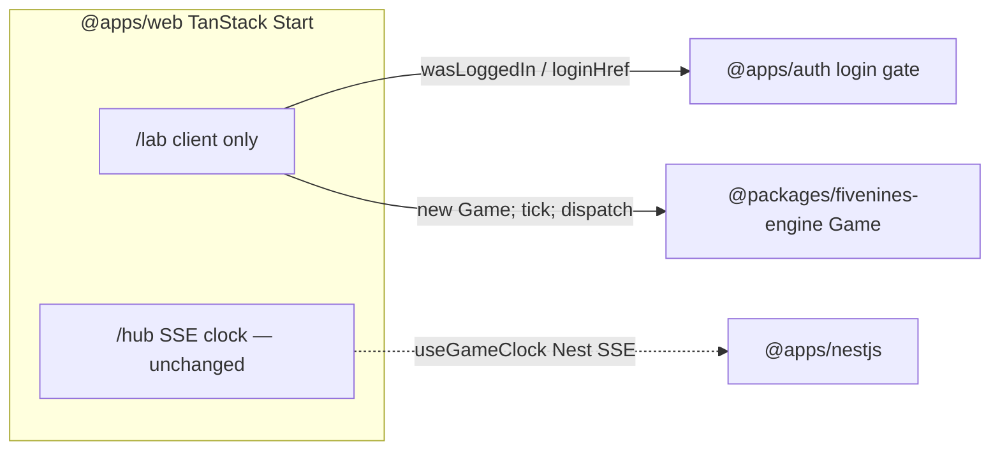

# Engine browser lab (`/lab` on `@apps/web`)

**Why this exists:** Parent plans ([five-nines-cloud-tycoon](five-nines-cloud-tycoon_79041648.plan.md), [fivenines-engine-kernel](fivenines-engine-kernel.plan.md)) still assume Nest-authoritative ticks and “UI never runs `tick`”. We are **not** executing those phases in order. This plan is a **temporary lab** so a logged-in player can see `@packages/fivenines-engine` without campaign Prisma/HTTP.

**Agreed in chat (2026-09-06):**

- Do **not** add a Vite SPA. `@apps/web` is already TanStack Start.
- `/lab` is a new route. `/`, `/status`, `/hub` stay.
- Compose stack may be up (auth exists). `/lab` does **not** call Nest campaign/clock APIs. `Game` lives in memory.
- `/lab` is **login-gated** (same public hint as `/hub`: `wasLoggedIn` → redirect to auth with `redirectUri: "/lab"`).
- Playable loop: Tick **button** (you are the clock) **plus** dispatch (`acceptProject`, `buyServer` Tiny, `buyLoadBalancer`, `attachProject`, `attachServer`).
- No auto clock, no cash/SLA/Opening Shift copy, no Prisma.

**Relationship to other plans:** Does **not** replace tycoon Phase 5 (Start + HTTP commands + SSE, no client tick). When that lands, delete `/lab` (or rewire it) and restore “web must not import the engine”. Until then, `/lab` is an explicit exception.

---

## Target architecture



**Naming / invariants**

- Time: only `game.tick()` on button click. `dispatch` does not advance the hour (engine contract).
- Authority: **this lab only** — the browser owns the `Game` instance. Nest is unused on `/lab`.
- Persistence: none. Refresh reconstructs from the selected initial.
- Login: cookie hint `wasLoggedIn`; **do not** subscribe `useGameClock` on `/lab` (that is Nest SSE and would 401-loop).
- UI: semantic HTML, numbers from `game.metrics` + graph getters. No design pass. `@packages/ui` optional; prefer native `<button>` / `<table>` / lists.

| Current | After | Notes |
|---------|-------|-------|
| `apps/web` Start, no engine dep | same app + `@packages/fivenines-engine` | Vite already used by Start |
| Engine AGENTS: web must not import | exception: `/lab` only | Nest still future production caller |
| No `/lab` | `src/routes/lab.tsx` | File route; `routeTree.gen.ts` regenerates on dev/build |

**Dependency / policy rules**

- `@apps/web` **may** depend on `@packages/fivenines-engine` (`workspace:*`).
- `/lab` **must not** import `useGameClock`, nestjs-sdk campaign/clock, or Prisma.
- Engine package: **no** Nest/UI code. Lab-only `GameInitial` (extra `offered` project) lives in **web**, not in engine fixtures (keep `oneTinyInitial` as the overload proof).
- Do not recreate `apps/vite-spa`. Do not strip Start.

---

## Phase 1 — `/lab` memory Game (Tick + dispatch)

**Goal:** Logged-in visit to `/lab` constructs a `Game`, shows last-tick metrics, and can Tick and dispatch without any campaign API.

**Hard constraints (phase 1 only):**

- Must: file route `/lab`; login gate copied from hub pattern (`AuthProvider` already on `__root__`); `redirectUri: "/lab"`.
- Must: `useRef` (or equivalent) holding one mutable `Game`; bump a render counter after `tick` / `dispatch` / reset (class mutates in place).
- Must: fixture control — start from engine `oneTinyInitial` / `twoTinyInitial`, plus **web-local** extra `offered` project so Accept is not a dead button (kernel fixtures are all `served`).
- Must: buttons — Tick; Accept (offered ids); Buy Tiny; Buy LB; Attach project→LB; Attach server→LB (ids from current graph). Catch `dispatch` throws and show the message.
- Must: display `handledRequests`, `droppedRequests`, `p95LatencyMs`, `utilization`, `errorPpm`; list customers/projects/assets/routes/pools.
- Must: tests — unauthenticated redirect (`state=%2Flab`); logged-in heading; after Tick on one-Tiny overload, dropped &gt; 0 (or equivalent assertion). Do not call real auth/Nest in tests.
- Must: add a discoverability link (e.g. from hub or home) to `/lab`. Do not replace Play → `/hub`.
- Must not: Prisma, Nest campaign routes, SSE on `/lab`, `setInterval` tick, cash, SLA, RNG offers, decline command (not in `EngineCommand`), new workspace, Start removal, engine kernel rewrite.
- Must not: docs during implement (documentation-sync after gate).

### Mechanical changes

| From | To | Notes |
|------|-----|-------|
| `apps/web/package.json` deps | add `@packages/fivenines-engine` | workspace |
| — | `apps/web/src/routes/lab.tsx` | page + gate |
| — | `apps/web/src/lab/*` | optional: `lab-initial.ts`, `use-lab-game.ts` if the route file would mix too much |
| — | `apps/web/src/routes/lab.test.tsx` | gate + tick assertion |
| `apps/web/src/routes/hub.tsx` or `index.tsx` | link to `/lab` | keep hub clock |
| `apps/web/src/routeTree.gen.ts` | regenerate | do not hand-edit |

### Code/config surfaces (builder-workflow)

- `apps/web/package.json`, `apps/web/src/routes/**`, optional `apps/web/src/lab/**`
- Do **not** edit `apps/nestjs`, Prisma, compose, `@apps/auth`, `packages/fivenines-engine/src/**` unless a Vite resolve bug forces a package `exports` tweak (prefer fixing web Vite config first).

### Scouts (parallel inventory — code/config only)

| Scout | Task | Patterns / paths | Row budget |
|-------|------|------------------|------------|
| 1 | Hub login gate + tests to copy | `apps/web/src/routes/hub.tsx`, `hub.test.tsx`, `__root.tsx` | ≤40 |
| 2 | Engine public API for the page | `packages/fivenines-engine/src/index.ts`, `game.ts` getters, `EngineCommand`, `fixtures.ts` | ≤40 |
| 3 | How web already depends on workspace packages | `apps/web/package.json`, `vite.config.ts`, other `@package` / `@packages` imports | ≤40 |

### Verification (phase 1 gate)

```bash
cd /Users/soheil/Workspace/fivenines
bun test apps/web
bun run turbo run typecheck --filter=@apps/web
bun run turbo run test --filter=@apps/web
```

Manual (compose already up): log in, open `http://play.fivenines.com:3000/lab`, Tick on one Tiny → drops; Buy Tiny + Tick → drops go to zero; Accept offered project.

Do **not** require `bun run overall` unless preparing git-pr-workflow (local `.env` / extra apps have failed overall before).

### Documentation before PR (documentation-sync)

**When:** After verification passes — **not** during implement.

- `apps/web/AGENTS.md` — `/lab` purpose, login gate, **engine import exception**, no `useGameClock`, memory-only Game
- `packages/fivenines-engine/AGENTS.md` — strike “do not import from web”; say `/lab` may import; Nest remains the future production caller
- `docs/CHEATSHEET.md` — `/lab` URL + `bun run turbo run dev --filter=@apps/web`
- Do **not** rewrite the tycoon product essay or claim backend-authoritative ticks for `/lab`

---

## What stays out of scope

- Nest campaign schema, poll worker, SSE, `applyCommand` HTTP
- Replacing TanStack Start with a Vite SPA
- Auto-advancing clock, pause/speed persistence
- Cash, SLA, Opening Shift narrative, RNG offer stream
- `declineProject` (not in engine union)
- Deleting `/hub` clock work
- Shipping this as the final player UI

---

## Suggested PR sequence

| PR | Content | Merge gate |
|----|---------|------------|
| PR1 | Phase 1 only | Phase 1 verify block |

---

## Risk summary

| Risk | Mitigation |
|------|------------|
| `/lab` accidentally uses Nest clock and bounce-loops | No `useGameClock`; tests must not `fetch` clock; `rg useGameClock apps/web/src/routes/lab` = 0 |
| `acceptProject` dead because fixtures are all `served` | Web-local initial adds an `offered` project; test that Accept is present or that offered id exists |
| React does not re-render after in-place `tick`/`dispatch` | Version counter / `useSyncExternalStore` after each mutation |
| Policy drift (“UI never ticks”) | AGENTS.md exception scoped to `/lab`; this plan marked temporary vs tycoon Phase 5 |
| Vite cannot resolve `@packages/fivenines-engine` | Scout 3; add workspace dep; only then consider `exports` |

---

## Planning gate

- **Plan:** `.cursor/plans/engine-browser-lab.plan.md`
- **Phases:** 1 (PR1)
- **Phase 1 gate:** `bun test apps/web && bun run turbo run typecheck --filter=@apps/web && bun run turbo run test --filter=@apps/web`
- **Assumptions:** Auth + web compose as you already run them; `/lab` ignores Nest game APIs; engine `dispatch`/`tick` API stays as in kernel AGENTS.md
- **Open questions:** none blocking — decline/cash/clock stay later
