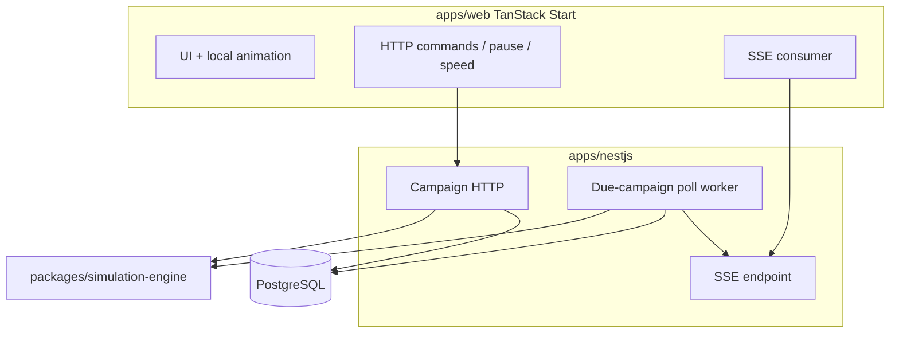

# Five Nines — Cloud Infrastructure Tycoon

**Implementation repo:** [`/Users/soheil/Workspace/fivenines`](/Users/soheil/Workspace/fivenines) (scaffold already present). **Do not implement in the old monobun repo.**

**Scaffold:** already in fivenines. Do not copy; delete unused demo apps and rename `monobun` → `fivenines`.

Primary plan (after approval, in the target repo): [`.cursor/plans/five-nines-cloud-tycoon.plan.md`](.cursor/plans/five-nines-cloud-tycoon.plan.md). Product narrative: [`docs/planning/five-nines-product.md`](docs/planning/five-nines-product.md).

Language: English in code, docs, commits, and plans.

Follow [planning-workflow](.cursor/skills/planning-workflow/SKILL.md) → per phase [builder-workflow](.cursor/skills/builder-workflow/SKILL.md) → [documentation-sync](.cursor/skills/documentation-sync/SKILL.md) → [git-pr-workflow](.cursor/skills/git-pr-workflow/SKILL.md). After Phase 0, those files live in **fivenines**.

---

## Agreed product/platform shifts (vs the previous plan)

- **Target repo is fivenines** (scaffold already present). Unnecessary apps may be deleted there.
- **Player UI is TanStack Start**, not Next.js. Workspace: `@apps/web` at `apps/web`, port **3001**.
- **NestJS is the product backend from the start**, not a later add-on. Ticks are **backend-authoritative**.
- **SSE transports tick results.** SSE does not create time. A running campaign advances even with no client (via worker + lazy catch-up).
- **Auth is copied with the scaffold.** Opening Shift does **not** require login (existing Nest `AUTH_ALLOW_HEADER_TENANT` / seed player). Real login is later, not a vertical-slice blocker.
- **Engine remains pure.** Nest calls `@packages/simulation-engine`. The UI never runs `simulateTick`.

---

## Repository impact map

**fivenines today:** scaffold is already in the repo. Phase 0 strips unused apps and renames `monobun` → `fivenines`.

**Remove:**

- Delete: `apps/nextjs`, `apps/express`, `apps/astro-ssg`, `apps/vite-spa`
- Keep: `apps/nestjs`, `apps/auth`, `packages/*` (`ui`, `utils`, `http`, `auth`, `nestjs-sdk`, `shared-react`, `shared-tanstack`), `tools/*`, turbo/biome/lefthook/compose scripts
- Add later: `apps/web` (TanStack Start), `packages/simulation-engine`

**Compose / CI after strip:** drop services and GitHub Pages build for astro-ssg; add `web` profile when Phase 5 lands. Postgres stays (`nestjs` + `auth` profiles).

**Nest today:** feature-flag Prisma (`Tenant` → `Project` → `FeatureFlag`) with almost no HTTP. **Replace that schema** in Phase 3. Do not overlay game `Project` onto flag `Project`. Do not implement feature-flag CRUD.

---

## Workspace verdicts

- **Reuse:** `@packages/ui` (import `@packages/ui/atoms`), `@packages/utils`, `@packages/http`, `@packages/nestjs-sdk` (regenerate after campaign API), `@packages/shared-tanstack` (router/query helpers; Start will own routing), `@packages/auth` + `@apps/auth` (copied, not required for first play), tools, compose, `bun test`, `bun run overall`
- **Repurpose:** `@apps/nestjs` — campaign API, clock, persistence, worker, SSE. Keep platform pieces (OpenAPI, list/error contract, JWT guards, Prisma 7).
- **New:** `@packages/simulation-engine`, `@apps/web`
- **Remove in fivenines (Phase 0):** Next.js storefront, Express stub, Astro docs demo, Vite admin SPA
- **Do not copy-as-product:** feature-flag domain, Nest Phase 3 CRUD from the old plan

---

## Target architecture



**Time authority**

- Each campaign has a persisted `GameClock`: `status` `running | paused`, `speed` `1 | 2 | 4`, `simulationTime` (tick index / simulated hour), `lastProcessedAt`, `nextTickAt`, `version`.
- New campaigns **start paused** so the player can accept/buy/deploy before time moves.
- Closing the browser does not pause. Only `POST .../pause` (or catch-up caps) stops time.
- **No `setInterval` per campaign.** One worker polls `status = running AND nextTickAt <= now`, locks the row, processes, commits, publishes.

**Command vs tick vs SSE**

```ts
// engine — unchanged split
applyCommand(state, catalog, command): CommandResult
simulateTick(state, catalog, rng): TickResult
projectView(state, catalog, lastTick): GameView
```

- `POST /api/v1/campaigns/:id/commands` applies **immediately** (optimistic `expectedVersion`), persists state + events, bumps `version`, emits SSE. Buying a server does not require a tick.
- Worker only calls `simulateTick` when a tick is due.
- `POST pause | resume` and `PATCH speed` are HTTP clock ops; they do not run the engine except resume may trigger catch-up.
- SSE is transport. Postgres is source of truth.

**HTTP (authoritative)**

- `POST /api/v1/campaigns/:campaignId/commands` with `{ expectedVersion, type, payload }`
- `POST .../pause` · `POST .../resume` · `PATCH .../speed`
- `GET .../snapshot` for resync
- `POST .../campaigns` creates Opening Shift (paused)

**SSE**

- `GET /api/v1/campaigns/:campaignId/events`
- Event names: `campaign.snapshot`, `tick.completed`, `metrics.updated`, `incident.started`, `incident.resolved`, `sla.violated`, `contract.completed`, `contract.failed`, `campaign.paused`, `campaign.resumed`, `speed.changed`
- Each stored event has unique id, `campaignId`, `version`. Reconnect uses `Last-Event-ID`. Gap too large → send `campaign.snapshot` instead of replaying history.
- Do not send full `GameState` on every tick. Send deltas + periodic snapshots.

**Lazy catch-up (not a 24/7 tick mill)**

If the player is away 2 hours at ×2, ~240 ticks are due. On resume or snapshot/SSE connect, the worker batch-runs due ticks:

- Max **24 hours** of real-time credit
- Max **1000 ticks** per catch-up batch
- v1 does **not** auto-stop catch-up on incidents (too vague; events remain in the log). Explicit pause only.

**Prisma (Phase 3 replace, not overlay)**

- `Campaign` — clock fields, `seed`, `engineVersion`, `stateJson` (serialized engine `GameState`), `version`
- `CampaignCommand` — audit of applied HTTP commands (idempotency key optional later)
- `CampaignEvent` — SSE replay log
- Optional `CampaignSnapshot` if event log would be huge; v1 can snapshot by rewriting `stateJson` and inserting occasional snapshot events
- **Do not** SQL-map Customer / Project / ProductFeature. Catalog stays in the engine package.

**Dependency policy**

- Engine: zero workspace runtime deps. No React, Start, Nest, Prisma, http, ui.
- Nest may depend on engine + prisma + auth contract.
- `@apps/web` may depend on ui, utils, http, nestjs-sdk. **Must not** depend on the engine. No `simulateTick` in the browser.
- Do not add Redis/Kafka/Bull until a later scaling initiative. Row lock + `version` is enough.

**Naming / invariants (engine)**

- Money: integer cents. Availability: ppm. CPU: millicores. No NaN.
- Commands are not ticks. SSE is not a clock.

---

## Feature-flag domain

Copied Nest schema collides with game `Project` / `Feature`. In fivenines, **replace it in Phase 3** (new migration; reset the Nest DB is acceptable). Rename scopes from `feature-flags:*` to `campaigns:read|write` (or keep header bypass for the slice). Regenerated Kubb will drop tenants list.

Engine TS: `ProductFeature`; UI copy: “Feature”.

---

## Product domain, formulas, Opening Shift, engine invariants

Unchanged from the previous plan’s engine design:

- Hierarchy: Customer → Project → ProductFeature → derived workload
- 1 tick = 1 simulated hour
- Piecewise latency (safe zone ≤70%, not raw M/M/1)
- Integer units; void component for undeployed accepted features
- Opening Shift: $400, three server types, bakery / clinic / radio; the lesson is overcommit vs spare capacity
- Engine tests still prove the loop **before** Nest or UI exist

Full formulas, customers, and teaching copy go in `docs/planning/five-nines-product.md` (written in fivenines, Phase 1 docs). Do not duplicate that essay here.

---

## Challenged assumptions

- **Keep** engine-first PRs even though Nest is in scope. Otherwise every formula bug is a DB/worker bug.
- **Keep** immediate `applyCommand` on HTTP. Queueing deploys until the next tick makes the UI feel broken.
- **Keep** campaigns starting **paused**.
- **Change** client-only simulation: rejected. Nest owns time.
- **Change** Next.js player app: rejected. TanStack Start.
- **Change** “don’t delete demo apps”: in **fivenines**, delete nextjs/express/astro/vite-spa.
- **Do not** put a per-campaign `setInterval` in Nest.
- **Do not** use TanStack Start server functions as a second simulation authority.
- **Do not** use WebSocket in MVP.
- **Do not** auto-pause catch-up on “important incidents” in v1.

---

## Phase 0 — Bootstrap fivenines

**Goal:** fivenines is a bootable toolchain minus unused frontends, named consistently, so later phases have a real workspace.

**Hard constraints:** do not copy from another repo; do not start the game engine or campaign schema; do not add TanStack Start yet; after strip, quality gate must pass.

**Mechanical**

- Remove `apps/nextjs`, `apps/express`, `apps/astro-ssg`, `apps/vite-spa` and their compose services, Dockerfiles, env samples, CI jobs (GitHub Pages astro build)
- Grep-fix leftover `@apps/nextjs` / express / astro / vite-spa filters
- Replace `monobun` → `fivenines` (compose project, DB names, JWT `aud` defaults, GitHub URLs, cache ids, `x-fivenines-package`)
- `bun install` in fivenines

**Surfaces:** almost all root config in fivenines; compose; `.github/workflows`; root `AGENTS.md` / `package.json` workspace globs (globs still fine)

**Scouts:** compose service names; `rg '@apps/nextjs|@apps/express|@apps/astro-ssg|@apps/vite-spa'`; Check.yml filters; `rg monobun`

**Verify**

```bash
cd /Users/soheil/Workspace/fivenines
bun install
bun run overall
```

**Docs before PR:** fivenines `README.md` + `AGENTS.md` “this is Five Nines”; CHEATSHEET drop deleted app commands. Copy this plan into fivenines `.cursor/plans/five-nines-cloud-tycoon.plan.md`.

---

## Phase 1 — Engine kernel

**Goal:** Testable engine: buy server, deploy fixture feature, tick, see saturation/latency/drops. No cash/SLA/Nest/UI.

**Must not:** edit Nest domain; add web app; consume RNG.

**Surfaces:** `packages/simulation-engine/**` (mirror `packages/utils`: `@tools/typescript/base.json`, explicit exports, colocated `*.test.ts`)

**Verify**

```bash
bun test packages/simulation-engine
bun run turbo run typecheck --filter=@packages/simulation-engine
bun run overall
```

**Docs:** `packages/simulation-engine/AGENTS.md`; root AGENTS workspace row; start `docs/planning/five-nines-product.md`

---

## Phase 2 — Economy, events, Opening Shift

**Goal:** Cash, SLA, reputation, typed events, serialize/replay, three-contract catalog. Fixture tests: bakery+clinic on one tiny loses; split or standard is solvent; large-for-bakery-only is unprofitable.

**Must not:** Nest; UI; random incidents. Tune **catalog constants** if the story fails, not formulas, unless a formula bug is proven.

**Surfaces:** engine `economy`, `sla`, `events`, `serialize`, `catalog/opening.ts`

**Verify:** `bun test packages/simulation-engine && bun run overall`

**Docs:** product doc customers + event schema; engine AGENTS API

---

## Phase 3 — Nest campaign API + worker

**Goal:** Replace feature-flag Prisma. Create paused Opening Shift campaign. HTTP commands and clock. Worker ticks due campaigns with row lock + version. Snapshot GET. **No SSE yet** (prove with curl + tests).

**Must:** all official mutations in one DB transaction (state, version, events, clock). Worker in `apps/nestjs/src/simulation-worker` as a **single poller**, not per-campaign timers. Nest is the only production caller of `simulateTick`.

**Must not:** SSE; TanStack Start; Redis; setInterval per campaign; SQL game catalog.

**Surfaces:** `apps/nestjs/prisma/schema.prisma` (replace), new migration, seed one campaign, `campaigns/` module, worker, tests with Nest TestingModule + Postgres when `DATABASE_URL` set. OpenAPI emit + `packages/nestjs-sdk` regenerate. Scope strings. Compose still profile `nestjs`.

**Verify**

```bash
bun test packages/simulation-engine apps/nestjs
bun run turbo run typecheck --filter=@apps/nestjs --filter=@packages/simulation-engine --filter=@packages/nestjs-sdk
cd apps/nestjs && bun run db:migrate && bun run db:seed
# curl: create campaign, buy tiny, deploy, resume, wait, GET snapshot shows tickIndex > 0
bun run overall
```

**Docs:** rewrite `apps/nestjs/AGENTS.md` as campaign control plane; CHEATSHEET nestjs smoke; cancel leftover feature-flag Phase 3 in copied plans.

---

## Phase 4 — SSE, reconnect, catch-up

**Goal:** `GET .../events` streams stored events; Last-Event-ID replay; snapshot fallback; catch-up caps on resume/connect.

**Must not:** WebSocket; client-side tick; per-campaign timers.

**Surfaces:** Nest SSE controller, event store queries, catch-up service, tests for replay and cap. SDK: EventSource is **hand-written** in web later; do not expect Kubb to generate SSE.

**Verify:** unit/integration tests for Last-Event-ID and 1000-tick cap; `bun run overall`

**Docs:** nestjs AGENTS SSE contract; product doc reconnect

---

## Phase 5 — TanStack Start player (`@apps/web`)

**Goal:** Playable Opening Shift in the browser. HTTP for commands/clock; SSE for official numbers. Local CSS animation only.

**Stack:** `@tanstack/react-start` + Vite + React 19, `bun --bun vite`, tsconfig extends `@tools/typescript/vite.json` (add a `start.json` preset only if Vite preset is insufficient). Port 3001. Compose profile `web`. `transpile`/workspace deps like other apps. Use `@packages/ui/atoms`.

**Must not:** import `@packages/simulation-engine`; run ticks in the client; Next.js; fake RSC as the game loop.

**Surfaces:** `apps/web/**`, root compose service, `package.json` workspace (glob already covers `apps/*`)

**Reuse UI:** Sidebar, Table, Progress, Badge, Button, ScrollArea, Tabs. Dense management layout, not rounded SaaS cards.

**Verify**

```bash
bun test packages/simulation-engine apps/nestjs apps/web
bun run turbo run typecheck --filter=@apps/web --filter=@apps/nestjs --filter=@packages/simulation-engine
bun run overall
```

Manual: paused start → accept bakery+clinic → buy one tiny → deploy both → resume → saturation events and cash pressure → pause → buy capacity → resume → recover. Kill the tab while running; reopen; catch-up; clock matches server.

**Docs:** `apps/web/AGENTS.md`; CHEATSHEET `bun run turbo run dev --filter=@apps/web` with nestjs+postgres.

---

## Phase 6 — Causal UX + repo identity

**Goal:** Player can answer what happened, why, which deploy, what it cost. README/AGENTS describe Five Nines, not a kitchen-sink monorepo.

**Must not:** AI-generated simulation; AWS names in the engine; extra packages.

**Verify:** `bun run overall`; `rg` in edited docs for Next.js storefront / feature-flag control plane as the product identity.

**Docs:** README, root AGENTS, CHEATSHEET, product doc UX checklist.

---

## Suggested PR sequence

- **PR0** Phase 0 bootstrap fivenines
- **PR1** Phase 1 engine kernel
- **PR2** Phase 2 economy + Opening Shift
- **PR3** Phase 3 Nest campaign + worker
- **PR4** Phase 4 SSE + catch-up
- **PR5** Phase 5 `@apps/web`
- **PR6** Phase 6 causal UX + identity

---

## Out of scope

Multiplayer, WebSocket, geo map, real AWS/Azure, K8s, HR, cooling, compliance sim, AI ticks, UGC, marketplace, mobile-first, heavy art, LB/cache/queue/replica/CDN/AZ as simulated components, Redis/Kafka, per-campaign `setInterval`, Next.js, keeping express/astro/vite/next in fivenines, feature-flag CRUD, monorepo tooling rewrite.

**Later:** real login required, provider handbook, more infrastructure components, scenario editor.

---

## Risk summary

- **Most dangerous:** Nest worker + Prisma + SSE + Start in one PR before the engine can prove overcommit vs margin. Mitigation: Phases 1–2 have **zero** Nest/UI surfaces.
- **Double clock:** client interpolates time and disagrees with server. Mitigation: UI displays `simulationTime` / `version` from SSE; local timers are cosmetic.
- **Duplicate ticks:** two workers or resume+poller. Mitigation: `UPDATE ... WHERE version = $n` or `SELECT ... FOR UPDATE`; tests for concurrent processTick.
- **SSE treated as source of truth:** reconnect without Last-Event-ID. Mitigation: persist events; snapshot fallback.
- **Catch-up storms:** 1000 ticks in one request blocking the API. Mitigation: worker does catch-up; HTTP resume enqueues; cap batch size; still one transaction per tick or small batches.
- **Feature-flag names leaking into OpenAPI:** replace schema before generating SDK for web.
- **TanStack Start server functions secretly ticking:** code review rejects engine imports in `apps/web`.
- **Copy drift:** implement only in fivenines after Phase 0.

---

## Report (planning gate)

- **Phases / PRs:** 7 (0–6)
- **Workspace architecture:** fivenines minus nextjs/express/astro/vite-spa; `@packages/simulation-engine` (pure); `@apps/nestjs` (clock, worker, SSE); `@apps/web` (TanStack Start); `@apps/auth` copied but not required to play
- **Phase 1 gate (first game code):** `bun test packages/simulation-engine && bun run turbo run typecheck --filter=@packages/simulation-engine && bun run overall` — **after Phase 0 has landed in fivenines**
- **First-phase-overall (bootstrap):** `cd /Users/soheil/Workspace/fivenines && bun run overall`
- **Assumptions:** English everywhere; strip listed apps in place (no copy); campaigns start paused; commands apply immediately; 1 tick = 1 hour; integer money; no RNG consumption in v1; no login wall for Opening Shift; no engine in the browser
- **Blocking questions remaining:** none for Phase 0. Confirm only if you want login required in Phase 5.
- **Most dangerous mistake:** building an event-sourced Nest platform (or a 15-subsystem engine) before Opening Shift is provable in engine tests and then visible as a paused/resume campaign
