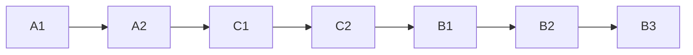

# Economy delivery master (handoff)

This file is the **source of truth for progress and order**. Slice `.design.md` / `.plan.md` files are the source of truth for **behavior**. The planning chat is discarded; do not reconstruct product from memory.

**You are the master agent.** Your context must last through as many stacked PRs as possible. You **orchestrate**; you do **not** implement, scout, typecheck, or write docs in-process if a subagent can.

---

## Master agent standing orders

1. **Read this file + the current slice spec/plan phase only.** Do not ingest all three designs every turn.
2. **Spawn subagents** (Cursor `Task`) for almost all work. Follow `.cursor/skills/builder-workflow/SKILL.md` and `orchestration.md`: scouts (`explore`) parallel; implementers disjoint paths; checkup **`composer-2-fast`**; review `code-reviewer`. Parent: short status, integrate, decide. Never paste rule/skill bodies into child prompts — `@` paths.
3. **Do not** use the master to mechanically edit `packages/` or `apps/` unless a child failed twice or the slice is a single-line fix.
4. **After each phase (or each failed checkup):** edit **this file’s YAML `todos`** (`pending` → `completed` / keep `pending`) **and** the matching slice plan YAML `todos` (`phase-N-*`, `phase-N-verify`, `phase-N-docs`). If a phase is abandoned, `cancelled` + one sentence in **Progress log** below.
5. **Stacked PRs:** each new branch is based on the previous PR branch, not a stale `main`. Merge **oldest-open first** on GitHub when checks are green (`git-pr-workflow`, including `bun overall` at ship). Same master merges as long as context is healthy.
6. **Hand off when context is fat** (long tool traces, you are dropping locks): finish the current phase’s plan-file tick + Progress log (“next: C1”), stop. Do not start the next PR in a dying context.
7. **Capacity Phase 4 / region picker is not this track.** Do not pick it up.

### Skills (read by path when executing)

| Step | Skill |
|------|--------|
| This sequence | `initiative-workflow` |
| One phase code | `builder-workflow` + `orchestration.md` |
| After checkup PASS | `documentation-sync` (slice plan **Documentation before PR** list only) |
| Commit / push / PR / merge | `git-pr-workflow` |

User prompt shape for a phase:

```text
@.cursor/plans/fivenines-economy-delivery.plan.md
@.cursor/plans/fivenines-engine-opex.plan.md
Use builder-workflow. Execute Phase 1 only (A1).
Do not edit documentation tiers; those are documentation-sync after checkup.
Spawn subagents. Tick YAML todos when done.
```

---

## Remind-checklist (every phase)

- [ ] Current `id` from YAML above is still `pending`; previous ids `completed`
- [ ] Read **only** that slice `.design.md` + that **phase** in `.plan.md`
- [ ] Builder: scouts → implementers → checkup → review (all subagents)
- [ ] No `docs/` / `AGENTS.md` in builder implementers
- [ ] documentation-sync on the phase doc list
- [ ] git-pr-workflow: branch stacked on parent PR; `bun overall`; hooks on
- [ ] Update YAML here + slice plan; append **Progress log**
- [ ] Merge parent PR if green; rebase/restack children
- [ ] Stop if context is overloaded; else start next `id`

---

## Big picture (locked)

**Game:** Five Nines cloud tycoon. Engine `@packages/fivenines-engine` is authoritative. `/lab` on `@apps/web` is the browser harness (`Game` in the client for now). Nest campaign/SSE is **later**, not these seven PRs.

**Physics already shipped:** customers → projects (offered/declined/served), regions, prefer-local overflow, CPU/net/RAM, metrics on server/game/project (`emittedRequests` only on project until C). 1 tick = 1 simulated hour. Integers. Bronze 1400 overload proofs must stay green.

**Money is three slices, this order:**

| Slice | What | Spec / plan |
|-------|------|-------------|
| **A opex** | Wallet, buy/sell cash, A2 electricity+maintenance, sticky jail | `fivenines-engine-opex.design.md` + `.plan.md` |
| **C SLA** | Per-project availability ppm + 168h busy ring; no credits | `fivenines-engine-sla.design.md` + `.plan.md` |
| **B billing** | Project contract terms, PAYG, week close, credits, 8 settlements | `fivenines-engine-billing.design.md` + `.plan.md` |

**A (locks):** cents; start 40_000; jail at `cash <= -20_000` sticky, no release; negative cash OK; buy fails if short or jailed; sell 70% salvage allowed while jailed; accept blocked while jailed; opex after physics; power `idle+floor((max-idle)*min(util,100)/100)`; idle still pays maint+idle power; Gold/Plat/Diamond purchase > 40_000; catalog table in opex spec; lab HUD cash/opex/jailed.

**C (locks):** slices get `projectId`; unroutable is a miss; ppm = handled/emitted; omit emit-0 from ring; `SLA_WINDOW_HOURS=168`; no night/day SLO; no target %; lab digits on served rows.

**B (locks):** terms on each `ProjectInitial` (no industry table, no customer MSA); PAYG = handled × rate; period 168 **global** close after increment; Z2 **period** buckets for credit (not C’s sliding ring); V1 prorate recurring; T1 credit `%` of period revenue if period ppm < target; cap 8 settlements; jail still earns; opening stub card 1¢ / $20 week / 99.0% / 10% credit; lab after A+C HUDs.

**Explicitly later (not these PRs):** customer multiplier contract; industry default cards; prestige; jail garnish; SKU unlocks; Nest `stateJson`; original bakery Opening Shift retune beyond stub card.

---

## PR sequence (M1) — stacked



| Stack | ID | Slice plan phase | Base on | Touches lab? | Gate |
|-------|-----|------------------|---------|--------------|------|
| 1 | A1 | opex Phase 1 | `main` | no | engine test + typecheck |
| 2 | A2 | opex Phase 2 | A1 | yes | + lab.test + web typecheck |
| 3 | C1 | sla Phase 1 | A2 | no | engine test + typecheck |
| 4 | C2 | sla Phase 2 | C1 | yes | + lab + web |
| 5 | B1 | billing Phase 1 | C2 | no | engine (needs C handled + A wallet) |
| 6 | B2 | billing Phase 2 | B1 | no | engine |
| 7 | B3 | billing Phase 3 | B2 | yes | + lab + web |

**Stacking vs GitHub merge:** start the next branch from the previous **branch** as soon as that phase is committed. You do **not** wait for `main` if the parent PR is still open. **Lab PRs** (A2, C2, B3) must not be developed in parallel on diverging copies of `lab-session.tsx`.

**Merge cadence:** merge A1 → restack; merge A2 → restack; … same master until handoff. Do not batch-merge if a child is red.

**C1 vs A2:** C1 is engine-only; it **stacks on A2** so lab HUD from A2 is in history, even though C1 does not edit lab. Do not run C2 until A2 is in the stack (merged or parent of C2).

---

## Invariants

- Engine is the only money/SLA authority; lab never subtracts cash by itself.
- Integers; 1 tick = 1 hour.
- 1400 physics totals unchanged by money/SLA attribution (attribute **after** `server.tick`).
- No Nest/Prisma invoices. No `bun overall` **inside builder checkup** unless the slice plan says so; **do** run it in git-pr-workflow before push.

---

## Progress log

_(Master appends here. Newest last.)_

- 2026-09-07: Plans approved. No code. Next: **A1**.
- 2026-09-07: **A1** engine wallet/opex/jail shipped in `@packages/fivenines-engine` (checkup PASS, engine AGENTS synced). Next: **A2** lab HUD after this PR is approved.
- 2026-09-07: **A2** `/lab` finance HUD (cash, jailed, opex split, buy/accept disable). Next: **C1** SLA engine.
- 2026-09-07: **C1** per-project attribution + 168h availability ring. Next: **C2** lab SLA digits.
- 2026-09-07: **C2** `/lab` served-row this-hour and window ppm. Next: **B1** PAYG.
- 2026-09-07: **B1** required commercial terms + PAYG into wallet and period buckets. Next: **B2** week close + credits.
- 2026-09-07: **B2** U1 week close, V1 prorated recurring, T1/Z2 credit, cap 8. Next: **B3** lab billing HUD.

---

## Risk

| Risk | Mitigation |
|------|------------|
| Master context dies mid-stack | Tick YAML + log “next: id”; new master reads this file first |
| Lab conflicts | One lab PR in the stack at a time |
| Credits vs HUD SLA | B uses period buckets, not `windowAvailabilityPpm` |
| Subagent too wide | Disjoint paths; ≤25 files; phase surfaces only |
