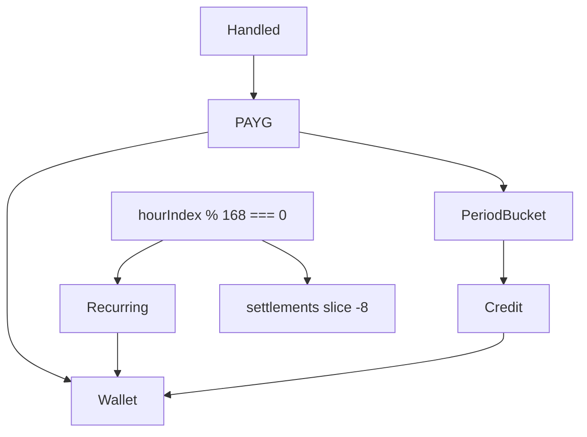

# Engine billing and credits Implementation Plan

**Goal:** Served projects earn PAYG on handled requests; every 168 global hours, prorated recurring and an SLA credit vs **this period’s** availability; keep 8 settlements. Lab shows it.

**Architecture:** Terms on `Project`. Accrue in `tick` after opex. Close on `hourIndex % 168 === 0`. Helpers in `game.commercial.ts`. Wallet remains J1 `cashCents`.

**Tech Stack:** `@packages/fivenines-engine`, `@apps/web` `/lab`.

**Spec:** [fivenines-engine-billing.design.md](fivenines-engine-billing.design.md)

**Prerequisite:** Merge opex (A) and SLA (C) first — especially both lab phases — before Phase 3.

## Global Constraints

- Integers; PAYG = handled × rate; no industry defaults; no customer multipliers.
- Billing period 168 = U1; credits from Z2 period buckets not C’s sliding ring.
- `SETTLEMENT_HISTORY_K = 8`.
- Jail does not freeze revenue.
- Do not commit unless the user asks.
- Do not edit `/lab` until Phase 3.

## Target architecture



---

## Phase 1 — Commercial fields and PAYG

**Goal:** Accept/construct requires terms; each tick credits wallet from handled.

**Hard constraints:**
- Must not close weeks or apply credits yet.
- Must not edit lab.
- Opening fixtures: stub card from spec.
- Construct throws if both PAYG and recurring are 0, or any field missing/invalid.

### Code/config surfaces

- `packages/fivenines-engine/src/catalog/commercial-policy.ts` (period hours 168, K=8, opening stub constants)
- `packages/fivenines-engine/src/project.ts` / `ProjectInitial`
- `packages/fivenines-engine/src/fixtures.ts` (all projects get stub card)
- `packages/fivenines-engine/src/game.ts` (PAYG after attribution)
- `packages/fivenines-engine/src/game.commercial.ts` (new; accrue helper)
- tests

### Scouts

| Scout | Task | Patterns / paths | Row budget |
|-------|------|------------------|------------|
| 1 | ProjectInitial | `rg 'ProjectInitial' packages/fivenines-engine` | ≤40 |
| 2 | opening fixtures | `packages/fivenines-engine/src/fixtures.ts` | ≤40 |

### Verification

```bash
bun test packages/fivenines-engine
bun run turbo run typecheck --filter=@packages/fivenines-engine
```

### Documentation before PR (documentation-sync — after build, before commit)

- `packages/fivenines-engine/AGENTS.md` — required commercial fields, PAYG formula, stub card

### Task 1

- [ ] Validate terms on construct.
- [ ] Stub card on opening + overload fixtures (overload may use 0 recurring + PAYG 1 so 1400 tests stay simple).
- [ ] Accrue PAYG; period buckets for phase 2.
- [ ] Tests: handled × rate; emit-0 → 0 PAYG; offered → 0.
- [ ] PASS.

---

## Phase 2 — Week close and credits

**Goal:** U1 close, V1 recurring, T1/Z2 credit, cap-8.

**Hard constraints:**
- Must not use `windowAvailabilityPpm` for credit.
- Must loop 168 `tick()` in tests (or construct `hourIndex` only if already exposed — prefer real ticks).
- Must not edit lab.

### Code/config surfaces

- `packages/fivenines-engine/src/game.ts` / `game.commercial.ts`
- `packages/fivenines-engine/src/project.ts` (settlements array)
- tests `billing.close.test.ts`

### Scouts

| Scout | Task | Patterns / paths | Row budget |
|-------|------|------------------|------------|
| 1 | hourIndex increment | `packages/fivenines-engine/src/game.ts` | ≤40 |

### Verification

```bash
bun test packages/fivenines-engine
bun run turbo run typecheck --filter=@packages/fivenines-engine
```

### Documentation before PR (documentation-sync — after build, before commit)

- `packages/fivenines-engine/AGENTS.md` — close order, proration, credit cap, K=8

### Task 2

- [ ] Close when `hourIndex % 168 === 0` after increment.
- [ ] Prorate recurring; Z2 ppm; T1 credit; reset buckets.
- [ ] `settlements.slice(-8)`.
- [ ] Tests from spec Proofs.
- [ ] PASS.

---

## Phase 3 — Lab billing HUD

**Goal:** Player sees PAYG this week and settlement history.

**Hard constraints:**
- Additive to A/C HUD. No Prisma.
- Keep `molecules/button`.

### Code/config surfaces

- `apps/web/src/lab/lab-session.tsx`
- `apps/web/src/routes/lab.test.tsx`

### Scouts

| Scout | Task | Patterns / paths | Row budget |
|-------|------|------------------|------------|
| 1 | lab HUD | `apps/web/src/lab/lab-session.tsx` | ≤40 |

### Verification

```bash
bun test packages/fivenines-engine apps/web/src/routes/lab.test.tsx
bun run turbo run typecheck --filter=@packages/fivenines-engine --filter=@apps/web
```

### Documentation before PR (documentation-sync — after build, before commit)

- `apps/web/AGENTS.md` if `/lab` fields are listed

### Task 3

- [ ] This-period PAYG, hours served, last settlement, ≤8 list.
- [ ] Test: buy + accept + tick → cash increases by PAYG minus opex (assert direction or exact with stub rates).
- [ ] PASS.

---

## What stays out of scope

- Customer multipliers, industry cards, prestige/garnish
- Nest invoice schema
- Uncapped AA2
- `bun overall` as phase gate

## Suggested PR sequence

| PR | Phase | Gate |
|----|-------|------|
| PR1 | 1 PAYG | Phase 1 verify |
| PR2 | 2 Close | Phase 2 verify |
| PR3 | 3 Lab | Phase 3 verify |

Ship **after** opex PRs and SLA PRs.

## Risk summary

| Risk | Mitigation |
|------|------------|
| Close uses sliding SLA | Z2 period buckets only |
| 168-tick tests slow | still cheap vs Nest; keep integer |
| Opening card prints money | 1¢/handled; retune catalog not formulas |
| Lab conflicts | Phase 3 last |
| Overload fixtures + required terms | PAYG-only stub on 1400 projects |

## Spec coverage

| Spec | Phase |
|------|-------|
| Terms + PAYG | 1 |
| Close + credit + K=8 | 2 |
| Lab | 3 |
