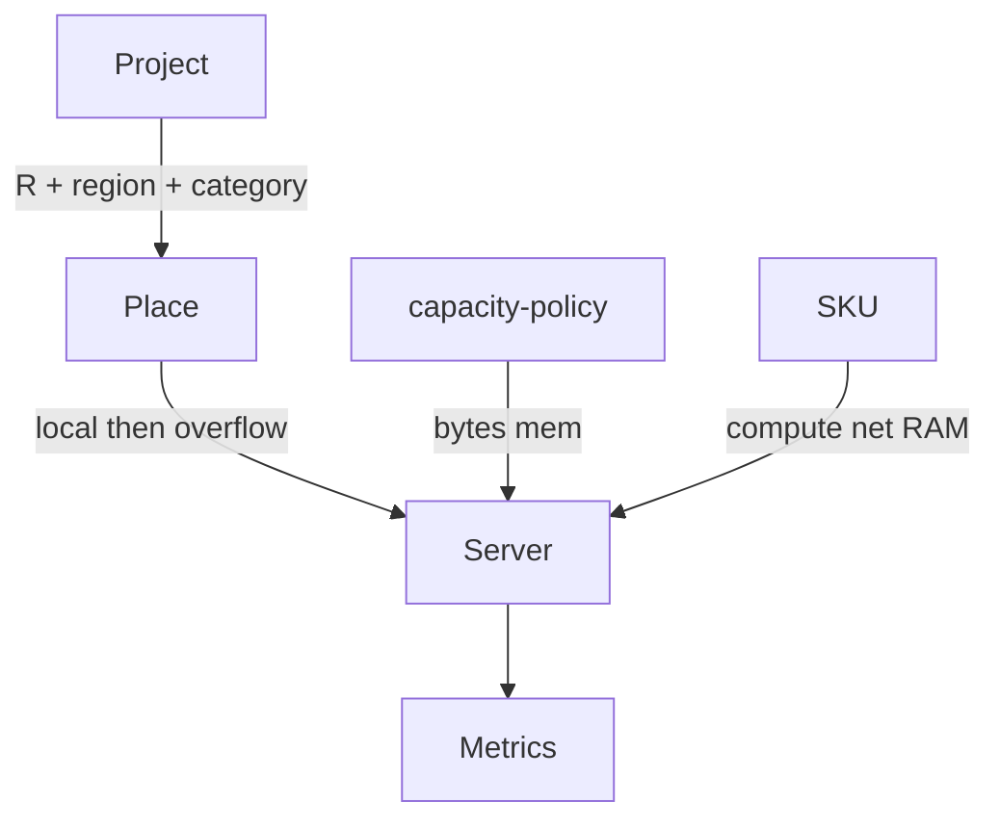

# Engine capacity and regions Implementation Plan

> **For agentic workers:** REQUIRED SUB-SKILL: Use superpowers:subagent-driven-development (recommended) or superpowers:executing-plans to implement this plan task-by-task. Steps use checkbox (`- [ ]`) syntax for tracking.

**Goal:** Projects and servers share five timezone-region buckets; demand prefers local boxes then overflows; each box checks CPU, network, and RAM; Bronze 1400 stays a same-region CPU proof.

**Architecture:** Traffic still emits requests/hour. `region` replaces `timezoneHours`. Tick assigns **per served project**. Category table supplies bytes/mem (CPU per request is 1 in v1). SKU stocks are compute/net/RAM. No AWS SDK.

**Tech Stack:** `@packages/fivenines-engine`, `@apps/web` `/lab`.

**Spec:** [fivenines-engine-capacity.design.md](fivenines-engine-capacity.design.md)

## Global Constraints

- Integers only; 1 tick = 1 hour.
- Demand unit remains requests/hour.
- Regions: `utc-8` | `utc-5` | `utc+0` | `utc+1` | `utc+9` only.
- `cpuPerRequest = 1` for all categories in this initiative.
- Overload fixtures: all `utc+0`; Bronze compute 1000.
- No Nest, cash, LB, AWS API, category CPU differentiation.
- Do not commit unless the user asks.

## Target architecture



---

## Phase 1 — Region enum, drop timezoneHours

**Goal:** One region field drives local hour and future placement; `buyServer` cannot omit region.

**Hard constraints:**
- Must not implement overflow yet (v1 behavior: **all servers eligible**, ignore region for assignment — region only stored + used for `localHour`). If that ships a unused field, still require it on construct. **Better:** Phase 1 assigns to **all** servers as today (region unused for split) so 1400 stays green; Phase 2 switches to prefer-local.
- Must not add CPU/net/RAM vectors yet.
- Must update lab `buyServer` payload or web will not typecheck — pass `region: "utc+0"` as a temporary default in lab until Phase 4 picker (allowed exception so `--filter=@apps/web` typecheck passes).

### Code/config surfaces

- `packages/fivenines-engine/src/catalog/regions.ts` (new)
- `packages/fivenines-engine/src/catalog/traffic-policy.ts` (remove timezone min/max)
- `packages/fivenines-engine/src/project.ts`
- `packages/fivenines-engine/src/traffic/project-demand.ts`
- `packages/fivenines-engine/src/server.ts` / `catalog/kernel.ts` (server.region)
- `packages/fivenines-engine/src/game.utils.ts` (`buyServer` payload, snapshot)
- `packages/fivenines-engine/src/fixtures.ts` + tests
- `apps/web/src/lab/lab-session.tsx` (hardcode `utc+0` on buy)

### Scouts

| Scout | Task | Patterns / paths | Row budget |
|-------|------|------------------|------------|
| 1 | timezoneHours | `rg 'timezoneHours' packages/fivenines-engine apps/web` | ≤40 |
| 2 | buyServer | `rg 'buyServer' packages/fivenines-engine apps/web` | ≤40 |

### Verification

```bash
bun test packages/fivenines-engine
bun run turbo run typecheck --filter=@packages/fivenines-engine --filter=@apps/web
```

`rg timezoneHours packages/fivenines-engine/src` → no matches (tests included).

### Documentation before PR

- `packages/fivenines-engine/AGENTS.md` — region enum, `buyServer.region`

### Task 1

- [ ] `REGIONS` map + `RegionId`; `offsetHoursFor(region)`.
- [ ] `ProjectInitial.region`; `localHour` uses offset from region.
- [ ] `AssetInitial` + `Server` + `buyServer` require `region`.
- [ ] Fixtures: overload `utc+0`; opening mix per spec table.
- [ ] Lab: `{ serverType, region: "utc+0" }`.
- [ ] Traffic tests: `utc+0` vs `utc-5` instead of 0 vs −3 (adjust hourIndex so evening vs night still differs for shopping).
- [ ] Engine tests + web typecheck PASS.

---

## Phase 2 — Prefer-local overflow

**Goal:** Per-project assignment; leftover remote; leftover after that unroutable.

**Hard constraints:**
- Must not add category cost vectors yet (assignment still **request counts**).
- Must keep 1400 when everything is `utc+0`.
- Must add `REMOTE_LATENCY_MS = 40` weighted into p95 when `remote` fraction > 0.

### Code/config surfaces

- `packages/fivenines-engine/src/demand.ts` (rewrite split: per project, local vs remote pools)
- `packages/fivenines-engine/src/game.ts` tick loop
- `packages/fivenines-engine/src/server.ts` (accept slices or tagged assigned counts)
- new `packages/fivenines-engine/src/placement.test.ts`

### Scouts

| Scout | Task | Patterns / paths | Row budget |
|-------|------|------------------|------------|
| 1 | tick assignment | `rg 'assignDemand|totalDemand' packages/fivenines-engine/src` | ≤40 |

### Verification

```bash
bun test packages/fivenines-engine
bun run turbo run typecheck --filter=@packages/fivenines-engine
```

### Documentation before PR

- `packages/fivenines-engine/AGENTS.md` — prefer-local, overflow, unroutable

### Task 2

- [ ] Tests from spec (local enough / overflow / remote-only / 1400 utc+0).
- [ ] Implement per-project place + split by compute stock.
- [ ] p95 includes remote weight.
- [ ] PASS.

---

## Phase 3 — Vectors and occupancy

**Goal:** Category bytes/mem; SKU CPU/net/RAM; drop on tightest axis.

**Hard constraints:**
- `cpuPerRequest = 1` for all categories.
- Bronze net/RAM fat so 1400 still CPU-binds (`cpuLoad === assignedRequests`).
- `inflightPerThousandRequests = 10`.
- New file `catalog/capacity-policy.ts` only for tunables.

### Code/config surfaces

- `packages/fivenines-engine/src/catalog/capacity-policy.ts`
- `packages/fivenines-engine/src/catalog/kernel.ts`
- `packages/fivenines-engine/src/server.ts`
- `packages/fivenines-engine/src/demand.ts` or `server.tick`
- tests

### Scouts

| Scout | Task | Patterns / paths | Row budget |
|-------|------|------------------|------------|
| 1 | millicore leftover | `rg 'millicore|cpuMillicores' packages/fivenines-engine` | ≤40 |

### Verification

```bash
bun test packages/fivenines-engine
bun run turbo run typecheck --filter=@packages/fivenines-engine
```

Rename `cpuMillicores` → `computeUnitsPerHour` in this phase if still named millicores.

### Documentation before PR

- `packages/fivenines-engine/AGENTS.md` — three axes, occupancy formula, category bytes/mem

### Task 3

- [ ] Policy table + inflight scale + remote latency constant.
- [ ] SKU fields per spec; Bronze numbers.
- [ ] `server.tick`: cpu/net/mem fit; scale handled by min ratio; util = tightest axis.
- [ ] Tests: shopping netLoad > saas at same R; tiny RAM SKU drops 1400; Bronze 1400 still CPU.
- [ ] `rg millicoresPerRequest` empty.
- [ ] PASS.

---

## Phase 4 — Lab region + optional teaching SKU

**Goal:** Player chooses region when buying; catalog may add one net- or RAM-starved SKU.

**Hard constraints:**
- Must not add AWS names.
- Must keep Tick/Accept/Reset/login.
- Must not import molecules barrel (keep `molecules/button`).

### Code/config surfaces

- `apps/web/src/lab/lab-session.tsx`
- `apps/web/src/routes/lab.test.tsx`
- optional `catalog/kernel.ts` teaching id

### Scouts

| Scout | Task | Patterns / paths | Row budget |
|-------|------|------------------|------------|
| 1 | lab buy | `apps/web/src/lab/lab-session.tsx` | ≤40 |

### Verification

```bash
bun test packages/fivenines-engine apps/web/src/routes/lab.test.tsx
bun run turbo run typecheck --filter=@packages/fivenines-engine --filter=@apps/web
```

### Documentation before PR

- `packages/fivenines-engine/AGENTS.md` if new SKU
- `apps/web/AGENTS.md` if `/lab` command list exists

### Task 4

- [ ] Region control (five options) used in `buyServer` payload.
- [ ] Test: select `utc+9`, Buy Bronze, row shows that region.
- [ ] Existing Buy Bronze tests set region (default `utc+0`).
- [ ] Optional SKU `thin-ram` or `thin-net` if time; else skip (label optional in PR).
- [ ] PASS.

---

## What stays out of scope

- Category CPU costs ≠ 1
- AWS price list / live SKUs
- CDN, LB, cash
- `bun overall` not required; use phase gates

## Suggested PR sequence

| PR | Phase | Gate |
|----|-------|------|
| PR1 | 1 | Phase 1 verify |
| PR2 | 2 | Phase 2 verify |
| PR3 | 3 | Phase 3 verify |
| PR4 | 4 | Phase 4 verify |

## Risk summary

| Risk | Mitigation |
|------|------------|
| 1400 breaks | cpuPerRequest 1; Bronze 1000; all utc+0; fat net/RAM |
| Little’s law ~0 in-flight | `inflightPerThousandRequests` |
| Lab coverage barrel | keep `molecules/button` |
| Opening TZ 3 / 8 / −2 / 6 | map table in spec, not free integers |
| Assignment ignores category until phase 3 | slices store category from phase 2 |

## Spec coverage

| Spec | Phase |
|------|-------|
| Region enum / drop TZ | 1 |
| Prefer-local overflow | 2 |
| Vectors + occupancy | 3 |
| Lab region | 4 |
| No AWS | Global |
