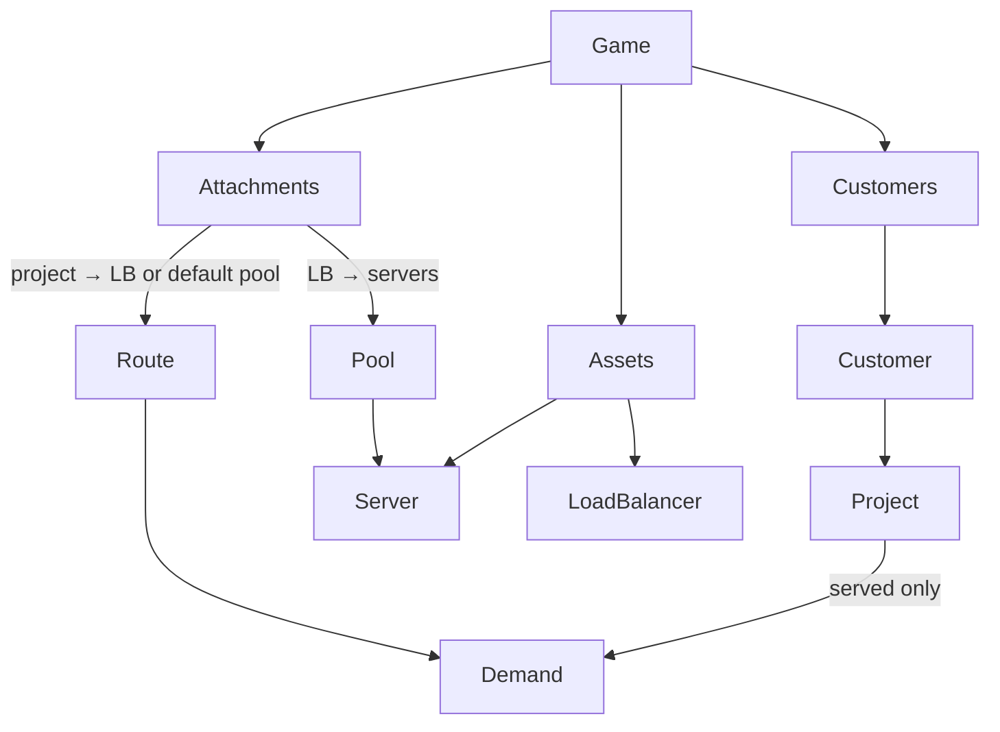

# Five Nines engine kernel (`@packages/fivenines-engine`)

Domain spec (approved): [fivenines-engine-domain.design.md](fivenines-engine-domain.design.md). Parent initiative: [five-nines-cloud-tycoon](five-nines-cloud-tycoon_79041648.plan.md).

**Ship policy:** execute locally. **Do not** run git-pr-workflow until the user asks.

Package already exists from the first Phase 1 pass. This plan **replaces** that graph (`Game.customer`, `Game.loadBalancer`, `ProductFeature`).

---

## Target architecture



**Workspace**

| Current | After | Notes |
|---------|-------|-------|
| `packages/fivenines-engine` | same | `name`: `@packages/fivenines-engine` |
| Scaffold (package.json, tsconfig, units) | keep | Do not recreate the workspace |

**Naming / invariants**

- **OO graph:** `Game` owns `customers[]`, `assets[]` (typed `Server` | `LoadBalancer`), and attachments (`projectRoutes`, `balancerPools`). No `Player` child. No singleton `Game.loadBalancer`.
- **Customer** owns projects. Does not emit load.
- **Project** status `offered` | `declined` | `served`. Emits `estimatedRequestsPerHour` only when `served`.
- **Tick:** served demand → group by route → LB or default pool assigns slices → `Server.tick()` → `Game` roll-up.
- **Default pool:** servers not in any balancer pool. Policy, not an asset. Empty routes/pools ⇒ all servers in default pool.
- **Unroutable served demand is dropped.**
- **Ids** unique in one Game (`customer.id`, `project.id` global, `asset.id`). Unknown attachment ids throw. Duplicate project route throws. A server belongs to at most one LB.
- **Units:** integers only. 1 tick = 1 simulated hour.
- **Catalog:** `TINY` only (1000 millicores, 1 millicore/request). Fixture estimates 700 + 700.
- **No `ProductFeature`.** Traffic is project-level.
- **Commands:** Phase 2 only. Discriminated union. `dispatch` does not advance time.

**Dependency / policy rules**

- Runtime dep: `@packages/utils` for `units` only (`@packages/utils/units`). DevDeps: `@tools/typescript`, `@types/bun`, `@types/node`.
- Do not wire Nest or web. Do not create `packages/simulation-engine`.
- No polymorphic `Asset` class with optional CPU/routing fields — two concrete types plus a union.

---

## Phase 1 — Graph + tick (constructors)

**Goal:** Reshape the existing package to the approved domain spec and prove the capacity loop with constructed games — no `dispatch`.

**Hard constraints (phase 1 only):**

- Must: keep `@packages/fivenines-engine`; `bun test` + turbo `typecheck` + turbo `test`.
- Must: classes `Game`, `Customer`, `Project`, `Server`, `LoadBalancer`. Attachments as data on `Game` (dedicated types/module OK).
- Must: `Game` constructor accepts `GameInitial` from the domain spec (`customers`, `assets`, `projectRoutes`, `balancerPools`).
- Must: delete `ProductFeature`. Delete `Game.customer` (singular) and `Game.loadBalancer` (always-on field).
- Must: `Game.tick()` walks served projects → routes → servers.
- Must: fixtures — two served projects at 700+700, no LB, default pool; one Tiny drops; two Tiny drop zero and lower p95. Extra offered/declined projects must not change demand.
- Must: construct-time throws for duplicate ids, unknown attachment ids, duplicate project routes, server on two LBs.
- Must not: `dispatch`, money, SLA, RNG, Nest/Prisma/UI, Opening Shift, `Player` entity, `ProductFeature`.
- Must not: docs / AGENTS.md (documentation-sync later).

### Mechanical changes

| From | To | Notes |
|------|-----|-------|
| `src/product-feature.ts` | delete | Traffic moves to `Project` |
| `src/catalog/kernel.ts` | drop feature catalog | Keep `TINY` + latency constants |
| `src/customer.ts` | `projects[]` | No load |
| `src/project.ts` | status + estimate | `tick()` returns estimate if served else 0 |
| `src/game.ts` | lists + attachments | Default pool; unroutable drops |
| `src/load-balancer.ts` | asset, not Game field | Split only its pool |
| `src/fixtures.ts` | new `GameInitial` | Two served projects, servers as assets |
| `src/index.ts` | drop ProductFeature exports | Export new initials |
| `src/overload.kernel.test.ts` | same three asserts | Plus offered/declined demand isolation; construct throws |
| `src/attachments.ts` | new if needed | Routes + pools + uniqueness |

### Code/config surfaces (builder-workflow)

- `packages/fivenines-engine/src/**` only (reshape)
- Do **not** edit `apps/**`, other packages, compose, Prisma, CI, `package.json` name

### Scouts (parallel inventory — code/config only)

| Scout | Task | Patterns / paths | Row budget |
|-------|------|------------------|------------|
| 1 | Current public API and constructors | `packages/fivenines-engine/src/**/*.ts` | ≤40 |
| 2 | Confirm no Nest/web import of engine | `rg '@packages/fivenines-engine' apps packages --glob '!packages/fivenines-engine/**'` | ≤40 |
| 3 | Tests and catalog constants to replace | `*.test.ts`, `catalog/kernel.ts`, `fixtures.ts` | ≤40 |

### Verification (phase 1 gate)

```bash
cd /Users/soheil/Workspace/fivenines
bun test packages/fivenines-engine
bun run turbo run typecheck --filter=@packages/fivenines-engine
bun run turbo run test --filter=@packages/fivenines-engine
```

Do **not** require `bun run overall` for this reshape. Last run failed on local `apps/web` / `apps/auth` `.env` (ports 3006 / 3001), not the engine.

### Documentation before PR (documentation-sync)

**When:** After verification — **and only if** preparing a commit/PR.

- `packages/fivenines-engine/AGENTS.md` — Game constructor, customers/projects/assets, attachments, tick, catalog
- Root `AGENTS.md` — workspace row if still missing
- `docs/CHEATSHEET.md` — filter `@packages/fivenines-engine`
- Do **not** write Opening Shift product essay

---

## Phase 2 — `dispatch`

**Goal:** Same overload proof, plus accept/buy/attach through a typed union. Constructors remain valid.

**Hard constraints (phase 2 only):**

- Must: `Game.dispatch(command: EngineCommand)` — unknown `type` throws.
- Must: at least `{ type: "acceptProject", payload: { projectId } }`, `{ type: "buyServer", payload: { serverType: "tiny" } }`, `{ type: "buyLoadBalancer" }`, attach project→LB and LB→server.
- Must: dispatch does not tick.
- Must: rebuild overload via construct (offered projects, zero or one server) → dispatch accept + buy → `tick()`.
- Must not: cash, SLA, RNG offer stream, Nest, UI, `ProductFeature`, PR.

### Code/config surfaces (builder-workflow)

- `packages/fivenines-engine/src/**` only

### Scouts (parallel inventory — code/config only)

| Scout | Task | Patterns / paths | Row budget |
|-------|------|------------------|------------|
| 1 | Phase 1 API as-built | `packages/fivenines-engine/src/**/*.ts` | ≤40 |
| 2 | No Nest/web import | `rg '@packages/fivenines-engine' apps packages --glob '!packages/fivenines-engine/**'` | ≤40 |

### Verification (phase 2 gate)

```bash
cd /Users/soheil/Workspace/fivenines
bun test packages/fivenines-engine
bun run turbo run typecheck --filter=@packages/fivenines-engine
bun run turbo run test --filter=@packages/fivenines-engine
```

### Documentation before PR (documentation-sync)

- Update `packages/fivenines-engine/AGENTS.md` with `dispatch` union

---

## What stays out of scope

- Auth, UI, Docker, Nest campaign/worker/SSE
- Money, SLA, RNG offers, Opening Shift copy
- `Player` entity, `ProductFeature`, polymorphic `Asset`
- `packages/simulation-engine`
- git-pr-workflow until asked
- `bun run overall` as a Phase 1 merge gate (local app `.env` noise)

---

## Suggested PR sequence

| PR | Content | Merge gate |
|----|---------|------------|
| — | **None** until the user asks | — |
| Later | Phase 1+2 together OK | Phase 2 verify block |

---

## Risk summary

| Risk | Mitigation |
|------|------------|
| Default pool empty when all servers sit behind an LB | Spec: unroutable demand dropped; fixture uses no LB |
| Offered projects leak demand | Test: extra offered/declined projects, demand still 1400 |
| LB left as Game field | `rg 'loadBalancer' packages/fivenines-engine/src/game.ts` must not be a singleton field |
| ProductFeature leftover | Delete file; `rg ProductFeature packages/fivenines-engine` = 0 |
| Duplicate / unknown ids silently accepted | Construct throws; add tests |
| Accidental Nest/UI wiring | Scout 2 = 0 matches |

---

## Report (planning gate)

- **Plan:** `.cursor/plans/fivenines-engine-kernel.plan.md`
- **Spec:** `.cursor/plans/fivenines-engine-domain.design.md`
- **Phases:** 2 local. **PRs:** 0 until asked
- **Phase 1 gate:** `bun test packages/fivenines-engine && bun run turbo run typecheck --filter=@packages/fivenines-engine && bun run turbo run test --filter=@packages/fivenines-engine`
- **Assumptions:** rebuild in place on `feat/fivenines-engine-phase-1`; no `overall` this phase
- **Open questions:** none
- **Proceed:** user said execute after spec approval
