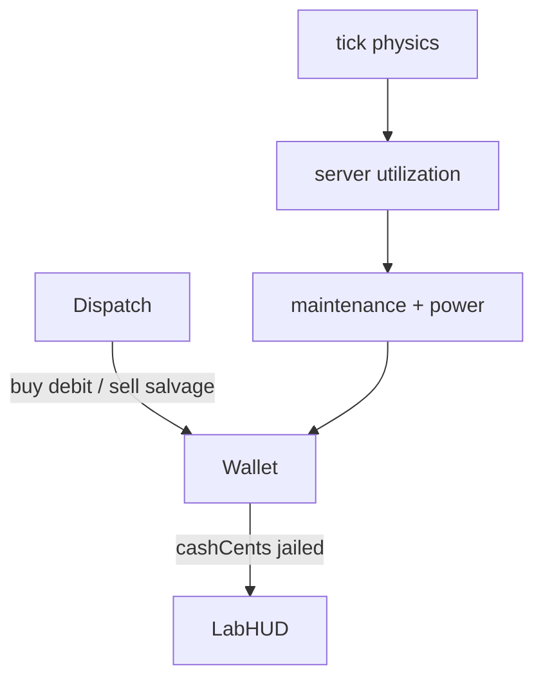

# Engine opex and cash Implementation Plan

**Goal:** Integer-cent wallet; buy/sell at catalog prices (70% salvage); hourly maintenance + power from utilization; sticky jail at −$200; lab HUD. No revenue or SLA.

**Architecture:** `cashCents` / `jailed` on `Game`. Money tunables in `catalog/economy-policy.ts`. Opex after physics in `tick`. Lab reads the finance snapshot.

**Tech Stack:** `@packages/fivenines-engine`, `@apps/web` `/lab`.

**Spec:** [fivenines-engine-opex.design.md](fivenines-engine-opex.design.md)

## Global Constraints

- Integers only; 1 tick = 1 hour; cash is signed cents.
- Salvage = `floor(purchaseCents * 70 / 100)` for every SKU.
- Jail: `cashCents <= -20_000` → sticky `jailed`; no release/prestige/garnish.
- Power: `idle + floor((max-idle) * min(util, 100) / 100)`; idle boxes still pay maintenance + idle power.
- No SLA, revenue, Nest, serialize, SKU unlock flags.
- Do not commit unless the user asks.
- Quality gate per phase (not `bun overall` unless shipping).

## Target architecture



**Naming / invariants:** Engine remains the only money authority. Lab does not subtract cash itself.

---

## Phase 1 — Engine wallet and opex

**Goal:** Tests prove purchase, salvage, A2 drain, and jail without UI.

**Hard constraints:**
- Must not edit `/lab` in this phase (typecheck engine-only).
- Must not change 1400 handled/dropped.
- Must not add revenue or SLA fields.
- `buyServer` / `acceptProject` throw when `jailed`; `sellServer` does not.

### Code/config surfaces

- `packages/fivenines-engine/src/catalog/economy-policy.ts` (new)
- `packages/fivenines-engine/src/catalog/kernel.ts` (SKU ids only; money stays in economy-policy)
- `packages/fivenines-engine/src/game.ts` / `game.utils.ts`
- `packages/fivenines-engine/src/game.finance.ts` (new; last-tick opex totals + helpers)
- `packages/fivenines-engine/src/fixtures.ts` if construct needs default cash
- `packages/fivenines-engine/src/index.ts` exports
- colocated `*.test.ts` (economy / jail / buy-sell)

### Scouts

| Scout | Task | Patterns / paths | Row budget |
|-------|------|------------------|------------|
| 1 | dispatch buy/sell | `rg 'buyServer|sellServer|acceptProject' packages/fivenines-engine` | ≤40 |
| 2 | tick end / hourIndex | `rg 'hourIndex' packages/fivenines-engine/src/game.ts` | ≤40 |

### Verification

```bash
bun test packages/fivenines-engine
bun run turbo run typecheck --filter=@packages/fivenines-engine
```

### Documentation before PR (documentation-sync — after build, before commit)

- `packages/fivenines-engine/AGENTS.md` — wallet, opex formula, jail, command throws, finance snapshot

### Task 1

- [ ] Policy constants + SKU money table from spec.
- [ ] `GameInitial.cashCents` / `jailed` optional; defaults 40_000 / false.
- [ ] After physics: charge opex, trip jail, expose finance snapshot.
- [ ] `applyCommand` money/jail rules.
- [ ] Tests from spec Proofs. 1400 fixtures unchanged.
- [ ] PASS.

---

## Phase 2 — Lab finance HUD

**Goal:** Player sees cash bleed and cannot click illegal buy/accept.

**Hard constraints:**
- Must not invent Nest campaign cash.
- Must keep Tick / Reset / region / existing metric table.
- Disable buy when jailed or `cash < purchase`; disable accept when jailed; sell if a server exists.
- Keep `@packages/ui/molecules/button` (no molecules barrel).

### Code/config surfaces

- `apps/web/src/lab/lab-session.tsx`
- `apps/web/src/lab/use-lab-game.ts` if snapshot fields need wiring
- `apps/web/src/routes/lab.test.tsx`

### Scouts

| Scout | Task | Patterns / paths | Row budget |
|-------|------|------------------|------------|
| 1 | lab session | `apps/web/src/lab/lab-session.tsx` | ≤40 |
| 2 | lab tests | `rg 'Buy|cash|Tick' apps/web/src/routes/lab.test.tsx` | ≤40 |

### Verification

```bash
bun test packages/fivenines-engine apps/web/src/routes/lab.test.tsx
bun run turbo run typecheck --filter=@packages/fivenines-engine --filter=@apps/web
```

### Documentation before PR (documentation-sync — after build, before commit)

- `apps/web/AGENTS.md` — `/lab` finance strip if that file lists lab commands
- `packages/fivenines-engine/AGENTS.md` only if snapshot names changed in phase 2

### Task 2

- [ ] HUD: cash, jailed, last opex maintenance vs power.
- [ ] Disable rules from spec; Reset restores wallet.
- [ ] Tests: starting cash visible; buy Bronze drops cash; Gold disabled at start; jailed path if cheap to fixture via construct (or skip UI jail if construct stays lab-only opening — prefer dispatch/tick sequence or test engine jail in phase 1 only and lab “Gold disabled”).
- [ ] PASS.

---

## What stays out of scope

- SLA / project-attributed handled (slice C)
- PAYG, subscriptions, credits (slice B)
- Prestige, garnish, jail release, SKU checkpoints
- Nest, Prisma, SSE
- `bun overall` not required for phase merge gates

## Suggested PR sequence

| PR | Phase | Gate |
|----|-------|------|
| PR1 | 1 Engine | Phase 1 verify |
| PR2 | 2 Lab | Phase 2 verify |

## Risk summary

| Risk | Mitigation |
|------|------------|
| 1400 metrics change | Charge opex after metrics; do not scale handled by cash |
| Util > 100 overbills | `min(utilization, 100)` |
| Lab fights engine throws | Disable buttons; keep throw as backstop |
| Salvage rounding | One `floor(purchase * 70 / 100)` helper + table tests |
| Jail never visible in lab | Phase 1 fixtures with `cashCents`; lab may not demo jail in v1 |

## Spec coverage

| Spec | Phase |
|------|-------|
| Wallet + catalog + opex + commands | 1 |
| Lab HUD + disable | 2 |
| No revenue/SLA | Global |
