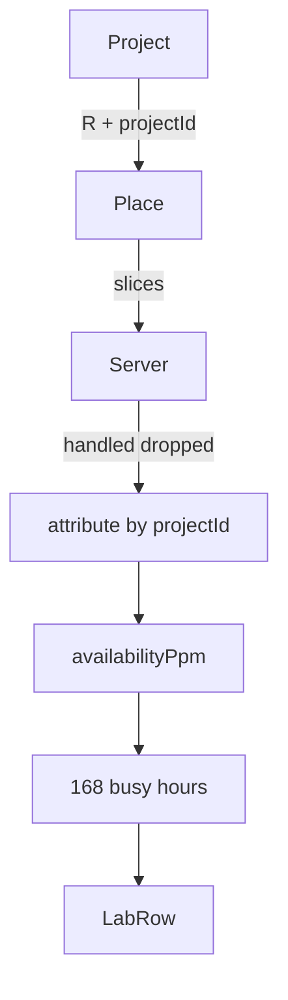

# Engine SLA measurement Implementation Plan

**Goal:** Served projects report this-hour and 168-hour availability ppm from attributed handled vs emitted. No SLA *promise* and no cash credits.

**Architecture:** Slices carry `projectId`. Box drops split proportionally. Ring on `Project`. Policy: `SLA_WINDOW_HOURS = 168`.

**Tech Stack:** `@packages/fivenines-engine`, `@apps/web` `/lab`.

**Spec:** [fivenines-engine-sla.design.md](fivenines-engine-sla.design.md)

## Global Constraints

- Integers; ppm via existing `units` style (`floor(handled * 1e6 / emitted)`).
- Unroutable is a miss. Zero-emit hours omitted from the ring.
- Do not change 1400 handled/dropped totals.
- No targets, credits, Nest, cash.
- Prefer merging **after** opex lab HUD to avoid conflicting `lab-session.tsx` edits.
- Do not commit unless the user asks.

## Target architecture



---

## Phase 1 — Attribution and ring

**Goal:** Engine tests prove conservation and sliding ppm.

**Hard constraints:**
- Must not edit `/lab`.
- Must not add contract/target fields.
- Must tag slices with `projectId` (extend current slice type).

### Code/config surfaces

- `packages/fivenines-engine/src/catalog/sla-policy.ts` (new)
- `packages/fivenines-engine/src/demand.ts` / placement
- `packages/fivenines-engine/src/server.metrics.ts` (slice `projectId`)
- `packages/fivenines-engine/src/project.metrics.ts` / `project.ts`
- `packages/fivenines-engine/src/game.ts` (attribute after server ticks)
- tests (new `sla.test.ts` or extend placement/capacity)

### Scouts

| Scout | Task | Patterns / paths | Row budget |
|-------|------|------------------|------------|
| 1 | slice type | `rg 'ServerDemandSlice|sourceRegion' packages/fivenines-engine` | ≤40 |
| 2 | project metrics | `packages/fivenines-engine/src/project.metrics.ts` | ≤40 |

### Verification

```bash
bun test packages/fivenines-engine
bun run turbo run typecheck --filter=@packages/fivenines-engine
```

### Documentation before PR (documentation-sync — after build, before commit)

- `packages/fivenines-engine/AGENTS.md` — attribution, ppm, ring, `SLA_WINDOW_HOURS`

### Task 1

- [ ] Policy constant 168.
- [ ] `projectId` on slices; unroutable tracked per project.
- [ ] Proportional attribution of box handled/dropped.
- [ ] Hourly ppm + ring; omit emitted 0.
- [ ] Tests from spec Proofs. 1400 totals unchanged.
- [ ] PASS.

---

## Phase 2 — Lab SLA digits

**Goal:** Served projects show this-hour and window ppm.

**Hard constraints:**
- Must not add charts.
- Offered/declined: no SLA numbers.
- Keep existing finance HUD if present; additive rows only.

### Code/config surfaces

- `apps/web/src/lab/lab-session.tsx`
- `apps/web/src/routes/lab.test.tsx`

### Scouts

| Scout | Task | Patterns / paths | Row budget |
|-------|------|------------------|------------|
| 1 | project rows | `apps/web/src/lab/lab-session.tsx` | ≤40 |

### Verification

```bash
bun test packages/fivenines-engine apps/web/src/routes/lab.test.tsx
bun run turbo run typecheck --filter=@packages/fivenines-engine --filter=@apps/web
```

### Documentation before PR (documentation-sync — after build, before commit)

- `apps/web/AGENTS.md` if `/lab` fields are listed

### Task 2

- [ ] Served row: hourly + window ppm or `—`.
- [ ] Test: empty fleet + accept + tick → 0 this-hour ppm (or equivalent).
- [ ] PASS.

---

## What stays out of scope

- Credits / invoice close (slice B)
- Target 99.9% catalog
- Prestige / jail garnish
- Nest

## Suggested PR sequence

| PR | Phase | Gate |
|----|-------|------|
| PR1 | 1 Engine | Phase 1 verify |
| PR2 | 2 Lab | Phase 2 verify |

## Risk summary

| Risk | Mitigation |
|------|------------|
| Attribution remainder drift | Floor + remainder; conservation test |
| Ring memory | Cap 168 × projects (Opening Shift ~10) |
| Lab merge conflict with opex | Ship A lab first |
| 1400 changes | Attribute after `server.tick`; do not rescale physics |

## Spec coverage

| Spec | Phase |
|------|-------|
| Attribution + ring | 1 |
| Lab digits | 2 |
| No credits | Global |
