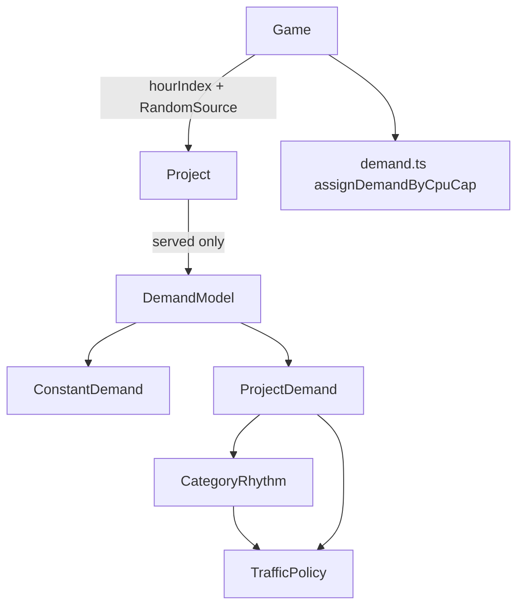

# Engine traffic profiles Implementation Plan

> **For agentic workers:** REQUIRED SUB-SKILL: Use superpowers:subagent-driven-development (recommended) or superpowers:executing-plans to implement this plan task-by-task. Steps use checkbox (`- [ ]`) syntax for tracking.

**Goal:** Served projects emit integer demand from category + timezone + campaign + live jitter, while Bronze overload fixtures stay exactly 1400 via `demand: "constant"`.

**Architecture:** `Project` owns a `DemandModel` (`ConstantDemand` | `ProjectDemand`). Rhythms read `catalog/traffic-policy.ts` only. `Game` holds `hourIndex` and a `RandomSource` (default `Math.random`). Do not put traffic math in existing `src/demand.ts` (that file is CPU-cap split).

**Tech Stack:** `@packages/fivenines-engine` (Bun tests, `units` integers), lab in `@apps/web` `/lab`.

**Spec:** [fivenines-engine-traffic.design.md](fivenines-engine-traffic.design.md)

## Global Constraints

- Integers only at the demand boundary; multipliers are permille (`1000` = ×1).
- `1 tick() = 1` simulated hour; `dispatch` does not advance `hourIndex`.
- Demand code never calls `Math.random` directly — only `random.nextUnit()`.
- Offered/declined projects return `0` and must not consume RNG.
- Kernel overload proofs: one Bronze drops; two Bronze drop `0`; extras offered/declined keep total **1400**.
- v1 categories only: `shopping` | `saas` | `portfolio`.
- No campaign `dispatch`, no weekends, no Nest, no extra categories.
- Do not commit unless the user asks.

## Target architecture



**Naming / invariants**

- `DemandKind`: `"constant"` | `"shaped"`.
- Local hour: `((hourIndex + timezoneHours) % 24 + 24) % 24`.
- First tick uses `hourIndex === 0`, then increment after metrics.

---

## Phase 1 — Engine clock and demand models

**Goal:** Kernel can tick a clock and emit shaped or constant demand with injected RNG.

**Hard constraints (phase 1 only):**
- Must keep `assignDemandByCpuCap` in `src/demand.ts` unchanged in role.
- Must not change lab UI yet (fixtures will grow required fields; `openingInitial` must still typecheck — fill shaped fields in Task 7 so web still compiles).
- Must not add `dispatch` for campaigns.

### Code/config surfaces (builder-workflow)

- `packages/fivenines-engine/src/catalog/traffic-policy.ts` (new)
- `packages/fivenines-engine/src/traffic/*` (new)
- `packages/fivenines-engine/src/project.ts`
- `packages/fivenines-engine/src/game.ts`
- `packages/fivenines-engine/src/game.utils.ts`
- `packages/fivenines-engine/src/fixtures.ts`
- `packages/fivenines-engine/src/index.ts`
- `packages/fivenines-engine/src/*.test.ts` (existing + new `src/traffic/*.test.ts`)

### Scouts (parallel inventory — code/config only)

| Scout | Task | Patterns / paths | Row budget |
|-------|------|------------------|------------|
| 1 | Project tick call sites | `rg 'project\\.tick\\(' packages/fivenines-engine` | ≤40 |
| 2 | ProjectInitial literals | `rg 'estimatedRequestsPerHour' packages/fivenines-engine apps/web` | ≤40 |
| 3 | Game constructor | `rg 'new Game\\(' packages/fivenines-engine apps/web` | ≤40 |

### Verification (phase 1 gate)

```bash
bun test packages/fivenines-engine
bun run turbo run typecheck --filter=@packages/fivenines-engine
```

### Documentation before PR (documentation-sync)

**When:** After verification passes — **not** during implement.

- `packages/fivenines-engine/AGENTS.md` — clock, `ProjectInitial` fields, constant vs shaped, no LB, Bronze catalog (file is currently stale).

---

### Task 1: Traffic policy catalog

**Files:**
- Create: `packages/fivenines-engine/src/catalog/traffic-policy.ts`
- Test: `packages/fivenines-engine/src/catalog/traffic-policy.test.ts`

**Interfaces:**
- Consumes: nothing
- Produces: `TRAFFIC_POLICY` object used by rhythms and `ProjectDemand`

- [ ] **Step 1: Write the failing test**

```ts
import { describe, expect, it } from "bun:test";

import { TRAFFIC_POLICY } from "./traffic-policy";

describe("TRAFFIC_POLICY - v1 tables", () => {
	it("uses shopping evening permille 1400 and saas night permille 200", () => {
		expect(TRAFFIC_POLICY.rhythm.shopping).toContainEqual({
			startHour: 17,
			endHour: 22,
			permille: 1400,
		});
		expect(TRAFFIC_POLICY.rhythm.saas).toContainEqual({
			startHour: 0,
			endHour: 7,
			permille: 200,
		});
	});
});
```

- [ ] **Step 2: Run test to verify it fails**

Run: `bun test packages/fivenines-engine/src/catalog/traffic-policy.test.ts`

Expected: FAIL (module not found)

- [ ] **Step 3: Write the policy file**

```ts
export const TRAFFIC_POLICY = {
	timezoneHours: { min: -12, max: 14 },
	campaignWindowPermille: 1500,
	idlePermille: 1000,
	fatSpike: {
		durationHours: 48,
		permille: 2000,
		triggerPerThousandProne: 80,
		triggerPerThousand: 20,
	},
	weakSpike: {
		durationHours: 3,
		permille: 1250,
		triggerPerThousand: 150,
	},
	jitter: { minPermille: 850, span: 300 },
	rhythm: {
		shopping: [
			{ startHour: 0, endHour: 7, permille: 400 },
			{ startHour: 8, endHour: 11, permille: 700 },
			{ startHour: 12, endHour: 13, permille: 900 },
			{ startHour: 14, endHour: 16, permille: 900 },
			{ startHour: 17, endHour: 22, permille: 1400 },
			{ startHour: 23, endHour: 23, permille: 800 },
		],
		saas: [
			{ startHour: 0, endHour: 7, permille: 200 },
			{ startHour: 8, endHour: 11, permille: 1100 },
			{ startHour: 12, endHour: 13, permille: 800 },
			{ startHour: 14, endHour: 16, permille: 1200 },
			{ startHour: 17, endHour: 22, permille: 400 },
			{ startHour: 23, endHour: 23, permille: 300 },
		],
		portfolio: [
			{ startHour: 0, endHour: 7, permille: 500 },
			{ startHour: 8, endHour: 11, permille: 600 },
			{ startHour: 12, endHour: 13, permille: 600 },
			{ startHour: 14, endHour: 16, permille: 700 },
			{ startHour: 17, endHour: 22, permille: 500 },
			{ startHour: 23, endHour: 23, permille: 500 },
		],
	},
} as const;

export type TrafficHourBand = (typeof TRAFFIC_POLICY.rhythm.shopping)[number];
```

Bands are inclusive on both `startHour` and `endHour`.

- [ ] **Step 4: Run test to verify it passes**

Run: `bun test packages/fivenines-engine/src/catalog/traffic-policy.test.ts`

Expected: PASS

---

### Task 2: RandomSource

**Files:**
- Create: `packages/fivenines-engine/src/traffic/random-source.ts`
- Test: `packages/fivenines-engine/src/traffic/random-source.test.ts`

**Interfaces:**
- Consumes: none
- Produces:

```ts
export interface RandomSource {
	nextUnit(): number;
}

export class MathRandomSource implements RandomSource {
	nextUnit(): number {
		return Math.random();
	}
}

export class SequenceRandomSource implements RandomSource {
	#index = 0;

	constructor(private readonly values: readonly number[]) {}

	nextUnit(): number {
		const value = this.values[this.#index];

		if (value === undefined) {
			throw new Error("random sequence exhausted");
		}

		this.#index += 1;

		return value;
	}
}

export class FixedRandomSource implements RandomSource {
	constructor(private readonly value: number) {}

	nextUnit(): number {
		return this.value;
	}
}
```

`FixedRandomSource(0.5)` is the spec’s idle stub: no fat (`floor(500) >= 80`), no weak (`>= 150`), jitter permille `850 + floor(0.5 * 300) = 1000`.

- [ ] **Step 1: Failing test** — `nextUnit` on `SequenceRandomSource([0.1, 0.2])` returns those values then throws.

- [ ] **Step 2: Run** `bun test packages/fivenines-engine/src/traffic/random-source.test.ts` — expect FAIL

- [ ] **Step 3: Implement** the three classes as above. Do not export `SequenceRandomSource` from package `index.ts` unless tests import via relative path (prefer relative imports in engine tests).

- [ ] **Step 4: Run** same test — expect PASS

---

### Task 3: CategoryRhythm

**Files:**
- Create: `packages/fivenines-engine/src/traffic/local-hour.ts`
- Create: `packages/fivenines-engine/src/traffic/category-rhythm.ts`
- Test: `packages/fivenines-engine/src/traffic/category-rhythm.test.ts`

**Interfaces:**
- Consumes: `TRAFFIC_POLICY`
- Produces:

```ts
export function localHour(hourIndex: number, timezoneHours: number): number {
	return ((hourIndex + timezoneHours) % 24 + 24) % 24;
}

export interface CategoryRhythm {
	permilleForLocalHour(localHourValue: number): number;
}

export function rhythmFor(category: "shopping" | "saas" | "portfolio"): CategoryRhythm
```

Lookup: first band where `startHour <= localHour <= endHour`. Throw if none (should not happen if tables cover 0–23).

- [ ] **Step 1: Failing tests**
  - `localHour(0, -3) === 21`
  - `rhythmFor("shopping").permilleForLocalHour(20) === 1400`
  - `rhythmFor("saas").permilleForLocalHour(3) === 200`
  - `rhythmFor("portfolio").permilleForLocalHour(15) === 700`

- [ ] **Step 2: Run** `bun test packages/fivenines-engine/src/traffic/category-rhythm.test.ts` — FAIL

- [ ] **Step 3: Implement** `localHour` and one `TableRhythm` class that takes `readonly TrafficHourBand[]`. `rhythmFor` switches on category. No permille literals in the class body.

- [ ] **Step 4: Run** — PASS

---

### Task 4: ConstantDemand and ProjectDemand

**Files:**
- Create: `packages/fivenines-engine/src/traffic/project-demand.ts`
- Test: `packages/fivenines-engine/src/traffic/project-demand.test.ts`

**Interfaces:**
- Consumes: `RandomSource`, `TRAFFIC_POLICY`, `rhythmFor`, `localHour`
- Produces:

```ts
export interface DemandModel {
	demandFor(hourIndex: number, random: RandomSource): number;
}

export class ConstantDemand implements DemandModel {
	constructor(private readonly baseline: number) {}
	demandFor(_hourIndex: number, _random: RandomSource): number {
		return this.baseline;
	}
}

export interface ProjectDemandTraits {
	baseline: number;
	category: "shopping" | "saas" | "portfolio";
	timezoneHours: number;
	campaignProne: boolean;
	campaign?: { startHour: number; durationHours: number };
}

export class ProjectDemand implements DemandModel {
	constructor(traits: ProjectDemandTraits)
	demandFor(hourIndex: number, random: RandomSource): number
}
```

Spike state: `#remainingHours = 0`, `#spikePermille = TRAFFIC_POLICY.idlePermille`.

`demandFor` algorithm (copy from spec):

1. `rhythmPermille = rhythm.permilleForLocalHour(localHour(hourIndex, timezoneHours))`
2. Campaign permille `1500` if `campaign` set and `hourIndex >= startHour && hourIndex < startHour + durationHours`, else `1000`
3. Spike:
   - if `#remainingHours > 0`: use `#spikePermille`, then `#remainingHours -= 1`
   - else `u = random.nextUnit()`; fat if `Math.floor(u * 1000) < threshold` (`80` if prone else `20`): this hour fat permille, `#remainingHours = 47`, `#spikePermille = 2000`
   - else `u2 = random.nextUnit()`; weak if `Math.floor(u2 * 1000) < 150`: this hour weak permille, `#remainingHours = 2`, `#spikePermille = 1250`
   - else idle `1000`
4. `jitterPermille = min + Math.floor(random.nextUnit() * span)`
5. `return Math.floor(baseline * r * c * s * j / 1000 / 1000 / 1000 / 1000)`

Thresholds and durations **must** be read from `TRAFFIC_POLICY`, not literals.

- [ ] **Step 1: Failing tests** (use `FixedRandomSource(0.5)` unless noted)

  - `new ConstantDemand(700).demandFor(99, fixed) === 700`
  - Shopping baseline `1000`, tz `0`, hour `20` > hour `4`
  - SaaS baseline `1000`, tz `0`, hour `10` > hour `3`
  - Campaign `{ startHour: 10, durationHours: 2 }`, shopping, hour `10` > hour `9`
  - `SequenceRandomSource`: first `0`, then always `0.5`. Shopping hour `0` fat; hours `1..47` stay above idle; hour `48` lower than hour `47`
  - Two shopping projects identical except `timezoneHours: 0` vs `-3`; with fixed `0.5`, hourIndex `20` is evening for offset `0` and not for `-3` — offset `0` demand `>` offset `-3`

- [ ] **Step 2: Run** `bun test packages/fivenines-engine/src/traffic/project-demand.test.ts` — FAIL

- [ ] **Step 3: Implement** `ConstantDemand` / `ProjectDemand`

- [ ] **Step 4: Run** — PASS

---

### Task 5: Project construction and tick

**Files:**
- Modify: `packages/fivenines-engine/src/project.ts`
- Test: `packages/fivenines-engine/src/project.test.ts` (new)

**Interfaces:**
- Consumes: `DemandModel` factory
- Produces: updated `ProjectInitial` / `Project.tick(hourIndex, random)`

```ts
export type ProjectCategory = "shopping" | "saas" | "portfolio";
export type DemandKind = "constant" | "shaped";

export interface CampaignWindow {
	startHour: number;
	durationHours: number;
}

export interface ProjectInitial {
	id: string;
	estimatedRequestsPerHour: number;
	status: ProjectStatus;
	demand: DemandKind;
	category: ProjectCategory;
	timezoneHours: number;
	campaignProne: boolean;
	campaign?: CampaignWindow;
}
```

Constructor:

- Validate `category` is one of the three keys of `TRAFFIC_POLICY.rhythm` (throw `unknown project category: …`).
- `timezoneHours` via `units.asFiniteInteger`; throw if outside `TRAFFIC_POLICY.timezoneHours.min/max`.
- If `campaign` present: `startHour` non-negative integer; `durationHours` positive integer (`>= 1`).
- `#demandModel = initial.demand === "constant" ? new ConstantDemand(baseline) : new ProjectDemand({...})`

```ts
tick(hourIndex: number, random: RandomSource): number {
	if (this.#status !== "served") {
		return 0;
	}

	return this.#demandModel.demandFor(hourIndex, random);
}
```

Expose readonly `demand`, `category`, `timezoneHours`, `campaignProne`, `campaign` for `projectSnapshot`.

- [ ] **Step 1: Failing tests**
  - Offered shaped project `tick(0, fixed)` is `0` (and a `SequenceRandomSource` with length `0` must not throw — no RNG)
  - `timezoneHours: 99` throws
  - `campaign: { startHour: 0, durationHours: 0 }` throws
  - `category: "shop"` as unknown throws

- [ ] **Step 2: Run** `bun test packages/fivenines-engine/src/project.test.ts` — FAIL

- [ ] **Step 3: Implement** `project.ts`

- [ ] **Step 4: Run** — PASS

---

### Task 6: Game clock and random option

**Files:**
- Modify: `packages/fivenines-engine/src/game.ts`
- Modify: `packages/fivenines-engine/src/game.utils.ts` (`projectSnapshot` must copy new fields)
- Test: extend `packages/fivenines-engine/src/overload.kernel.test.ts` with hourIndex assertion

**Interfaces:**
- Consumes: `MathRandomSource`, `RandomSource`
- Produces:

```ts
export interface GameOptions {
	random?: RandomSource;
}

constructor(initial: GameInitial, options?: GameOptions)

get hourIndex(): number
get hourOfDay(): number  // hourIndex % 24
get dayIndex(): number   // Math.floor(hourIndex / 24)
```

`#hourIndex = 0` at construct. `dispatch` must not change it.

`tick()` after current roll-up:

```ts
this.#hourIndex += 1;
return this;
```

Demand loop:

```ts
totalDemand += project.tick(this.#hourIndex, this.#random);
```

`#random = options?.random ?? new MathRandomSource()`

- [ ] **Step 1: Failing test** — `new Game(oneBronzeInitial).hourIndex === 0`; after `tick()` it is `1`; `dispatch` accept on an offered clone does not change hour (use a small offered+constant fixture).

- [ ] **Step 2: Run** `bun test packages/fivenines-engine/src/overload.kernel.test.ts` — FAIL on new cases / compile errors on `ProjectInitial`

- [ ] **Step 3: Wire Game + snapshot**

`projectSnapshot`:

```ts
return {
	id: project.id,
	estimatedRequestsPerHour: project.estimatedRequestsPerHour,
	status: project.status,
	demand: project.demand,
	category: project.category,
	timezoneHours: project.timezoneHours,
	campaignProne: project.campaignProne,
	...(project.campaign === undefined ? {} : { campaign: project.campaign }),
};
```

- [ ] **Step 4: Run** `bun test packages/fivenines-engine` — existing tests still fail until Task 7 fixtures

---

### Task 7: Fixtures and existing tests

**Files:**
- Modify: `packages/fivenines-engine/src/fixtures.ts`
- Modify: `packages/fivenines-engine/src/overload.dispatch.test.ts` (`offeredInitial` literals)
- Modify: `packages/fivenines-engine/src/overload.kernel.test.ts` (idle extra projects)
- Modify: `packages/fivenines-engine/src/game.utils.test.ts`

**Interfaces:**
- Consumes: new `ProjectInitial`
- Produces: compiling fixtures

Helper in `fixtures.ts`:

```ts
function constantProject(
	id: string,
	estimatedRequestsPerHour: number,
	status: "offered" | "declined" | "served",
) {
	return {
		id,
		estimatedRequestsPerHour,
		status,
		demand: "constant" as const,
		category: "saas" as const,
		timezoneHours: 0,
		campaignProne: false,
	};
}
```

`twoServedProjects` = two `constantProject(..., 700, "served")`.

`openingInitial`: every project `demand: "shaped"`, mix:

| id | category | timezoneHours | campaignProne | campaign |
|----|----------|---------------|---------------|----------|
| acme-web | shopping | 0 | true | `{ startHour: 24, durationHours: 48 }` |
| acme-api | saas | 1 | false | — |
| acme-jobs | portfolio | -5 | false | — |
| northwind-shop | shopping | 3 | true | — |
| northwind-search | saas | 0 | false | — |
| northwind-reports | portfolio | 8 | false | — |
| globex-portal | saas | -2 | true | `{ startHour: 0, durationHours: 12 }` |
| globex-billing | shopping | 0 | false | — |
| initech-tps | portfolio | 0 | false | — |
| initech-cover | saas | 6 | false | — |

Keep estimates as today. Still 4 customers, 10 projects, `assets: []`.

Dispatch test `offeredInitial`: use `constantProject` for both offered rows; bronze server unchanged.

Kernel extras `project-offered` / `project-declined`: `constantProject`.

`game.utils.test.ts` offered customer: full `ProjectInitial` via `constantProject`.

- [ ] **Step 1: Typecheck/tests fail** until literals updated — apply fixtures then run.

- [ ] **Step 2: Run** `bun test packages/fivenines-engine`

Expected: all existing overload tests PASS (1400 exact on constant).

- [ ] **Step 3: Export types** from `packages/fivenines-engine/src/index.ts`:

```ts
export type { RandomSource } from "./traffic/random-source";
export type { CampaignWindow, DemandKind, ProjectCategory, ProjectInitial, ProjectStatus } from "./project";
```

Lab does not need `SequenceRandomSource`.

- [ ] **Step 4: Run** `bun run turbo run typecheck --filter=@packages/fivenines-engine` — PASS

Also run `bun run turbo run typecheck --filter=@apps/web` after this task: `openingInitial` is used by lab; shaped fields must be present or web typecheck fails. If web typecheck fails on incomplete `ProjectInitial`, finish this task before stopping Phase 1.

---

### Task 8: Game-level traffic tests

**Files:**
- Create: `packages/fivenines-engine/src/traffic.game.test.ts`

**Interfaces:**
- Consumes: `Game`, `FixedRandomSource`, shaped `GameInitial`

- [ ] **Step 1: Write tests** (one failure reason each)

  - Two games, same shopping served project, `FixedRandomSource(0.5)`, empty assets. Tick **7** times so the last tick uses `hourIndex === 6`. `timezoneHours: 14` → local `20` (shopping 1400). `timezoneHours: -2` → local `4` (shopping 400). Both offsets are inside `[-12, 14]`. Unroutable `droppedRequests` after that tick is higher for tz `14`.

- [ ] **Step 2: Run** — should PASS if Tasks 4–7 are correct; if FAIL, fix `Game` wiring not the policy file.

- [ ] **Step 3: Phase 1 gate**

```bash
bun test packages/fivenines-engine
bun run turbo run typecheck --filter=@packages/fivenines-engine
```

Expected: PASS

Do not commit unless asked.

---

## Phase 2 — Lab clock and opening mix

**Goal:** `/lab` shows simulated time; opening board uses shaped projects from Task 7.

**Hard constraints (phase 2 only):**
- Must not add campaign start/stop buttons.
- Must not inject RNG in the lab (live `Math.random`).
- Must keep login gate and Tick/Accept/Buy/Delete/Reset.

### Code/config surfaces

- `apps/web/src/lab/lab-session.tsx`
- `apps/web/src/routes/lab.test.tsx`

### Scouts

| Scout | Task | Patterns / paths | Row budget |
|-------|------|------------------|------------|
| 1 | Lab headings | `apps/web/src/lab/lab-session.tsx` | ≤40 |
| 2 | Lab tests | `apps/web/src/routes/lab.test.tsx` | ≤40 |

### Verification (phase 2 gate)

```bash
bun test packages/fivenines-engine apps/web/src/routes/lab.test.tsx
bun run turbo run typecheck --filter=@packages/fivenines-engine --filter=@apps/web
```

### Documentation before PR

- `packages/fivenines-engine/AGENTS.md` if Phase 1 docs were deferred
- Do not rewrite Opening Shift product docs

---

### Task 9: Lab clock UI

**Files:**
- Modify: `apps/web/src/lab/lab-session.tsx`
- Modify: `apps/web/src/routes/lab.test.tsx`

**Interfaces:**
- Consumes: `game.hourIndex`, `game.hourOfDay`, `game.dayIndex`
- Produces: visible clock copy

Add under the Lab heading (or Commands):

```tsx
<p>
	Day {game.dayIndex}, {String(game.hourOfDay).padStart(2, "0")}:00 (hour {game.hourIndex})
</p>
```

Use a **single text node** (template string) so Testing Library `getByText` / role queries work with RN Button’s split-text issue — this is a `<p>`, so split is less likely, but still use one `{`Day ${...}`}` string.

Optional: on each project row show `category` (already on the model).

- [ ] **Step 1: Failing test** in `lab.test.tsx`: after login wait, expect text matching `/Day 0, 00:00/`; after Tick, `/Day 0, 01:00/` or `hour 1`.

- [ ] **Step 2: Run** `bun test apps/web/src/routes/lab.test.tsx` — FAIL

- [ ] **Step 3: Render the clock from `game`**

- [ ] **Step 4: Run** lab tests — existing Accept globex-portal + Tick still drops (shaped globex-portal at hour 0 with empty fleet: campaign window `startHour: 0` is active — demand > 0). Keep that test.

Reset must show Day 0 again: add test click Reset after Tick → `hour 0`.

- [ ] **Step 5: Phase 2 gate commands** — PASS

Do not commit unless asked.

---

## What stays out of scope

- Weekends, more categories, multilingual stacked peaks
- `dispatch` start/stop campaign
- Seeded full-run replay
- Nest / Prisma / cash / SLA / load balancers
- `bun run overall` not required for these phases (same as kernel plan); use the phase gates above

## Suggested PR sequence

| PR | Content | Merge gate |
|----|---------|------------|
| PR1 | Phase 1 engine | Phase 1 verify block |
| PR2 | Phase 2 lab | Phase 2 verify block |

Phases may land in one PR if the user wants a single ship; still run both gates.

## Risk summary

| Risk | Mitigation |
|------|------------|
| Live RNG flakes lab demand tests | Assert drops `> 0` after Accept, never exact opening-board totals |
| Existing 1400 proofs break | `demand: "constant"` on overload fixtures |
| Magic numbers drift | Only `traffic-policy.ts`; rhythms import it |
| Offered projects burn RNG | `Project.tick` returns 0 before `demandFor` |
| `src/demand.ts` confused with traffic | New code only under `src/traffic/` + `catalog/traffic-policy.ts` |
| RN split text | Clock as one template string |

## Spec coverage

| Spec section | Task |
|--------------|------|
| Clock / tick order | 6 |
| RandomSource | 2, 6 |
| ProjectInitial / validation | 5, 7 |
| OOP split | 3, 4, 5 |
| Policy file | 1 |
| Formula / spikes / jitter | 4 |
| Overload 1400 | 7 |
| Engine inequality tests | 4, 8 |
| Lab clock + opening mix | 7, 9 |
| Out of scope | Global constraints |
