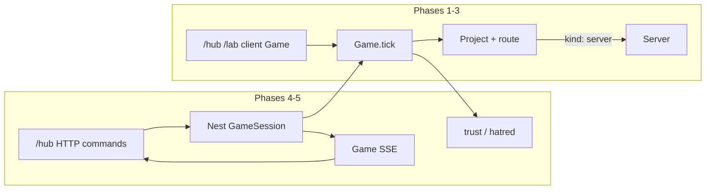

# Hosting platform

**Design (product contract):** `.cursor/plans/fivenines-hosting-platform.design.md`

## Target architecture



**Naming / invariants:**

- Physics, wallet, SLA, PAYG stay in `@packages/fivenines-engine`. Nest never reimplements `tick`.
- One `RouteTarget` per served project. Arrays of servers wait for a balancer asset.
- Research is not a magic profit knob. Do not add `technologies[]`.
- Integers at demand, cash, ppm, milli-trust. No float cash/ppm/requests.
- `dispatch` does not tick.
- Do not edit GitHub workflows / required checks (PR #39 `overall` stays).

| Current | After phase 1 | Notes |
|---------|----------------|-------|
| Fleet-wide `placeProjectDemand` | Place only on routed server | Overflow removed |
| `acceptProject { projectId }` | `{ projectId, serverId }` | Breaking |
| `ProjectStatus` offered/declined/served | + `offline` | Park |
| Hub `serverLabel` = `N local` | Routed server id | `ActiveProjectCard` already has the prop |

**Dependency / policy rules:**

- `@apps/web` and later `@apps/nestjs` depend on the engine; engine must not depend on apps.
- `@packages/ui` molecules stay engine-agnostic (labels and callbacks only).
- Phase 4 must not hang `GameSession` off Prisma `Project` / `FeatureFlag`.
- Catalog numbers live in `packages/fivenines-engine/src/catalog/*-policy.ts`.

---

## Phase 1 — Project routing

**Goal:** A served project is on exactly one server; overload cannot borrow another box.

**Hard constraints (phase 1 only):**

- Must: `acceptProject` requires `serverId`; `moveProject`; `unassignProject` → `offline`; `assignProject` from offline; sell throws if a **served** route points at that server; cross-region allowed; hub + lab wired; isolation test.
- Must not: load balancer, `RouteTarget[]`, Research, Nest, tenure, incidents, trust fields, CI/workflow edits, docs during implement.

### Mechanical changes

| From | To | Notes |
|------|----|-------|
| `placeProjectDemand(servers, …)` | Place onto one `Server` (or filter pool to `[routed]`) | Keep latency when `server.region !== project.region` |
| `EngineCommand.acceptProject` | Add `serverId` | All test dispatches |
| `ProjectStatus` | Add `offline` | `project.tick` emits for served **and** offline |
| `accrueServedPayg` | Split recurring hours vs period SLA | Offline: no `hoursServedInPeriod`++; still period emit/handled |

### Code/config surfaces (builder-workflow)

- `packages/fivenines-engine/src/game.utils.ts` — commands
- `packages/fivenines-engine/src/project.ts` — status, route, tick, asServed/asOffline
- `packages/fivenines-engine/src/demand.ts` / `game.ts` — placement
- `packages/fivenines-engine/src/game.commercial.ts` / `project.ts` accrue/close
- `packages/fivenines-engine/src/fixtures.ts` + `*.test.ts` (overload, dispatch, sla, billing, placement)
- `apps/web/src/hub/hub-session.tsx`, `use-hub-game.ts`, hub tests
- `apps/web/src/lab/lab-session.tsx`, lab tests
- `packages/ui/src/molecules/project-offer-card/` — server picker / accept still `onAccept` plus optional select props
- `packages/ui/src/molecules/active-project-card/` — move/unassign actions if the card owns buttons; otherwise hub chrome only

### Scouts (parallel inventory — code/config only)

| Scout | Task | Patterns / paths | Row budget |
|-------|------|------------------|------------|
| 1 | Command + graph | `rg 'acceptProject\\|EngineCommand\\|placeProjectDemand' packages/fivenines-engine` | ≤40 |
| 2 | Fixtures + overload proofs | `rg 'oneBronzeInitial\\|twoBronzeInitial\\|asServed' packages/fivenines-engine` | ≤40 |
| 3 | Hub/lab dispatch UI | `rg 'acceptProject\\|sellServer\\|serverLabel' apps/web packages/ui/src/molecules` | ≤40 |
| 4 | Billing/SLA served-only | `rg 'hoursServedInPeriod\\|status !== "served"' packages/fivenines-engine/src` | ≤40 |

### Verification (phase 1 gate)

```bash
bun test packages/fivenines-engine
bun test apps/web
bun test packages/ui/src/molecules/active-project-card
bun test packages/ui/src/molecules/project-offer-card
bun run turbo run typecheck --filter=@packages/fivenines-engine --filter=@apps/web --filter=@packages/ui
bun run overall
```

Isolation proof (must exist as a test): two served projects, two servers, one each; 1400-style overload on A does not `assignSlice` on B.

### Documentation before PR (documentation-sync)

**When:** After verification passes and builder finishes — **not** during implement.

- `packages/fivenines-engine/AGENTS.md` — graph, commands, placement (no fleet overflow), offline money/SLA split
- `apps/web/AGENTS.md` — accept requires server; park/move; `serverLabel`
- `.github/instructions/engine.instructions.md` — one line if command table is referenced
- `.cursor/plans/fivenines-hosting-platform.design.md` — only if implementation drifted (link, do not duplicate formulas)

---

## Phase 2 — Server tenure

**Goal:** Player can buy (owned) or rent (leased) the same SKU; economics differ, physics do not.

**Hard constraints (phase 2 only):**

- Must: `ServerTenure`; lease hourly integer in catalog; `releaseServer` for leased; sell rejected for leased; owned path remains salvage sell.
- Must not: weaker leased capacity/reliability; Research; LB; Nest; trust; CI; docs during implement.

### Mechanical changes

| From | To | Notes |
|------|----|-------|
| `buyServer` always owned | `buyServer` owned; `leaseServer` (name TBD, one command) leased | Same `ServerCatalogId` + region |
| Hourly opex | Owned: existing maint+power; leased: + `hourlyCents` | Policy file |
| `sellServer` | Owned only | Leased → `releaseServer` |

### Code/config surfaces (builder-workflow)

- `packages/fivenines-engine/src/server.ts`, `catalog/economy-policy.ts`, `game.utils.ts`, `game.finance.ts`
- Fixtures + economy tests
- Hub/lab market cards: buy vs lease; fleet: sell vs release

### Scouts (parallel inventory — code/config only)

| Scout | Task | Patterns / paths | Row budget |
|-------|------|------------------|------------|
| 1 | Buy/sell/opex | `rg 'buyServer\\|sellServer\\|SKU_ECONOMY\\|opexCents' packages/fivenines-engine` | ≤40 |
| 2 | Hub/lab market | `rg 'buyServer\\|sellServer\\|canAfford' apps/web packages/ui/src/molecules/server-card` | ≤40 |

### Verification (phase 2 gate)

```bash
bun test packages/fivenines-engine
bun test apps/web
bun run turbo run typecheck --filter=@packages/fivenines-engine --filter=@apps/web --filter=@packages/ui
bun run overall
```

### Documentation before PR (documentation-sync)

- `packages/fivenines-engine/AGENTS.md` — tenure, lease opex, release vs sell
- `apps/web/AGENTS.md` — market verbs
- `docs/CHEATSHEET.md` — only if a root script changed (unlikely)

---

## Phase 3 — First incident (`serverOutage`)

**Goal:** One believable outage loop; monitoring only changes **time-to-see**.

**Hard constraints (phase 3 only):**

- Must: degraded → unavailable; routed projects lose capacity; repair and/or reroute; optional monitoring module (RAM/OPEX); delayed visibility without it.
- Must not: logging, backup, rollback, Research tree, Nest, trust meters, CI.

### Mechanical changes

| From | To | Notes |
|------|----|-------|
| Server always available | Health: ok / degraded / unavailable | Catalog timings |
| All engine events visible | Hidden outage until discover hour or report | Monitoring skips delay |
| Server modules none | Optional `monitoring` agent | Integer RAM + opex |

### Code/config surfaces (builder-workflow)

- `packages/fivenines-engine/src/server.ts`, `game.ts`, `game.events.ts`, new catalog policy
- Tests for outage + discovery
- Hub/lab: repair command; agent install; incident visibility in event log

### Scouts (parallel inventory — code/config only)

| Scout | Task | Patterns / paths | Row budget |
|-------|------|------------------|------------|
| 1 | Server tick + events | `rg 'server.tick\\|EngineEvent\\|serverSaturated' packages/fivenines-engine` | ≤40 |
| 2 | Hub event log | `rg 'engineEventMessage\\|game.events' apps/web/src/hub` | ≤40 |

### Verification (phase 3 gate)

```bash
bun test packages/fivenines-engine
bun test apps/web
bun run turbo run typecheck --filter=@packages/fivenines-engine --filter=@apps/web
bun run overall
```

### Documentation before PR (documentation-sync)

- `packages/fivenines-engine/AGENTS.md` — incident cycle, monitoring module
- `apps/web/AGENTS.md` — repair / visibility
- Wiki: **do not** copy kernel formulas (existing AGENTS.md rule)

---

## Phase 4 — Nest session (engine stays put)

**Goal:** Authoritative game in Nest persistence + SSE; `/hub` is a client of that API; `/lab` still local `Game`.

**Hard constraints (phase 4 only):**

- Must: serializable `GameSnapshot` + RNG state + `schemaVersion` + `revision`; restore determinism test; `GameSession` JSONB; listed HTTP + game SSE (full snapshot per tick); `/hub` no `new Game()`.
- Must not: move physics into Nest; per-noun Prisma; delta protocol; treat feature-flag `Project` as a game project; change CI required checks; delete the whole flag schema unless already unused **and** scoped in this phase’s PR description.

### Mechanical changes

| From | To | Notes |
|------|----|-------|
| `MathRandomSource` for hub | Seedable serializable RNG for sessions | Lab may keep Math |
| Prisma flags only | + `GameSession` | JSONB snapshot |
| Hub `useHubGame` local tick | Commands HTTP, state SSE | Clock SSE remains session health |

### Code/config surfaces (builder-workflow)

- `packages/fivenines-engine` snapshot/serialize/restore (+ tests)
- `apps/nestjs/prisma/schema.prisma` + migration
- Nest games module, guards (JWT), OpenAPI
- `packages/nestjs-sdk` regen
- `apps/web/src/hub/` transport; not `src/lab/` constructor (keep)

### Scouts (parallel inventory — code/config only)

| Scout | Task | Patterns / paths | Row budget |
|-------|------|------------------|------------|
| 1 | RNG + Game internals | `rg 'RandomSource\\|MathRandomSource\\|class Game' packages/fivenines-engine` | ≤40 |
| 2 | Nest prisma + SSE | `rg 'FeatureFlag\\|Sse\\|EventSource' apps/nestjs apps/web` | ≤40 |
| 3 | Hub game loop | `rg 'new Game\\|useHubGame\\|tick\\(' apps/web/src/hub` | ≤40 |

### Verification (phase 4 gate)

```bash
bun test packages/fivenines-engine
bun test apps/nestjs
bun test apps/web
bun run turbo run typecheck --filter=@packages/fivenines-engine --filter=@apps/nestjs --filter=@apps/web --filter=@packages/nestjs-sdk
bun run overall
```

### Documentation before PR (documentation-sync)

- `packages/fivenines-engine/AGENTS.md` — snapshot, RNG
- `apps/nestjs/AGENTS.md` — GameSession APIs vs flag APIs; do not confuse clock SSE
- `apps/web/AGENTS.md` — hub vs lab constructors
- `README.md` — one architecture sentence if hub is no longer client-sim
- `docs/CHEATSHEET.md` — new Nest routes if that file lists APIs

---

## Phase 5 — Trust and hatred

**Goal:** Two capped relationship stocks driven by events (and tiny mood-hour deltas), with five UI bands each and no “happy.”

**Hard constraints (phase 5 only):**

- Must: `trustMilli` / `hatredMilli` 0–10_000 per customer; event table from the design doc; no idle trust drip; hatred no hourly decay; hub standing display.
- Must not: Research tree; Nest protocol changes unless snapshot schemaVersion bump is required; CI.

### Mechanical changes

| From | To | Notes |
|------|----|-------|
| Customer is id + projects | + milli stocks + last mood | Integers |
| Week close / incidents / park | Emit trust/hatred deltas | Catalog rates |

### Code/config surfaces (builder-workflow)

- `packages/fivenines-engine/src/customer.ts`, catalog trust policy, billing close, unassign, outage
- Snapshot schemaVersion bump if phase 4 shipped
- Hub customer/project chrome (bands, never “happy”)
- Tests for event deltas and clamps

### Scouts (parallel inventory — code/config only)

| Scout | Task | Patterns / paths | Row budget |
|-------|------|------------------|------------|
| 1 | Customer + close + park | `rg 'class Customer\\|closeBillingPeriod\\|unassignProject' packages/fivenines-engine` | ≤40 |
| 2 | Hub customer labels | `rg 'customerId\\|customerName' apps/web/src/hub packages/ui/src/molecules` | ≤40 |

### Verification (phase 5 gate)

```bash
bun test packages/fivenines-engine
bun test apps/web
bun run turbo run typecheck --filter=@packages/fivenines-engine --filter=@apps/web --filter=@packages/ui
bun run overall
```

### Documentation before PR (documentation-sync)

- `packages/fivenines-engine/AGENTS.md` — stocks, events, milli units
- `apps/web/AGENTS.md` — bands / copy
- Design doc rates if tuned away from the meeting numbers

---

## What stays out of scope

- Load balancer asset and `RouteTarget[]`
- Research tree and K8s-as-goal
- Logging / backup / rollback incidents (until after phase 3 + Research)
- Moving `tick` into Nest
- Prisma tables per server/project
- Game delta protocol
- GitHub Actions / ruleset / Copilot config
- Wiki copies of kernel formulas
- Feature-flag control plane rewrite (unless a later dedicated PR)

---

## Suggested PR sequence

| PR | Content | Merge gate |
|----|---------|------------|
| PR1 | Phase 1 only | Isolation test + phase 1 verify / `overall` |
| PR2 | Phase 2 only | Tenure tests + `overall` |
| PR3 | Phase 3 only | Outage + monitoring discovery tests + `overall` |
| PR4 | Phase 4 only | Restore determinism + hub no `new Game()` + `overall` |
| PR5 | Phase 5 only | Trust/hatred tests + `overall` |

Doc sync **after** each phase build, **before** that phase’s commit/PR.

---

## Risk summary

| Risk | Mitigation |
|------|------------|
| `twoBronzeInitial` still assumes fleet pooling | Rewrite tests in phase 1; `rg 'twoBronzeInitial'` |
| Offline emit-0 would freeze SLA (cheat) | Offline must emit; `rg 'status !== "served"'` on `Project.tick` |
| Recurring pause vs period SLA mixed up | Unit tests: `hoursServedInPeriod` frozen, `periodEmitted` grows |
| Accept payload break | `rg 'acceptProject'` all workspaces |
| `Math.random` cannot restore | Phase 4 RNG replacement + snapshot test |
| Prisma `Project` name collision | GameSession JSONB; do not reuse flag `Project` |
| Scope leak (LB/Research/Nest in PR1) | Phase 1 must-not list; review |
| CI churn | No `.github/workflows` in any phase |
