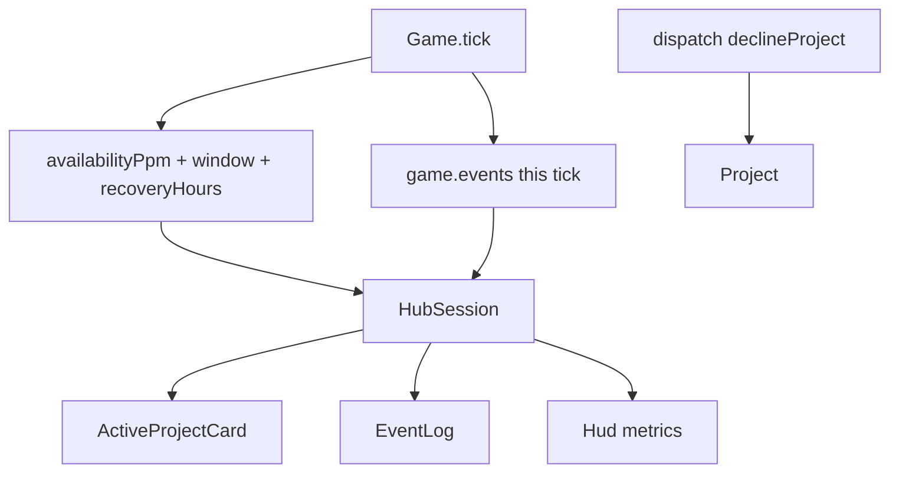

# Gameplay feedback and truthful controls

Persian playtest of `/hub` (keep product copy **English**). Players cannot trust the floor: CPU can look idle while SLA is red, Decline is a lie, sparkline greens 80% on a 99% contract, money labels mix WTD PAYG with daily AR, and the event log never shows the sim.

**Related:** Hub composition [ops-console-hub-ui.plan.md](ops-console-hub-ui.plan.md). SLA ring [fivenines-engine-sla.plan.md](fivenines-engine-sla.plan.md). Decline status already exists on `Project` but is fixture-only.

## Design agreement

| Topic | Decision (proposed — approve with the plan) |
|-------|-----------------------------------------------|
| **Outcome** | Every Hub control that looks like a verb or a number is true. Players can see *this hour* vs *168h window* vs *target* and an ETA to recover the window if they stay healthy. |
| **Phases** | **2 PRs.** Phase 1 = feedback list. Phase 2 = Opening Shift ending (called out as “after that”). |
| **No new infra** | No Nest campaign, no SSE sim clock, no reputation, no new workspace, no engine pause command. |
| **Decline** | Real `declineProject`. Offered → `declined`. Allowed while jailed (same idea as `sellServer`: refuse work, no cash). Throws if not offered. |
| **Recovery ETA** | Pure function on the existing 168h ring + `targetPpm`. Simulate appending 100% hours (FIFO 168). Hours until `windowAvailabilityPpm >= target`, or `null` if already meeting / warming / not reachable inside one window. UI: `31 healthy hours` or `—`. |
| **Events** | Kernel appends **this tick’s** `EngineEvent[]` (replaced each `tick`). Hub maps them into `EventLog`. Player `dispatch` lines stay Hub-owned (already true once Decline works). |
| **Saturation** | Edge: box `utilization >= 100` this hour after `< 100` (or first hour at cap). |
| **Cash low** | Edge: `cashCents <= 0` after it was `> 0`. Jail (`<= -DEBT_LIMIT_CENTS`) is already sticky; do not spam `cashLow` every hour. |
| **WTD revenue** | Active card green number is `periodPaygCents` (PAYG this billing week, not hourly). Recurring is week-close only — do not pretend it is in that digit. |
| **Opening end** | Phase 2. Stop Hub ticks when `hourIndex >= 14 * 24` (336). Win if cash `> 0`, ≥2 served projects meeting window target, and no settlement with 100% credit (`creditCents === periodRevenueCents && periodRevenueCents > 0`). Jailed is a loss. |

## Target architecture



**Naming / invariants:**

| Current | After | Notes |
|---------|-------|-------|
| `EngineCommand` 3 variants | + `declineProject` | Mirror `acceptProject` / `asServed` → `asDeclined` |
| Hub Decline logs “not a kernel command” | Dispatch + remove from Incoming | Offer leaves the queue |
| Card SLA = window only | Current hour, rolling 168h, target, recovery ETA | Status/tone still from **window vs target** |
| Sparkline `value < 0.5` green/red | Color vs `targetPpm / 1e6` | Molecule stays engine-agnostic |
| HUD `AR` / `OPEX` | `Receivable today` / `OPEX / hour` | Cash label stays `CASH` |
| Unlabeled `paygLabel` | Caption **WTD revenue** | Value still `periodPaygCents` |
| `game` has no events | `readonly events` last tick | Bounded; Hub copies into 50-line UI log |
| Hub `min-h-screen` | `h-screen overflow-hidden` | Event log stays in viewport |

**Dependency / policy rules:**

- `@packages/ui` still must **not** import the engine. Sparkline target is a `number` (0–1) or per-bar tone from Hub.
- Events are a **discriminated union** on the kernel (`type` field). Hub formats English strings.
- Do not change physics, PAYG math, credit bands, or `windowAvailabilityPpm`. Recovery is display/helper only.
- Lab stays the verbose harness: wire Decline if the Accept row is one-line; do not clone Hub cards.

---

## Phase 1 — Truthful controls and readable SLA

**Goal:** Hub never lies, and SLA redness is explained without a new sim noun.

**Hard constraints (phase 1 only):**

- Must implement `declineProject` in `applyCommand` + `Project.asDeclined()`; tests in `game.utils.test.ts` / `overload.dispatch.test.ts`.
- Must not add Opening Shift win/loss, campaign SSE, Nest, or pause-in-kernel.
- Must not change `slaAvailabilityPpm` / ring append rules.
- Must keep molecules free of `Game`.
- Must not restyle `/`, `/status`, or `/lab` beyond optional Decline on existing lab Accept.

### Mechanical changes

| From | To | Notes |
|------|-----|-------|
| `EngineCommand` | + `declineProject` | `payload: { projectId }` |
| *(none)* | `Project.asDeclined()` | Copy like `asServed`; offered only |
| *(none)* | `packages/fivenines-engine/src/game.events.ts` | Union + collect from tick |
| *(none)* | `slaRecoveryHours` in `sla-policy.ts` or `project.metrics.ts` | Integer hours or `null` |
| `active-project-card.tsx` | Extra SLA rows + sparkline vs target | Props: current/window/target/eta labels; `sparklineTarget` |
| `hub-session.tsx` | Layout + real Decline + drain events | `h-screen overflow-hidden`; columns `min-h-0` |
| `hub-map.ts` | Sparkline tone vs target; event → log line | Keep ppm helpers |

### Code/config surfaces (builder-workflow)

- `packages/fivenines-engine/src/game.utils.ts` `game.utils.test.ts` `overload.dispatch.test.ts`
- `packages/fivenines-engine/src/project.ts` `project.test.ts`
- `packages/fivenines-engine/src/game.ts` `game.events.ts` (new) + tests (`game.events.test.ts` or extend `sla.test.ts` / `billing.*.test.ts`)
- `packages/fivenines-engine/src/catalog/sla-policy.ts` `sla-policy.test.ts` (recovery helper)
- `packages/fivenines-engine/src/index.ts` exports
- `packages/ui/src/molecules/active-project-card/**`
- `packages/ui/src/molecules/event-log/**` only if empty state / `flex-1` needs a min height
- `apps/web/src/hub/hub-session.tsx` `hub-map.ts` `hub-map.test.ts` `use-hub-game.ts`
- `apps/web/src/routes/hub.test.tsx`
- `apps/web/src/lab/lab-session.tsx` only if adding Decline next to Accept

### Engine events (this tick only)

| `type` | When | Payload (min) |
|--------|------|----------------|
| `slaBreached` | Window ppm crosses from ≥ target or `null` to `< target` | `projectId`, `windowPpm` |
| `slaRecovered` | Window ppm crosses from `< target` to ≥ target | `projectId`, `windowPpm` |
| `paygSettled` | `settlePaygReceivableIfDue` returns `> 0` | `cents` |
| `weeklyCreditCharged` | Close wrote `creditCents > 0` | `projectId`, `creditCents` |
| `serverSaturated` | Box utilization edge ≥ 100 | `serverId` |
| `cashLow` | Cash edge to `<= 0` | `cashCents` |

`tick()` replaces `#events`. `dispatch` does not invent sim events (Decline stays a Hub command log line). Compare **pre-tick** window ppm / util / cash to **post-SLA** / **post-money** values; do not emit on construct.

`closeBillingPeriodIfDue` today returns a net cash integer only — Phase 1 may return close rows (or read `project.settlements` last index after close) so credit events are exact. Do not change credit math.

### Hub SLA copy (English)

On each active card:

- `Current hour:` this-hour `availabilityPpm` (`—` if `null`)
- `Rolling 168h:` `windowAvailabilityPpm`
- `Target:` `commercial.targetPpm`
- `Recovery ETA:` recovery helper or `—`

Progress bar + `meeting` / `at risk` / `breach` stay **window vs target** (existing `slaTone` / `slaStatusLabel`).

Sparkline: each bar is `handled/emitted`; class `bg-primary` iff value ≥ `targetPpm/1_000_000`, else `bg-destructive`. Optional warning band is **out** for this PR (playtest asked target, not 50%).

### Layout

Root Hub: `h-screen overflow-hidden flex flex-col`. `main`: `flex-1 min-h-0`. Queue / active / market / fleet scroll regions: `min-h-0 overflow-y-auto`. Event log: `h-40 shrink-0` (or `flex-none`) so it is always on screen; inner `EventLog` already `flex-1`.

### Money labels

| Surface | Label | Value |
|---------|--------|--------|
| HUD | `CASH` | `finance.cashCents` |
| HUD | `Receivable today` | `finance.accountsReceivableCents` |
| HUD | `OPEX / hour` | `finance.opexCents` |
| Active card | `WTD revenue` | `periodPaygCents` |

### Scouts (parallel inventory — code/config only)

| Scout | Task | Patterns / paths | Row budget |
|-------|------|------------------|------------|
| 1 | Dispatch + project status | `rg 'EngineCommand\|asServed\|declined' packages/fivenines-engine/src` | ≤40 |
| 2 | Tick money/SLA hooks | `packages/fivenines-engine/src/game.ts` `game.commercial.ts` `game.sla.ts` `project.ts` close | ≤40 |
| 3 | Hub map + session | `apps/web/src/hub/**` `apps/web/src/routes/hub.test.tsx` | ≤40 |
| 4 | Card/log molecules | `packages/ui/src/molecules/active-project-card` `event-log` `hud` | ≤40 |

### Verification (phase 1 gate)

```bash
bun test packages/fivenines-engine
bun test packages/ui
bun test apps/web
bun run typecheck --filter=@packages/fivenines-engine --filter=@packages/ui --filter=@apps/web
```

Extra proofs (implementer tests, not extra CLI):

- Decline: offered → declined; not in Incoming; demand 0; unknown id / already served throws.
- Recovery: fixture ring below 99% then 100% hours → finite ETA; already meeting → `null` or `0` (pick one; UI shows `—` when meeting).
- Sparkline: 0.80 vs target 0.99 is not primary.
- Events: one tick that settles PAYG emits `paygSettled` once; idle tick emits `[]`.
- Layout: Hub root includes `h-screen` / `overflow-hidden` (assert class string in `hub.test.tsx` if rendered).

### Documentation before PR (documentation-sync)

**When:** After verification passes and builder finishes — **not** during implement.

- `packages/fivenines-engine/AGENTS.md` — `declineProject`; `game.events`; recovery helper; dispatch still does not tick
- `apps/web/AGENTS.md` — Hub Decline is real; SLA rows; event log sources; money captions; layout viewport rule
- `packages/ui/AGENTS.md` — Active card SLA/sparkline props (one line)

---

## Phase 2 — Opening Shift ending

**Goal:** After two simulated weeks the floor stops and shows a result, using existing cash / SLA / settlements.

**Hard constraints (phase 2 only):**

- Must not add Nest, reputation, extra project statuses, or new commands.
- Must not tick 336 hours in a test; evaluate a **pure** `openingShiftOutcome(snapshot)` with constructed numbers.
- Hub: when `hourIndex >= OPENING_SHIFT_HOURS`, skip interval `tick` (treat as paused) and show a result overlay. Reset still builds `Game(openingInitial)`.
- Must not change Phase 1 event types except if a `shiftEnded` log line is Hub-only.

### Mechanical changes

| From | To | Notes |
|------|-----|-------|
| *(none)* | `packages/fivenines-engine/src/catalog/opening-shift-policy.ts` | `OPENING_SHIFT_HOURS = 336` |
| *(none)* | `openingShiftOutcome` | `{ status: "in_progress" \| "won" \| "lost"; … }` |
| `use-hub-game.ts` | Stop ticking when complete | Keep pause toggle disabled or no-op |
| `hub-session.tsx` | Result overlay | English: win/loss + which clauses failed |

### Win / loss (all must hold to win)

1. `hourIndex >= 336` (else `in_progress`)
2. `cashCents > 0`
3. Count of **served** projects with `windowAvailabilityPpm !== null` and `>= targetPpm` is **≥ 2**
4. No `BillingSettlement` with `periodRevenueCents > 0` and `creditCents === periodRevenueCents` (catastrophe band)
5. `jailed === false`

Fail any of 2–5 → `lost`.

### Code/config surfaces (builder-workflow)

- `packages/fivenines-engine/src/catalog/opening-shift-policy.ts` + test
- `packages/fivenines-engine/src/index.ts`
- `apps/web/src/hub/use-hub-game.ts` `hub-session.tsx` `hub-map.ts` (outcome copy)
- `apps/web/src/routes/hub.test.tsx`
- Overlay: Hub-local view or a tiny `@packages/ui` molecule if it stays engine-agnostic (`title`, `body`, `onReset`)

### Scouts (parallel inventory — code/config only)

| Scout | Task | Patterns / paths | Row budget |
|-------|------|------------------|------------|
| 1 | Clock + jail + settlements | `rg 'dayIndex\|hourIndex\|jailed\|settlements' packages/fivenines-engine/src` | ≤40 |
| 2 | Hub loop | `apps/web/src/hub/use-hub-game.ts` `hub-session.tsx` | ≤40 |
| 3 | Credit catastrophe | `rg 'slaCreditPpm\|creditCents' packages/fivenines-engine/src` | ≤40 |

### Verification (phase 2 gate)

```bash
bun test packages/fivenines-engine
bun test apps/web
bun run typecheck --filter=@packages/fivenines-engine --filter=@apps/web
```

### Documentation before PR (documentation-sync)

- `packages/fivenines-engine/AGENTS.md` — Opening Shift length + outcome helper
- `apps/web/AGENTS.md` — Hub stops at D14; Reset starts a new shift

---

## What stays out of scope

- Nest campaign / SSE as sim clock
- Reputation, cancel-after-served, re-offer declined projects
- Engine `pause` command
- Recurring in the WTD digit
- Sparkline 50% heuristic (removed, not kept as fallback)
- `/lab` as a second ops console
- `apps/mobile`, token redesign, CHEATSHEET unless a command table lists Decline
- Ticking 336 hours in CI

---

## Suggested PR sequence

| PR | Content | Merge gate |
|----|---------|------------|
| PR1 | Phase 1 only | Phase 1 verify block |
| PR2 | Phase 2 only | Phase 2 verify block |

Doc sync **after** each phase build, **before** that PR.

---

## Risk summary

| Risk | Mitigation |
|------|------------|
| Fake Decline remains | `rg 'not a kernel command'` must be empty after Phase 1 |
| Event spam | Edge-trigger; replace `#events` each tick; Hub slice 50 |
| Recovery never finishes | FIFO sim of 168 healthy hours; `null` → `—` |
| Close events miss credits | Read settlement written this close, not net cash only |
| Layout still clips log | Assert `h-screen` / `overflow-hidden` / log `shrink-0` |
| Phase 2 slow tests | Pure outcome helper; no 336-tick loop |
| Lab/Hub command union drift | Single `EngineCommand` in engine; both apps import it |

## Assumptions

- `slaRecoveryHours` returns `0` or `null` when already meeting — Hub shows `—` in both cases if meeting.
- Catastrophe = 100% of that period’s revenue credited (existing `< 800_000` ppm band), not a new credit table.
- “Day 14” = `hourIndex >= 336` (HUD `D14 H00` after the last Opening hour).

## Open questions

1. Should Decline be disabled while jailed, or allowed? **Plan default: allowed.**
2. Is cash-low `<= 0` enough, or should runway vs last-hour opex also fire? **Plan default: `<= 0` only.**
3. Win clause “two healthy contracts”: window SLA vs last settlement ppm? **Plan default: live window vs target.**
