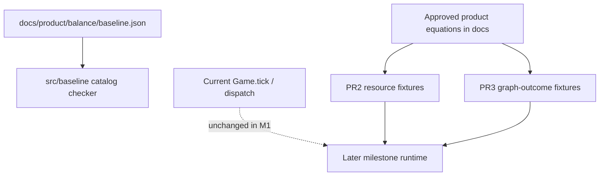

# M1 — Final architecture and mathematical model

Milestone: [docs/milestones/engine-architecture-and-mathematics.md](../../docs/milestones/engine-architecture-and-mathematics.md) · GitHub [milestone 1](https://github.com/movahedan/fivenines/milestone/1) · Tracking [issue #41](https://github.com/movahedan/fivenines/issues/41)

Assigned slices: [#61](https://github.com/movahedan/fivenines/issues/61) → [#62](https://github.com/movahedan/fivenines/issues/62) → [#63](https://github.com/movahedan/fivenines/issues/63)

Product sources (do not rewrite equations here): [domain model](../../docs/product/domain-model.md), [gameplay](../../docs/product/gameplay.md), [demand and projects](../../docs/product/balance/demand-and-projects.md), [hardware and economy](../../docs/product/balance/hardware-and-economy.md), [contracts and time](../../docs/product/balance/contracts-and-time.md), [customers and offers](../../docs/product/balance/customers-and-offers.md), [baseline.json](../../docs/product/balance/baseline.json).

Inspected current kernel (2026-09-10): `Game` in `packages/fivenines-engine/src/game.ts` still places integer RPS on one `RouteTarget`, caps with `remainingHeadroom`, then `server.tick` / SLA / opex / PAYG / jail / `hourIndex += 1` / daily settle / week close. Catalog tunables live in `src/catalog/*-policy.ts` and `src/catalog/kernel.ts` (Bronze–Diamond). That catalog is **not** `baseline.json`. No DAG validator, GPU/disk I/O solver, or component graph exists in runtime.

**Decision (2026-09-10):** Product guidelines (owners, tick order, coincidences, future commands, compilation dirty flags) are documented in the milestone. They are not TypeScript modules. PR1 code is the catalog checker only.

## Target architecture



**Naming / invariants:**

| Current | After M1 | Notes |
|---------|----------|-------|
| Live physics in `Game` / `Server` / `placeProjectDemand` | Unchanged runtime formulas | M1 proves contracts; it does not ship a second production solver |
| Authored numbers in `docs/product/balance/baseline.json` | Same file remains source of truth | Validator **loads** it; do not copy into `src/catalog/` as live Game config |
| Engine SKUs `bronze`…`thin-ram` | Still live | Design hardware ids (`general-small`, …) are **not** required to match in M1 |
| Sticky `jailed` in `Game` | Still live | Product credit-limit recovery is a **documented contradiction**, not a silent runtime flip |
| No catalog checker | `src/baseline/` loads product JSON in tests | Guidelines (owners, tick order, coincidences) stay in the milestone markdown |

**Dependency / policy rules:**

- Catalog checker lives under `packages/fivenines-engine/src/baseline/`. It may read `docs/product/balance/baseline.json`. It must not import React, Nest, or UI.
- Do **not** implement product guidelines as TypeScript constants/modules (ownership maps, future command lists, compilation dirty flags, coincidence tables).
- `Game.tick`, `dispatch`, `SERVER_CATALOG`, and existing overload proofs (`oneBronzeInitial` 1400 vs 1000) must not change meaning in these PRs.
- Do not introduce subticks, per-request objects, automatic retries, or a millisecond clock.
- Integers at demand/cash/ppm boundaries in **runtime**. Reference fixtures may use rationals internally and must show conservation after named rounding.
- Do not add `baseline.json` as a `Game` constructor input. Do not hot-reload catalogs.
- Estimated review size: ~15–25 files / well under 3k lines per PR if fixtures stay table-driven.

---

## Phase 1 — Responsibilities and state transitions (PR1 / #61)

**Goal:** Check in a repeatable `baseline.json` catalog checker. Publish ownership, tick order, and coincidences in the milestone document. Do not encode those guidelines as engine modules.

**Hard constraints (phase 1 only):**

- Must: validate `baseline.json` for unique IDs, acyclic technology DAG, resolving references, project mix summing to 1, listed policy guards, and version-one release closure (v1 must not depend on expansion).
- Must: record current vs target tick/ownership/coincidence notes in `docs/milestones/engine-architecture-and-mathematics.md`.
- Must not: add TypeScript tables for owners, future commands, index keys, compilation dirty flags, or coincidence rows.
- Must not: replace `placeProjectDemand`, capacity min-ratio handling, PAYG/SLA formulas, or command effects.
- Must not: add player UI screens or Hub/Lab command surface.
- Must not: implement component/instance entities (milestone 2).

### Mechanical changes

| From | To | Notes |
|------|-----|-------|
| (none) | `packages/fivenines-engine/src/baseline/load.ts` | Resolve repo-root `docs/product/balance/baseline.json`; throw if missing |
| (none) | `packages/fivenines-engine/src/baseline/validate.ts` | Pure `validateBaseline(data)` |
| (none) | `packages/fivenines-engine/src/baseline/validate.test.ts` | Happy path on real file; fixture mutations for each failure class |
| `src/reference/ownership|tick|commands|indexes` | deleted | Rejected: guidelines are not runtime |

### Code/config surfaces (builder-workflow)

- `packages/fivenines-engine/src/baseline/**`
- `packages/fivenines-engine/src/index.ts` only if a public export is required
- Do **not** edit `docs/`, `AGENTS.md`, Hub/Lab, Nest, Docker, CI

### Scouts (parallel inventory — code/config only)

| Scout | Task | Patterns / paths | Row budget |
|-------|------|------------------|------------|
| 1 | Current Game tick + dispatch order | `packages/fivenines-engine/src/game.ts`, `game.utils.ts`, `game.commercial.ts` | ≤40 |
| 2 | Catalog / uniqueness already enforced | `rg 'assertUnique|parseCommercialTerms|SERVER_CATALOG' packages/fivenines-engine/src` | ≤40 |
| 3 | baseline.json top-level keys and release fields | `docs/product/balance/baseline.json` keys `policies`, `technologies`, `hardware`, `demandTypes`, `projects`, `courses` | ≤40 |
| 4 | Existing test file naming | `packages/fivenines-engine/src/**/*.test.ts` | ≤40 |

### Validator acceptance (must fail on mutation)

IDs: unique technology `name`/`id`, hardware `id`, demand type ids, project `id`, course ids.

DAG: technology `prerequisites` acyclic; every prerequisite exists; v1 node cannot require an `expansion` node.

References: project `mix` keys ⊆ demand types; project `technologies` ⊆ catalog; finite job `demand` ⊆ demand types; rhythm/variation names ⊆ policy maps; course skill names resolve.

Mixtures: each continuous project mix values are finite, ≥ 0, and sum to 1 (exact rational or documented epsilon only if JSON cannot be exact — prefer exact `0.8+0.2`).

Policy guards (from baseline + validation.md): `policies.time.internalSubticks === 0`, `policies.queue.automaticRetries === 0`, `policies.operations.powerOnHours === 0`, `policies.learning.sharedConcurrentSlots === 2`, salvage fraction present, `policies.observation.alertOnMonitoringOutage === false`, `policies.observation.backfillMonitoringGaps === false`, `policies.release.expansionEnabled === false`.

Release closure: count v1 vs expansion technologies/demand/projects/finite jobs; every v1 project mix and technology closure stays in v1. Do not require live `Game` to consume these catalogs.

### Outer-tick coincidence table (encode, do not run in Game)

Target **GameCoordinator** stage order (product: [contracts-and-time](../../docs/product/balance/contracts-and-time.md), [customers and offers](../../docs/product/balance/customers-and-offers.md), [gameplay](../../docs/product/gameplay.md)):

1. Apply player commands already accepted since last tick (cannot rewrite a closed period).
2. Generate demand (roots only).
3. Rebuild processing structure **only if** compilation is dirty.
4. Allocate shared resources / advance work (one outer tick).
5. Classify service outcomes for the hour.
6. Update relationships and dissatisfaction.
7. Evaluate setup-withdrawal and post-launch departure.
8. Accrue finance; trip credit-limit restrictions.
9. If due: daily usage collection (`usageCollectionHours` 24).
10. If due: period close/settlement **then** departure already applied **then** renew only still-active contracts.
11. Learning: completion before renewal at the same boundary (`completeBeforeRenewalAtSameBoundary`).
12. Advance `hourIndex` by 1 (record whether current engine increments before or after settle — tests must state the **target** and the **current** order separately).

Coincidence rows that tests must pin:

| Id | Collision | Resolution | Source |
|----|-----------|------------|--------|
| `close-then-renew` | Period close and renewal same hour | Finish old-period processing and settlement, apply departure, renew only if still active | contracts-and-time |
| `lateness-vs-cutoff` | Job completion and 100% refund cutoff same boundary | Evaluate lateness band first; **beyond** 10 intervals termination wins; **exactly** 10 stays 50% band | contracts-and-time finite jobs |
| `depart-then-settle` | Service hour also a settle hour | Classify → relationships → departure → settle; no double refund | customers-and-offers |
| `learn-before-renew` | Course/tech completion and tuition renewal | Completion ends future charges before charging the new month | baseline `learning.completeBeforeRenewalAtSameBoundary` |
| `setup-withdraw-ceil` | Fractional patience threshold | Withdraw at first outer boundary **at or after** threshold (acquaintance example: hour 39) | customers-and-offers |
| `payg-vs-week` | Hour 168 is both 24h and 168h multiple | Daily collection and week close both run; order is daily then period close | contracts-and-time + current `game.ts` after increment |
| `activate-vs-accept` | Activation hour vs acceptance | First 168h service period starts at activation; acceptance advance is not charged again | contracts-and-time |

Document **current vs target** where they differ (example: current `jailed` is sticky; target credit limit lifts). Tests assert the table, not a behavior change.

### Command validation and compilation (contract only)

- Current commands remain those in `EngineCommand` (`acceptProject` … `releaseServer`). A helper lists them; tests equal the union in `game.utils.ts`.
- Future commands (install, configure, activate, enroll, …) appear as a frozen string union with `implemented: false`. `Game.dispatch` must still throw on unknown `type`.
- Invalidation: dirty when placement, dependency, routing, or shared instance configuration changes; clean path on ordinary ticks. Tests are boolean tables, not a compiler.

### Verification (phase 1 gate)

```bash
bun test packages/fivenines-engine
bun run turbo run typecheck --filter=@packages/fivenines-engine
bun run overall
```

### Documentation before PR (documentation-sync)

**When:** After verification passes and builder finishes — **not** during implement.

- `packages/fivenines-engine/AGENTS.md`: `src/baseline/` catalog check; guidelines stay in the milestone
- `docs/milestones/engine-architecture-and-mathematics.md`: delivery record + markdown working agreements
- `docs/milestones/engine-architecture-and-mathematics.md`: delivery record for slice 1; record file paths and equation/stage identifiers
- `docs/milestones/README.md`: only if a pointer is missing (unlikely)
- Do not rewrite `docs/product/**` unless a **contradiction** must be surfaced (prefer milestone “material unresolved” over product edits)

---

## Phase 2 — Resource and work reference model (PR2 / #62)

**Depends on:** Phase 1 merged or at least present on the branch as predecessor files.

**Goal:** Independent analytical fixtures for CPU, GPU, resident/queued memory, disk capacity and I/O, and network transfer — conservation, contention, FIFO, bounded rounding, infeasible demand.

**Hard constraints (phase 2 only):**

- Must: named units per dimension (CPU work / GPU work / MiB / disk ops / network MiB) distinct from per-tick throughput vs retained occupancy.
- Must: fixtures for CPU-bound, GPU-incompatible, memory-bound, network-bound, disk-bound.
- Must: two projects on one host get demand-proportional shares **including eligible backlog**; older compatible work first **within** a share; permutation of project/server iteration must not create systematic preference.
- Must: identify infeasible demand (e.g. GPU work with `gpuCount === 0`) instead of silently treating it as CPU.
- Must not: wire the allocator into `Server.tick` or change Bronze overload proofs.
- Must not: introduce subticks or per-request simulation.

### Mechanical changes

| From | To | Notes |
|------|-----|-------|
| (none) | `src/work/units.ts` | Dimension ids + unit names |
| | `src/work/conservation.ts` | Totals: handled + waiting + rejected + infeasible |
| | `src/work/share.ts` | Proportional shares + FIFO within share + remainder policy |
| | `src/work/*.test.ts` | Table-driven analytical cases |

Revalidate share math against [gameplay allocation](../../docs/product/gameplay.md) and demand cost columns in [demand-and-projects](../../docs/product/balance/demand-and-projects.md). Use small integer/rational cases, not stochastic `baseline.json` sampling.

### Code/config surfaces

- `packages/fivenines-engine/src/work/**`
- Do not edit Hub/Lab, catalog policy numbers, or `Game`

### Scouts

| Scout | Task | Patterns / paths | Row budget |
|-------|------|------------------|------------|
| 1 | Current capacity axes | `capacity-policy.ts`, `server.ts`, `server.metrics.ts` | ≤40 |
| 2 | Product resource columns | `docs/product/balance/demand-and-projects.md` table + `baseline.json` `demandTypes` | ≤40 |
| 3 | Catalog checker isolation | `packages/fivenines-engine/src/baseline/` | ≤40 |

### Verification (phase 2 gate)

```bash
bun test packages/fivenines-engine
bun run turbo run typecheck --filter=@packages/fivenines-engine
bun run overall
```

### Documentation before PR

- `packages/fivenines-engine/AGENTS.md`: resource fixture module + unit names
- `docs/milestones/engine-architecture-and-mathematics.md`: slice 2 delivery record + equation identifiers

---

## Phase 3 — Graph and outcome reference model (PR3 / #63)

**Depends on:** Phase 2 resource fixtures (shares feed joined branches).

**Goal:** Required branches, shared downstream work, root success, waiting, and latency **estimation** with independently calculated cases and permutation checks.

**Hard constraints (phase 3 only):**

- Must: converging DAG counts each customer **root** outcome once.
- Must: required-child failure prevents root success; optional child cannot manufacture additional customer demand.
- Must: latency estimate is aggregate (wait + required processing; parallel essential branches join, do not sum); not a millisecond clock.
- Must: export tested functions later milestones can call; do not add a typed “integration contract” module that only restates docs.
- Must not: add load balancers, health checks, or component entities to runtime.
- Must not: change live placement (`placeProjectDemand`).

### Mechanical changes

| From | To | Notes |
|------|-----|-------|
| Phase 2 fixtures | `src/work/` (reuse shares) | Do not add guideline enums |
| | `src/work/paths.ts` | Required vs optional edges |
| | `src/work/outcomes.ts` | Root success/fail/pending |
| | `src/work/latency.ts` | Join vs series estimates |
| | `src/work/*.test.ts` | Permutations of node order |

Shop payment + optional email is the canonical optional-child case ([demand-and-projects](../../docs/product/balance/demand-and-projects.md#root-paths-and-feature-dependencies)).

### Code/config surfaces

- `packages/fivenines-engine/src/work/**`

### Scouts

| Scout | Task | Patterns / paths | Row budget |
|-------|------|------------------|------------|
| 1 | Current project metrics / SLA attribution | `game.sla.ts`, `project.metrics.ts` | ≤40 |
| 2 | Phase 2 share helpers to reuse | `src/work/` | ≤40 |

### Verification (phase 3 gate)

```bash
bun test packages/fivenines-engine
bun run turbo run typecheck --filter=@packages/fivenines-engine
bun run overall
```

### Documentation before PR

- `packages/fivenines-engine/AGENTS.md`: graph/outcome fixture functions
- `docs/milestones/engine-architecture-and-mathematics.md`: slice 3 delivery record

---

## What stays out of scope

- Replacing `Game.tick` physics or Opening Shift Hub/Lab UX
- Milestone 2 entities (components, instances, catalog runtime modules)
- Nest/SSE, employees, away-time
- Binding `baseline.json` hardware/economy numbers into `SKU_ECONOMY`
- Figma production screens (M1 explicitly: no new player screen)
- Changing sticky jail, RPS demand, or Bronze teaching fixtures

---

## Suggested PR sequence

| PR | Content | Merge gate | GitHub |
|----|---------|------------|--------|
| PR1 | Phase 1 only | Phase 1 verify block | #61 |
| PR2 | Phase 2 only | Phase 2 verify block | #62 |
| PR3 | Phase 3 only | Phase 3 verify block | #63 |

Refresh main / merged predecessor before each PR’s implement step. Re-scout if `Game.tick` order changed.

---

## Risk summary

| Risk | Mitigation |
|------|------------|
| Validator duplicates `baseline.json` | Load the product file; mutate clones only in tests |
| Accidental live solver | `rg 'from \"./reference' packages/fivenines-engine/src/game.ts` must stay empty |
| Mega-PR | Three PRs; keep runtime files untouched |
| Silent product/runtime contradictions | Coincidence table has `current` vs `target` columns; do not “fix” jail/RPS in M1 |
| JSON mix sums (0.1+0.2+0.7) | Prefer exact fractions already in file; if float noise appears, compare via rational reconstruction from known templates, not ad-hoc epsilon sprawl |
| Engine package reading `docs/` | Document the path in engine `AGENTS.md` at doc-sync; throw on missing file |

## Assumptions

- Execution is authorized for this milestone’s assigned PRs; each PR still gets its own builder → docs → git-pr loop.
- `docs/product/balance/baseline.json` remains the authored numeric source through M1.
- No new product decision is required unless a coincidence cannot be resolved from cited docs (then stop and escalate).

## Open questions

None blocking PR1. Escalate only if validator discovery finds a **v1 → expansion** edge or mix that does not sum to 1 in the committed baseline (that is a product-data defect, not an engine taste decision).
