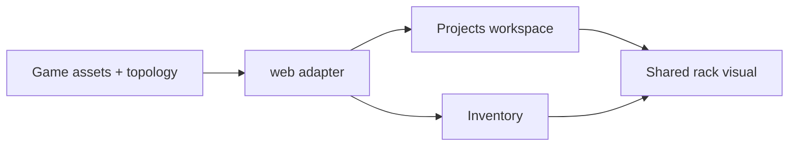

# M2 — Application model integration (#66)

Milestone: [entities and catalogs](../../docs/milestones/entities-and-catalogs.md) · Issue [#66](https://github.com/movahedan/fivenines/issues/66)

Depends on [#65](https://github.com/movahedan/fivenines/issues/65). **Revalidate this plan against merged #65 before implementation.**

Product UI: [interface-design-brief](../../docs/product/interface-design-brief.md), [interaction-specification](../../docs/product/interaction-specification.md). Figma app is visual reference only (`apps/figma-design`).

Inspected UI (2026-09-10): Hub/Lab construct `Game` in the browser. Accept still `{ type: "acceptProject", payload: { projectId, serverId } }`. Inventory and project views treat a server as a per-project route pick, not a shared asset identity. Tenure owned/leased is already shown in Lab sell/release.

## Target architecture



**Naming / invariants:**

| Current | After #66 | Notes |
|---------|-----------|-------|
| Project `route.serverId` is the only shared-server story | Projections expose the same asset id to both project views and Inventory | Live tick may still place RPS via one RouteTarget until M5 |
| Distinct ad-hoc server chrome | Shared rack component density variants | Layout coordinates stay out of the engine |
| Accept-to-served | Still the current command | Must not be labeled as the redesigned preparation flow |

**Dependency / policy rules:**
- `@packages/ui` takes display props only; no engine imports.
- Hub/Lab must still launch.
- Unsupported actions (install, configure, start-ready-project) stay unavailable with honest copy — not a fake M4 success path.
- No Nest/auth/SDK/persistence expansion.

---

## Phase 1 — Engine consumers + Projects/Inventory identity (single PR)

**Goal:** Two project views and Inventory resolve the same physical asset; instances keep independent host/readiness display data even if tick still uses one route.

**Hard constraints:**
- Must preserve tenure.
- Must use the main project workspace rack as the shared server visual (adapt density; no second server design).
- Must not implement accept-to-served as M4 preparation.
- Split the PR if the web+engine surface exceeds reviewability; record the reason in the milestone.

### Code/config surfaces (builder-workflow)

- Engine: fixtures/projections/adapters as required by merged #65
- `apps/web` hub Projects + Inventory
- `packages/ui` rack/display components if the shared visual lives there
- Lab only if it shares the same identity adapters (keep diagnostic, no duplicate management UI)

### Scouts (parallel inventory — code/config only)

| Scout | Task | Patterns / paths | Row budget |
|-------|------|------------------|------------|
| 1 | Hub project/inventory | `apps/web/src/hub/**` | ≤40 |
| 2 | UI rack/server | `packages/ui` server/rack | ≤40 |
| 3 | Engine exports | `packages/fivenines-engine/src/index.ts` | ≤20 |

### Verification (phase 1 gate)

```bash
bun test packages/fivenines-engine
bun test apps/web
bun run turbo run typecheck --filter=@packages/fivenines-engine --filter=@apps/web --filter=@packages/ui
bun run overall
```

Browser: Hub launches; Projects and Inventory show the same asset id for a shared server; Lab launches. Record that preparation is still the current accept command.

### Documentation before PR (documentation-sync)

- `packages/fivenines-engine/AGENTS.md`
- `apps/web/AGENTS.md` if hub contracts change
- `packages/ui/AGENTS.md` if rack props change
- `docs/milestones/entities-and-catalogs.md` — #66 row + milestone acceptance notes (honest incomplete)

---

## What stays out of scope

- M4 installation/configuration/start.
- M5 fair share solver / wiring `src/work` into `Server.tick`.
- Nest/auth/SSE/persistence.
- Figma-design as production.

## Suggested PR sequence

| PR | Content | Merge gate |
|----|---------|------------|
| This | Phase 1 only | Phase 1 verify |

## Risk summary

| Risk | Mitigation |
|------|------------|
| Fake preparation UI | Copy and disabled states; keep current accept |
| Hub/Lab fail to launch | No Game constructor break; smoke hub/lab |
| Dual engines | Remove adapters that assume one project owns one private box |
