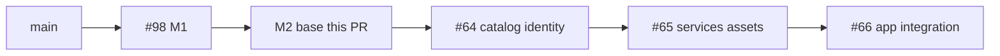

# M2 — stack base

Milestone: [docs/milestones/entities-and-catalogs.md](../../docs/milestones/entities-and-catalogs.md) · GitHub [milestone 2](https://github.com/movahedan/fivenines/milestone/2) · Tracking [issue #41](https://github.com/movahedan/fivenines/issues/41)

**Stack:** `main` ← [#98](https://github.com/movahedan/fivenines/pull/98) `feature/m1-baseline-catalog-checker` ← **this PR** `docs/m2-base` ← #64 ← #65 ← #66.

Inspected HEAD (2026-09-10): commit `731e892` includes M1 checker (`src/baseline/`), work fixtures (`src/work/`), and #100 graph/outcome fixtures. `#98` is **open** against `main`; `#99` and `#100` are merged into it. Live `Game` still has one `RouteTarget` per served project, Bronze SKUs in `src/catalog/kernel.ts`, and owned/leased tenure.

## Target architecture



**Dependency / policy rules:**
- This PR is documentation and plans only.
- Do not change `Game.tick`, `dispatch`, Hub/Lab, Nest, auth, or SDKs.
- Do not treat M1 guidelines as implemented runtime.

---

## Phase 1 — M2 stack base (docs-only)

**Goal:** Give Milestone 2 a reviewable stack root on current M1 code and stop claiming graph/outcome work is still local.

**Hard constraints (phase 1 only):**
- Must update M1 and M2 delivery tables to match GitHub (`#98` open; `#99`/`#100` merged into `#98`).
- Must publish current-code plans for #64–#66.
- Must not add engine modules, command tables, or coincidence tables.

### Code/config surfaces (builder-workflow)

- None. Docs-only phase.

### Scouts (parallel inventory — code/config only)

| Scout | Task | Patterns / paths | Row budget |
|-------|------|------------------|------------|
| 1 | Confirm M1 HEAD vs GitHub | `gh pr view 98,99,100` | ≤10 |

### Verification (phase 1 gate)

```bash
bun run overall
```

### Documentation before PR (documentation-sync)

**When:** This PR *is* the documentation-sync.

- `docs/milestones/engine-architecture-and-mathematics.md`
- `docs/milestones/entities-and-catalogs.md`
- `packages/fivenines-engine/AGENTS.md` (dedupe Related; point at M2 plans)
- `.cursor/plans/m2-base.plan.md`
- `.cursor/plans/m2-catalog-and-identity-foundations.plan.md`
- `.cursor/plans/m2-project-services-and-shared-assets.plan.md`
- `.cursor/plans/m2-application-model-integration.plan.md`

---

## What stays out of scope

- Catalog compile, identity registry, project services, Hub/Lab UI (#64–#66).
- Wiring `src/baseline/` or `src/work/` into `Game`.
- Nest, auth, SDK, persistence.

## Suggested PR sequence

| PR | Content | Merge gate |
|----|---------|------------|
| Base | This phase | `bun run overall` |
| #64 | Catalog and identity | engine tests + `bun run overall` |
| #65 | Project services and shared assets | engine tests + `bun run overall` |
| #66 | Application model integration | engine + web tests + `bun run overall` |

## Risk summary

| Risk | Mitigation |
|------|------------|
| Planning against stale `main` | Head is #98 + merged #99/#100; do not reset to `origin/main` |
| Duplicate Related in engine AGENTS | Deduped in this PR |
