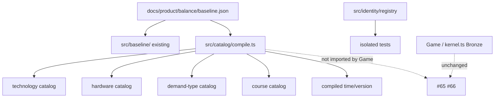

# M2 — Catalog and identity foundations (#64)

Milestone: [entities and catalogs](../../docs/milestones/entities-and-catalogs.md) · GitHub [milestone 2](https://github.com/movahedan/fivenines/milestone/2) · Issue [#64](https://github.com/movahedan/fivenines/issues/64)

Stack: `#98` ← `docs/m2-base` ← **this PR**.

Product: [domain model](../../docs/product/domain-model.md), [technology catalog](../../docs/product/technology-catalog.md), [balance index](../../docs/product/balance/index.md), [repository boundaries](../../docs/product/repository-boundaries.md).

Inspected kernel (2026-09-10, #98 HEAD): `Game` unique-checks customer/project/asset ids via `@packages/shared/ids`. Served projects have one `RouteTarget`. Live SKUs are `bronze`…`thin-ram` in `src/catalog/kernel.ts` plus `SKU_ECONOMY` cents. Design hardware ids are `general-small`… in `docs/product/balance/baseline.json` (purchase `240` game-dollars, cores, diskGiB, gpuCount). `src/baseline/` already validates authored JSON (IDs, DAG, mixes, policy guards, v1 closure). `src/work/units.ts` names throughput/occupancy dimensions. `Game` must not import `src/baseline/` or `src/work/` in this PR.

**M1 constraint:** executable code is checkers, math, or real entities. No ownership/index/command/coincidence *guideline tables* as fake runtime.

## Target architecture



**Naming / invariants:**

| Current | After #64 | Notes |
|---------|-----------|-------|
| `src/baseline/` checker | Unchanged | Still not Game config |
| Live `SERVER_CATALOG` / `SKU_ECONOMY` | Unchanged | Do not replace Bronze with `general-small` |
| Design JSON floats (purchase, dailyRent, coreFactor) | Compiled integer fields | Explicit translation; reject non-integer results or document rounding |
| `ids.assertUnique` on Game construct | Keep | New registry is a separate module Game does not call yet |
| Tenure owned/leased | Unchanged | Hardware compile must not drop lease/purchase distinction in types |

**Dependency / policy rules:**
- New catalog modules live under `packages/fivenines-engine/src/catalog/`. Compile may read baseline via existing `src/baseline/load.ts`.
- `Game`, `Server`, `demand.ts`, Hub/Lab must not import compiled catalogs in this PR.
- Do not add TypeScript tables that only restate tick order, command lists, or same-hour coincidences.
- Expansion entries may exist in compiled output but must be marked `release: "expansion"` and must not be required by v1 edges (checker already enforces that on JSON).
- Money: compiled hardware may carry integer cents **and** retain design-dollar fields for audit, but must not overwrite `STARTING_CASH_CENTS` / `SKU_ECONOMY`. Design `startingCash: 500` is not live cash.

---

## Phase 1 — Catalog compile, identity index, clock contracts (single PR)

**Goal:** Typed, validated, isolated catalogs and identity/clock contracts that later PRs can consume, without changing live simulation.

**Hard constraints (phase 1 only):**
- Must translate baseline technology, hardware, demand types, and courses into runtime-shaped records using `src/work` dimension names where capacity is involved.
- Must reject missing/duplicate catalog ids and technology prerequisite cycles on the **compiled** objects (not only on raw JSON).
- Must provide an identity registry that records owner + kind + id, rejects duplicates and missing lookups, and rolls back failed batch inserts.
- Must expose catalog version + `hoursPerTick === 1` as data on the compiled catalog (from baseline `policies.time.simulatedHoursPerTick` / `policies.version`), not as a coincidence table.
- Must not change `Game.tick`, `dispatch`, fixtures, Hub, Lab, Nest, auth, or persistence.
- Must not wire compile output into `SERVER_CATALOG`.
- Must not invent project services or instances (that is #65).

### Mechanical changes

| From | To | Notes |
|------|-----|-------|
| — | `src/catalog/compile.ts` | Load + translate + validate compiled catalogs |
| — | `src/catalog/technology-catalog.ts` | Runtime technology records (id, name, prerequisite ids, release) |
| — | `src/catalog/hardware-catalog.ts` | Runtime hardware: work-unit capacities + tenure price fields; ids stay design ids |
| — | `src/catalog/demand-catalog.ts` | Demand-type ids, policy key, release |
| — | `src/catalog/course-catalog.ts` | Course ids, names, effect keys |
| — | `src/identity/registry.ts` | Kind + id uniqueness; owner index |
| — | matching `*.test.ts` | Compile + registry; Game import-forbidden test |

### Code/config surfaces (builder-workflow)

- `packages/fivenines-engine/src/catalog/compile.ts` (+ tests)
- `packages/fivenines-engine/src/catalog/technology-catalog.ts`
- `packages/fivenines-engine/src/catalog/hardware-catalog.ts`
- `packages/fivenines-engine/src/catalog/demand-catalog.ts`
- `packages/fivenines-engine/src/catalog/course-catalog.ts`
- `packages/fivenines-engine/src/identity/registry.ts` (+ tests)
- Optional barrel: do **not** re-export compile from `src/index.ts` unless Hub needs it (it must not).
- Reuse `src/baseline/load.ts` and `src/work/units.ts` types. Do not modify `game.ts`, `kernel.ts`, `economy-policy.ts`.

**Compile rules (implementation):**
- Technology: map prerequisite **names** to ids using the existing baseline checker convention; compiled edges store ids.
- Hardware capacity: integer `cpuWork` from `cores * coreFactor * policies.resource.cpuWorkPerCoreHour` (fail if result is not a safe integer after an explicit rounding policy: `Math.round` then `units.asNonNegativeInteger`). `residentMemoryMiB = ramMiB`. `diskCapacityMiB = diskGiB * 1024`. `gpuCount` / `gpuWork` from JSON. Network: integer `networkMiB` from `networkMbps` with an explicit formula in the compile module (Mbps × 3600 / 8 / 1024, then round); test one SKU by hand.
- Demand types and courses: id uniqueness + policy/effect string passthrough; no Game traffic-policy merge.
- Compiled catalog object includes `version` string from `policies.version` and `hoursPerTick` from `simulatedHoursPerTick` (must be `1`).
- Tests: authored JSON compiles; duplicate hardware id fails; v1 tech cannot depend on missing id; Game source must not import `./catalog/compile` or `./identity/` (rg in test or a small import-boundary test).

**Identity registry:**
- Kinds: `customer` | `project` | `asset` (register these in tests). Allow `service` | `instance` kinds in the union so #65 does not rename, but #64 tests need not populate them.
- `register({ kind, id, ownerId })`; owner of a customer is `null` or `"game"`.
- Index: `get(kind, id)`, `ownedBy(ownerId)`, `assertUniqueAcrossKinds` optional — product ids are globally unique per kind first; Game today also unique-checks project ids globally. Registry should reject duplicate `(kind, id)` and duplicate raw `id` across kinds (matches Game’s global project uniqueness spirit).
- Batch `registerAll` is atomic.

**Clock/state:** fields on compiled catalog + `assertHourIndex(n)` using `units.asNonNegativeInteger`. No tick-order module.

### Scouts (parallel inventory — code/config only)

| Scout | Task | Patterns / paths | Row budget |
|-------|------|------------------|------------|
| 1 | Catalog live vs design ids | `rg 'SERVER_CATALOG|general-small|bronze' packages/fivenines-engine/src` | ≤40 |
| 2 | Baseline load/validate API | `packages/fivenines-engine/src/baseline/*` | ≤40 |
| 3 | Game imports | `rg "from \"./catalog|from \"./baseline|from \"./work" packages/fivenines-engine/src/game.ts` | ≤20 |
| 4 | Id helpers | `packages/shared/src/ids.ts` | ≤20 |

### Verification (phase 1 gate)

```bash
bun test packages/fivenines-engine
bun run turbo run typecheck --filter=@packages/fivenines-engine
bun run overall
```

Also: `rg "from \"./catalog/compile\"|from \"./identity/" packages/fivenines-engine/src/game.ts packages/fivenines-engine/src/server.ts packages/fivenines-engine/src/demand.ts` must be empty.

### Documentation before PR (documentation-sync)

- `packages/fivenines-engine/AGENTS.md` — compiled catalogs and identity registry; Game still Bronze; must not import compile.
- `docs/milestones/entities-and-catalogs.md` — delivery row for #64.
- Do not copy formulas into the wiki.

---

## What stays out of scope

- Project services, instances, placement edges (#65).
- Hub/Lab identity UI (#66).
- Replacing live Bronze SKUs or cash constants.
- Nest/auth/SDK/persistence.
- Encoding M1 coincidence tables.

## Suggested PR sequence

| PR | Content | Merge gate |
|----|---------|------------|
| This | Phase 1 only | Phase 1 verify block |

## Risk summary

| Risk | Mitigation |
|------|------------|
| Blind JSON import becomes Game config | Compile stays unimported by Game; live SKUs unchanged |
| Float design fields leak into cash/ppm | Integer assertions in compile; money not applied to Game |
| Fake guideline runtime | No command/coincidence modules |
| Hub/Lab break | No web edits in this PR |
