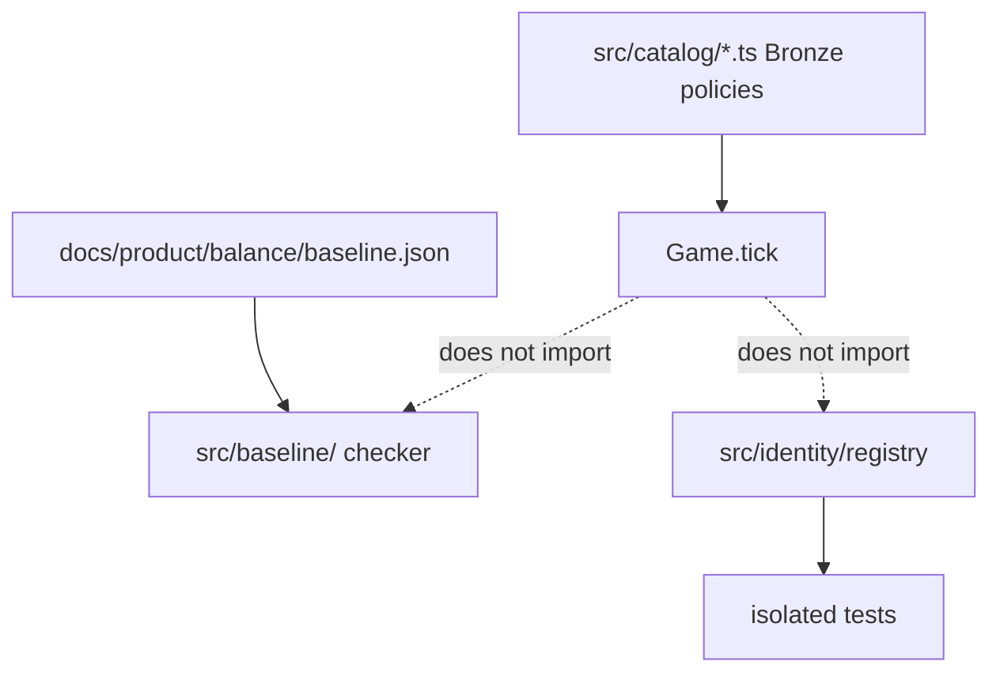

# M2 — Catalog and identity foundations (#64)

Milestone: [entities and catalogs](../../docs/milestones/entities-and-catalogs.md) · GitHub [milestone 2](https://github.com/movahedan/fivenines/milestone/2) · Issue [#64](https://github.com/movahedan/fivenines/issues/64)

Stack: `#98` ← `docs/m2-base` ← **this PR**.

**Decision:** A `compileAuthoredCatalog` translator was drafted and removed. It duplicated `src/baseline/` with no `Game` consumer. Live tunables stay in `src/catalog/*.ts`. Authored JSON stays a design pack. Cutover later replaces those modules (or one versioned runtime snapshot). No compiler, no second JSON Game loads.

## Target architecture



**Naming / invariants:**

| Current | After #64 | Notes |
|---------|-----------|-------|
| `src/baseline/` checker | Unchanged | Still not Game config |
| Live `SERVER_CATALOG` / `SKU_ECONOMY` | Unchanged | Bronze stays until a later cutover |
| Game unique ids at construct | Keep | Registry is extra for future services/instances; Game does not call it yet |

**Dependency / policy rules:**
- Do not add `src/catalog/compile.ts` or compiled catalog types.
- `Game` must not import `src/baseline/` or `src/identity/`.
- No command/coincidence tables.

---

## Phase 1 — Identity index and clock contracts (single PR)

**Goal:** Stampable instance ids and a non-negative hour index, without a catalog compiler.

**Hard constraints:**
- Identity registry: kind + id uniqueness, owner index, atomic `registerAll`.
- Kinds include `service` | `instance` for #65; #64 tests need not populate them.
- `assertHourIndex` via `units.asNonNegativeInteger`.
- Must not change `Game.tick`, Bronze SKUs, Hub/Lab, Nest, auth.

### Code/config surfaces (builder-workflow)

- `packages/fivenines-engine/src/identity/registry.ts` (+ tests)
- `packages/fivenines-engine/src/identity/clock.ts`
- Do not modify `game.ts`, `kernel.ts`, `economy-policy.ts`

### Verification (phase 1 gate)

```bash
bun test packages/fivenines-engine
bun run turbo run typecheck --filter=@packages/fivenines-engine
bun run overall
```

`game.ts` must not import `identity/`.

### Documentation before PR (documentation-sync)

- `packages/fivenines-engine/AGENTS.md`
- `docs/milestones/entities-and-catalogs.md`
- `docs/product/balance/index.md` and `docs/product/repository-boundaries.md` — no compiler; live TS catalog

---

## What stays out of scope

- Catalog compile / `baseline-2.json` loaded by Game.
- Project services (#65).
- Hub/Lab identity UI (#66).
- Replacing live Bronze SKUs.

## Risk summary

| Risk | Mitigation |
|------|------------|
| Compiler sneaks back | Milestone durable note; no `compile.ts` |
| Dual uniqueness vs Game | Fold registry into Game when consumers move |
