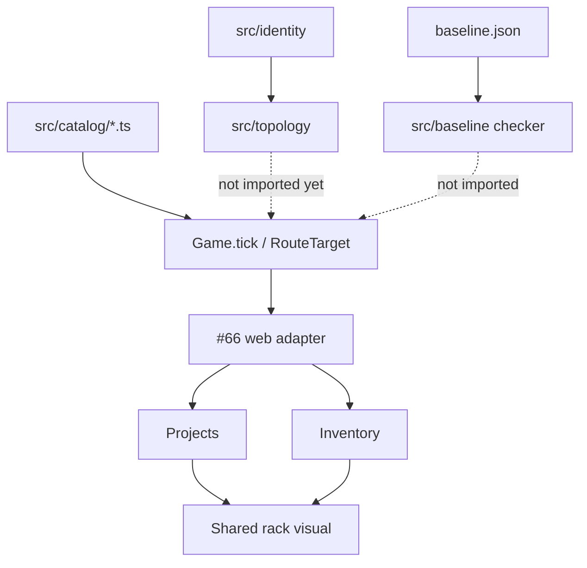

# Milestone 2 — Entities and catalogs

Milestone: [entities and catalogs](../../docs/milestones/entities-and-catalogs.md) · GitHub [milestone 2](https://github.com/movahedan/fivenines/milestone/2) · Issues [#64](https://github.com/movahedan/fivenines/issues/64) [#65](https://github.com/movahedan/fivenines/issues/65) [#66](https://github.com/movahedan/fivenines/issues/66)

**PR:** [#101](https://github.com/movahedan/fivenines/pull/101) on `docs/m2-base`, stacked on [#98](https://github.com/movahedan/fivenines/pull/98) (Milestone 1). Former slice PRs #102 and #103 fold into #101.

**Catalog rule:** Live tunables stay in `src/catalog/*.ts` (Bronze today). `baseline.json` is checked by `src/baseline/` only. No compiler. No second JSON `Game` loads. Cutover later replaces those modules or one versioned runtime snapshot.

**M1 leftover:** `Game` still has one `RouteTarget` per served project, owned/leased tenure. `src/work/` stays unwired.

## Target architecture



**Dependency / policy rules:**
- Register **instances** (customer, project, asset, service, instance), not catalog rows or metrics.
- Dependency, placement, and routing are different edges. Layout coordinates stay out of the engine.
- `Game.tick` does not run topology or `src/work/`.
- No command/coincidence guideline tables.
- Hub/Lab must launch. Accept stays the current command until M4.

---

## Done — Identity

`IdentityRegistry`: unique id across kinds, owner index, atomic `registerAll`, `clone`. `assertHourIndex`. Tests in `src/identity/`. `Game` must not import this tree until consumers move; then stamp ids at create time inside `Game`, do not keep a sidecar forever.

## Done — Topology

`TopologyGraph`: services, instances, shared assets, placement, health, shared config, dependency edges. Atomic rollback. Rebuild instance-by-asset indexes on change. Two projects can share one asset; two instances share config and keep independent host/health. `Game` must not import this tree yet.

## Remaining — Application model integration (#66)

**Goal:** Projects and Inventory resolve the same physical asset; instances can show independent host/readiness even while tick still uses one route.

**Hard constraints:**
- Preserve tenure.
- Shared rack visual (density variants only).
- Do not fake M4 preparation as accept-to-served.
- `@packages/ui` display props only.

**Surfaces:** engine projections as needed; `apps/web` hub Projects + Inventory; `packages/ui` rack if that is where the visual lives.

**Verify:**

```bash
bun test packages/fivenines-engine
bun test apps/web
bun run turbo run typecheck --filter=@packages/fivenines-engine --filter=@apps/web --filter=@packages/ui
bun run overall
```

---

## What stays out of scope

- Catalog compile / `Game` loading `baseline.json`.
- M4 install/configure/start.
- M5 solver / wiring `src/work` into `Server.tick`.
- Nest, auth, SDK, persistence.

## Risk summary

| Risk | Mitigation |
|------|------------|
| Compiler returns | Milestone durable note; no `compile.ts` |
| Dual uniqueness vs Game | Fold registry into Game when #66 wires consumers |
| Fake preparation UI | Keep current accept; honest disabled copy |
