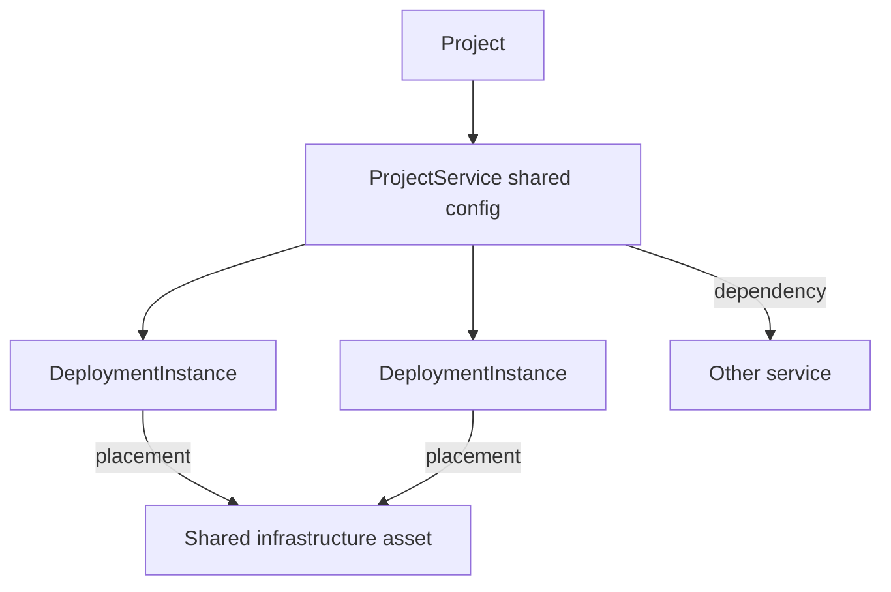

# M2 — Project services and shared assets (#65)

Milestone: [entities and catalogs](../../docs/milestones/entities-and-catalogs.md) · Issue [#65](https://github.com/movahedan/fivenines/issues/65)

Depends on [#64](https://github.com/movahedan/fivenines/issues/64). **Revalidate this plan against merged #64 before implementation.**

Product: [domain model](../../docs/product/domain-model.md) (component vs deployment vs server; dependency vs placement vs routing).

Inspected kernel (2026-09-10): `Project` holds traffic, commercial terms, status, and one `route?: RouteTarget`. `Game.assets` is `Server` only. Accept still requires `serverId`. No service or instance types.

## Target architecture



**Naming / invariants:**

| Current | After #65 | Notes |
|---------|-----------|-------|
| One `RouteTarget` on Project | Still the live Game placement | New graph is parallel until #66 |
| `Server` as only asset | Shared asset identity type wrapping existing Server id | Tenure stays on Server |
| No services | `ProjectService` + `DeploymentInstance` | Instances share logical config; host/readiness/health are per instance |
| Mutations via `applyCommand` | Keep existing commands | New graph mutations are a separate atomic API Game does not call from tick |

**Dependency / policy rules:**
- Distinguish dependency, placement, and routing edges. Do not store layout coordinates in the engine.
- Candidate mutations apply all-or-nothing; invalid placement, missing/duplicate ids, or cyclic dependencies throw without partial writes.
- Compile or dirty indexes on topology/configuration change, not every tick.
- `Game.tick` must not allocate via `src/work/` or run the new graph.
- Hub/Lab unchanged in this PR (still launch because Game API is unchanged).

---

## Phase 1 — Services, instances, shared assets (single PR)

**Goal:** Represent two projects on one physical server and two instances of one service as real entities, independently of live RPS routing.

**Hard constraints:**
- Must register new ids through the #64 identity registry (atomic).
- Must keep tenure on existing `Server`.
- Must not change accept-to-served to a preparation flow (M4).
- Must not replace `RouteTarget` in `Game` (that is #66).
- Must not add coincidence/command guideline tables.

### Code/config surfaces (builder-workflow)

- `packages/fivenines-engine/src/topology/` (or `src/services/`): types + mutation + index rebuild
- Tests: two projects → one asset; two instances share config and diverge on host/health; config mutation isolated to one project; reject cycles/missing placements atomically
- Do not edit `apps/web`, Nest, auth
- Do not import topology from `Game.tick`

### Scouts (parallel inventory — code/config only)

| Scout | Task | Patterns / paths | Row budget |
|-------|------|------------------|------------|
| 1 | Project/Server graph | `project.ts`, `server.ts`, `game.utils.ts` | ≤40 |
| 2 | Identity registry from #64 | `src/identity/` | ≤40 |
| 3 | Fixtures | `src/fixtures.ts` | ≤20 |

### Verification (phase 1 gate)

```bash
bun test packages/fivenines-engine
bun run turbo run typecheck --filter=@packages/fivenines-engine
bun run overall
```

### Documentation before PR (documentation-sync)

- `packages/fivenines-engine/AGENTS.md` — new nouns; live route still one server
- `docs/milestones/entities-and-catalogs.md` — #65 delivery row

---

## What stays out of scope

- Consumer/UI migration (#66).
- Preparation/installation lifecycle (M4).
- Resource solver (M5).
- Nest/auth/SDK/persistence.

## Suggested PR sequence

| PR | Content | Merge gate |
|----|---------|------------|
| This | Phase 1 only | Phase 1 verify |

## Risk summary

| Risk | Mitigation |
|------|------------|
| Two engines forever | #66 must delete incompatible assumptions; this PR keeps RouteTarget as the live path |
| Fake success on accept | Do not add a served-via-services command that pretends M4 exists |
