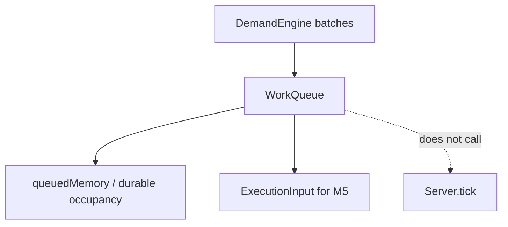

# M3 PR — Batch retention and queue state (#68)

Depends on #67. Stacked on `feature/m3-typed-demand`.

**Outcome:** Waiting groups retain original age and compatible progress. Queue fullness rejects excess **new** work. Aggregation does not reset deadlines or invent free storage. No substitute allocator.

## Target architecture



**Invariants (product):**
- Group by demand type + arrival hour + compatible processing key. 30 leftover + 80 new = two groups, not one reset group.
- Interactive and continuous: `maxCarryTicks = 0` (must finish this tick or fail; generation still emits them).
- Queued: may use arrival tick + next two; expire before the third subsequent tick (`queuedMaxCarryTicks = 2`).
- Jobs: retain progress until delivery or lateness cutoff fields on the cohort (do not settle contracts here).
- Volatile occupancy (queue KiB / working memory of waiting interactive-style) vs durable job data occupancy are distinct.
- Full queue: reject incoming; do not evict accepted work.
- No retries.
- `Game` must not import this tree in this PR (same pattern as `src/work/`). Expose `toExecutionInput()` for later M5.

## Phase 1

### Code/config surfaces

- `packages/fivenines-engine/src/catalog/queue-policy.ts` (carry ticks, no retries)
- `packages/fivenines-engine/src/demand-engine/queue.ts` + tests
- Optional occupancy helper using demand-type `queueKiB` / working memory micro-units
- `src/index.ts` exports

### Verification

```bash
bun test packages/fivenines-engine
bun run turbo run typecheck --filter=@packages/fivenines-engine
bun run overall
```

Fixtures: all four families + GPU inference type present as queued occupancy candidates. Overflow test: second cohort rejected, first keeps age.

### Documentation before PR

- `packages/fivenines-engine/AGENTS.md`
- `docs/milestones/demand-and-learning-foundations.md`
- `.cursor/plans/m3-batch-retention-and-queue-state.plan.md`

## Out of scope

- `Server.tick` fair shares (M5 / existing `src/work/`)
- Hub queue UI beyond honest incomplete
- Learning
