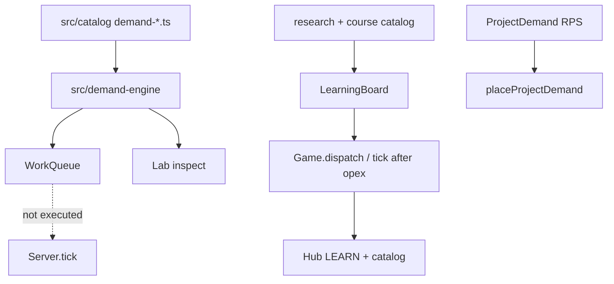

# Milestone 3 — Demand, work retention and learning foundations

Milestone: [demand and learning foundations](../../docs/milestones/demand-and-learning-foundations.md) · GitHub [milestone 3](https://github.com/movahedan/fivenines/milestone/3) · Tracking [#41](https://github.com/movahedan/fivenines/issues/41) · Issues [#67](https://github.com/movahedan/fivenines/issues/67) [#68](https://github.com/movahedan/fivenines/issues/68) [#69](https://github.com/movahedan/fivenines/issues/69) [#70](https://github.com/movahedan/fivenines/issues/70)

**PR:** [#104](https://github.com/movahedan/fivenines/pull/104) on `feature/m3-demand-and-learning-foundations`, stacked on [#101](https://github.com/movahedan/fivenines/pull/101) (`docs/m2-base`) and [#98](https://github.com/movahedan/fivenines/pull/98). Slice PRs merged into #104: [#105](https://github.com/movahedan/fivenines/pull/105) [#106](https://github.com/movahedan/fivenines/pull/106) [#107](https://github.com/movahedan/fivenines/pull/107) [#108](https://github.com/movahedan/fivenines/pull/108).

Live `Game` still has one `RouteTarget` per served project, Bronze SKUs, owned/leased tenure, Opening Shift boot. `src/identity/` and `src/topology/` exist and `Game` does not import them. `src/baseline/` is the JSON checker only. `src/work/` is unwired. Issue [#66](https://github.com/movahedan/fivenines/issues/66) remains open on #101.

## Target architecture



**Dependency / policy rules:**
- Generation never places or executes. No substitute resource solver (M5).
- Live tunables stay in `src/catalog/*.ts`. Do not load `baseline.json` into `Game`. Translate numbers into integers when cutting them into catalog modules (`Math.round(value * 1_000_000)` micro-units; tuition ×100 cents).
- Research permissions stay distinct from installation.
- Shared cash posting (`postCashDelta`) for tuition; no learning wallet.
- Do not re-export DemandEngine / WorkQueue from `src/index.ts`. Lab imports `@packages/fivenines-engine/demand-engine` → `engine.ts` only.
- Hub/Lab still launch. Tenure preserved. No Nest/auth/SDK/persistence expansion.
- Numerical arrival checks state sample size and tolerances.

## Shipped surfaces

### Typed demand (#67 / #105)

- Catalog: `demand-types.ts`, `demand-rhythms.ts`, `demand-variation.ts`, `demand-projects.ts`
- Mixes are permille summing to 1000. Rhythm bands 6h, daily-mean normalized. Combined campaign × spike capped at 6.
- `DemandEngine`: seeded mulberry32 from project id, Gamma–Poisson, multinomial / largest remainder. Finite jobs `activateFinite` only. Expansion ids throw unless `allowExpansion`.
- Sample check: `n=10000`, mean within 5% of 300, `k=25`.
- Opening Shift still `ConstantDemand` / `ProjectDemand`. `Game` does not import this tree.

### Batch retention (#68 / #106)

- `queue-policy.ts` + `demand-engine/queue.ts`
- Cohorts by type + arrival hour. Interactive/continuous carry 0; queued 2; jobs retained.
- Occupancy `queueKiB`. Overflow rejects new work. `toExecutionInput()` for M5.
- `Game` does not import this tree.

### Enrollment (#69 / #107)

- `learning-policy.ts`, `research-catalog.ts`, `course-catalog.ts`
- Two shared slots, 672h month, tuition via `postCashDelta`
- Commands `enrollLearning` / `pauseLearning` / `resumeLearning` / `cancelLearning`. Enroll blocked while jailed. Tick after opex, before jail.
- Effects stored; not applied to missing consumers.

### Learning + demand UI (#70 / #108)

- `learningCatalog` / `Game.learningCatalog`
- Hub **LEARN n/2** and Learning strip (authored durations/prices). Honest #66 and missing-consumer copy.
- Lab Demand inspect samples Appointment Site. Roots not placed.

## Verification

```bash
bun run overall
```

## What stays out of scope

- Finishing #66 Hub identity UI
- Wiring DemandEngine into `placeProjectDemand` / `Server.tick`
- M5 allocator / `src/work/` in `Game.tick`
- Nest, auth, SDK, persistence
