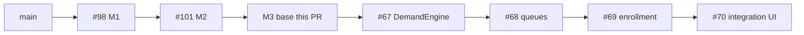

# M3 — stack base

Milestone: [demand-and-learning-foundations.md](../../docs/milestones/demand-and-learning-foundations.md) · GitHub [milestone 3](https://github.com/movahedan/fivenines/milestone/3) · Tracking [issue #41](https://github.com/movahedan/fivenines/issues/41)

**Stack:** `main` ← [#98](https://github.com/movahedan/fivenines/pull/98) ← [#101](https://github.com/movahedan/fivenines/pull/101) `docs/m2-base` ← **this PR** `feature/m3-demand-and-learning-foundations` ← [#67](https://github.com/movahedan/fivenines/issues/67) ← [#68](https://github.com/movahedan/fivenines/issues/68) ← [#69](https://github.com/movahedan/fivenines/issues/69) ← [#70](https://github.com/movahedan/fivenines/issues/70).

Inspected HEAD (2026-09-11): `docs/m2-base` `49297d4`. Live `Game` still has one `RouteTarget` per served project, Bronze SKUs, owned/leased tenure, Opening Shift boot. `src/identity/` and `src/topology/` exist and `Game` does not import them. `src/baseline/` is the JSON checker only. `src/work/` is unwired. Hub/Lab still launch on Opening Shift RPS demand (`ConstantDemand` / `ProjectDemand`). Issue [#66](https://github.com/movahedan/fivenines/issues/66) (Projects/Inventory shared-asset identity UI) remains open on #101 — this stack does not fake it.

## Target architecture



**Dependency / policy rules:**
- This PR is documentation and plans only.
- Do not change `Game.tick`, `dispatch`, Hub/Lab, Nest, auth, or SDKs here.
- Generation never places or executes. No substitute resource solver (M5).
- Live tunables stay in `src/catalog/*.ts`. Do not load `baseline.json` into `Game`. Translate numbers into integers when cutting them into catalog modules.
- Research permissions stay distinct from installation.
- Shared cash posting for tuition; no learning wallet.

---

## Phase 1 — M3 stack base (docs-only)

**Goal:** Give Milestone 3 a reviewable stack root on current M2 code and stop treating M2 stacked slice PRs as merge targets.

**Hard constraints (phase 1 only):**
- Must record #101 as the M2 merge target; #102/#103 are closed into it; #66 is incomplete.
- Must publish current-code plans for #67–#70.
- Must not add engine modules.

### Code/config surfaces (builder-workflow)

- None. Docs-only phase.

### Scouts (parallel inventory — code/config only)

| Scout | Task | Patterns / paths | Row budget |
|-------|------|------------------|------------|
| 1 | Confirm M2 HEAD vs GitHub | `gh pr view 101,98` | ≤10 |

### Verification (phase 1 gate)

```bash
bun run overall
```

### Documentation before PR (documentation-sync)

**When:** This PR *is* the documentation-sync.

- `docs/milestones/entities-and-catalogs.md`
- `docs/milestones/demand-and-learning-foundations.md`
- `packages/fivenines-engine/AGENTS.md` (Related: M3 stack)
- `.cursor/plans/m3-demand-and-learning-foundations.plan.md`
- `.cursor/plans/m3-typed-demand-generation.plan.md`
- `.cursor/plans/m3-batch-retention-and-queue-state.plan.md`
- `.cursor/plans/m3-enrollment-and-tuition-lifecycle.plan.md`
- `.cursor/plans/m3-learning-and-demand-integration.plan.md`

---

## What stays out of scope

- Implementing #67–#70 in this PR.
- Finishing #66 Hub identity UI (honest incomplete).
- Nest, auth, SDK, persistence.
- Wiring `src/work/` into `Game.tick`.

## Suggested PR sequence

| PR | Content | Merge gate |
|----|---------|------------|
| Base | This phase | `bun run overall` |
| #67 | Typed demand generation | engine tests + `bun run overall` |
| #68 | Batch retention and queue state | engine tests + `bun run overall` |
| #69 | Enrollment and tuition lifecycle | engine tests + `bun run overall` |
| #70 | Learning and demand integration | engine + web tests + `bun run overall` |

At milestone close, merge slice branches into this base, fold slice plans into this file, and keep the PR title **Milestone 3: Demand, work retention and learning foundations**.

## Risk summary

| Risk | Mitigation |
|------|------------|
| Planning against stale `main` | Head is #101 on #98; `git fetch` before each slice |
| Dual demand models | Opening Shift keeps RPS `ProjectDemand`; DemandEngine is independent until a consumer needs typed batches |
| #66 incomplete | State it; do not invent shared-asset Hub identity |
