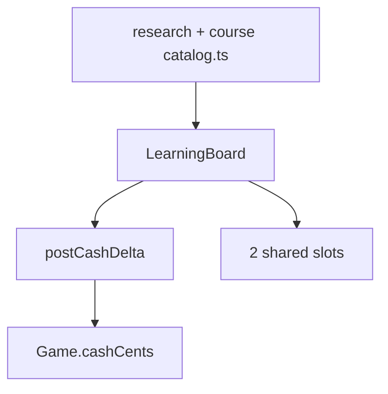

# M3 PR — Enrollment and tuition lifecycle (#69)

Depends on M2 only; stacked after #68 for linear review. May share the M3 base cash helper.

**Outcome:** Two concurrent enrollments. Courses ≤5 sequential levels; technology research does not stack. Upfront monthly charge on `Game.cashCents`. Insufficient funds pause with progress kept. Completion at a renewal boundary does not charge another month.

## Target architecture



**Invariants:**
- `LEARNING_POLICY.sharedConcurrentSlots = 2`. Research is not an operational task and is not installation.
- Base techs Application Runtime + Relational Database start completed, tuition 0.
- Duration/tuition by dependency-depth tier: 168/336/504/840 hours and 40/80/160/320 design-dollars → **cents ×100** (4000/8000/16000/32000). Courses: authored monthlyTuition ×100, durations 168…840.
- Billing month = 672 hours from enrollment (or from resumption after nonpayment).
- Collect full month at enroll and at month start while active. No proration. Completion processed **before** renewal when hour matches both.
- Insufficient funds: pause, free slot, keep progress, no tuition debt.
- Resume after nonpayment: new 672h month, full tuition, needs a free slot.
- Voluntary cancel: keep progress, free slot, no refund; resume inside remaining paid coverage without a new fee.
- Technology: one enrollment per tech; cannot stack. Courses: cannot enroll two copies; must complete level n before n+1.
- `Game` **does** own `LearningBoard` and ticks it after opex/PAYG or at a documented hour boundary — learning progress is live state, not a guideline table. Do not simulate Quality Checks / install-time reductions of missing M4/M7 consumers; store effect factors only.
- Commands: `enrollLearning`, `pauseLearning`, `resumeLearning`, `cancelLearning`. Jail: enroll that spends cash should fail like `buyServer`; pause/cancel allowed.
- Tenure, Opening Shift Hub/Lab still launch. Learning UI is #70; engine may expose snapshot fields.

### Code/config surfaces

- `packages/fivenines-engine/src/catalog/learning-policy.ts`
- `packages/fivenines-engine/src/catalog/research-catalog.ts` (v1 rows; expansion marked)
- `packages/fivenines-engine/src/catalog/course-catalog.ts`
- `packages/fivenines-engine/src/learning/` (board, enrollment, posting)
- `packages/fivenines-engine/src/game.ts` / `game.utils.ts` — wire board + commands + `postCashDelta`
- tests

### Verification

```bash
bun test packages/fivenines-engine
bun run turbo run typecheck --filter=@packages/fivenines-engine
bun run overall
```

Cases: two-slot cap; third enroll throws; insufficient funds pause; completion at 672h of a 168h course charges once; Monitoring research duration 168h / 4000 cents.

### Documentation before PR

- `packages/fivenines-engine/AGENTS.md`
- `docs/milestones/demand-and-learning-foundations.md`
- `.cursor/plans/m3-enrollment-and-tuition-lifecycle.plan.md`

## Out of scope

- Learning Hub screens (#70)
- Install/config durations as runtime tasks (M4)
- Incident probability rolls (M7)
