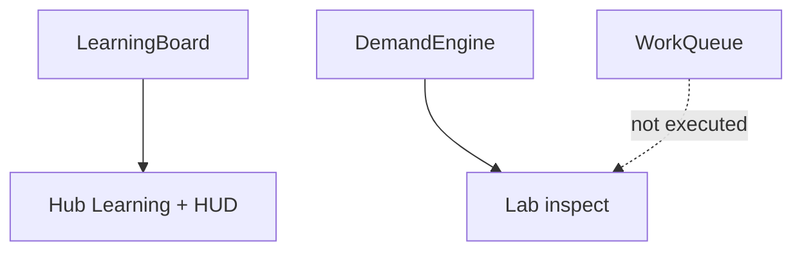

# M3 PR — Learning and demand integration (#70)

Depends on #68 and #69.

**Outcome:** Learning catalog, inline enrollment, distinct progress in desktop top bar / mobile strip. Completed course levels vs active enrollments. Locked/active/paused/completed/insufficient-funds. Authored durations/prices/prereqs, not Figma hour-scale. Demand inspectable in Lab without claiming execution. Effects whose consumers do not exist stay explicit.

## Target architecture



**Honest incomplete:** Projects/Inventory still lack #66 shared-asset identity. Demand batches are not placed. Queue is not Server.tick. Skill factors are stored, not applied to install/incident/CPU consumers.

## Phase 1

### Code/config surfaces

- `packages/fivenines-engine` snapshot helpers for learning + optional demand inspect API used by Lab only
- `apps/web/src/hub/` Learning panel + HUD slot indicators
- `apps/web/src/lab/` demand/queue inspect (read-only)
- `packages/ui` only if existing molecules already cover catalog/enroll; do not invent a second design system
- Figma app is visual reference only

### Verification

```bash
bun test packages/fivenines-engine
bun test apps/web/src/routes/hub.test.tsx
bun test apps/web/src/routes/lab.test.tsx
bun run overall
```

Hub/Lab still launch. Keyboard/touch enroll states: locked, active, paused, completed, insufficient-funds.

### Documentation before PR

- `packages/fivenines-engine/AGENTS.md`
- `apps/web/AGENTS.md`
- `docs/milestones/demand-and-learning-foundations.md`
- Fold slice plans into `.cursor/plans/m3-demand-and-learning-foundations.plan.md` when merging slices into the M3 base PR

## Out of scope

- Nest/auth/SDK/persistence
- M5 allocator
- M9 remaining catalog coverage
