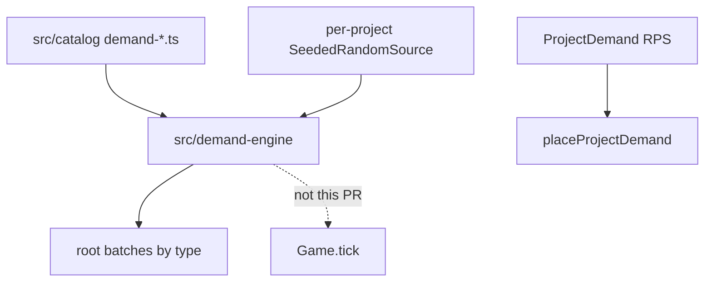

# M3 PR — Typed demand generation (#67)

Milestone: [demand-and-learning-foundations.md](../../docs/milestones/demand-and-learning-foundations.md) · stacked on M3 base → [#101](https://github.com/movahedan/fivenines/pull/101).

**Outcome:** A project can emit typed root batches from authored mixes without touching placement, `Server.tick`, or Opening Shift RPS.

**HEAD assumption:** `Game` uses `ConstantDemand` / `ProjectDemand` integer RPS. DemandEngine is a new tree. `Game` must not import it in this PR.

## Target architecture



**Naming / invariants:**
- Baselines are root units per hour, not RPS.
- Integers at the emission boundary (`count` per type).
- Translate fractional baseline costs with `Math.round(value * 1_000_000)` micro-units (dns `networkMiB` 0.0005 → 500). Store application vs database CPU separately. Do not load `baseline.json`.
- Mix weights as permille summing to 1000.
- Rhythm bands `[0,6),[6,12),[12,18),[18,24)`: raw weights from product; permille = `round(1000 * raw / mean(raw))` so daily mean stays the baseline.
- Combined campaign × spike multiplier capped at 6 (`eventMultiplierCap`).
- No extra jitter (Opening Shift jitter stays on `ProjectDemand` only).
- Inactive generators emit empty batches and must not consume the project stream except for scheduled campaign/spike state that already exists.
- Expansion catalog rows may exist; `DemandEngine` refuses expansion ids unless a test explicitly opts in. Default fixtures are v1: interactive (page-read), queued (email-message), continuous (video-minute / live-minute), finite GPU (inference-gpu) and CPU jobs (transcode-job, batch-job).
- Finite jobs: one frozen root on `activate()`, never hourly Poisson.
- DemandEngine emits external roots only (no payment→email child).

**Arrival (product):** `m = baseline × rhythm × campaign × spike` (after cap). `Z ~ Gamma(k, scale=1/k)`, `N ~ Poisson(mZ)`, then multinomial split. Constant fixture skips Z/N and uses largest-remainder split of `m`.

**RNG:** `SeededRandomSource` from a u32 seed derived from `projectId` (FNV-1a or equivalent). Independent of customer iteration order. Snapshot state: spike remaining hours, cooldown, campaign window, last campaign end hour. `nextUnit()` remains the only `RandomSource` method; DemandEngine may call it many times per hour.

## Phase 1 — Catalog + DemandEngine

**Hard constraints:**
- Must not import DemandEngine from `game.ts` / `project.ts`.
- Must not change Bronze overload proofs or Opening Shift shaped RPS.
- Must not add a catalog compiler.
- Hub/Lab unchanged.

### Code/config surfaces

- `packages/fivenines-engine/src/catalog/demand-types.ts`
- `packages/fivenines-engine/src/catalog/demand-rhythms.ts`
- `packages/fivenines-engine/src/catalog/demand-variation.ts`
- `packages/fivenines-engine/src/catalog/demand-projects.ts` (v1 templates + finite jobs)
- `packages/fivenines-engine/src/demand-engine/` (`engine.ts`, `rng.ts`, `sample.ts`, `mix.ts`, tests)
- `packages/fivenines-engine/src/index.ts` (export types/engine, not wired)
- `packages/fivenines-engine/src/traffic/random-source.ts` (add seeded source only if DemandEngine should not fork RandomSource — prefer `demand-engine/rng.ts` implementing `RandomSource`)

### Scouts

| Scout | Task | Patterns / paths | Row budget |
|-------|------|------------------|------------|
| 1 | Live demand path | `src/traffic/`, `src/catalog/traffic-policy.ts` | ≤20 |
| 2 | Baseline demand numbers | `docs/product/balance/baseline.json` policies.demand, demandTypes, projects | ≤40 |

### Verification

```bash
bun test packages/fivenines-engine
bun run turbo run typecheck --filter=@packages/fivenines-engine
bun run overall
```

Numerical arrival checks **must** print sample size and tolerances in the assertion message, e.g. `n=10000 hours, mean within 5% of m, mix within 2pp`. Seeded replay: same seed + hour sequence → identical batches.

### Documentation before PR

- `packages/fivenines-engine/AGENTS.md` — DemandEngine tree; Game must not import; Opening Shift RPS unchanged
- `docs/milestones/demand-and-learning-foundations.md` — #67 row
- `.cursor/plans/m3-typed-demand-generation.plan.md`

## Out of scope

- Queue occupancy, expiry, overflow (#68)
- Learning (#69/#70)
- Feeding batches into `placeProjectDemand`
- Resource solver
