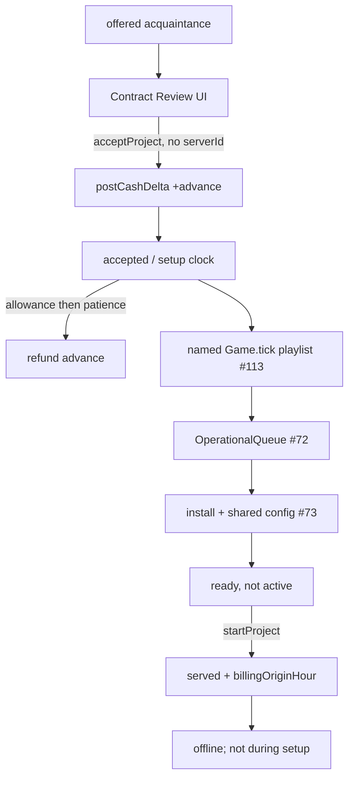

# Milestone 4 — Infrastructure preparation and operations

Milestone: [infrastructure preparation and operations](../../docs/milestones/infrastructure-preparation-and-operations.md) · GitHub [milestone 4](https://github.com/movahedan/fivenines/milestone/4) · Tracking [#41](https://github.com/movahedan/fivenines/issues/41) · Issues [#71](https://github.com/movahedan/fivenines/issues/71) [#113](https://github.com/movahedan/fivenines/issues/113) [#72](https://github.com/movahedan/fivenines/issues/72) [#73](https://github.com/movahedan/fivenines/issues/73) [#74](https://github.com/movahedan/fivenines/issues/74) [#75](https://github.com/movahedan/fivenines/issues/75)

**Stack:** `feature/m4-infrastructure-preparation-and-operations` on [#104](https://github.com/movahedan/fivenines/pull/104) (`feature/m3-demand-and-learning-foundations`). Do not treat old M3 slice branches as the merge target. Slice PRs stack on the M4 base; after review they fold into the base PR titled **Milestone 4: Infrastructure preparation and operations**.

Live `Game` still has one `RouteTarget` per served project, Bronze–Diamond + `thin-ram`, owned/leased tenure, Opening Shift 336h clock. `src/identity/` and `src/topology/` exist; `Game` must not import them until a consumer creates those instances. `src/work/` remains unwired. `src/baseline/` is the authored JSON checker only. Live tunables stay in `src/catalog/*.ts`. DemandEngine / WorkQueue stay out of `Game.tick`. Learning effects stay stored, not simulated onto missing Monitoring/incident consumers. Issue [#66](https://github.com/movahedan/fivenines/issues/66) remains incomplete on #101 — do not fake shared-asset identity in Hub.

## Target architecture



**Naming / invariants:**

| Current | After M4 | Notes |
|---------|----------|-------|
| `acceptProject` + `serverId` → `served` | `acceptProject` `{ projectId }` → `accepted`, no route | Breaking command payload |
| Immediate PAYG/SLA on accept | Demand/SLA/PAYG only after `startProject` | Setup is not live service |
| Global week close as first-period origin | `billingOriginHour` on activation | Daily AR settle stays global 24h |
| Incoming offer cards Accept-on-card | Central offer + Contract Review | Back keeps offer identity; Close never charges |
| 10 Opening Shift offered projects | First acquaintance appointment; later acquaintance-style offers by policy | Not M6 professional families |

**Dependency / policy rules:**
- Money: `postCashDelta` only. No second wallet. Advance, refund, buy/lease, tuition share it.
- Integers at cash/ppm/request boundaries. Patience uses millihours (`B` × 1000) so 14.4h is exact; withdrawal on the first outer tick at or after the threshold (acquaintance: hour 39 from accept-at-0).
- `Game` must not import `src/identity/`, `src/topology/`, `src/demand-engine/`, `src/work/`, `src/baseline/`.
- No resource solver (M5). Transfers stay `pending`. No weekly-settlement-complete claim. No Nest/auth/SDK/persistence expansion.
- Park throws during initial setup. Park is project-scoped; it cannot stop another project on the same box.
- First-project preset is two installs + one shared configuration = 5h; do not add per-technology configuration a second time.
- Hub/Lab must still launch. Figma app is visual reference only.
- Overload fixtures (`oneBronzeInitial` / `twoBronzeInitial`) stay constructible as already-`served` with `billingOriginHour: 0` so existing physics tests do not walk setup.
- **Tick structure (option C, [#113](https://github.com/movahedan/fivenines/issues/113) / [#114](https://github.com/movahedan/fivenines/pull/114)):** `Game.tick` is an authored playlist of private methods on one `TickContext` `{ hour, cash, events, rng }`. `#tickOperations` is empty until #72. No `TickPhase[]` registry, no manager that copies `customers[]`.

## Implementation choice (not a product conflict)

Opening Shift still needs two **served** contracts meeting window SLA. Reputation 0 only allows acquaintance-style appointment variants, pending cap 1, interval 24h after the first offer leaves pending. M4 therefore:
- Replaces the prefilled 10-offer Opening Shift board with Maya / Maya's Appointments (`appointment-site`, 80% SLA, weekly fee 80 design units → 8000¢).
- After that offer is accepted, declined, or expired (48h), the next interval may add another acquaintance-style appointment (not community/shop templates — those stay M6).
- Ready/Start land in later slices, so Opening Shift **win** stays hard until installs exist; do not silently mark ready.

Live starting cash and Bronze prices stay as they are (`STARTING_CASH_CENTS`). Translate authored weekly fees with ×100 like tuition.

---

## Phase 0 — M4 stack base (docs)

**Goal:** Open `feature/m4-infrastructure-preparation-and-operations` from #104 with this plan and an honest milestone delivery row. No engine behavior change.

**Hard constraints:** docs/plans only; do not edit Hub/Lab/engine runtime.

### Code/config surfaces (builder-workflow)

- None (docs-only phase).

### Verification

```bash
bun run overall
```

### Documentation before PR

- `.cursor/plans/m4-infrastructure-preparation-and-operations.plan.md`
- `docs/milestones/infrastructure-preparation-and-operations.md` (stack on #104, in progress)
- `packages/fivenines-engine/AGENTS.md` pointer to M4 plan (no fake “implemented” claims)

---

## Phase 1 — Acquaintance acceptance and advance (#71)

**Goal:** Acceptance, advance, setup clock, refund, and explicit Start as billing origin — distinct from readiness work and from live routing.

**Hard constraints (phase 1 only):**
- `acceptProject` must not take `serverId` and must not call `asServed`.
- Do not implement the operational queue, installs, power, duplication, or rack hierarchy.
- `startProject` requires `ready === true`; Hub Start stays disabled with honest copy. Kernel tests may construct `ready` via `ProjectInitial`, not a debug command.
- Do not charge advance on Contract Review Close or Back.
- Do not apply learning skill to missing install consumers yet (no install work in this slice).
- Keep `unassignProject` / `assignProject` for already-`served` / `offline` fixtures; throw if used on `accepted`.

### Mechanical changes

| From | To | Notes |
|------|-----|-------|
| `EngineCommand.acceptProject` `{ projectId, serverId }` | `{ projectId }` | Hub/Lab/tests |
| `ProjectStatus` | add `accepted` | setup; no route |
| — | `src/catalog/contract-policy.ts` | allowance, patience millihours, offer expiry, reputation delta on withdrawal |
| — | `src/catalog/acquaintance-offer.ts` | Maya appointment commercial + copy fields |
| `openingInitial` | Maya first offer; empty fleet | Lab/Hub tests retarget |

### Code/config surfaces (builder-workflow)

- `packages/fivenines-engine/src/project.ts` — `accepted`, contract snapshot, `advanceCents`, `acceptedHour`, `setupDeadline` fields, `ready`, `billingOriginHour`, `asAccepted`, `asWithdrawn`/`asDeclined` from offered, `asStarted` offered-not; park only from served
- `packages/fivenines-engine/src/catalog/contract-policy.ts` — `SETUP_ALLOWANCE_HOURS`, patience millihours, `OFFER_TTL_HOURS`, `DESIGN_UNIT_CENTS = 100`
- `packages/fivenines-engine/src/catalog/acquaintance-offer.ts` — appointment terms: recurring 8000¢, PAYG 0, target 800_000 ppm, allowance 24, baseline 120
- `packages/fivenines-engine/src/customer.ts` — `trust`, `hatred` integers 0–100; Maya 70 / 0
- `packages/fivenines-engine/src/game.ts` / `game.utils.ts` — accept posts advance once; jail blocks accept; tick setup then patience; withdraw refunds via `postCashDelta`; reputation −3 on delay withdrawal; `startProject`; expire offered at 48h
- `packages/fivenines-engine/src/game.commercial.ts` / `project.ts` close — first period prepaid; close relative to `billingOriginHour`; no second charge at Start; skip close for `accepted`
- `packages/fivenines-engine/src/fixtures.ts` — opening acquaintance; served fixtures set `billingOriginHour: 0` and `ready: true`
- Tests: new `contract.accept.test.ts` (advance once, Close not in engine, refund, hour 39, Start blocked unless ready, Park blocked in setup)
- `apps/web/src/hub/` — central offer + Contract Review (Back preserves selection; Close returns; Accept dispatches); setup panel; Start disabled; Park hidden/disabled in setup; New project still works with empty fleet
- `apps/web/src/lab/` — Accept without server; show accepted + advance + setup hours remaining; honest “not ready”
- `packages/ui` — Contract Review molecule (engine-agnostic props); offer card Accept no longer requires server picker
- Tests: `apps/web/src/routes/hub.test.tsx`, `lab.test.tsx`, ui molecule tests

### Scouts (parallel inventory — code/config only)

| Scout | Task | Patterns / paths | Row budget |
|-------|------|------------------|------------|
| 1 | accept/dispatch | `rg 'acceptProject' packages apps` | ≤40 |
| 2 | Hub/Lab offer UI | `apps/web/src/hub` `apps/web/src/lab` `packages/ui/src/molecules/project-offer-card` | ≤40 |
| 3 | Billing close | `rg 'closeBillingPeriod|hoursServedInPeriod|asServed' packages/fivenines-engine` | ≤40 |

### Verification (phase 1 gate)

```bash
bun test packages/fivenines-engine
bun test apps/web/src/routes/hub.test.tsx apps/web/src/routes/lab.test.tsx packages/ui
bun run turbo run typecheck --filter=@packages/fivenines-engine --filter=@apps/web --filter=@packages/ui
bun run overall
```

### Documentation before PR

- `packages/fivenines-engine/AGENTS.md` — accept payload, `accepted`, advance/refund, Start/billing origin, setup Park block
- `apps/web/AGENTS.md` — Contract Review, accept without fleet
- `docs/milestones/infrastructure-preparation-and-operations.md` — #71 merged into #111

---

## Phase 2 — Hourly tick orchestration (#113)

**Goal (landed on [#114](https://github.com/movahedan/fivenines/pull/114)):** `Game.tick` is a named playlist on one `TickContext`. `Project.tickCalendar` owns offer TTL and setup patience; Game applies `postCashDelta`, clamps reputation, and `spawnAcquaintanceIfDue`. `#tickOperations` is reserved and empty. No plugin registry.

**Hard constraints:**
- Do not change acquaintance accept/advance/refund/hour-39/TTL/spawn numbers.
- Do not add an ops queue (that is #72).
- No plugin phase registry, no ECS, no entity→Game cash callbacks.
- Game still must not import identity/topology/demand-engine/work/baseline.

### Code/config surfaces

- `packages/fivenines-engine/src/game.ts` — short playlist; call entity ticks and shared steps
- `packages/fivenines-engine/src/project.ts` — offer expiry and setup patience as project hour (return refund delta)
- `packages/fivenines-engine/src/setup-clock.ts` — shrink to Game-only market spawn / reputation, or delete if inlined
- Tests: existing `contract.accept.test.ts` and physics suite must stay green

### Verification

```bash
bun test packages/fivenines-engine
bun run overall
```

### Documentation before PR

- `packages/fivenines-engine/AGENTS.md` — live playlist order
- `docs/milestones/infrastructure-preparation-and-operations.md` — #113 in review on #114
- `docs/milestones/engine-architecture-and-mathematics.md` — runtime playlist matches `Game.tick`

---

## Phase 3 — Operational queue and readiness (#72)

**Goal:** One player operational queue with prerequisites, retained progress, skill-adjusted duration using **stored** M3 course levels (Deployment Automation 0.92/level when that work exists). Explicit `ready` vs `active`; completing queue work never calls `startProject`.

**Hard constraints:** No install application to instances yet (commands enqueue only / duration math). No M5 solver. Do not silently start contracts. Fill `#tickOperations` on the #113 playlist; do not add a second clock.

### Code/config surfaces

- `packages/fivenines-engine/src/catalog/operations-policy.ts` — one slot, cancel keeps completed progress
- `packages/fivenines-engine/src/operations/queue.ts` — `OperationalQueue` analogous to `LearningBoard` but one slot
- `Game.dispatch` enqueue/cancel; `#tickOperations` after learning and before PAYG accrue; skill factor from `learning.completedCourseLevels`
- `Project.ready` flips when required setup tasks for that project are complete (checklist ids), still not served
- Hub: distinct OPS n/1 indicator separate from LEARN

### Verification

```bash
bun test packages/fivenines-engine
bun run overall
```

### Documentation before PR

- `packages/fivenines-engine/AGENTS.md` operational queue
- `apps/web/AGENTS.md` OPS indicator
- milestone delivery row

---

## Phase 4 — Installation and configuration actions (#73)

**Goal:** Application Runtime + Relational Database installs on instances plus **one** shared configuration (5h preset). Power-on immediate; power-off drops volatile work, keeps durable data. Ready after those tasks; Start still explicit.

**Hard constraints:** Do not import topology graph into `Game` unless this slice actually constructs instances — prefer project-owned setup records + server id placement on the existing `RouteTarget` world. Do not charge per-tech extra config. Park still blocked until activated.

### Code/config surfaces

- Catalog durations from product (2h + 2h + 1h)
- Commands: `installService`, `configureConnection`, `powerOn`, `powerOff`
- Placement still one server per project when the player assigns a box during setup (new `placeSetup` / reuse assign semantics for accepted projects **without** serving)
- Hub setup checklist opens object drawer at real actions
- Add server remains available after first acquisition

### Verification

```bash
bun test packages/fivenines-engine
bun run overall
```

### Documentation before PR

- engine AGENTS install/power
- milestone row

---

## Phase 5 — Duplication and transfer lifecycle (#74)

**Goal:** Duplicate **this project only**. Destination compatibility checks. Transfer state `pending`. Source keeps serving during prep. Completed movement is M5.

**Hard constraints:** No throughput hours. Activation cannot succeed if required deployment/data readiness is missing (pending transfer blocks ready/start).

### Verification

```bash
bun test packages/fivenines-engine
bun run overall
```

---

## Phase 6 — System workspace operations (#75)

**Goal:** Desktop left Projects / right business panels / mobile nav; rack reuse in acquisition and Inventory; bottom drawers; project-scoped Park/Resume with Gameplay blockers; honest #66.

**Hard constraints:** Basic state only (no M7 monitoring). Figma app untouched except as reference. No Nest expansion.

### Verification

```bash
bun test apps/web/src/routes/hub.test.tsx
bun run overall
```

---

## What stays out of scope

- M5 resource solver, completed transfers, DemandEngine in `Game.tick`
- M6 generalized contracts, MSA, professional offer families, subsequent-growth reputation farming
- Claiming weekly service settlement is complete (activation origin + first prepaid advance only)
- Catalog compiler / Game loading `baseline.json`
- Identity/topology import without live instances
- Simulating Monitoring/incident consumers
- Employees, away-time, persistence

## Suggested PR sequence

| PR | Content | Merge gate |
|----|---------|------------|
| M4 base #111 | Phase 0 | `bun run overall` |
| #71 / #112 | Phase 1 | merged into #111 |
| #113 / #114 | Phase 2 | stacked on #111 |
| #72 | Phase 3 | after #114 folds into #111 |
| #73 | Phase 4 | after #72 |
| #74 | Phase 5 | after #73 |
| #75 | Phase 6 | after #74 |

## Risk summary

| Risk | Mitigation |
|------|------------|
| Massive `acceptProject` payload break | `rg acceptProject` in engine, web, ui tests |
| Physics tests assume accept→served | Keep served fixtures; only opening + dispatch tests change |
| Opening Shift win with one family | Second acquaintance offer after cap frees; still needs later ready/start |
| Double-charging recurring | Prepaid at accept; close uses `billingOriginHour`; Start posts 0 |
| Fake identity UI | Explicit #66 copy; no topology ids in Hub lists |
