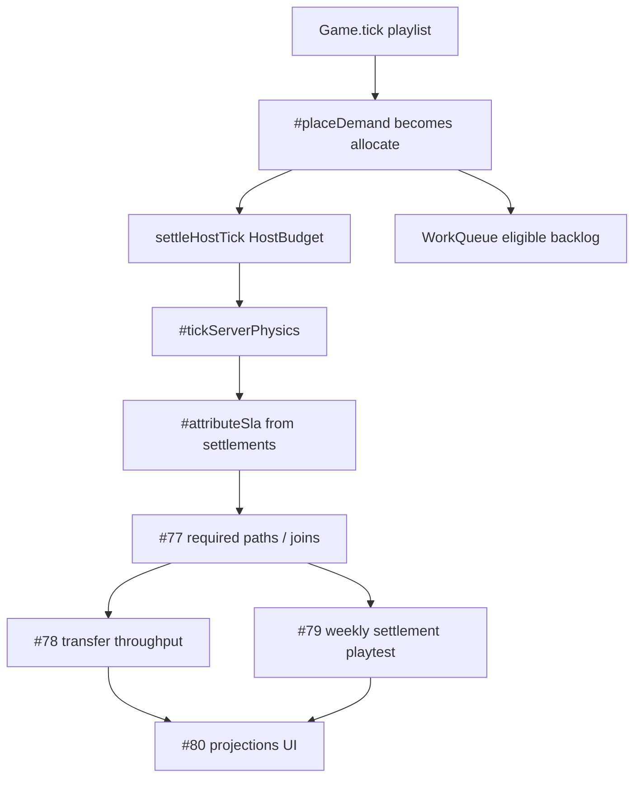

# Milestone 5 — Resource allocation and system execution

Milestone: [resource allocation and system execution](../../docs/milestones/resource-allocation-and-execution.md) · GitHub [milestone 5](https://github.com/movahedan/fivenines/milestone/5) · Issues [#76](https://github.com/movahedan/fivenines/issues/76) [#77](https://github.com/movahedan/fivenines/issues/77) [#78](https://github.com/movahedan/fivenines/issues/78) [#79](https://github.com/movahedan/fivenines/issues/79) [#80](https://github.com/movahedan/fivenines/issues/80)

**Stack:** `feature/m5-resource-allocation-and-execution` on [#111](https://github.com/movahedan/fivenines/pull/111) (`feature/m4-infrastructure-preparation-and-operations`). Do not treat old M3/M4 slice branches as the merge target. Slice PRs stack on the M5 base; after review they fold into the base PR titled **Milestone 5: Resource allocation and system execution**.

**Parent as of this plan:** #111 head `fe25c3e` (includes #71–#75). Revalidate against current #111 before each later slice plan/execution.

Live `Game.tick` is already a named playlist on one `TickContext`. `#placeDemand` still uses `placeProjectDemand` (CPU headroom + request slices). `src/work/` (`allocateProportional`, `settleHostTick`, `evaluateRootOutcomes`) and `src/demand-engine/` exist but are unwired. `SERVER_CATALOG` is Bronze–Diamond + `thin-ram` with CPU/net/RAM only. Transfers stay `pending` and block ready/start. Identity/topology/baseline stay out of `Game` until a slice constructs those instances.

## Target architecture



**Naming / invariants:**

| Current | After M5 | Notes |
|---------|----------|-------|
| `placeProjectDemand` CPU headroom | `settleHostTick` on full `HostBudget` | No CPU/RAM-only fallback |
| Request slices on `Server` | Work items + retained occupancy | Memory/disk occupancy retained across hours |
| Independent `src/work` fixtures | Same functions constructed from `Game` | Do not fork a second solver |
| Transfer `pending` forever | Completes only with allocated net/disk | Source serves until atomic handover |
| Hub compact four bars | Workload-relevant disk/GPU too (#80) | Missing telemetry stays unavailable |

**Dependency / policy rules (every slice):**
- Allocation replaces `#placeDemand` inside the existing playlist — no second clock, no `TickPhase[]` registry.
- Money: `postCashDelta` only.
- No identity/topology/demand-engine/work/baseline imports into `Game` until that slice constructs and uses those instances.
- Full resource accounting: CPU, GPU, memory, disk space/I/O, network. GPU work on `gpuCount === 0` is infeasible, not CPU.
- No Nest/auth expansion. Hub/Lab still launch. Figma is visual-only.
- Do not fake #66. No M6 contract families. No M7 monitoring reconstruction in the UI.
- Integers at cash/ppm/request/work boundaries. Largest-remainder shares; FIFO age within a project share.

---

## Phase 0 — M5 stack base (docs)

**Goal:** Open `feature/m5-resource-allocation-and-execution` from #111 with this plan and an honest milestone delivery row. No engine behavior change.

**Hard constraints:** docs/plans only; do not edit Hub/Lab/engine runtime.

### Code/config surfaces (builder-workflow)

- None (docs-only phase).

### Scouts

| Scout | Task | Patterns / paths | Row budget |
|-------|------|------------------|------------|
| 1 | Confirm #111 head vs slice branches | `gh pr view 111` | ≤40 |

### Verification

```bash
bun run overall
```

### Documentation before PR

- `.cursor/plans/m5-resource-allocation-and-execution.plan.md`
- `docs/milestones/resource-allocation-and-execution.md` (in progress, stack on #111, planned slice rows)
- `packages/fivenines-engine/AGENTS.md` pointer to M5 plan (no fake “implemented” claims)

---

## Phase 1 — Resource allocator (#76)

**Goal:** Heterogeneous budgets and proportional shared-server policy with retained memory/storage, eligible backlog, rounding, and incompatible hardware. Replace `#placeDemand` inside the playlist.

**Hard constraints (phase 1 only):**
- Import `src/work` (and `src/demand-engine` if this slice constructs `DemandEngine` / `WorkQueue`) because Game uses those instances. Do not import identity/topology/baseline.
- Do not implement full path outcomes, completed transfers, or playtest sessions.
- Do not add a second tick or phase registry.
- Map live SKUs onto `HostBudget` (extend `SERVER_CATALOG` with GPU/disk/IOPS/network-in-work-units). Do not swap Bronze ids for `general-small` catalog names.
- Appointment demand uses `appointment-site` mix (`DemandEngine.hourly`) rather than CPU-only RPS placement.
- Overload fixtures remain constructible; conservation tests must cover mixed dimensions on one host.

### Mechanical changes

| From | To | Notes |
|------|-----|-------|
| `#placeDemand` + `placeProjectDemand` | allocate via `settleHostTick` | Keep playlist slot name or rename to `#allocateDemand` in the same position |
| `SERVER_CATALOG` CPU/net/RAM | plus gpuCount, gpuWork, gpuMemory, diskCapacity, diskOps | Derive units from hardware-and-economy formulas; Bronze stays the opening SKU |
| Unwired `WorkQueue` | per-host or per-project eligible backlog | Occupancy counts against queuedMemory / disk; full queue rejects new work |
| `server.remainingHeadroom` CPU | leftover is unroutable/rejected per dimension | SLA still conserves handled + misses = emitted |

### Code/config surfaces (builder-workflow)

- `packages/fivenines-engine/src/game.ts` — replace `#placeDemand` body; construct allocator inputs; `postCashDelta` unchanged
- `packages/fivenines-engine/src/catalog/kernel.ts` / `server.ts` / `server.metrics.ts` — full `HostBudget`
- `packages/fivenines-engine/src/work/*` — consume, do not fork
- `packages/fivenines-engine/src/demand-engine/*` — wire generate/admit for served (and parked contractual emit) projects
- `packages/fivenines-engine/src/demand.ts` — retire or wrap `placeProjectDemand`
- Tests: allocator integration next to existing `work/share.test.ts` and physics/SLA conservation
- Hub/Lab: keep runnable; host metrics must not pretend CPU is the only axis if the kernel now reports more

### Scouts

| Scout | Task | Patterns / paths | Row budget |
|-------|------|------------------|------------|
| 1 | place-demand call sites | `rg 'placeProjectDemand|#placeDemand|remainingHeadroom' packages` | ≤40 |
| 2 | catalog vs HostBudget | `kernel.ts` `server.ts` `work/share.ts` `demand-types.ts` | ≤40 |
| 3 | demand engine boundary | `demand-engine/` `Project.tick` `game.ts` imports | ≤40 |
| 4 | Hub host bars | `apps/web/src/hub` utilization | ≤40 |

### Verification

```bash
bun test packages/fivenines-engine
bun run overall
```

### Documentation before PR

- `packages/fivenines-engine/AGENTS.md` — allocation in the playlist; Game may import work/demand-engine
- `docs/milestones/resource-allocation-and-execution.md` — #76 row in review (not merged)

---

## Phase 2 — Dependency graph execution (#77)

**Goal:** Execute compiled required paths, branch joins, and type-specific outcomes. Queues and progress with no retries or subticks. Compare against independent `src/work` fixtures.

**Hard constraints:** No transfer throughput completion. No M6 growth. Optional children must not reverse a completed primary. Shared downstream must not double-count root successes.

### Code/config surfaces

- `packages/fivenines-engine/src/work/paths.ts` / `outcomes.ts` / `latency.ts` — call from Game after allocation
- Topology import only if this slice constructs the graph instances; otherwise compile edges from existing project services/setup records
- Tests: independent reference fixtures plus Game-level path cases (interactive, queued, continuous, finite/GPU)

### Verification

```bash
bun test packages/fivenines-engine
bun run overall
```

### Documentation before PR

- engine AGENTS — path outcomes in tick
- milestone #77 row

---

## Phase 3 — Transfers and migration completion (#78)

**Goal:** Allocate real network/disk (and associated work) to transfers. Data readiness; source keeps serving; atomic handover only when dest is ready. This is what M4 left pending.

**Hard constraints:** No fake completion without allocated resources. Saturated I/O delays completion. Do not merge this yourself into the M5 base.

### Code/config surfaces

- `packages/fivenines-engine/src/game.ts` duplicate/transfer lifecycle
- `packages/fivenines-engine/src/project.ts` pending → ready handover
- Tests: `game.duplicate.test.ts` plus throughput delay

### Verification

```bash
bun test packages/fivenines-engine
bun run overall
```

### Documentation before PR

- engine AGENTS — transfers consume allocation
- milestone #78 row

---

## Phase 4 — First-project settlement and playtest (#79)

**Goal:** Acquaintance path through actual demand, weekly settlement/renewal, credits, hourly owned/leased costs, recoverable debt. Play acceptance → setup → start → first billing cycle; healthy vs overloaded. Parked project still emits contractual demand/timing/costs.

**Hard constraints:** Can stack in parallel with #78 only if paths stay disjoint. Do not merge. Not broad catalog families (M6). Equations alone do not pass — record playtest findings in the milestone.

### Code/config surfaces

- Settlement already exists; wire credits/overload to allocator outcomes
- Hub/Lab first-project journey
- Tests: engine settlement + Hub as needed

### Verification

```bash
bun test packages/fivenines-engine
bun run overall
```

Plus Hub/Lab play of healthy vs overloaded first cycle; write findings into the milestone during documentation-sync.

### Documentation before PR

- milestone playtest findings (required)
- engine AGENTS if settlement attribution changed

---

## Phase 5 — Integrated runtime projections (#80)

**Goal:** Replace request-only capacity/SLA assumptions with authoritative workload outcomes. Basic utilization/execution on project components. Seeded contention + permutation checks. Complexity notes (no per-request objects / needless graph rebuilds). Hardware comparison must show disk/GPU beyond the four compact bars. Missing telemetry stays unavailable.

**Hard constraints:** Depends on #78 and #79. No second solver in UI. No M7 monitoring reconstruction.

### Code/config surfaces

- `apps/web` Hub host activity, project Status/Performance/Finances
- engine snapshot fields the UI reads (no parallel math)
- Tests: `bun test apps/web/src/routes/hub.test.tsx` as needed; engine permutation/seeded checks

### Verification

```bash
bun test packages/fivenines-engine
bun test apps/web/src/routes/hub.test.tsx
bun run overall
```

### Documentation before PR

- `apps/web/AGENTS.md` — honest projections; unavailable telemetry
- milestone #80 row

---

## What stays out of scope

- M6 contract families, MSA, professional offers, offer growth
- M7 incidents, monitoring coverage, reconstructed solver in UI
- Faking #66 shared-asset identity
- Nest/auth/SSE/persistence expansion
- Employees, away-time
- Claiming the milestone complete before constituent PRs merge
- `gh pr merge` / merging into the M5 base / #111 / `main` (human merges)

## Suggested PR sequence

| PR | Content | Merge gate |
|----|---------|------------|
| M5 base | Phase 0 | `bun run overall` |
| #76 | Phase 1 | engine tests + `bun run overall` |
| #77 | Phase 2 stacked on #76 | engine tests + `bun run overall` |
| #78 | Phase 3 stacked on #77 | engine tests + `bun run overall` |
| #79 | Phase 4 stacked on #77 (parallel with #78 if disjoint) | engine tests + playtest notes + `bun run overall` |
| #80 | Phase 5 after #78 and #79 | engine + hub tests + `bun run overall` |

## Risk summary

| Risk | Mitigation |
|------|------------|
| CPU-only leftover in `remainingHeadroom` | `rg remainingHeadroom placeProjectDemand`; HostBudget fixtures |
| Double solver in Hub | UI reads engine snapshots only |
| Transfer completes without I/O | tests: zero net/disk share ⇒ still pending |
| Opening SKU vs authored `general-small` | keep Bronze id; extend fields; do not rename catalog |
| Game import boundary tests | update only the trees this slice constructs |
| Parallel #78/#79 overlap | disjoint paths or stack #79 after #78 if files collide |
