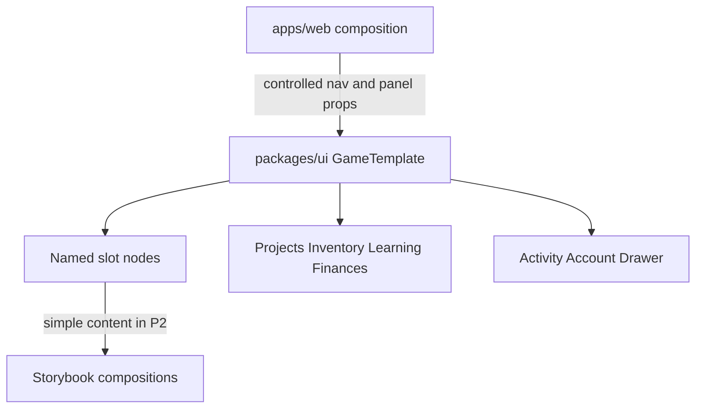

# M5.1 game-template shell

Milestone: [Interface design and documentation](../../docs/milestones/interface-design-and-documentation.md). Product map: [Game shell and section map](../../docs/product/game-shell.md). Predecessor: open [PR #134](https://github.com/movahedan/fivenines/pull/134) on `codex/interface-milestones-docs` — stack; do not merge it. Do not start M5.2.

## Target architecture



**Naming / invariants:**

| Current | After | Notes |
|---------|-------|-------|
| No `packages/ui/src/templates` | `packages/ui/src/templates/game-template/` | Component-first folder; named export |
| Storybook globs atoms + molecules | Add `src/templates/**/*.stories.*` | Keep RN-web Vite path |
| `write-barrels` atoms/molecules/hooks | Also barrel `src/templates` when `templates/<name>/<name>.tsx` exists | Same molecule folder rule |
| Existing `Hud` | Unchanged in P2 | Hub keeps it until P4; template uses a new status-bar layout |

**Dependency / policy rules:**

- `@packages/ui` must not import engine, auth, or React Flow.
- Web owns business state; template owns responsive placement.
- Production routes must not simulate unsupported setup success.
- Preserve `apps/figma-design/src` byte-for-byte.
- No engine source, tests, catalogs, public APIs, or balance edits.

---

## Phase 1 — Documentation section map (#126)

**Goal:** Finish the documentation slice that PR #134 started: a durable Figma → desktop/mobile → data-owner map the template PR can follow.

**Hard constraints (phase 1 only):**

- Must update product/milestone records only.
- Must not claim #126 complete until this stacked PR merges.
- Must not rewrite M1–M5 historical delivery evidence already in #134.
- Must not invent answers to [open questions](../../docs/product/open-questions.md).

### Code/config surfaces (builder-workflow)

- None. Documentation only.

### Scouts (parallel inventory — code/config only)

| Scout | Task | Patterns / paths | Row budget |
|-------|------|------------------|------------|
| 1 | Confirm no templates exist yet | `packages/ui/src/templates` glob | ≤10 |
| 2 | Confirm Hub still owns live gameplay | `apps/web/src/hub/hub-session.tsx` | ≤20 |

### Verification (phase 1 gate)

```bash
git diff --check
```

Plus local Markdown file-target checks for added links.

### Documentation before PR (documentation-sync)

Already the phase body:

- `docs/product/game-shell.md` (new)
- `docs/product/index.md`
- `docs/product/repository-boundaries.md`
- `docs/milestones/interface-design-and-documentation.md`
- `.cursor/plans/infrastructure-editor-redesign.plan.md` execution record only

---

## Phase 2 — Responsive game-template (#127)

**Goal:** Browsable complete desktop/mobile shell with named slots and simple content. No canvas editor, no engine.

**Hard constraints (phase 2 only):**

- Must implement `GameTemplate` as a controlled layout component.
- Must compose empty, populated, drawer, overlay, and long-scroll states in Storybook.
- Must verify 360/390, intermediate, 1280/1440, focus, safe area, and reduced motion at the layout level.
- Must not cut over `/hub`.
- Must not add `infrastructure-editor`, pickers, Requirements, or React Flow.
- Must not change engine packages.

Do not start this phase until the developer confirms the slot names, props, and file list below (or an agreed delta).

### Proposed slot names and props

Public component: `GameTemplate`.

```ts
type GameDestination = "projects" | "inventory" | "learning" | "finances";
type RightDestination = Exclude<GameDestination, "projects"> | null;
type CenterKind = "empty" | "project" | "offer" | "contractReview";

interface GameTemplateProps {
  readonly isMobile?: boolean;
  readonly destination: GameDestination;
  readonly onDestinationChange: (destination: GameDestination) => void;
  readonly onNewProject: () => void;

  readonly projectsOpen: boolean;
  readonly onProjectsOpenChange: (open: boolean) => void;
  readonly projectsWidth: number;
  readonly onProjectsWidthChange: (width: number) => void;
  readonly rightDestination: RightDestination;
  readonly onRightDestinationChange: (destination: RightDestination) => void;
  readonly rightWidth: number;
  readonly onRightWidthChange: (width: number) => void;

  readonly activityOpen: boolean;
  readonly onActivityOpenChange: (open: boolean) => void;
  readonly accountOpen: boolean;
  readonly onAccountOpenChange: (open: boolean) => void;

  readonly accountControl: ReactNode;
  readonly accountOverlay: ReactNode;
  readonly statusMetrics: ReactNode;
  readonly operationsProgress: ReactNode;
  readonly learningProgress: ReactNode;
  readonly clockControls: ReactNode;
  readonly activityTrigger?: ReactNode;
  readonly activityOverlay: ReactNode;
  readonly projectsPanel: ReactNode;
  readonly centerContent: ReactNode;
  readonly centerKind: CenterKind;
  readonly inventoryPanel: ReactNode;
  readonly learningPanel: ReactNode;
  readonly financesPanel: ReactNode;
  readonly objectDrawer?: ReactNode;
  readonly mobileProgressStrip?: ReactNode;
}
```

Template default: if `activityTrigger` is omitted, render an Activity control that toggles `onActivityOpenChange`. Account control is always supplied.

### Ownership of navigation and open/close

| Action | Who |
|---|---|
| Bottom-nav tab press / right-rail tab press | Template calls `onDestinationChange` / `onRightDestinationChange` |
| Desktop Projects collapse | Template calls `onProjectsOpenChange` |
| Desktop right panel close (× or second tab press) | Template calls `onRightDestinationChange(null)` |
| New project | Template calls `onNewProject`; web chooses offer center kind |
| Activity / account open and close | Controlled; template overlay chrome may call the change handlers |
| Drawer close | The drawer node owns its close control; web owns whether `objectDrawer` is passed |
| Panel widths | Controlled numbers; template performs drag math and clamps 160–520 |

Storybook wrappers hold the controlled state so the component remains usable without web.

### Exact initial file structure

```text
packages/ui/src/templates/game-template/
  game-template.tsx
  game-template.types.ts
  game-template-desktop.tsx
  game-template-mobile.tsx
  game-status-bar.tsx
  game-template.stories.tsx
  game-template.test.tsx
packages/ui/src/templates/index.ts   # generated/updated by write-barrels
```

Also: Storybook glob, `package.json` export `@packages/ui/templates` and `@packages/ui/templates/game-template`, `write-barrels.ts` templates folder rule.

No organisms in this PR. Center project sections are a single `centerContent` node (placeholder blocks in stories). Editor folders stay for #128.

### Mechanical changes

| From | To | Notes |
|------|-----|-------|
| (none) | files above | new |
| `packages/ui/.storybook/main.ts` stories | include templates | |
| `packages/ui/scripts/write-barrels.ts` | barrel templates like molecules | |
| `packages/ui/package.json` exports | `./templates` | run export-modules |

### Code/config surfaces (builder-workflow)

- `packages/ui/src/templates/game-template/**`
- `packages/ui/scripts/write-barrels.ts`
- `packages/ui/.storybook/main.ts`
- `packages/ui/package.json` (exports only)
- No `apps/web` composition in this phase unless a tiny unused import is required for typecheck; prefer Storybook-only until P4.

### Scouts (parallel inventory — code/config only)

| Scout | Task | Patterns / paths | Row budget |
|-------|------|------------------|------------|
| 1 | Barrel and export conventions | `packages/ui/scripts/write-barrels.ts`, `packages/ui/package.json` | ≤40 |
| 2 | Existing Hud / PanelHeader reuse limits | `packages/ui/src/molecules/hud`, `panel-header` | ≤40 |
| 3 | `use-mobile` breakpoint | `packages/ui/src/hooks/use-mobile.ts` (768) | ≤10 |
| 4 | `react-resizable-panels` current usage | `rg react-resizable-panels` | ≤20 |

### Verification (phase 2 gate)

```bash
bun test packages/ui
bun run turbo run typecheck --filter=@packages/ui
bun run turbo run build:storybook --filter=@packages/ui
bun run overall
```

Visual: 360/390, intermediate, 1280/1440 against `apps/figma-design` shell (not canvas internals). Keyboard focus on tabs, overlays, drawer. Safe area on mobile nav. Reduced motion: no required panel animation.

### Documentation before PR (documentation-sync)

- `packages/ui/AGENTS.md` layout, exports, Storybook globs
- `packages/ui/STORYBOOK.md` if present
- `docs/milestones/interface-design-and-documentation.md` delivery row for #127
- `docs/product/repository-boundaries.md` only if the planned paths become real

---

## What stays out of scope

- M5.2 engine follow-ups and live setup
- `apps/web/src/infrastructure-editor`
- Requirements, pickers, React Flow, target overlay
- Hub route cutover
- Marketing/auth/Lab
- Closing GitHub issues before merge
- Merging PR #134

## Suggested PR sequence

| PR | Content | Merge gate |
|----|---------|------------|
| Stacked on #134 | Phase 1 docs (#126 remainder) | Markdown / `git diff --check` |
| After structure OK | Phase 2 template (#127) | UI tests + overall |
| Later 5.1 | #128 editor visuals, then #129 Hub bind | Separate plans |

## Risk summary

| Risk | Mitigation |
|------|------------|
| Repeating #134 | Diff only the new map and delivery-record updates |
| Cutting over Hub too early | Phase 2 Storybook-only constraint |
| DOM-only layout breaking RN | View/Text/Pressable; no `div` in template |
| Treating Figma Requirements absence as product | Follow `game-shell.md` amendments |
| Starting M5.2 | Explicit out of scope |
