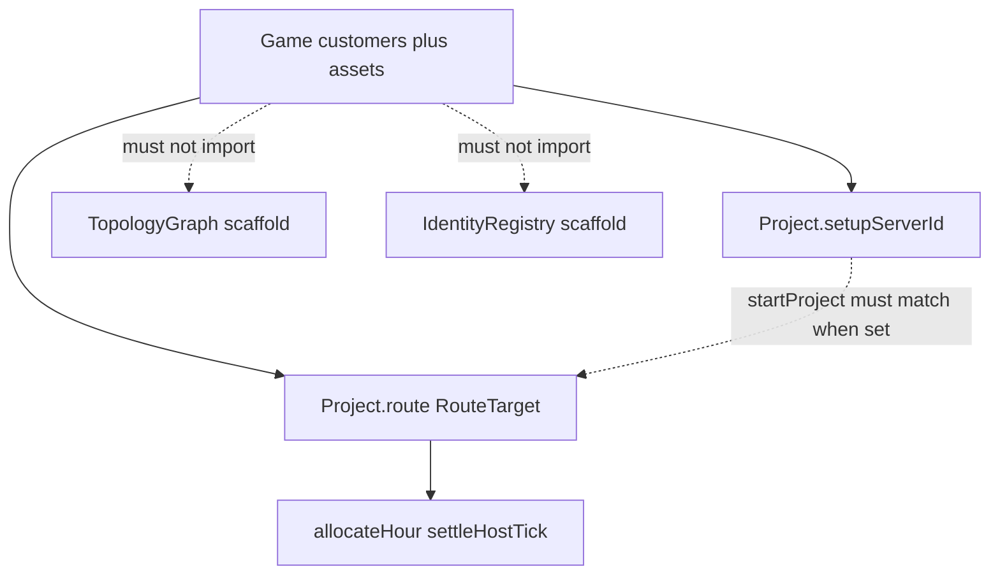

# M5.2 live placement and identity (#130)

Milestone: [Infrastructure engine and interface integration](../../docs/milestones/infrastructure-engine-and-interface-integration.md). Issue [#130](https://github.com/movahedan/fivenines/issues/130). Stack on open [PR #135](https://github.com/movahedan/fivenines/pull/135) (`feature/m51-game-shell`) per user; do not merge #134/#135. F2–F4 (#131–#133) stay later PRs.

## Target architecture



**Naming / invariants:**

| Current | After F1 | Notes |
|---------|----------|-------|
| Live placement = one `RouteTarget` per project | Unchanged | No balancers, no route arrays (M8) |
| `TopologyGraph` / `IdentityRegistry` unused by Game | Still unused | Keep import-ban tests |
| `startProject` ignores `setupServerId` | Reject mismatch when `setupServerId` is set | Teaching fixtures with unset setup still start |
| Installs on `Project.installedServiceIds` | Unchanged | Not topology instances |

**Dependency / policy rules:**

- Do not rewrite allocator formulas or `CAPACITY_POLICY`.
- Do not import `src/topology/` or `src/identity/` from `game.ts`.
- Do not implement proposal queries (#131), apply/auto-prep (#132), or editor cutover (#133).
- Hub/Lab adapter repair only if the bind would break Start.

### Audit (current code)

Live same-host (`oneBronzeInitial` 500/500), split-host (`twoBronzeInitial` no spill), first-project setup→serve→settle, park/transfer already exist. Topology instance health / shared service config / app+DB on different hosts are **scaffolds**, not missing allocator bugs. Split-host **application vs database** needs multiple routes → M8, not F1.

---

## Phase 1 — Bind setup placement to activation (#130)

**Goal:** Close the only live ownership hole: activation can name a different box than setup placement. Prove same-host / split-host / shared opex still hold without a second graph.

**Hard constraints (phase 1 only):**

- Must keep Game free of topology/identity imports.
- Must throw from `startProject` when `setupServerId` is set and `payload.serverId` differs.
- Must still allow `startProject` when `setupServerId` is unset (existing ready fixtures).
- Must not change tick order, money formulas, or operational-queue durations.
- Must not cut over `/hub` to `GameTemplate`.

### Code/config surfaces (builder-workflow)

- `packages/fivenines-engine/src/game.utils.ts` (`startProject`)
- `packages/fivenines-engine/src/placement.live.test.ts` (new)
- `apps/web/src/hub/hub-session.tsx` Start command uses `setupServerId` when set

### Scouts (parallel inventory — code/config only)

| Scout | Task | Patterns / paths | Row budget |
|-------|------|------------------|------------|
| 1 | `startProject` call sites | `rg 'type: "startProject"'` | ≤20 |
| 2 | Game import bans | `topology/graph.test.ts`, `identity/registry.test.ts` | ≤10 |

### Verification (phase 1 gate)

```bash
bun test packages/fivenines-engine
bun run turbo run typecheck --filter=@packages/fivenines-engine
bun run overall
```

### Documentation before PR (documentation-sync)

**When:** After verification passes and builder finishes — **not** during implement.

- `packages/fivenines-engine/AGENTS.md` — `startProject` vs `setupServerId`; F1 did not wire topology
- `docs/milestones/infrastructure-engine-and-interface-integration.md` — #130 delivery row
- `.cursor/plans/infrastructure-editor-redesign.plan.md` — F1 execution record only

---

## What stays out of scope

- Merging `TopologyGraph` into Game
- Proposal/eligibility queries, apply, automatic prep, React Flow editor
- Balancers, multi-route app/DB split
- Catalog duration / patience retune (F3)
- Merging #134 or #135

---

## Suggested PR sequence

| PR | Content | Merge gate |
|----|---------|------------|
| This | F1 bind + live placement regressions | engine tests + overall |
| Later | #131 proposal queries | after this merges |
| Later | #132 apply / auto-prep | after #131 |
| Later | #133 live editor + commercial path | after #132 |

---

## Risk summary

| Risk | Mitigation |
|------|------------|
| Accidental topology merge | Keep Game import-ban tests; no new Game imports |
| Hub Start picks a different box | Start uses `setupServerId` when set |
| Duplicate coverage | New file names F1 contract; reuse `oneBronze` / `twoBronze` |
