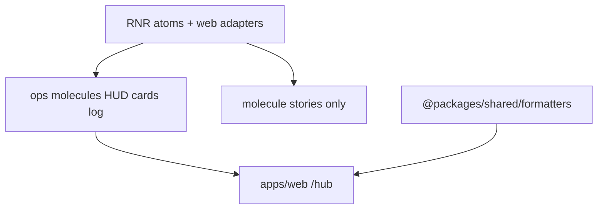

# Atoms fold, TanStack-safe theme, hub visual fidelity

Visual reference (do not vendor): `/Users/soheil/Downloads/Writing Tool with Organization/src/App.tsx`. Prototype `game.ts` is **not** the kernel.

Follow-up to [ops-console-hub-ui.plan.md](ops-console-hub-ui.plan.md) (tokens + ops molecules + `/hub` already landed).

## Decisions (this session — 2026-09-08)

Posted here so you can override before Phase 1.

| Topic | Decision | Why |
|-------|----------|-----|
| **Button / Card / Input / Label** | Fold today’s molecule adapters **into** `src/atoms/{button,card,input,label}.tsx`. Delete molecule wrapper `*.tsx` (keep **stories** under `src/molecules/` importing atoms). | User: these belong to atoms. CLI `add` still overwrites atoms — document a post-`rnr add` re-apply list in `packages/ui/AGENTS.md` (docs-sync). |
| **Stories / tests** | Primitive stories live next to atoms (`src/atoms/*.stories.tsx`). Storybook glob includes atoms + molecules. Tests sit next to atoms. CLI `add` can overwrite atom stories — re-apply after regen. | User override of “no atom stories”. |
| **Consumer imports** | Hub/lab/login-form/ops molecules import `@packages/ui/atoms` (or `#/atoms`). Drop `package.json` exports `./molecules/{button,card,input,label}`. | Atoms are the public primitive API. |
| **`next-themes`** | **Remove** from `@packages/ui`. Frozen `src/shadcn/sonner.tsx` pins Sonner `theme="dark"` (ops palette is always-dark; no Next.js). | Stack is TanStack Start, not Next. No theme toggle in this initiative. |
| **Formatters** | Change `@packages/shared/formatters` strings to match prototype **shape**, keep engine integers. | See Phase 3 table. |
| **CPU “core”** | Display alias only: `formatters.cores(n)` / compact `Nc`. Hub passes **kernel integers** (`computeUnitsPerHour`, project `estimatedRequestsPerHour`). **Do not** invent a 4/8/16 SKU table or change the engine. | Prototype used “cores”; kernel stocks are compute units / request baseline. |
| **Logo** | CSS **9s** mark (rounded square, `bg-primary`, `shadow-glow-primary`) as default HUD chrome. Optional `logo?: ReactNode` slot if web later passes an `<Image>`. **No PNG in repo** unless you supply a file. | Prototype has no image asset; current HUD is a plain 24×24 square. |
| **Shining dots** | `PanelHeader` + fleet/market SKU dots: `rounded-full` + `shadow-glow-*` (add warning/info/sla glow tokens). No hex. | Tokens exist but unused. |

**Open question (only if you disagree):** If you have a real logo file, say where it lives and Phase 2 will `Image` it instead of the 9s mark.

---

## Target architecture



**Naming / invariants:**

| Current | After | Notes |
|---------|-------|-------|
| `molecules/button` wraps atom + `onClick` + `Text` children | Atom owns that | Same for Input `onChange` / `disabled` |
| `molecules/card`, `molecules/label` re-export only | Deleted | Import atoms |
| `next-themes` on UI package | Gone | Sonner dark-only |
| `formatters.ppm` → `990000 ppm` | `99.00%` | `ppm / 10_000`, two decimals |
| `hourTick` `T+0000` | `TICK 0000` | Prototype HUD |
| `clockLabel` `D0 H00` | `DAY 01 · HR 00:00` | 1-based day (`floor(h/24)+1`) |
| `skuCpuLabel` `1000 cu` | `1000 cores` | Same integer |
| Offer CPU `N /h` | `Nc` compact | Same `estimatedRequestsPerHour` |

**Dependency / policy rules:**

- `@packages/ui` still must not import engine or auth.
- `@packages/shared/formatters` stays display-only (no engine types).
- Do not add Next.js or `next-themes`. Do not add `apps/mobile`.
- Do not vendor the Figma Make repo. Do not change kernel catalog numbers.

---

## Phase 1 — Atoms absorb wrappers; drop `next-themes`

**Goal:** Primitives live in atoms; UI package has no Next.js theme dep.

**Hard constraints (phase 1 only):**

- Must fold Button (`onClick` → `onPress`, wrap string/number children in `Text`, ignore unused `asChild`/`type`) and Input (`onChange` synthetic event, `disabled` → `editable` + a11y, `type` email/password) into atoms.
- Must delete `packages/ui/src/molecules/{button,card,input,label}/*.{tsx}` wrappers **except** `*.stories.tsx` (retarget imports to atoms).
- Must retarget all in-repo imports and drop `package.json` `./molecules/{button,card,input,label}` (and any export-modules test rows).
- Must remove `next-themes` from `packages/ui/package.json` + lockfile; `src/shadcn/sonner.tsx` must not import it.
- Must **not** change HUD/panel visuals or formatters in this phase.

### Mechanical changes

| From | To | Notes |
|-------|-----|-------|
| `molecules/button/button.tsx` | `atoms/button.tsx` | Merge adapter; keep RNR `Pressable` |
| `molecules/input/input.tsx` | `atoms/input.tsx` | |
| `molecules/card/card.tsx` | delete | Already re-exports atom |
| `molecules/label/label.tsx` | delete | Already re-exports atom |
| `molecules/*/ *.test.tsx` | `atoms/*.test.tsx` | Button + card tests |
| `src/shadcn/sonner.tsx` | `theme="dark"` | No `useTheme` |
| `package.json` deps | drop `next-themes` | |

### Code/config surfaces (builder-workflow)

- `packages/ui/src/atoms/button.tsx`, `input.tsx` (card/label only if types need export)
- `packages/ui/src/molecules/{hud,server-card,project-offer-card,login-form}/**` import paths
- `packages/ui/src/molecules/index.ts` — stop re-exporting primitives
- `packages/ui/package.json` exports + `tools/scripts/export-modules/**`
- `apps/web/src/hub/hub-session.tsx`, `apps/web/src/lab/lab-session.tsx`
- `packages/ui/src/shadcn/sonner.tsx`, `bun.lock`

### Scouts (parallel inventory — code/config only)

| Scout | Task | Patterns / paths | Row budget |
|-------|------|------------------|------------|
| 1 | Primitive consumers | `rg 'molecules/(button\|card\|input\|label)'` | ≤40 |
| 2 | next-themes / sonner | `rg 'next-themes' packages/ui apps` | ≤20 |
| 3 | Export map | `packages/ui/package.json` `tools/scripts/export-modules` | ≤20 |

### Verification (phase 1 gate)

```bash
bun run typecheck --filter=@packages/ui
bun test packages/ui
bun run typecheck --filter=@apps/web
bun test apps/web
```

Plus grep gate: `rg 'next-themes' packages/ui` must be empty; `rg 'from \"./button\"' packages/ui/src/molecules` only stories.

### Documentation before PR (documentation-sync)

- `packages/ui/AGENTS.md` — molecules are ops chrome only; primitives from `@packages/ui/atoms`; `onClick` lives on atom Button; CLI regen re-apply list
- `packages/ui/README.md` — drop dual Button import example
- `.github/instructions/ui.instructions.md` — molecules wrap ops chrome, not Button/Input
- Root `AGENTS.md` only if it still says molecules wrap those four

---

## Phase 2 — Shining dots and HUD mark

**Goal:** Ops chrome matches prototype glows without hex in JSX.

**Hard constraints (phase 2 only):**

- Must add CSS glow tokens used by dots (`--shadow-glow-warning`, `--shadow-glow-info`, `--shadow-glow-sla` or equivalent) in `style.css` `@theme` + `theme.ts` hex lockstep.
- Must apply glow on `PanelHeader` dots and `ServerCard` fleet/market status dots (SKU accent via `className` prop, still token utilities).
- Must replace HUD empty square with 9s mark + glow; keep account slot.
- Must **not** change formatters or engine.

### Mechanical changes

| From | To | Notes |
|------|-----|-------|
| `Hud` 24×24 `bg-primary` | 34-ish 9s badge + `shadow-glow-primary` | Optional `logo` slot |
| `PanelHeader` dot | + glow by tone | |
| `ServerCard` fleet/market | 8px glowing SKU dot | New optional `dotClassName` |
| `style.css` / `theme.ts` | extra glow tokens | Mirror hex |

### Code/config surfaces (builder-workflow)

- `packages/ui/src/style.css`, `packages/ui/src/theme.ts`
- `packages/ui/src/molecules/hud/hud.tsx` + stories/tests
- `packages/ui/src/molecules/panel-header/**`
- `packages/ui/src/molecules/server-card/**`

### Scouts (parallel inventory — code/config only)

| Scout | Task | Patterns / paths | Row budget |
|-------|------|------------------|------------|
| 1 | Glow tokens | `rg 'shadow-glow' packages/ui` | ≤20 |
| 2 | Dot markup | `panel-header.tsx` `hud.tsx` `server-card.tsx` | ≤20 |

### Verification (phase 2 gate)

```bash
bun run typecheck --filter=@packages/ui
bun test packages/ui
bun run turbo run build:storybook --filter=@packages/ui
```

### Documentation before PR (documentation-sync)

- `packages/ui/AGENTS.md` — glow token names; HUD 9s mark; pass SKU `dotClassName` from web
- `packages/ui/STORYBOOK.md` — HUD / panel glow visible on canvas

---

## Phase 3 — Formatters and CPU cores

**Goal:** Player-facing strings match the prototype’s **shape**; kernel numbers unchanged.

**Hard constraints (phase 3 only):**

- Must update `packages/shared/src/formatters.ts` + tests as in the table below.
- Must map hub `cpuLabel` via `formatters.cores` / compact form; stop `"cu"` and offer `" /h"` for the CPU slot.
- Must update hub tests that assert old strings (`T+`, `ppm`, `cu`).
- Must **not** change `packages/fivenines-engine` catalog or physics.

### Formatter contract

| Function | After | Example |
|---------|-------|---------|
| `cents` | keep `$N.NN` / `-$N.NN` | `$250.00` |
| `cents(amount, { sign: true })` **or** `centsSigned` | optional `+$` | only if a hub metric needs NET/HR; otherwise skip |
| `hourTick` | `TICK ` + 4-digit pad | `TICK 0000` |
| `clockLabel` | `DAY DD · HR HH:00` with **1-based** day | hour `0` → `DAY 01 · HR 00:00`; hour `25` → `DAY 02 · HR 01:00` |
| `ppm` | `(value / 10_000).toFixed(2) + '%'` | `990_000` → `99.00%`; `null` → `—` |
| `cores(n)` | `1 core` / `N cores` | `1000 cores` |
| `coresCompact(n)` | `Nc` | `2000c` |

`slaShareLabel` in hub currently duplicates percent math — after this phase it should call `formatters.ppm` (or a shared percent helper) so HUD/cards/log do not drift.

### Code/config surfaces (builder-workflow)

- `packages/shared/src/formatters.ts`, `formatters.test.ts`
- `apps/web/src/hub/hub-map.ts`, `hub-session.tsx`, `hub-map.test.ts`, `hub.test.tsx`
- `packages/ui/src/molecules/server-card/*.stories.tsx` / tests if they hardcode `"8 cores"` (keep as display examples)

### Scouts (parallel inventory — code/config only)

| Scout | Task | Patterns / paths | Row budget |
|-------|------|------------------|------------|
| 1 | Formatter call sites | `rg 'formatters\.(ppm\|hourTick\|clockLabel\|cents)'` | ≤40 |
| 2 | cu / /h CPU labels | `rg ' cu\|/h\|skuCpuLabel' apps/web packages/ui` | ≤20 |

### Verification (phase 3 gate)

```bash
bun test packages/shared
bun test apps/web
bun test packages/ui
bun run typecheck --filter=@packages/shared
bun run typecheck --filter=@apps/web
```

### Documentation before PR (documentation-sync)

- `packages/shared/AGENTS.md` — formatter string contracts
- `apps/web/AGENTS.md` — CPU shown as cores (kernel CU / request baseline); clock/ppm shapes

---

## Phase 4 — HUD play/pause icon and tick speed

**Goal:** Replace the HUD **Pause** / **Resume** text button with a lucide **Pause** / **Play** icon, then compact **×1**, **×2**, **×4** speed controls. Interval is UI-only (`HUB_TICK_MS / speed`); the engine still ticks one hour per `Game.tick()`.

**Hard constraints (phase 4 only):**

- Must use `lucide-react-native` via the existing `Icon` atom (`Pause` when `running`, `Play` when paused). Accessible names: **Pause** and **Play** (not "Resume").
- Must add speed `1 | 2 | 4` as icon-sized buttons immediately after the play/pause control (`×1` / `×2` / `×4`). Changing speed while paused keeps paused; resume uses the selected speed.
- Must wire `use-hub-game.ts` so `setInterval` uses `HUB_TICK_MS / speed` (1000 / 500 / 250 ms). Default **×1**. Reset returns to ×1 and running.
- Must **not** change `packages/fivenines-engine`. Must **not** add a second clock or skip hours.
- Must update `Hud` tests, Storybook, and `apps/web/src/routes/hub.test.tsx` (they currently look up `name: "Pause"` / `"Resume"`).

### Code/config surfaces (builder-workflow)

- `packages/ui/src/molecules/hud/hud.tsx`, `hud.test.tsx`, `hud.stories.tsx`
- `apps/web/src/hub/use-hub-game.ts`, `hub-session.tsx`
- `apps/web/src/routes/hub.test.tsx`

### Scouts (parallel inventory — code/config only)

| Scout | Task | Patterns / paths | Row budget |
|-------|------|------------------|------------|
| 1 | Pause/Resume copy | `rg 'Pause|Resume' packages/ui/src/molecules/hud apps/web/src` | ≤20 |
| 2 | Tick interval | `rg 'HUB_TICK_MS|setInterval' apps/web/src/hub` | ≤15 |

### Verification (phase 4 gate)

```bash
bun test packages/ui
bun test apps/web
bun run typecheck --filter=@packages/ui
bun run typecheck --filter=@apps/web
```

### Documentation before PR (documentation-sync)

- `packages/ui/AGENTS.md` — HUD play/pause icon + ×N speed props
- `apps/web/AGENTS.md` — UI interval = `HUB_TICK_MS / speed`; engine unchanged

---

## What stays out of scope

- Engine catalog, demand, or adding a `cpuRequired` field
- Nest/SSE campaign; `/lab` layout clone
- `@apps/auth` restyle
- Light/dark theme toggle
- Mobile stacking
- Copying Figma Make `App.tsx` / `game.ts` into the repo
- `rnr init` / `apps/mobile`

---

## Suggested PR sequence

| PR | Content | Merge gate |
|----|---------|------------|
| PR1 | Phase 1 only | Phase 1 verify + `rg next-themes` empty |
| PR2 | Phase 2 only | Phase 2 verify |
| PR3 | Phase 3 only | Phase 3 verify |
| PR4 | Phase 4 only | Phase 4 verify |

Doc sync after each build, before that PR’s commit.

---

## Risk summary

| Risk | Mitigation |
|------|-----------|
| CLI `rnr add` wipes atom adapters | AGENTS regen checklist; stories/tests catch `onClick` |
| Removing molecule exports breaks apps | Scout 1 + typecheck `@apps/web` |
| `ppm` change breaks lab copy | Scout formatter call sites; update lab if it asserts `ppm` |
| “cores” misread as 4/8/16 SKUs | Docs: same kernel integers, word only |
| Glow unused on RN | NativeWind shadow tokens; degrade to fill color if shadow no-ops |
| Speed buttons skip hours | Interval only; each `tick()` is still one hour |
