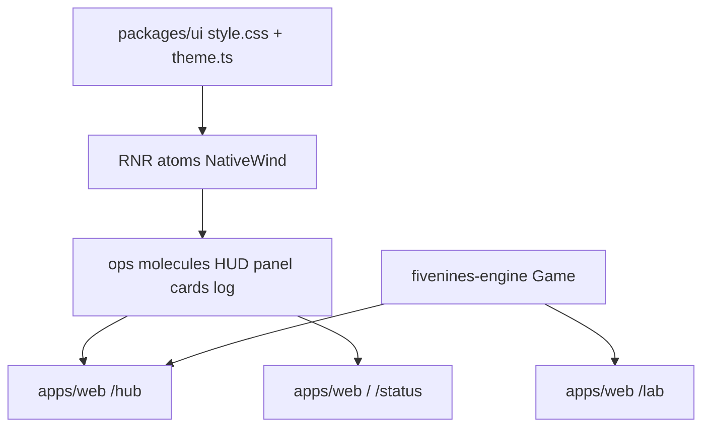

# Ops console player UI

Visual reference (do not copy into the repo): Figma Make app at `/Users/soheil/Downloads/Writing Tool with Organization` (`src/App.tsx` layout: HUD, queue | active+fleet | market, event log). Prototype `game.ts` is **not** the kernel.

## Design agreement (2026-09-07)

| Topic | Decision |
|-------|----------|
| **Main screen** | `/hub` is the player ops console. `/lab` stays the debug harness. |
| **Data** | Temporary **client `Game`** on `/hub` (`openingInitial` + `tick` / `dispatch`), same idea as lab. Nest/SSE campaign later. |
| **Tokens** | **Ops neon only** — replace global `@packages/ui` palette. No parallel light theme. |
| **Styling engine** | Existing **RNR atoms + NativeWind v5** (`className` → tokens). No new theme package. No hex in feature JSX. |
| **Layout** | Desktop ops floor first (≈1280+). Stacking for phone/tablet is later. |
| **Auth** | Keep session gate (redirect to login). Put account chrome in the HUD. Drop the Play-button lobby on `/hub`. |
| **Clock SSE** | Keep as **session health** (unauthenticated → login). Game tick is the HUD time source, not SSE `at`. |
| **Other routes** | Phase 4: `/`, `/status`, not-found, home Play/Lab links — ops look. `@apps/auth` is a separate app (does not import `@packages/ui` today). |
| **Native app** | Do **not** add `apps/mobile`. Components stay native-ready. |

## Target architecture



**Naming / invariants:**

| Current | After | Notes |
|---------|-------|-------|
| shadcn-neutral `--background` / `--primary` | Same **names**, ops **values** | NativeWind utilities (`bg-background`, `text-primary`) keep working |
| Geist / Geist Mono in `@theme` | Inter (sans) + JetBrains Mono (mono) | Load via CSS `@import` in `style.css` (already imported by web + Storybook) |
| `/hub` lobby | Ops console | Session gate unchanged |
| Production “no `Game` in browser” | **Temporary exceptions: `/lab` and `/hub`** | Document in `apps/web/AGENTS.md` Phase 3 |
| `THEME.light` vs `THEME.dark` | Both maps = ops palette (or single `THEME.ops` + `NAV_THEME` dark) | RN later; no light mode |

**Dependency / policy rules:**

- Tokens and ops molecules live in `@packages/ui`. `@packages/ui` must **not** import `@packages/fivenines-engine` or `@packages/auth`.
- Hub/lab own `Game` and command dispatch. Molecules take **plain props** (cash, ppm, labels, callbacks).
- Feature screens use token classNames (`bg-card`, `text-primary`, `shadow-glow-primary`). No one-off `#00ff88` in `apps/web`.
- Do **not** run `rnr init`. Do **not** add atom-level Storybook files. Do **not** vendor the Figma Make repo.
- Pause/resume is a **UI interval flag** (skip `tick()` while paused) unless the engine already has pause — do not add engine pause for this UI.

### Token extendability (NativeWind)

Keep one source of truth:

1. CSS variables on `:root` (ops values) in `packages/ui/src/style.css`.
2. Tailwind v4 `@theme inline` mapping `--color-*`, `--font-*`, `--radius-*`, and named shadows.
3. `packages/ui/src/theme.ts` `THEME` / `NAV_THEME` **mirroring** those values for RN navigation later.

Add semantic tokens the prototype needs beyond shadcn:

- Surfaces: `background`, `card`, `hud`, `panel` (or `card` + `muted` if two levels suffice).
- Status: `primary` (neon green), `destructive`, `warning`, `info`, `sla` (or reuse `chart-*` only if named clearly).
- Effects: `--shadow-glow-primary`, `--shadow-glow-danger` as theme shadows; prefer utilities over inline `boxShadow`.
- Region/SKU accent: prefer **data-driven** colors from a small token map in UI (`region.utc-8` etc.) or pass `className` from web using token utilities — do not hardcode prototype `REGION_COLORS` hex in cards.

`tailwind.config.js` is legacy shadcn (`hsl(var(--border))`). **Do not** dual-maintain a third palette there unless Storybook still requires it; prefer `style.css` `@theme` as canonical (matches RNR plan).

Web-only extras (text-shadow, scanline): wrap in utilities that no-op or degrade on RN (`shadows` / opacity). Sparklines: `View` bars like the prototype (no chart library in Phase 2–3).

---

## Phase 1 — Ops token kernel

**Goal:** Make the design system ops-neon and extendable so every existing atom/molecule picks up the look without a second config.

**Hard constraints (phase 1 only):**

- Must rewrite `packages/ui/src/style.css` `:root` / `.dark` / `@theme inline` and `src/theme.ts` to the ops palette + fonts.
- Must keep existing token **names** used by atoms (`background`, `primary`, `destructive`, `border`, …) so generated atoms do not need a mass className rewrite.
- Must not add hub layout, new molecules (except tiny token demo if needed), or `apps/mobile`.
- Must not copy Figma Make source files into the monorepo.

### Mechanical changes

| From | To | Notes |
|------|-----|-------|
| Neutral oklch shadcn vars | Ops navy + neon | Map prototype hex → oklch or keep hex in CSS vars if simpler; stay consistent |
| `--font-sans` Geist | Inter | |
| `--font-mono` Geist Mono | JetBrains Mono | HUD/labels use `font-mono` |

### Code/config surfaces (builder-workflow)

- `packages/ui/src/style.css`
- `packages/ui/src/theme.ts`
- Existing molecules if they hardcode colors (scan `packages/ui/src/molecules`)
- Storybook preview only if fonts/background need an explicit `.dark` class on the canvas
- `apps/web/src/routes/__root.tsx` only if `html`/`body` need `class="dark"` for ops (today tokens are on `:root`; ops-only can live on `:root` without a toggle)

### Scouts (parallel inventory — code/config only)

| Scout | Task | Patterns / paths | Row budget |
|-------|------|------------------|------------|
| 1 | Token consumers | `rg -- '--background|--primary|THEME|NAV_THEME|font-sans' packages/ui apps/web` | ≤40 |
| 2 | Hardcoded colors in UI | `rg -- '#\|oklch\|hsl\(' packages/ui/src/molecules packages/ui/src/style.css` | ≤40 |
| 3 | Font / dark class wiring | `rg -- 'Geist\|class=.dark\|style.css' packages/ui apps/web` | ≤40 |

### Verification (phase 1 gate)

```bash
bun run typecheck --filter=@packages/ui
bun test packages/ui
bun run turbo run build:storybook --filter=@packages/ui
```

### Documentation before PR (documentation-sync)

**When:** After verification passes and builder finishes — **not** during implement.

- `packages/ui/AGENTS.md` — ops tokens live in `style.css` + `theme.ts`; how to add a semantic color (`:root` + `@theme inline` + `THEME`)
- `packages/ui/STORYBOOK.md` — canvas is ops-dark; fonts
- Root `docs/CHEATSHEET.md` only if token/theme commands are listed there (usually skip)

---

## Phase 2 — Ops chrome molecules

**Goal:** Shared, Storybook-visible building blocks for the prototype layout, still **engine-agnostic**.

**Hard constraints (phase 2 only):**

- Must build from `@packages/ui/atoms` + `cn` + token classNames.
- Must add molecule stories (not under `src/atoms/`).
- Must not import engine or auth.
- Must not rewrite `/hub` yet (optional Storybook composition page is OK).
- Desktop widths in stories; no mobile layout system.

### Mechanical changes

| From | To | Notes |
|------|-----|-------|
| *(new)* | `packages/ui/src/molecules/hud/` | Logo, tick, metric slots, pause, jail, **account slot** (`ReactNode`) |
| *(new)* | `packages/ui/src/molecules/panel-header/` | Dot + label + count |
| *(new)* | `packages/ui/src/molecules/metric-stat/` | Label/value/color token |
| *(new)* | `packages/ui/src/molecules/project-offer-card/` | Queue card: accept/decline |
| *(new)* | `packages/ui/src/molecules/active-project-card/` | SLA bar + sparkline views |
| *(new)* | `packages/ui/src/molecules/server-card/` | Fleet + market variants via props, or split `server-fleet-card` / `server-market-card` if clearer |
| *(new)* | `packages/ui/src/molecules/event-log/` | Scroll list of typed lines |
| `molecules/index.ts` | Re-export new modules | |

Props should be **display + callbacks** (e.g. `cashLabel: string`, `onAccept`), not `Game`. Tests: render + callback like existing `button.test.tsx`.

### Code/config surfaces (builder-workflow)

- `packages/ui/src/molecules/**`
- `packages/ui/src/molecules/index.ts`
- `packages/ui/package.json` exports only if a new subpath is required (prefer existing `./molecules`)

### Scouts (parallel inventory — code/config only)

| Scout | Task | Patterns / paths | Row budget |
|-------|------|------------------|------------|
| 1 | Atom primitives to reuse | `packages/ui/src/atoms/{button,card,badge,progress,scroll-area,separator,text}.tsx` + `rg 'export' packages/ui/src/atoms/index.ts` | ≤40 |
| 2 | Molecule patterns | `packages/ui/src/molecules/button/button.tsx` `card/card.tsx` `login-form` | ≤40 |
| 3 | RN-web pitfalls | `rg 'onClick\|onPress\|className' packages/ui/src/molecules packages/ui/AGENTS.md` | ≤40 |

### Verification (phase 2 gate)

```bash
bun run typecheck --filter=@packages/ui
bun test packages/ui
bun run turbo run build:storybook --filter=@packages/ui
```

### Documentation before PR (documentation-sync)

- `packages/ui/AGENTS.md` — list ops molecules; Storybook glob unchanged (`src/molecules/**/*.stories.*`)
- `packages/ui/STORYBOOK.md` — where to preview HUD / cards

---

## Phase 3 — `/hub` ops console + client Game

**Goal:** Logged-in `/hub` is the Opening Shift floor: compose Phase 2 molecules, drive them from a **client `Game`**, keep lab as the verbose debug UI.

**Hard constraints (phase 3 only):**

- Must keep session gate + clock-SSE unauthenticated redirect from current `hub.tsx`.
- Must construct `Game` with `openingInitial` in `apps/web/src/hub/` (mirror `use-lab-game.ts`; extract a shared hook in `apps/web` **only if** it shrinks duplication without pulling lab UI into hub).
- Must not delete or restyle `/lab` in this phase (lab may look “off” vs new tokens until Phase 4 — acceptable).
- Must not put `Game` inside `@packages/ui`.
- Desktop 3-column CSS (`flex` / NativeWind) matching the prototype; no responsive redesign.
- HUD account: `useAuth()` in **web** (logout / identity), passed into HUD slot.

### Mechanical changes

| From | To | Notes |
|------|-----|-------|
| `apps/web/src/routes/hub.tsx` | Thin route | Gate + render `HubSession` |
| *(new)* | `apps/web/src/hub/hub-session.tsx` | Layout + dispatch |
| *(new)* | `apps/web/src/hub/use-hub-game.ts` | Game ref, interval tick, pause flag |
| `apps/web/src/routes/hub.test.tsx` | Extend | Gate still tested; add ops landmarks (queue / fleet / pause) with auth stub |

Map engine fields to molecule props in hub (wallet cash/AR, jailed, offers, servers, SKU catalog, SLA ppm). **Do not** invent prototype-only economy numbers.

If a prototype widget has no engine field (e.g. 32-bar sparkline), derive from existing metrics history **or** omit with an empty state — do not fake SLA.

### Code/config surfaces (builder-workflow)

- `apps/web/src/routes/hub.tsx`
- `apps/web/src/hub/**`
- `apps/web/src/routes/hub.test.tsx`
- `apps/web/package.json` — already depends on engine + UI
- `apps/web/src/lab/use-lab-game.ts` — read-only unless extracting a shared hook

### Scouts (parallel inventory — code/config only)

| Scout | Task | Patterns / paths | Row budget |
|-------|------|------------------|------------|
| 1 | Lab Game loop | `apps/web/src/lab/use-lab-game.ts` `lab-session.tsx` | ≤40 |
| 2 | Engine read model | `rg 'finance\|jailed\|dispatch\|tick' packages/fivenines-engine/src apps/web/src/lab` | ≤40 |
| 3 | Hub auth/clock | `apps/web/src/routes/hub.tsx` `apps/web/src/clock` `hub.test.tsx` | ≤40 |

### Verification (phase 3 gate)

```bash
bun test apps/web
bun run typecheck --filter=@apps/web
bun run typecheck --filter=@packages/ui
```

### Documentation before PR (documentation-sync)

- `apps/web/AGENTS.md` — `/hub` is the player console; **temporary** client `Game` (alongside `/lab`); production Nest campaign still future; clock SSE is auth health not tick
- Root `AGENTS.md` — one line if it still says only `/lab` constructs `Game`
- `docs/CHEATSHEET.md` — only if hub/lab commands are listed

---

## Phase 4 — Remaining `@apps/web` routes

**Goal:** Home, status, and not-found feel like the same product as hub (tokens already apply; this is layout/chrome).

**Hard constraints (phase 4 only):**

- Must restyle `apps/web/src/routes/index.tsx`, `status.tsx`, `__root.tsx` not-found, `home/home-status.tsx`, `PlayButton`.
- Must keep `/status` JSON health behavior (`Accept: application/json`) — do not break probes.
- Must not start `@apps/auth` restyle (out of scope unless a follow-up).
- `/lab` gets a **minimal** token pass (existing `Button` + page background) so it is not unreadable; not a second ops console.

### Mechanical changes

| From | To | Notes |
|------|-----|-------|
| Plain `<main><h1>` home | Ops-styled landing | Play → `/hub`, Lab link remains |
| Status HTML | Ops typography | JSON handler unchanged |
| Lab session | Background/text tokens | No layout clone of hub |

### Code/config surfaces (builder-workflow)

- `apps/web/src/routes/index.tsx` `status.tsx` `__root.tsx`
- `apps/web/src/home/**`
- `apps/web/src/lab/lab-session.tsx` (light token pass)
- Matching `*.test.tsx`

### Scouts (parallel inventory — code/config only)

| Scout | Task | Patterns / paths | Row budget |
|-------|------|------------------|------------|
| 1 | Web routes | `apps/web/src/routes/*.tsx` | ≤40 |
| 2 | Health JSON vs HTML | `rg 'application/json\|/status' apps/web` | ≤40 |
| 3 | Lab token gaps | `apps/web/src/lab/*.tsx` | ≤40 |

### Verification (phase 4 gate)

```bash
bun test apps/web
bun run overall
```

### Documentation before PR (documentation-sync)

- `apps/web/AGENTS.md` — route table: hub = play, lab = debug, home/status ops chrome
- `docs/CHEATSHEET.md` — play URL `/hub` if listed as lobby

---

## What stays out of scope

- `apps/mobile` / Expo / `rnr init`
- `@apps/auth` pages (no `@packages/ui` today)
- Nest campaign, SSE game state, removing client `Game` from hub
- Phone/tablet stacked layout
- Copying Figma Make `game.ts` / inline-style `App.tsx`
- New chart libraries, scanline canvases, sound
- Changing engine physics, economy, or adding pause to the kernel
- Light theme
- Pixel-perfect lab = hub

## Suggested PR sequence

| PR | Content | Merge gate |
|----|---------|------------|
| PR1 | Phase 1 tokens | Phase 1 verify |
| PR2 | Phase 2 molecules | Phase 2 verify |
| PR3 | Phase 3 `/hub` + Game | Phase 3 verify |
| PR4 | Phase 4 other web routes | Phase 4 `bun run overall` |

Doc sync **after** each phase build, **before** that phase’s PR.

## Risk summary

| Risk | Mitigation |
|------|------------|
| Dual palettes (`style.css` vs `tailwind.config.js` vs `theme.ts`) | Scout 1 Phase 1; canonical `style.css` `@theme`; sync `theme.ts` in the same PR |
| NativeWind missing web glows / text-shadow | Named CSS utilities; degrade to `border`/`opacity` on RN |
| Hub `Game` vs AGENTS “production no Game” | Explicit temporary exception in web + root AGENTS (Phase 3 docs) |
| Engine fields ≠ prototype widgets | Hub mapping table in implementer notes; omit sparkline if no history |
| Dense 3-col on RN `View` | NativeWind flex; desktop-only min-width; no grid polyfill hunt |
| Health check `/status` broken by pretty HTML | Keep JSON branch; tests in `status.test.tsx` |
| Token change breaks login-form contrast | Phase 1 Storybook + `bun test packages/ui` |
| Figma folder name “Writing Tool” confusion | Plan cites path; do not import that project |
