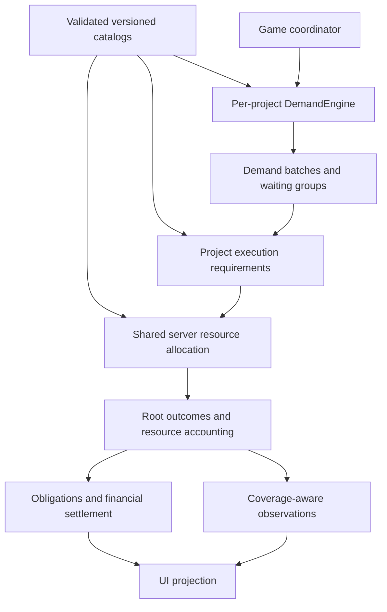

# Project systems transition

> Planning status: the [agreed milestone sequence](../../docs/milestones/README.md) supersedes this broad plan’s delivery ordering. The ten milestone documents now define delivery and acceptance. Retain this file only as transition context; create assigned-PR plans from the relevant milestone. Do not execute this entire document as one PR.

Status: replacement execution plan, not runtime implementation. It supersedes the old hosting initiative's Phase 3 onward ordering. Its slices are not a new product milestone numbering system. No merge, push, deployment or engine rewrite is performed by the documentation task.

## Inputs and base reconciliation

Product authority: [Gameplay](../../docs/product/gameplay.md), [Domain model](../../docs/product/domain-model.md), [Balance](../../docs/product/balance/index.md), [Interface](../../docs/product/interface-design-brief.md), [Interactions](../../docs/product/interaction-specification.md).

This documentation branch is synchronized with main at `2d2c512`, including hosting Phase 2 and completed public-site, SEO, PWA and consent delivery. Before future runtime work, inspect any newer main changes rather than repeating those completed migrations. Workspace guides describe implemented behavior.

Impact: `packages/fivenines-engine/src/`, its tests and catalog; `apps/web/src/hub/`, `apps/web/src/lab/`; `packages/ui/src/` and Storybook; generic formatters only where justified. No automatic changes to Nest, auth, generated SDKs, Docker, CI, or dependency manifests. Read nested workspace guidance and the relevant TypeScript/security/testing rules before implementation.

## Target ownership



Use indexed identities for lookup and explicit graph adjacency for dependencies/routing. Keep one shared server record per asset. Group waiting work by demand type, arrival tick and compatible progress/state; preserve FIFO age without allocating an object per request. Rebuild processing structure on topology/configuration changes, not every tick. These choices guide implementation; prove semantics with tests before treating an API or storage structure as final.

All tunables stay in focused engine `src/catalog/` modules. DemandEngine generates only demand. Execution computes required work; per-server allocation owns contention. Game coordinates a single outer-tick transition, operations, accounting and published projections. No second authority in UI or transport.

## Delivery slices

Each row is a separately reviewed merge unit when its prerequisites exist; split further if the changed surface exceeds a reviewable unit. Introduce new paths only after inspecting existing module boundaries. Do not ship a partial new model as if legacy actions obey its rules.

| Slice | Surfaces and output | Hard constraints | Acceptance evidence |
|---|---|---|---|
| Model and catalogs | Engine entities/indexes, service/instance ownership, catalog validation and data-driven operations | Preserve Phase 2 tenure; validate catalog references/DAG once; no UI dependencies | Duplicate/missing ID rejection; shared server identity; instance config scope; validated catalog and serialization boundaries |
| Aggregate execution | Demand generation, compiled required paths, batch queues, resource allocator | One outer tick, no retries/subticks; CPU/GPU/RAM/network/disk budgets; no iteration-order privilege | Conservation; proportional contention including backlog; FIFO; queue overflow; incompatible GPU; shared downstream graph; optional-child/root counting |
| Preparation and configuration | Command validation, operational tasks, placement, activation and migration | One attention queue, retained preparation; shared config changes at boundary; no free duplicate/data copy | First project preparation timing; source serves during migration; atomic activation; unrelated projects unchanged |
| Routing and recovery | Target graph, health detection, replication, incidents, backups/checkpoints, replacement/leasing | Detected health only; one primary; no monitoring-down alert; no autosale/autobuy; no hidden cause leakage | Loop rejection; ready/unready standby; monitoring-independent checks; one replacement; credit recheck; repaired-original state; permanent failed job without checkpoint |
| Contracts and progression | Obligations, settlement ledger, customers/offers, learning | Advance at acceptance; separate activation period; prospective attribution; full upfront monthly tuition | Boundary/cutoff examples; refund cap and receivable netting; customer departure before renewal; recoverable debt; course completion before renewal; two slots |
| Observation and interface | Engine projections, Hub/Lab integration, display-only UI components, graph/charts and Storybook | Approved drawers/navigation/action hierarchy; RN-compatible implementation; telemetry honors coverage | Missing data vs zero; historical aggregation; interaction-spec journeys; touch/keyboard and shared-asset impact; no prototype jail/Opening Shift UI |

The solver needs a focused design/proof inside its slice before coding: define resource-ready work and multi-resource fairness, integer remainder handling, joining required branches, and latency estimation. Do not silently resolve these by sequentially exhausting servers or adding simulation subticks. Demonstrate invariants on small analytical cases, then seeded stress scenarios. This plan does not claim that mathematical proof has been completed.

Resolve the first-project preparation accounting explicitly: the documented five-hour baseline is two installs plus one shared connection/configuration task. Catalog per-technology configuration costs must not be blindly added again to that preset. General deployment configuration remains separately costed. Preserve this interpretation in a regression test rather than silently changing the opening duration.

## Verification per slice

For each engine slice, in order:

```bash
bun test packages/fivenines-engine
bun run turbo run typecheck --filter=@packages/fivenines-engine
bun run overall
```

For the interface slice, run the affected UI/web tests under their workspace guidance, then `bun run overall`. Verify the Figma handoff journeys in browser and native-compatible component previews, including keyboard and touch affordances. Select graph/chart dependencies only after a compatibility/performance comparison against the actual shared UI stack; Figma prototype libraries are not automatically approved production dependencies.

Do not claim success when a gate cannot start. If a gate cannot start, fix the environment and rerun it before reporting verification as passed. A documentation link/catalog check is not a substitute for engine tests.

## Documentation before each PR

After slice verification, update engine or app/package `AGENTS.md` only for behavior actually implemented. Keep product changes limited to genuine approved corrections; update balance validation with new evidence and limitations. Update this plan's corresponding status. Keep [Remaining work](../../docs/product/open-questions.md) accurate without copying algorithms into product prose. Preserve independent platform task status.

## PR sequence and risks

The milestone sequence owns delivery order: mathematical foundations, entities/catalogs, demand/learning, preparation, execution, contracts, observation/recovery, routing/automation, catalog completion and integrated validation. The broad slices above are context, not PR assignments. Each PR must keep current application consumers runnable; no parallel legacy engine or compatibility layer is required. No automatic save migration is implied; transport/snapshot protocol remains deferred.

| Risk | Mitigation |
|---|---|
| Historical rules leak into new UI | Search current changes for jailed, Opening Shift, Park, CPU label conversions, direct accept-to-served and server-wide monitoring; verify each against product rules |
| Shared hardware counted twice | Conservation tests with two projects and converging/nested routing |
| Wrong settlement at simultaneous boundaries | Exact boundary fixtures for activation, expiry, completion, departure and renewal |
| Recovery invents data or repeats work | Usable-record predicates and lost-progress fixtures; no retry fallback |
| UI outruns authoritative state | Pending/rejected projections, revalidation, no optimistic authoritative success |
| Scope expands into infrastructure/platform work | Keep Nest/SSE migration, legal/consent, employees, away-time and geographic latency redesign outside these slices |

Canvas connection gesture selection remains deferred; compatible links and outcome rules are settled. No subagent delegation is required by this plan.
