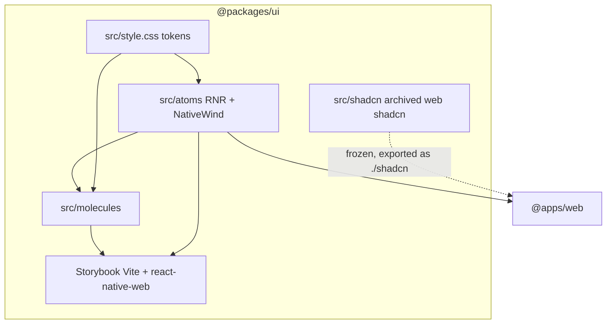

# Universal RNR atoms for `@packages/ui`

## Design agreement (2026-09-04)

| Topic | Decision |
|-------|----------|
| **Init** | **Do not** run `bunx @react-native-reusables/cli init` inside `packages/ui`. Current CLI `init` scaffolds a **new Expo app**. Existing library uses **manual** NativeWind + `components.json` + `doctor`. |
| **Scope** | `bunx @react-native-reusables/cli@latest add -a -y -o --styling-library nativewind -p src/atoms` (all RNR registry components). |
| **Legacy** | `git mv packages/ui/src/atoms` → `packages/ui/src/shadcn` (not `packages/ui/shadcn`). |
| **Storybook** | Keep `@storybook/react-vite`. Add **atom** stories. **Molecule** stories must keep working against the new atoms. |
| **Icons** | RNR internals use `lucide-react-native`. Molecules currently use `lucide-react` (`login-form`). Switch package internals; Storybook resolves via `react-native-web`. |
| **Tokens** | Keep existing `--background` / `--primary-foreground` (and `@theme inline`) in `src/style.css`. Do not invent a second palette. |
| **Styling engine** | **NativeWind v5** (Tailwind CSS v4 compatible). Keep current `tailwindcss@4.x` on `@packages/ui`. Do **not** install NativeWind v4 or downgrade Tailwind to v3. Peer: `react-native-css`. Install with `bun add nativewind@5` (or `nativewind@preview` if npm has no `5` dist-tag). |

## Inventory (scan)

**Location:** atoms live at `packages/ui/src/atoms/` (not `packages/ui/atoms/`). `components.json` already aliases `"ui": "./src/atoms"`.

**58 files in `src/atoms`:** accordion, alert, alert-dialog, aspect-ratio, avatar, badge, breadcrumb, button, button-group, calendar, card, carousel, chart, checkbox, collapsible, command, context-menu, dialog, drawer, dropdown-menu, empty, field, form, hover-card, input, input-group, input-otp, item, kbd, label, menubar, navigation-menu, pagination, popover, progress, radio-group, resizable, scroll-area, select, separator, sheet, sidebar, skeleton, slider, sonner, spinner, switch, table, tabs, textarea, toast, toaster, toggle, toggle-group, tooltip, use-mobile, use-toast, plus `index.ts`.

**Stories today:** only `src/molecules/*/*.stories.tsx` (button, card, counter-button, input, label, link, login-form). **No atom stories.** Molecules **duplicate** web Button/Card/Input/Label; they do **not** import `#/atoms`. Login form uses `lucide-react`.

**Consumers:** `@apps/web` depends on `@packages/ui` and imports `@packages/ui/style.css` only (`apps/web/src/routes/__root.tsx`). No `apps/mobile`.

**Styling stack (agreed):** UI package already uses **Tailwind CSS 4** (`@import "tailwindcss"` + `@theme inline` in `src/style.css`) and Vite Storybook. Phase 2 adds **NativeWind v5** + `react-native-css` on top of that CSS-first setup (`@import "nativewind/theme"` additive; do not replace token blocks). Metro/`withNativewind` is **not** required for Storybook; use NativeWind v5 Vite/other-bundler guidance. Pin `lightningcss` only if NativeWind v5 docs require it for CSS deserialization errors.

## Target architecture



**Naming / invariants:**
- Package name stays `@packages/ui`.
- Public exports: `./atoms` (universal RNR), `./shadcn` (legacy web, Phase 1+), `./molecules`, `./hooks`, `./utils`, `./style.css`.
- CLI writes into `src/atoms` only after Phase 1 archive.
- Theme class names (`bg-background`, `text-primary-foreground`) stay.
- No Expo app in this initiative.

**Dependency / policy rules:**
- Add RN/NativeWind deps **only** on `@packages/ui` (not root, not every app).
- Do **not** add NativeWind as a blanket dep of `@apps/web` until web actually renders RNR primitives (may stay CSS-only this initiative).
- Prefer `@packages/utils` `cn` over duplicating `clsx`/`tailwind-merge` helpers unless RNR files require a local `lib/utils` path the CLI injects — if CLI writes `lib/utils`, map alias to `@packages/utils/cn` or a thin re-export.
- `react-native` / `react-native-web` are **dev or peer** of the library; Storybook aliases `react-native` → `react-native-web`.

| Current | After | Notes |
|---------|-------|-------|
| `packages/ui/src/atoms/*` (shadcn/Radix) | `packages/ui/src/shadcn/*` | Archive; keep for curl/diff |
| `packages/ui/src/atoms/*` (empty then RNR) | RNR CLI output | `--path src/atoms` |
| `packages/ui/components.json` | Same file, aliases for RNR add | `ui` → `./src/atoms`; `rsc: false` for RN |
| `lucide-react` in UI internals | `lucide-react-native` | Molecules + generated atoms |
| Storybook stories = molecules only | Atoms + molecules | Vite still |

---

## Phase 1 — Archive shadcn atoms

**Goal:** Move web-only atoms out of the `atoms` path so later CLI `add` can write RNR files without mixing trees, without changing runtime behavior.

**Hard constraints (phase 1 only):**
- Must use `git mv` (preserve history).
- Must keep `@packages/ui/atoms` resolving (re-export from `src/shadcn` or point export at `src/shadcn`).
- Must update `src/style.css` `@source` if it only scans `./atoms`.
- Must update `scripts/write-barrels.ts` so it does not wipe the archive.
- Must **not** add NativeWind, RNR CLI generate, or Storybook RN aliases.
- Must **not** edit `docs/` / `AGENTS.md` during implement.

### Mechanical changes

| From | To | Notes |
|------|-----|-------|
| `packages/ui/src/atoms/` | `packages/ui/src/shadcn/` | `git mv` |
| `package.json` `exports["./atoms"]` | still public; implementation re-exports shadcn | Temporary bridge |
| `exports["./shadcn"]` | `src/shadcn/index.ts` | New |

### Code/config surfaces (builder-workflow)

- `packages/ui/src/atoms/` (bridge barrel only)
- `packages/ui/src/shadcn/`
- `packages/ui/package.json` exports
- `packages/ui/src/style.css` `@source`
- `packages/ui/scripts/write-barrels.ts`
- `packages/ui/components.json` aliases if they still say `./src/atoms` for shadcn CLI — Phase 1: point a `shadcn` alias or leave `ui` until Phase 2

### Scouts (parallel inventory — code/config only)

| Scout | Task | Patterns / paths | Row budget |
|-------|------|------------------|------------|
| 1 | Export + barrel writers | `packages/ui/package.json`, `packages/ui/scripts/write-barrels.ts`, `packages/ui/scripts/watch-export-modules.ts` | ≤40 |
| 2 | CSS/source globs | `packages/ui/src/style.css`, `packages/ui/components.json` | ≤40 |
| 3 | Importers of atoms | `rg '@packages/ui/atoms'`, `rg 'src/atoms'` in `apps/` `packages/` | ≤40 |

### Verification (phase 1 gate)

```bash
bun run typecheck --filter=@packages/ui
bun run turbo run build:storybook --filter=@packages/ui
```

### Documentation before PR (documentation-sync)

**When:** After verification passes and builder finishes — **not** during implement.

- `packages/ui/AGENTS.md` — atoms vs `src/shadcn` layout
- `packages/ui/README.md` — export `./shadcn` if advertised

---

## Phase 2 — Manual NativeWind / RNR toolchain

**Goal:** Make `rnr doctor` pass on `@packages/ui` without generating components and without `init`.

**Hard constraints (phase 2 only):**
- Must install from `packages/ui` **NativeWind v5** (not v4): `nativewind@5` or `nativewind@preview`, `react-native-css@latest`, `react-native-reanimated`, `react-native-safe-area-context`, plus RNR peers doctor reports (`@rn-primitives/portal`, `react-native`, `react-native-web` as needed).
- Must **keep** existing `tailwindcss@4.x` (`4.3.3` today). NativeWind v5 requires Tailwind **4.1+**.
- Must **not** run `init`.
- Must **not** `add` components yet.
- Must keep Tailwind **design tokens** in `src/style.css`. Add `@import "nativewind/theme"` (and v5 CSS imports if Storybook/RN-web needs the split `theme.css` / `preflight.css` / `utilities.css` form) **without** deleting `@theme inline` variables.
- Must not add Expo app under `apps/`.
- Prefer CLI/doctor to invent metro/babel files; if doctor demands `metro.config.js` in a Vite library, add the **minimum** stub or document skip — do not convert Storybook to Metro in this phase.
- Types: NativeWind v5 uses `/// <reference types="react-native-css/types" />` in `nativewind-env.d.ts` (not `nativewind/types`).
- `clsx` / `class-variance-authority` / `tailwind-merge` / `@radix-ui/react-slot` already present — do not duplicate versions.

### Mechanical changes

| From | To | Notes |
|------|-----|-------|
| `components.json` shadcn web | RNR-compatible (same schema) | `"rsc": false`, `tailwind.css` → `src/style.css`, aliases `ui` → `./src/atoms` |
| missing `lib/utils` for CLI | re-export `@packages/utils/cn` | Avoid second `cn` |
| NativeWind v5 types | `nativewind-env.d.ts` | `react-native-css/types`; do not name file `nativewind.d.ts` |

### Code/config surfaces (builder-workflow)

- `packages/ui/package.json`
- `packages/ui/components.json`
- `packages/ui/tsconfig.json` (paths `@/*` if CLI requires)
- `packages/ui/src/style.css` (NativeWind v5 `@import "nativewind/theme"` **additive**, keep `@theme` tokens)
- `packages/ui/tailwind.config.js` (legacy JS config; v5 is CSS-first — do not add NativeWind v4 `presets: [require("nativewind/preset")]`)
- `packages/ui` PostCSS (`@tailwindcss/postcss` if Storybook still uses `tailwindcss` v3 plugin in `.storybook/vite.config.ts` — align with Tailwind 4)
- Root `bun.lock` via `bun add` in package

### Scouts (parallel inventory — code/config only)

| Scout | Task | Patterns / paths | Row budget |
|-------|------|------------------|------------|
| 1 | Doctor + CLI | `bunx @react-native-reusables/cli@latest doctor -c packages/ui --summary` | ≤40 |
| 2 | NativeWind v5 Vite | https://www.nativewind.dev/v5/getting-started/installation “Other Bundlers” vs `.storybook/vite.config.ts` | ≤40 |
| 3 | Existing deps overlap | `packages/ui/package.json` vs RNR peer list | ≤40 |

### Verification (phase 2 gate)

```bash
bunx @react-native-reusables/cli@latest doctor -c packages/ui --summary
bun run typecheck --filter=@packages/ui
bun run turbo run build:storybook --filter=@packages/ui
```

### Documentation before PR (documentation-sync)

- `packages/ui/AGENTS.md` — NativeWind **v5** + `react-native-css` + RNR CLI (`add`, `doctor`), no `init`
- `docs/CHEATSHEET.md` — optional one-liner for `rnr add` from `packages/ui`

---

## Phase 3 — Generate all RNR atoms + link molecules

**Goal:** Populate `src/atoms` from the official registry; switch icons; point molecules at atoms so stories use universal primitives.

**Hard constraints (phase 3 only):**
- Must run from `packages/ui`:

```bash
bunx @react-native-reusables/cli@latest add -a -y -o --styling-library nativewind -p src/atoms
```

- Must **not** curl-rewrite components the CLI already emitted.
- Curl fallback **only** if `add -a` skips a **molecule-required** primitive (button, card, input, label) — then one `curl` from `https://raw.githubusercontent.com/founded-labs/react-native-reusables/main/...` (real blob URL, not `githubusercontent.com` host root).
- After generate: global replace `from "lucide-react"` → `from "lucide-react-native"` under `packages/ui/src` (atoms + molecules).
- Retarget `src/molecules/{button,card,input,label}` to re-export or wrap `src/atoms` equivalents (login-form already imports sibling molecules).
- `write-barrels.ts` must match RNR file layout (CLI may emit folders vs flat files).
- Must not add Expo; must not delete `src/shadcn`.

### Mechanical changes

| From | To | Notes |
|------|-----|-------|
| `src/atoms/index.ts` shadcn re-export | RNR barrel | `exports["./atoms"]` now universal |
| molecule local Radix copies | import from atoms | Storybook + web API stability |
| `lucide-react` internals | `lucide-react-native` | Keep `lucide-react` only if a leftover shadcn file needs it |

### Code/config surfaces (builder-workflow)

- `packages/ui/src/atoms/**`
- `packages/ui/src/molecules/**`
- `packages/ui/scripts/write-barrels.ts`
- `packages/ui/package.json` exports if CLI adds `lib/` `hooks/`

### Scouts (parallel inventory — code/config only)

| Scout | Task | Patterns / paths | Row budget |
|-------|------|------------------|------------|
| 1 | CLI output shape | `ls packages/ui/src/atoms` after dry-run/help | ≤40 |
| 2 | lucide imports | `rg "lucide-react" packages/ui/src` | ≤40 |
| 3 | molecule public props vs RNR | button/card/input/label prop types | ≤40 |

### Verification (phase 3 gate)

```bash
bun run typecheck --filter=@packages/ui
bun test packages/ui
rg -n "from [\"']lucide-react[\"']" packages/ui/src --glob '!**/shadcn/**'
```

(`rg` must return no matches outside `src/shadcn`.)

### Documentation before PR (documentation-sync)

- `packages/ui/AGENTS.md` — atom file layout after RNR (folder vs flat)
- `packages/ui/README.md` — import paths if they still say `@packages/ui/button/button`

---

## Phase 4 — Storybook visual gate

**Goal:** Storybook shows new atoms and existing molecule stories still render.

**Hard constraints (phase 4 only):**
- Must keep `@storybook/react-vite` (no RN Storybook app).
- Must alias `react-native` → `react-native-web` in `.storybook` Vite config; wrap overlay stories with `PortalHost` if dialogs need it.
- Must add stories under `src/atoms` (or colocated) for generated primitives used by molecules at minimum: button, badge, card, dialog, input, select — **plus** any molecule dependency.
- Must not restyle tokens; use existing `src/style.css` import in `preview.tsx`.
- Browser verify: `bun run turbo run dev --filter=@packages/ui` (port **3004**) — open molecule Button/Card/Input/Login and new atom stories.

### Code/config surfaces (builder-workflow)

- `packages/ui/.storybook/main.ts`
- `packages/ui/.storybook/preview.tsx`
- `packages/ui/.storybook/vite.config.ts`
- `packages/ui/src/atoms/**/*.stories.tsx` (new)
- existing `packages/ui/src/molecules/**/*.stories.tsx` (fix imports/args only)

### Scouts (parallel inventory — code/config only)

| Scout | Task | Patterns / paths | Row budget |
|-------|------|------------------|------------|
| 1 | Storybook Vite aliases | `.storybook/*`, `STORYBOOK.md` commands vs `package.json` scripts | ≤40 |
| 2 | PortalHost / dialog | RNR dialog + `@rn-primitives/portal` | ≤40 |
| 3 | Existing story args vs new props | molecule stories argTypes | ≤40 |

### Verification (phase 4 gate)

```bash
bun run turbo run build:storybook --filter=@packages/ui
bun run typecheck --filter=@packages/ui
bun test packages/ui
bun run overall
```

Plus interactive: Storybook :3004 molecule + atom stories (browser).

### Documentation before PR (documentation-sync)

- `packages/ui/STORYBOOK.md` — RN-web, atom story titles, port 3004
- `packages/ui/AGENTS.md` — Storybook structure (replace stale `src/button/` tree)
- `docs/CHEATSHEET.md` only if Storybook command changed (it should not)

---

## What stays out of scope

- `rnr init` / new Expo app / `apps/mobile`
- Deleting `src/shadcn` in this initiative
- Replacing `@apps/web` pages with RNR (CSS import only today)
- RN Storybook / Expo preview
- Rewriting `src/hooks` except what CLI drops beside atoms
- Changing design tokens / brand colors
- Dual publishing of web-DOM vs RN entrypoints (`package.json` `react-native` condition) unless typecheck forces it — defer to a follow-up plan

---

## Suggested PR sequence

| PR | Content | Merge gate |
|----|---------|------------|
| PR1 | Phase 1 archive + dual export | Phase 1 verify |
| PR2 | Phase 2 toolchain + doctor | Phase 2 verify |
| PR3 | Phase 3 `add -a` + molecules + lucide | Phase 3 verify |
| PR4 | Phase 4 Storybook + `overall` | Phase 4 verify |

---

## Risk summary

| Risk | Mitigation |
|------|------------|
| `init` overwrites the library with an Expo template | **Forbidden.** Manual setup + `doctor` only. |
| NativeWind v4 accidentally installed | Pin **v5** (`nativewind@5` / `@preview`). Reject `nativewind@4` and `nativewind/preset`. |
| `add -a` overwrites `src/atoms` bridge | Phase 1 archive complete before Phase 3. |
| CLI wants `metro.config.js` in a Vite package | Minimum stub or doctor skip; Storybook stays Vite. |
| RNR components are RN `View`/`Text` — DOM Storybook / Testing Library break | `react-native-web` alias; fix tests to RN-web roles. |
| Molecules duplicate atoms — stories would not prove RNR | Phase 3 retarget molecules to atoms. |
| `write-barrels.ts` assumes flat `*.tsx` atoms | Update after seeing CLI output (folders). |
| `add` interactive hang | Always `-y`; `-c` / cwd `packages/ui`. |
| Wrong curl host | Use `raw.githubusercontent.com/founded-labs/react-native-reusables/...` only if CLI cannot emit a required file. |

## Human gates

- Adding `react-native` / NativeWind v5 to a web-first library (Phase 2).
- `add --all` volume (Phase 3).
- Pinning `lightningcss` (or bun/npm overrides) if v5 CSS pipeline requires it.
