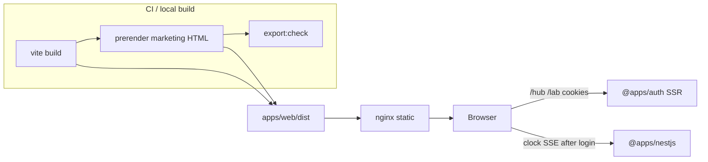

# Web static SSG (one `@apps/web`)

## Design agreement

**Outcome:** `@apps/web` is a **static `dist/`** (Vite client build + later prerender). **nginx** serves it. No Node/Vite process in production. **`/hub` and `/lab`** stay **client-only** (lazy `Game`). **`@apps/auth`** remains the SSR auth app. Marketing HTML is crawlable (home + required legal). **Blog is out.** No second `apps/landings`.

**Model:** Xpertell `apps/landings` (Vite + TanStack Router + post-build prerender + nginx) plus PWA/analytics from `apps/xpertell` / `packages/analytics` — **without** FCM, Firebase, campaigns, start-selling, Apple IAP, help-center, or a second workspace.

**Phases:** 4 PRs, in order.

**Constraints (every phase):**
- Stay in **one** `@apps/web`.
- `trailingSlash: "never"`.
- Do not construct `Game` outside `/hub` and `/lab`.
- Do not add `createServerFn` or `@tanstack/react-start` after Phase 1 removes them.
- Legal copy may be honest placeholders; contact is **mailto + GitHub/wiki**, no form backend.
- Home CTA is **Play → `/hub`**, not app stores.

---

## Target architecture



**Naming / invariants:**

| Current | After | Notes |
|---------|-------|-------|
| TanStack Start SSR + `vite preview` | Vite SPA + `tanstackRouter` plugin + nginx `dist/` | Same pattern as xpertell landings |
| `createServerFn` + `@packages/nestjs-sdk/server` on `/` | Gone | Home is static; Nest is browser-only from hub |
| `GET /` JSON liveness | `GET /status` JSON only | `/` is marketing HTML |
| `AuthProvider` on `__root` | Only `/hub` and `/lab` (Phase 2) | Marketing pays no session restore |
| HTML `/status` route | Removed | nginx / Vite middleware owns JSON |
| no analytics package | `@packages/analytics` (Phase 4) | GTM after Silktide; **no Firebase** |

**Dependency / policy rules:**
- `@apps/web` may depend on `@packages/ui`, `@packages/auth` (play routes only), `@packages/http`, `@packages/nestjs-sdk` **client** (hub clock), `@packages/fivenines-engine` (hub/lab), `@packages/analytics` (Phase 4).
- `@packages/analytics` must **not** depend on Firebase, FCM, or `@apps/web`.
- Do **not** add `@packages/analytics` as a blanket workspace `devDependency`.
- Marketing UI lives in `apps/web/src/site/` (header/footer/pages). Do **not** put marketing into `@packages/ui/molecules` (ops chrome only).
- Do **not** create `apps/landings`.

---

## Phase 1 — Static `dist/` + nginx; no `createServerFn`; `/status` JSON

**Goal:** Production artifact is files + nginx. Dev stays `vite`. Home no longer SSR-fetches Nest. Process-up is **`/status` JSON**.

**Hard constraints (phase 1 only):**
- Must drop `@tanstack/react-start` and every `createServerFn`.
- Must not ship a real marketing layout (stub home: title + Play + Lab links is enough).
- Must not move `AuthProvider` yet (Phase 2).
- Must not add PWA, GTM, Silktide, or `@packages/analytics`.
- Must not prerender marketing SEO (Phase 3). `vite build` SPA `dist/` is enough for nginx `try_files` → `index.html`.
- Must keep `/hub` and `/lab` working as client routes.

### Mechanical changes

| From | To | Notes |
|------|-----|-------|
| `tanstackStart()` in `apps/web/vite.config.ts` | `@tanstack/router-plugin/vite` `tanstackRouter({ target: "react" })` | Keep RN-web plugins; drop `ssr:` block if unused |
| `getRouter()` + Start `Scripts` / HTML document in `__root` | `index.html` + `src/main.tsx` `RouterProvider` | Landings shape; `__root` is fragment + `Outlet` + `HeadContent` |
| `src/routes/index.tsx` `createServerFn` + Nest health | Static stub page (no loader I/O) | Delete `HomeStatus` Nest wiring |
| `src/routes/status.tsx` HTML | Delete route + `status.test.tsx` | JSON is not a React page |
| Vite middleware JSON on `/` and `/status` | JSON **only** `GET /status` | `isLivenessPath` → `/status` only |
| `apps/web/Dockerfile` bun `vite preview` | nginx alpine + `apps/web/nginx.conf` + copy `dist/` | Install `curl` (or `wget`) for HEALTHCHECK |
| Compose HEALTHCHECK `GET /` | `GET /status` JSON `"ok":true` | `docker-compose.yml` + `docker-compose.dev.yml` |
| Prod `web` `depends_on: nestjs` | Drop | Static site must be healthy without Nest |
| `package.json` `start` | `preview:static` / nginx-compatible (`bunx serve dist` or `vite preview` for local) | No Node required in **prod image** |
| Router pin vs Start | Pin `@tanstack/react-router` to the version `@tanstack/router-plugin` needs | Still **do not** reuse `@packages/shared-tanstack`’s older pin |

**nginx (prod):**
- `listen` **3000** (keep `WEB_PORT` / compose HEALTHCHECK `127.0.0.1:3000`).
- `location = /status` → `default_type application/json;` `return 200 '{"ok":true}';` (compose grep is `"ok":true`; timestamp optional).
- `location /assets/` immutable cache; HTML `no-cache`.
- `try_files $uri $uri.html $uri/index.html /index.html;` for SPA `/hub` `/lab`.
- Do **not** serve marketing `/` as JSON.

**Vite dev:** keep `status-json` middleware for `/status` only so host `bun run container check` / compose health still work.

### Code/config surfaces (builder-workflow)

- `apps/web/package.json`, `vite.config.ts`, `tsconfig.json`, `Dockerfile`, `nginx.conf` (new), `index.html` (new), `src/main.tsx` (new)
- `apps/web/src/router.tsx`, `src/routes/__root.tsx`, `src/routes/index.tsx`, `src/home/*` (stub or delete Nest-only)
- `apps/web/src/liveness.ts`, `liveness.test.ts` — delete status route tests
- `docker-compose.yml`, `docker-compose.dev.yml` — web health + prod depends_on
- `apps/web/.env.sample` — drop unused `NESTJS_API_URL` (SSR); keep `VITE_*`

### Scouts (parallel inventory — code/config only)

| Scout | Task | Patterns / paths | Row budget |
|-------|------|------------------|------------|
| 1 | Start / server-fn / status HTML | `rg 'createServerFn\|@tanstack/react-start\|tanstackStart\|nestjs-sdk/server' apps/web` | ≤40 |
| 2 | Health probes | `rg 'localhost:3000/\|WEB_PORT.*\/ \|isLivenessPath\|Accept: application/json' docker-compose.yml docker-compose.dev.yml apps/web tools/scripts` | ≤40 |
| 3 | Docker / start scripts | `apps/web/Dockerfile`, `package.json` `build`/`start`/`dev`, compose `web:` | ≤40 |

### Verification (phase 1 gate)

```bash
rg 'createServerFn' apps/web
# must be empty (exit 1 from rg is the pass for “no matches”; treat any hit as FAIL)

bun test apps/web
bun run turbo run typecheck --filter=@apps/web
bun run turbo run build --filter=@apps/web
```

Also confirm (checkup): `dist/index.html` exists; Dockerfile no longer `vite preview`.

### Documentation before PR (documentation-sync)

**When:** After verification passes and builder finishes — **not** during implement.

- `apps/web/AGENTS.md` — stack (Vite SPA, not Start); health `GET /status` JSON; Docker nginx; drop status HTML / `createServerFn`
- `AGENTS.md` — `@apps/web` row: static player + marketing UI, not SSR
- `README.md` — TanStack Start badge / “Player UI is TanStack Start”
- `docs/CHEATSHEET.md` — web probe `http://localhost:3000/status` (not `GET /`)
- `.github/instructions/web.instructions.md` — pin router to router-plugin, not Start

---

## Phase 2 — Auth only on `/hub` `/lab`

**Goal:** Marketing (and later legal) trees do not mount `AuthProvider`, `FetcherSettingsProvider`, or pay session restore. Auth stays `@apps/auth`.

**Hard constraints (phase 2 only):**
- Must not change hosting model from Phase 1.
- Must not add site pages (Phase 3).
- `/hub` and `/lab` session gates, `loginHref` / `logoutHref`, cookie domain, **no Vite `/auth` proxy** — unchanged.
- Home must not call `restore()`.
- `QueryClient` / Nest fetcher only where hub/lab need them.

### Mechanical changes

| From | To | Notes |
|------|-----|-------|
| Providers in `__root` | Shared `src/play/play-providers.tsx` used by `hub.tsx` and `lab.tsx` | Or a pathless `_play` layout **without** changing URLs |
| Root `WebRouterContext` queryClient | Optional / play-only | Marketing root can be `createRootRoute()` without QueryClient |
| `apps/web/src/routes/hub.test.tsx` / `lab.test.tsx` | Keep wrapping providers in tests **or** export a testable inner page | Behavior: unauthenticated still redirects to auth |

### Code/config surfaces (builder-workflow)

- `apps/web/src/routes/__root.tsx`, `hub.tsx`, `lab.tsx`, `router.tsx`, `router-context.ts`
- `apps/web/src/play/` (new) or equivalent
- Hub/lab tests under `apps/web/src/routes/`

### Scouts (parallel inventory — code/config only)

| Scout | Task | Patterns / paths | Row budget |
|-------|------|------------------|------------|
| 1 | Auth on root vs play | `rg 'AuthProvider\|restoreOnMount\|useAuth\|playerAuthSession\|FetcherSettingsProvider' apps/web/src` | ≤40 |
| 2 | Tests that assume root providers | `rg 'AuthProvider\|PlayButton' apps/web/src --glob '*.test.tsx'` | ≤40 |

### Verification (phase 2 gate)

```bash
rg 'AuthProvider|@packages/auth' apps/web/src/routes/index.tsx apps/web/src/routes/__root.tsx
# FAIL if marketing/root still mounts auth (hub/lab files may still import)

bun test apps/web
bun run turbo run typecheck --filter=@apps/web
```

### Documentation before PR (documentation-sync)

- `apps/web/AGENTS.md` — providers live on play routes; home has no `restore()`
- `packages/auth/AGENTS.md` — Play home does not mount `AuthProvider`; guarded routes own login/refresh

---

## Phase 3 — Real site: home, legal, SEO, prerender, `export:check`

**Goal:** Required marketing surfaces (xpertell landings analog, **minus** skipped extras) with **prerendered HTML** so crawlers see `<title>` / `og:*` without JS. Still one app.

**Hard constraints (phase 3 only):**
- Must not add a blog, campaigns, start-selling, help-center, or app-store CTAs.
- Must not prerender `/hub` or `/lab` as `Game` (SPA fallback via `index.html` is correct).
- Legal pages: **honest placeholders** (what we collect later, cookies via Phase 4, not fake GDPR completeness).
- Contact: **mailto + GitHub repo + wiki**; no Nest/form backend.
- Site chrome (header/footer) on marketing routes **only** — hub stays `h-screen` ops floor.
- Use existing Tailwind + `@packages/ui/atoms` / `Link`; do not port xpertell Sass landings.

### URL map (prerender list)

| Path | File | Notes |
|------|------|-------|
| `/` | `src/routes/index.tsx` + `src/site/home/` | Hero, how it works, FAQ, **Play → `/hub`** |
| `/about` | `src/routes/about.tsx` | Studio / game pitch; wiki link |
| `/privacy` | `src/routes/privacy.tsx` | Placeholder |
| `/terms` | `src/routes/terms.tsx` | Placeholder |
| `/cookie-policy` | `src/routes/cookie-policy.tsx` | Placeholder (Silktide copy in Phase 4) |
| `/contact` | `src/routes/contact.tsx` | mailto + GitHub + wiki |

**SEO / static files:**
- Per-route `head()` (title, description, `og:image` absolute via `VITE_APP_ORIGIN`).
- `public/robots.txt`, `public/sitemap.xml` (or generated in prerender from the path list).
- `apps/web/scripts/prerender-web.ts` — landings script adapted: `WEB_PRERENDER=1`, `trailingSlash: "never"` → `about/index.html`.
- `apps/web/scripts/export-check-web.ts` — assert HTML files + title/og smoke.
- `package.json`: `"build": "vite build && bun run prerender"`, `"export:check": "bun scripts/export-check-web.ts"`.

**Copy source of truth (structure, not pixels):** xpertell `apps/landings` home sections + header/footer; skip `start-selling`, `landing/xpertell-early`, environment switcher.

### Code/config surfaces (builder-workflow)

- `apps/web/src/site/**`, `src/routes/{index,about,privacy,terms,cookie-policy,contact}.tsx`
- `apps/web/src/lib/web-prerender-paths.ts`, `web-site-url.ts`
- `apps/web/scripts/prerender-web.ts`, `export-check-web.ts`
- `apps/web/public/` (og image, robots, sitemap)
- `apps/web/package.json` `build` / `prerender` / `export:check`
- `apps/web/.env.sample` — document `VITE_APP_ORIGIN` for absolute OG URLs
- Prerender may need Vite `ssr.noExternal` for RN-web **only if** prerender imports UI atoms; prefer DOM/`@packages/ui/atoms` `Link` without pulling hub/lab

### Scouts (parallel inventory — code/config only)

| Scout | Task | Patterns / paths | Row budget |
|-------|------|------------------|------------|
| 1 | Current routes / home stub | `apps/web/src/routes/**`, `apps/web/src/home/**` | ≤40 |
| 2 | Landings analog (read-only xpertell) | `apps/landings/src/routes`, `scripts/prerender-landings.ts`, `export-check-landings.ts` | ≤40 |
| 3 | Public / head | `rg 'head:|og:image|robots' apps/web` | ≤40 |

### Verification (phase 3 gate)

```bash
bun test apps/web
bun run turbo run typecheck --filter=@apps/web
bun run turbo run build --filter=@apps/web
bun run --filter=@apps/web export:check
```

`export:check` must fail if a prerender path is missing `<title>` or `property="og:image"`.

### Documentation before PR (documentation-sync)

- `apps/web/AGENTS.md` — route table, prerender list, `export:check`, site vs hub chrome
- `docs/CHEATSHEET.md` — `export:check` / `preview:static` if added
- `README.md` — player + marketing in `@apps/web`; Play at `/hub`

---

## Phase 4 — PWA (no FCM) + `@packages/analytics` (GTM after consent, no Firebase)

**Goal:** Installable PWA via **`vite-plugin-pwa`**. Cookie banner **Silktide-shaped** (same as xpertell). GTM loads **only after analytics consent**. **No Firebase, no FCM, no `firebase-messaging-sw`.**

**Hard constraints (phase 4 only):**
- Must not add FCM, `@firebase/*`, or xpertell `injectManifest` messaging SW.
- Use **`generateSW`** (or injectManifest **without** FCM) — `registerType: "autoUpdate"`.
- GTM gated: production + `VITE_GTM_CONTAINER_ID` + analytics consent; skip in `bun run dev`.
- Silktide static assets live in **`apps/web/public/silktide/`** + `index.html` script tags / gtag Consent Mode defaults (package must not own those files).
- `start_url`: `/`. Optional shortcut **Play → `/hub`**. Do not cache `/status` as HTML.
- Cookie policy page already exists (Phase 3); wire “manage cookies” to `openCookiePreferences`.

### Mechanical changes

| From | To | Notes |
|------|-----|-------|
| (none) | `packages/analytics` | Port xpertell `consent.ts` + `tag-manager.ts` + `configure.ts` + `env.ts`; **omit** `firebase.ts` and Firebase env names |
| Tests | `bun:test` colocated `*.test.ts` | Repo preset, not xpertell vitest |
| `apps/web` bootstrap | `initAnalytics` + `initConsentManager` in `main.tsx` before `RouterProvider` | App owns `import.meta.env` → `buildAnalyticsConfig` |
| Vite | `VitePWA({ strategies: "generateSW", manifestFilename: "manifest.json", … })` | Icons in `public/`; theme from ops tokens |
| nginx | `/silktide/`, `/manifest.json`, SW files | Cache like xpertell `nginx.static.conf` |

**Env (`ANALYTICS_ENV_VAR_NAMES`):** `VITE_GTM_CONTAINER_ID` only. Empty id → no GTM (legal locally).

### Code/config surfaces (builder-workflow)

- `packages/analytics/**` (`package.json`, `tsconfig.json`, `src/*`)
- Root `package.json` workspaces already `packages/*`
- `apps/web/vite.config.ts`, `index.html`, `public/silktide/**`, `public/logo*.png`
- `apps/web/src/main.tsx`, cookie-policy / footer link to preferences
- `apps/web/nginx.conf` silktide + manifest
- `apps/web/.env.sample`

### Scouts (parallel inventory — code/config only)

| Scout | Task | Patterns / paths | Row budget |
|-------|------|------------------|------------|
| 1 | Xpertell analytics (no Firebase) | `/Users/soheil/Workspace/xpertell/packages/analytics/src/{consent,tag-manager,configure,env}*` | ≤40 |
| 2 | Xpertell PWA (manifest only) | `apps/xpertell/vite.config.ts` `VitePWA`, `public/silktide` | ≤40 |
| 3 | Web nginx / index.html | `apps/web/nginx.conf`, `apps/web/index.html` | ≤40 |

### Verification (phase 4 gate)

```bash
bun test packages/analytics apps/web
bun run turbo run typecheck --filter=@packages/analytics --filter=@apps/web
bun run turbo run build --filter=@apps/web
bun run --filter=@apps/web export:check
```

Checkup: `dist/manifest.json` (or Vite PWA output name) exists; `rg '@firebase|firebase-messaging' packages/analytics apps/web` empty.

### Documentation before PR (documentation-sync)

- `packages/analytics/AGENTS.md` (new)
- `AGENTS.md` — workspace table row `@packages/analytics`
- `apps/web/AGENTS.md` — PWA, Silktide, GTM consent gate, env
- `docs/CHEATSHEET.md` — GTM env if listed
- `.github/instructions/web.instructions.md` — no FCM SW

---

## What stays out of scope

- Blog / CMS / MDX.
- Second app (`apps/landings`).
- Xpertell campaigns, start-selling, environment switcher, Apple IAP, empty help-center.
- Firebase Analytics / FCM / `firebase-messaging-sw`.
- Contact form backend, Nest loaders on marketing routes.
- App-store CTAs (Play is `/hub`).
- Moving hub `Game` off the client (Nest campaign/SSE remains later).
- Changing `@apps/auth` off SSR.

---

## Suggested PR sequence

| PR | Content | Merge gate |
|----|---------|------------|
| PR1 | Phase 1 only | `rg 'createServerFn' apps/web` empty; `bun test apps/web`; typecheck + build `@apps/web` |
| PR2 | Phase 2 only | `bun test apps/web`; typecheck; root/home have no `AuthProvider` |
| PR3 | Phase 3 only | build + `export:check` + `bun test apps/web` |
| PR4 | Phase 4 only | analytics + web tests; typecheck both; build; no Firebase |

Doc sync **after** each phase checkup PASS, **before** that phase’s commit/PR.

---

## Risk summary

| Risk | Mitigation |
|------|------------|
| `createServerFn` / Start sneaks back | Phase 1 `rg` gate; instructions drop Start pin |
| Compose health still hits `GET /` | Scout compose + CHEATSHEET; HEALTHCHECK `/status` |
| nginx SPA fallback serves JSON for `/` | Dedicated `location = /status`; `/` is HTML |
| Prerender pulls hub/Game/RN-web | Prerender path list = marketing only; lazy hub/lab |
| Auth on marketing bundle | Phase 2 import `rg` on `__root` / `index` |
| GTM without consent | `setupTagManager` only from Silktide analytics `onAccept` |
| FCM copied from xpertell PWA | `generateSW`; `rg` firebase gate |
| Prod web waits on Nest | Drop `depends_on: nestjs` in Phase 1 |
| Router version skew | Pin router to router-plugin; not `shared-tanstack` |
