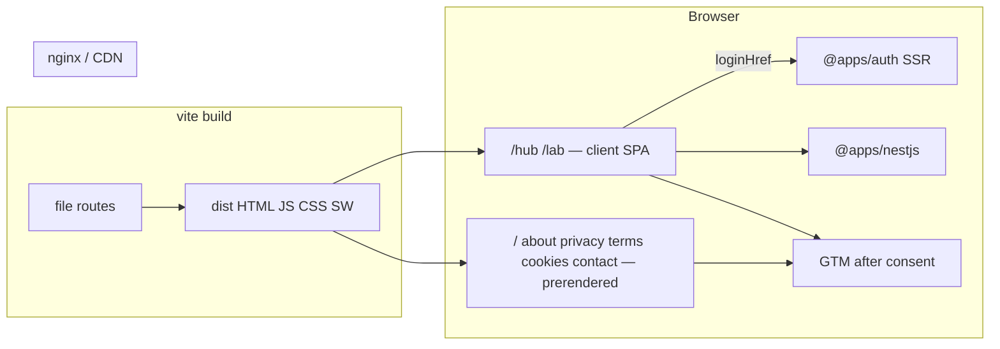

# Web as static site (marketing + client play)

**Reference (read, do not copy travel copy or Sass):** xpertell `apps/landings` (static marketing), `apps/xpertell/src/pwa` + `vite-plugin-pwa`, `packages/analytics` (GTM + Silktide consent only). Five Nines stays **one** `@apps/web` (do not add `apps/landings`).

**Product copy:** Five Nines cloud tycoon (contracts, servers, SLA “five nines”, Opening Shift). Wiki is human pitch; do not paste kernel formulas into marketing HTML.

## Target architecture



**Naming / invariants:**

- Runtime is **static files**. No `createServerFn`, no Node app as production CMD (`vite preview` is local preview only).
- `@apps/auth` is the only auth SSR. Web never proxies `/auth`, never exchanges codes, never `restore()` on marketing.
- `/hub` and `/lab` are client-only. Marketing never constructs `Game`.
- Marketing HTML is **prerendered** (crawlers see `<title>` / `og:*` without JS). Hub/lab may be a SPA shell.
- `trailingSlash: "never"` stays (unlike xpertell landings `always`). Dist paths: `about.html` or `about/index.html` — pick one and keep `export:check` in sync.
- `VITE_*` baked at build. Drop `NESTJS_API_URL` from web after Phase 1.
- Pin `@tanstack/react-router` to the version `@tanstack/react-start` depends on.

| Current | After | Notes |
|---------|-------|-------|
| Start SSR + `vite preview` | Static `dist/` + nginx | Scout Start 1.168 `spa` / `prerender` |
| Nest health on `/` | Marketing home | No server fn |
| JSON liveness on `/` | Static `GET /status` | Align with auth/nest |
| `AuthProvider` on root | Play layout only (Phase 2) | |
| Stub `/` | Landings-shaped home (Phase 3) | Original copy |
| No legal pages | `/about` `/privacy` `/terms` `/cookie-policy` `/contact` | Skip xpertell environment/apple/help stubs |
| No PWA / GTM | Phase 4 | No Firebase/FCM |

**Dependency / policy rules:**

- Do not add Next.js or a second public web app.
- Do not add `@packages/nestjs-sdk/server` in web after Phase 1.
- Do not copy xpertell Sass, `EN_TEXT` travel strings, or Firebase into fivenines.
- `@packages/analytics` (Phase 4) is GTM + consent. **No** `@firebase/*`.
- Markdown/blog CMS is out.

---

## Required public URL map (Phase 3)

Modeled on xpertell **landings** + cookie/contact from xpertell **marketing** routes. Skip campaign `/landing/*`, start-selling, environment, apple IAP, empty help-center.

| Path | Role | Prerender |
|------|------|-----------|
| `/` | Marketing home: hero, how it works, who it’s for, FAQ, CTA **Play** → `/hub` | Yes |
| `/about` | What Five Nines is | Yes |
| `/privacy` | Privacy policy (placeholder lawyer text OK) | Yes |
| `/terms` | Terms of use (not `terms-of-us`) | Yes |
| `/cookie-policy` | Cookies; consent banner links here | Yes |
| `/contact` | mailto + GitHub/wiki links; **no** POST backend | Yes |
| `/status` | Static JSON `{ ok: true }` for HEALTHCHECK | File, not a React page |
| `/hub` `/lab` | Play (auth gate) | SPA shell OK |

Shared chrome on marketing only: header (logo, section/page links, Play), footer (legal links, contact email). Hub/lab keep current full-screen ops UI (no marketing footer).

SEO materials with those pages: per-route `head()` (title, description, `og:image` absolute via `VITE_APP_ORIGIN`), `public/robots.txt`, build-time `sitemap.xml`, favicon + OG image under `apps/web/public/`.

---

## Phase 1 — Static artifact and static host

**Goal:** Production `@apps/web` is files on disk; compose serves them with nginx. Dev may keep Vite HMR.

**Hard constraints (phase 1 only):**

- Must: `vite build` emits HTML + assets; production image does not run `vite preview` or Bun as the HTTP app.
- Must: delete `createServerFn` from `apps/web`.
- Must: `/hub` `/lab` stay client `Game` (lazy).
- Must: liveness is static `GET /status` JSON. Compose HEALTHCHECK and Check.yml web probe use `/status` (drop web-only `/` JSON).
- Must not: marketing redesign, PWA, analytics package, blog.
- Must not: change `@apps/auth` cookies.
- Must not: move `AuthProvider` off root (Phase 2).

### Mechanical changes

| From | To | Notes |
|------|-----|-------|
| `tanstackStart({ router })` | SPA + prerender | Confirm plugin keys vs 1.168.49 |
| Home loader + server fn | Minimal static home (Play/Lab links OK until Phase 3) | Drop Nest badge |
| Vite Accept-JSON middleware | `public/status.json` or nginx `location = /status` | |
| Dockerfile bun preview | nginx (or Caddy) + `dist` | SPA fallback `/hub` `/lab` |
| Prod `depends_on: nestjs` | remove | |
| Check.yml `probe_path="/"` for web | `/status` | |

### Code/config surfaces (builder-workflow)

- `apps/web/vite.config.ts`, `package.json`
- `apps/web/src/routes/index.tsx`, `home/*`, `liveness.ts`, `status.tsx` + tests
- `apps/web/Dockerfile`, optional `nginx.conf`
- `docker-compose.yml`, `docker-compose.dev.yml`
- `.github/workflows/Check.yml`

### Scouts (parallel inventory — code/config only)

| Scout | Task | Patterns / paths | Row budget |
|-------|------|------------------|------------|
| 1 | Start SPA/prerender types | `apps/web/vite.config.ts`; `node_modules/@tanstack/react-start` `spa` `prerender` `pages` | ≤40 |
| 2 | Server-only web I/O | `rg 'createServerFn|nestjs-sdk/server|NESTJS_API_URL' apps/web` | ≤40 |
| 3 | Health / CI | `rg 'isLivenessPath|probe_path|vite preview' apps/web docker-compose.yml docker-compose.dev.yml .github/workflows/Check.yml` | ≤40 |
| 4 | Dockerfile | `apps/web/Dockerfile` `package.json` compose web service | ≤40 |

### Verification (phase 1 gate)

```bash
rg 'createServerFn' apps/web
# expect: no matches

bun test apps/web
bun run turbo run typecheck --filter=@apps/web
bun run turbo run build --filter=@apps/web
```

Compose HEALTHCHECK: `http://127.0.0.1:${WEB_PORT:-3000}/status` + `"ok":true`.

### Documentation before PR (documentation-sync)

- `apps/web/AGENTS.md` — static runtime, `/status` JSON, no `createServerFn`
- Root `AGENTS.md` web row
- `docs/CHEATSHEET.md` — probe `/status`
- `.github/instructions/web.instructions.md` if it still says SSR as runtime

---

## Phase 2 — Auth cost only on play routes

**Goal:** Marketing does not mount `AuthProvider` / `AuthSession` / auth fetcher. Hub/lab keep cookie-hint + `loginHref` to `@apps/auth`. `restoreOnMount={false}` on play.

**Hard constraints (phase 2 only):**

- Must: play layout wraps hub + lab only.
- Must not: Vite `/auth` proxy or `/callback` on web.
- Must not: marketing pages, PWA, analytics.
- Must not: change auth service.

### Mechanical changes

| From | To | Notes |
|------|-----|-------|
| Auth on `__root.tsx` | `_play` (or equivalent) layout | Root = document (+ QueryClient if required by Start) |
| `player-session.ts` from root | Play layout only | |

### Code/config surfaces (builder-workflow)

- `apps/web/src/routes/__root.tsx`, new layout, `hub.tsx`, `lab.tsx`, `player-session.ts`
- Hub/lab tests

### Scouts (parallel inventory — code/config only)

| Scout | Task | Patterns / paths | Row budget |
|-------|------|------------------|------------|
| 1 | Auth mounts | `rg 'AuthProvider|useAuth|playerAuthSession|createAuthFetcherBindings' apps/web` | ≤40 |
| 2 | Routes | `apps/web/src/routes/` `router.tsx` | ≤40 |
| 3 | Tests | `hub.test.tsx` `lab.test.tsx` | ≤40 |

### Verification (phase 2 gate)

```bash
rg 'AuthProvider' apps/web/src/routes
# expect: play layout only

bun test apps/web packages/auth
bun run turbo run typecheck --filter=@apps/web --filter=@packages/auth
```

### Documentation before PR (documentation-sync)

- `apps/web/AGENTS.md` — public vs play
- `packages/auth/AGENTS.md` — hub/lab layout owns provider
- `.github/instructions/web.instructions.md` if auth wiring listed

---

## Phase 3 — Marketing website (home + required pages)

**Goal:** A real public site: landings-shaped **home** plus required legal/contact, chrome, prerender, sitemap/robots. Pattern: xpertell `apps/landings` (`head()` on routes, `LANDINGS_PRERENDER_PATHS`, `export-check-landings.ts`). Copy **structure**, not travel UI.

**Hard constraints (phase 3 only):**

- Must: URL map in this plan; home CTA is Play → `/hub` (not “Get the App” stores).
- Must: `head()` per marketing route; absolute `og:image` from `VITE_APP_ORIGIN`.
- Must: prerender list + `export:check` asserting titles in **dist HTML**.
- Must: `robots.txt` + `sitemap.xml` for those URLs only (`/hub` `/lab` noindex or omit from sitemap).
- Must not: blog, CMS, MDX, contact form API, PWA, GTM.
- Must not: xpertell campaign/start-selling/environment/apple pages.
- Must not: tick `Game` on marketing.
- Legal text may be honest placeholders (effective date, contact email) — not copied from Xpertell.

**Home sections (minimum):** hero + pitch, how it works (3 steps: take contracts / buy servers / survive the hour), who it’s for, FAQ, Play CTA. Header + footer as landings.

If Start prerender does not write per-route HTML with `head()`, add a post-build script like `apps/landings/scripts/prerender-landings.ts` (human gate only if a new approach vs Phase 1 plugin).

### Mechanical changes

| From | To | Notes |
|------|-----|-------|
| Stub `/` | `src/marketing/` views + `routes/index.tsx` | |
| (none) | `about.tsx` `privacy.tsx` `terms.tsx` `cookie-policy.tsx` `contact.tsx` | Pathless `(marketing)` group OK |
| (none) | Header/Footer molecules or web-local | Prefer `@packages/ui` only if tokens already exist; do not invent a second design system |
| `vite.config` / prerender paths | Include marketing URLs | |
| (none) | `scripts/export-check-web.ts` | Mirror landings export-check |
| (none) | `public/robots.txt`, sitemap generation | |

### Code/config surfaces (builder-workflow)

- `apps/web/src/routes/*` marketing, `src/marketing/*`, tests
- `apps/web/vite.config.ts`, `public/*`, export-check script, `package.json` script
- Optional `apps/web/src/lib/prerender-paths.ts`

### Scouts (parallel inventory — code/config only)

| Scout | Task | Patterns / paths | Row budget |
|-------|------|------------------|------------|
| 1 | Xpertell landings route/prerender pattern (read-only) | `/Users/soheil/Workspace/xpertell/apps/landings/src/lib/landings-prerender-paths.ts` `scripts/export-check-landings.ts` `routes/__root.tsx` | ≤40 |
| 2 | Current web public routes / head | `apps/web/src/routes/` | ≤40 |
| 3 | UI tokens for marketing chrome | `packages/ui` atoms usable on web | ≤40 |

### Verification (phase 3 gate)

```bash
bun test apps/web
bun run turbo run typecheck --filter=@apps/web
bun run turbo run build --filter=@apps/web
# plus package export:check (exact script name from package.json)
```

`rg 'createServerFn' apps/web` still empty. Dist HTML for `/` and `/privacy` includes `<title>` and `og:image`.

### Documentation before PR (documentation-sync)

- `apps/web/AGENTS.md` — URL map, prerender list, export:check, how to add a marketing page
- `docs/CHEATSHEET.md` — public routes vs hub/lab
- Root `AGENTS.md` — web is marketing + play, not “SSR health check”

---

## Phase 4 — PWA + analytics (GTM + consent)

**Goal:** Installable PWA (xpertell `vite-plugin-pwa` pattern, **not** Firebase messaging SW) and `@packages/analytics` for production GTM **after** consent (xpertell `initAnalytics` + `initConsentManager`, without Firebase).

**Hard constraints (phase 4 only):**

- Must: `vite-plugin-pwa` — `registerType: "autoUpdate"`, `generateSW` (or injectManifest **without** FCM). Manifest name Five Nines; `start_url` `/` or `/hub`; icons 192/512 in `public/`.
- Must: register SW after first paint (xpertell `deferAfterFirstPaint`); do not block marketing HTML.
- Must: new workspace `@packages/analytics`: `initAnalytics`, `initConsentManager`, `openCookiePreferences`, GTM inject on analytics consent. Tests with Bun (`@tools/tests-preset`).
- Must: consent copy links `/cookie-policy`. GTM only when `import.meta.env.PROD` and container id set. Missing `VITE_GTM_CONTAINER_ID` in prod = no GTM (do not fake an id).
- Must not: `@firebase/app`, FCM, Silktide credit spam if we can hide icon (xpertell hides cookie icon).
- Must not: load GTM on every page before consent.
- Human gates: `vite-plugin-pwa` dep; Silktide (or equivalent) consent script; GTM container id in env sample as empty.

### Mechanical changes

| From | To | Notes |
|------|-----|-------|
| (none) | `packages/analytics/` | Port **consent.ts + tag-manager.ts + configure.ts + env.ts** shape; delete firebase.ts |
| (none) | `apps/web/src/pwa/` | `initPwa` via `virtual:pwa-register`; optional install prompt later |
| `vite.config.ts` | `VitePWA({...})` | Workbox: precache marketing; network-first or omit `/hub` engine chunks if SW fights Vite HMR — disable SW in `command === "serve"` |
| marketing footer | “Cookie preferences” → `openCookiePreferences` | |

### Code/config surfaces (builder-workflow)

- `packages/analytics/**`, workspace `package.json` / turbo
- `apps/web/vite.config.ts`, `src/pwa/`, root/layout init
- `apps/web/.env.sample` `VITE_GTM_CONTAINER_ID`
- Tests

### Scouts (parallel inventory — code/config only)

| Scout | Task | Patterns / paths | Row budget |
|-------|------|------------------|------------|
| 1 | Xpertell PWA plugin + init | `/Users/soheil/Workspace/xpertell/apps/xpertell/vite.config.ts` `src/pwa/` | ≤40 |
| 2 | Xpertell analytics surface | `/Users/soheil/Workspace/xpertell/packages/analytics/src` (exclude firebase) | ≤40 |
| 3 | Fivenines vite/root init points | `apps/web/vite.config.ts` `src/routes/__root.tsx` | ≤40 |
| 4 | Workspace registration | root `package.json` workspaces, `turbo.json` | ≤40 |

### Verification (phase 4 gate)

```bash
bun test apps/web packages/analytics
bun run turbo run typecheck --filter=@apps/web --filter=@packages/analytics
bun run turbo run build --filter=@apps/web
```

Build output includes `manifest.webmanifest` (or `manifest.json`) and a service worker. `rg '@firebase' packages/analytics apps/web` empty.

### Documentation before PR (documentation-sync)

- `packages/analytics/AGENTS.md` (new)
- `apps/web/AGENTS.md` — PWA, consent, GTM env
- Root `AGENTS.md` workspace table
- `docs/CHEATSHEET.md` / `.env.sample` notes
- `.github/instructions/` if a new package needs a review file (only if repo convention requires it)

---

## What stays out of scope

- Blog / CMS / MDX
- Firebase, FCM, iOS IAP, store listings
- Second app `apps/landings`
- Contact POST / CRM
- Sentry (unless already in repo — do not add here)
- Copying xpertell travel landing visuals
- Nest campaign/SSE sim
- Auth cookie domain changes

---

## Suggested PR sequence

| PR | Content | Merge gate |
|----|---------|------------|
| PR1 | Phase 1 | Phase 1 verify + HEALTHCHECK `/status` |
| PR2 | Phase 2 | AuthProvider not on public routes |
| PR3 | Phase 3 | export:check + prerendered home/legal HTML |
| PR4 | Phase 4 | analytics tests + PWA artifacts in build |

Doc sync after each build, before that phase’s commit/PR.

---

## Risk summary

| Risk | Mitigation |
|------|------------|
| Start 1.168 options ≠ latest docs | Scout `node_modules` types |
| SPA shell-only home | Phase 3 export:check on dist titles |
| nginx 404 on `/hub` | SPA fallback; prerendered files win |
| HEALTHCHECK still `/` | grep Check.yml + compose |
| Auth JS on public bundle | Phase 2 `rg AuthProvider` |
| SW breaks Vite HMR | PWA plugin `devOptions.enabled: false` |
| GTM without consent | GTM only in consent `onAccept` |
| Legal copy wrong | Placeholders + contact; not xpertell text |
| Workbox caches API/SSE | Runtime caching deny Nest/auth origins |
