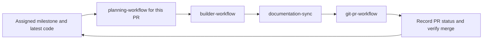

# Initiative workflow

Use [Milestones and delivery workflow](../../../docs/milestones/README.md) as the standing agreement. Milestones coordinate outcomes; PR plans describe execution. Do not ask the user to restate the process or create a second orchestration system.



Repeat **P → B → D → G** for each PR, refreshing the code and dependency state first. A phase inside a PR plan is an implementation step; it is not automatically another PR or a product milestone. Existing explicitly scoped multi-PR plans remain usable, but their next slice must be revalidated before execution.

## Step 1 — Read milestone and product context

Read the assigned milestone and linked product references. Product discussion is not a required repeated brainstorming step. Reuse approved behavior and mathematics; ask only for material unresolved decisions. Update the proposed PR breakdown when current code justifies it, preserving agreed outcomes and recording the reason.

## Step 2 — planning-workflow for the assigned PR

Produce `.cursor/plans/<slug>.plan.md` grounded in current code, with the milestone link, PR outcome, dependencies, code/config surfaces, verification and documentation impact. Simple low-impact tasks may use a concise task plan. No mandatory new agent per PR; agent reuse and delegation follow the milestone agreement and active authorization.

Proceed within existing execution authorization. A new scope or unapproved product change needs resolution; routine implementation details do not require another permission round.

## Step 3 — builder-workflow (assigned PR)

**When:** Execution is authorized; execute the assigned PR plan. Its internal phases are implementation steps, not separate PRs.

**Scope:** **Code and config only** — no `docs/`, `AGENTS.md`, `README.md`, `.cursor/skills/` edits unless the plan labels a docs-only phase.

**Ends at:** Checkup PASS + code review critical fixes fixed. **Does not commit** (unless you explicitly ask).

**Your message (minimal):**

```text
@.cursor/plans/<slug>.plan.md
Use builder-workflow. Execute the assigned PR plan.
Do not edit documentation tiers; those are step 4.
```

**Do not attach:** rules bodies, full product spec, scout tables from prior runs.

## Step 4 — documentation-sync (assigned PR)

**When:** The assigned PR build is finished and its verification gate passed. Synchronize documentation before committing the PR slice.

**Not:** During scout/implement/checkup. **Not** interleaved with implementer slices.

**Input:** The assigned plan’s **Documentation before PR** section and current branch diff.

**Your message (minimal):**

```text
Build for the assigned PR is complete (checkup passed).
Use documentation-sync for paths listed in .cursor/plans/<slug>.plan.md "Documentation before PR".
```

## Step 5 — git-pr-workflow (assigned PR)

**When:** Code and docs for the assigned PR are verified; commit/push/PR creation is authorized.

**Prerequisite:** Step 4 finished (docs match code).

**Your message (minimal):**

```text
Use git-pr-workflow. Commit the assigned slice, push, open draft PR.
```

## Assigned PR checklist

```text
[ ] Assigned PR plan ready; execution authorized (.cursor/plans/….plan.md)
[ ] builder-workflow assigned PR — checkup PASS (code/config only)
[ ] documentation-sync — plan’s doc list updated
[ ] git-pr-workflow — commit, push, PR
[ ] Record PR link and actual state in the milestone
[ ] Confirm merge, refresh code and plan the next assigned PR
```

## Context budget (what to paste)

| Step | Paste |
|------|--------|
| Planning | Milestone path and assigned PR outcome |
| Builder | Plan path + assigned PR outcome + execute |
| Doc sync | Plan path + “assigned PR doc list” + build complete |
| Git/PR | Branch intent, draft vs ready, PR scope |

## Skill index

| Skill | Role |
|-------|------|
| [planning-workflow](../planning-workflow/SKILL.md) | Write plan |
| [builder-workflow](../builder-workflow/SKILL.md) | Execute the assigned slice; delegation only when authorized |
| [documentation-sync](../documentation-sync/SKILL.md) | Docs after build, before PR |
| [git-pr-workflow](../git-pr-workflow/SKILL.md) | Commit, push, PR |
