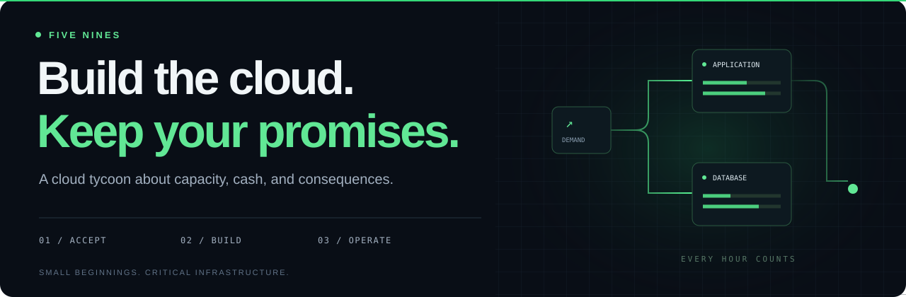
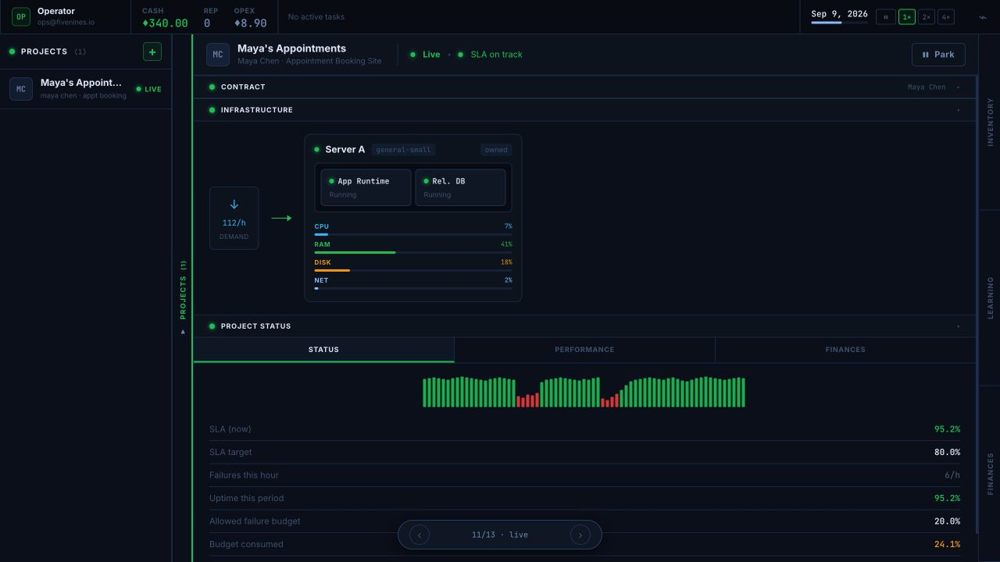
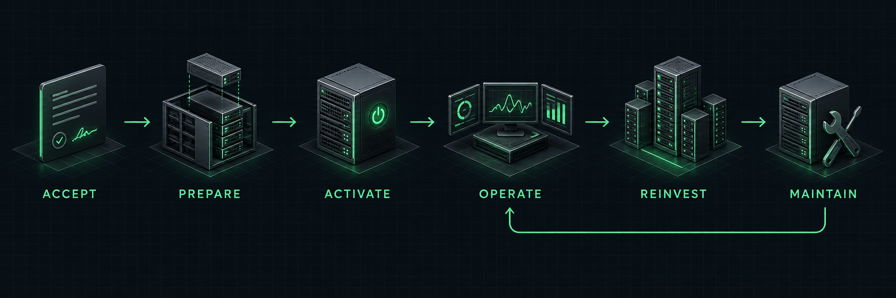
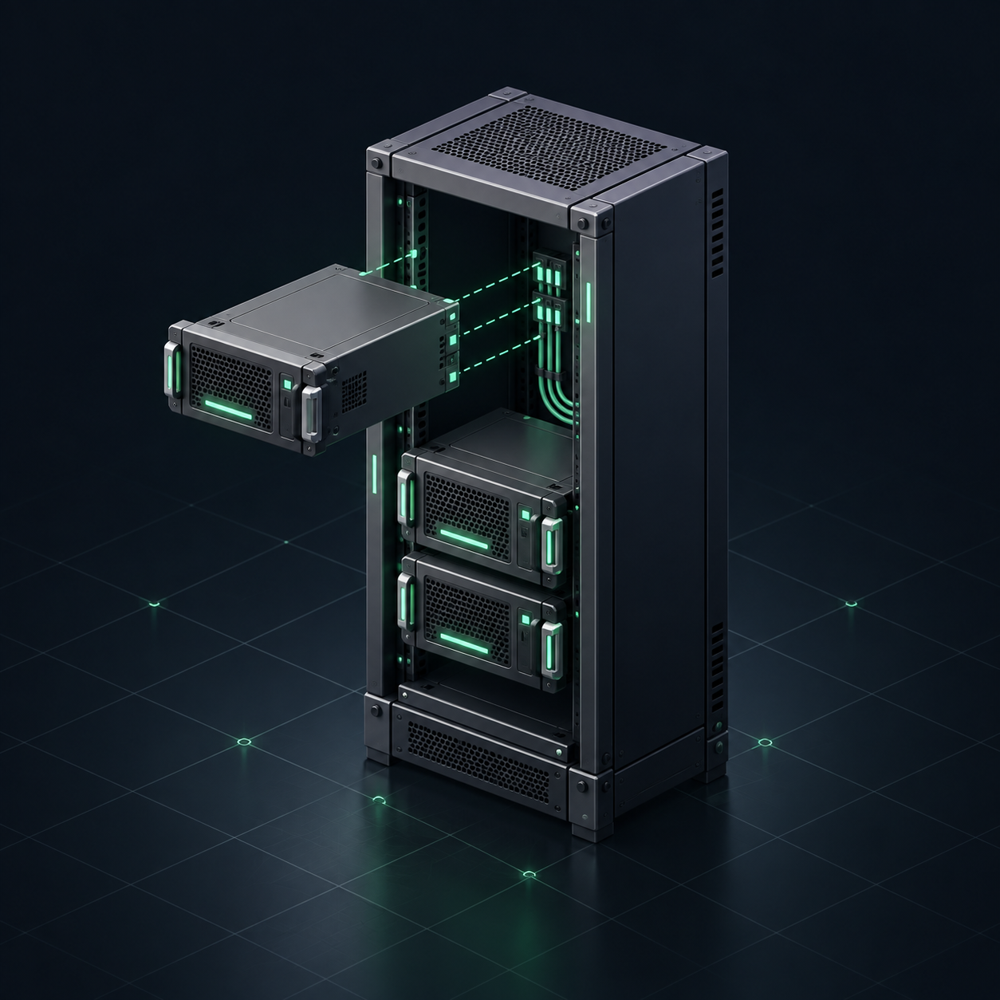
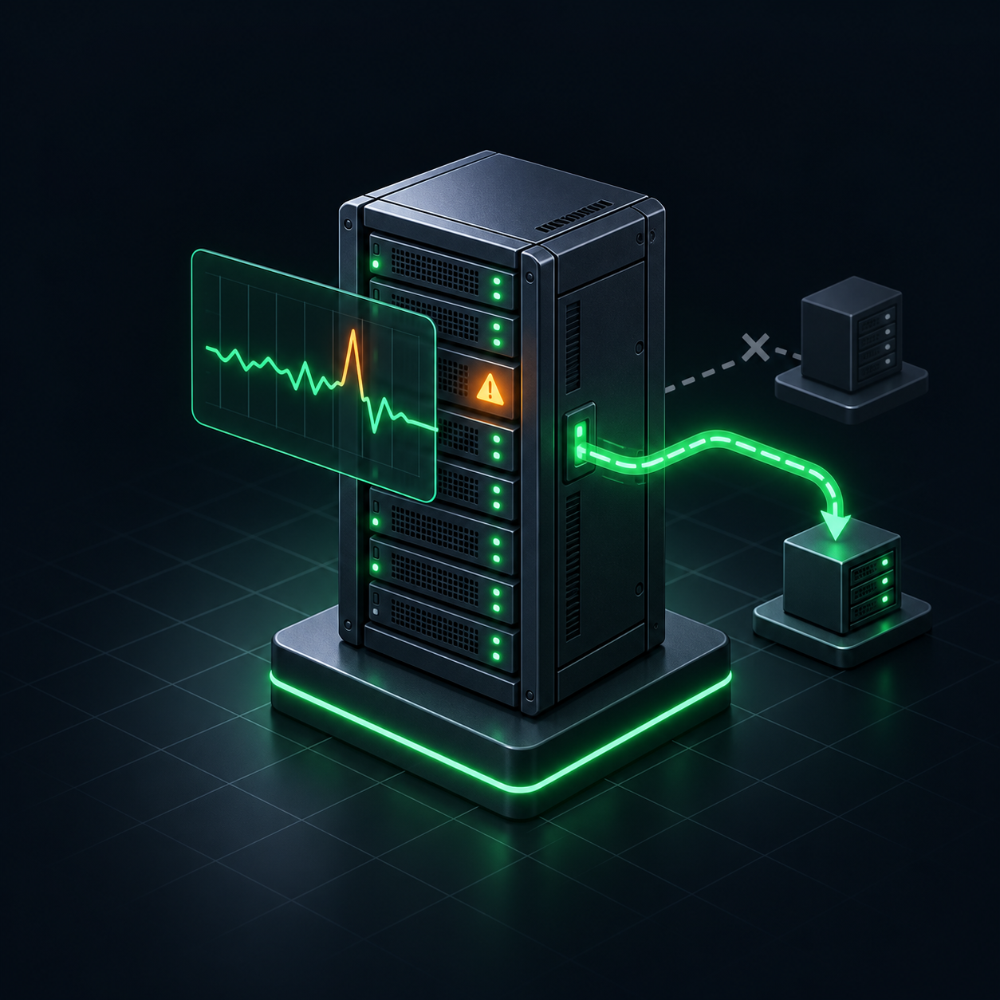

**A cloud tycoon where every promise needs infrastructure.**

[Explore the game](docs/product/introduction.md) · [Help build it](docs/help-build-it.md) · [Roadmap](docs/milestones/README.md)

Illustrative data; production implementation is in progress.

## Your next customer is counting on you

Start with a customer's trust and a small server. Take contracts, keep services running, and grow without letting costs or failures catch up with you.

## Player guide

Take contracts you can support, buy the capacity they need, and keep an eye on cash and service quality. Every simulated hour tests your choices; turning down work can be as important as winning it.

[How to play](https://github.com/movahedan/fivenines/wiki/Opening-Shift) · [About the game](https://github.com/movahedan/fivenines/wiki/Product) · [Player wiki](https://github.com/movahedan/fivenines/wiki)

<table>
<tr>
<td width="33%" align="center" valign="top">

 <strong>Build with intent</strong>
 Choose capacity. Connect services.
</td>
<td width="33%" align="center" valign="top">

 <strong>Operate under pressure</strong>
 Find the fault. Keep your promise.
</td>
<td width="33%" align="center" valign="top">

 <strong>Grow into the responsibility</strong>
 Learn more. Take on bigger work.
</td>
</tr>
</table>

---

**Build something people can depend on.**  
Source-available under [PolyForm Noncommercial 1.0.0](LICENSE).
