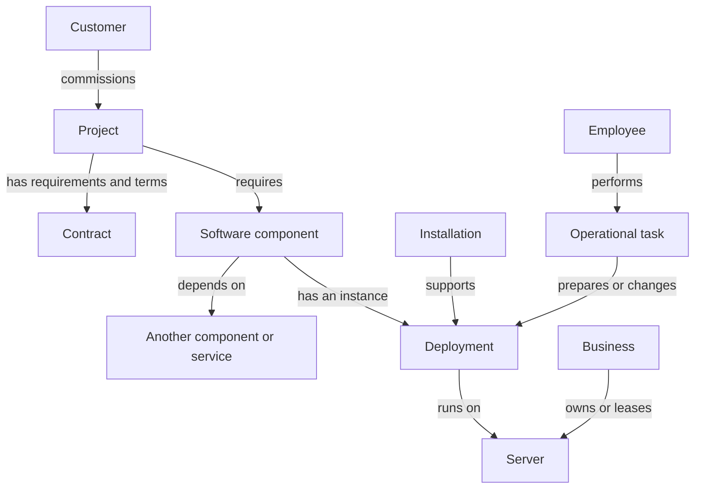

# Five Nines — Product documentation

Source: local main at 86b08175183fce67bda05f66fe670a6c9a7abaaf.

This bundle contains Markdown documents only; baseline.json is excluded. File links refer to source paths; use the matching File heading within this bundle.

<!-- Source: docs/product/introduction.md -->

# File: introduction.md

# Introduction

## The premise

Five Nines is a management game in which the player starts an infrastructure and operations business. The first customers are relatives and acquaintances willing to entrust the player with small, forgiving projects. By delivering useful service, the player earns money, builds a reputation, and gains access to more demanding work.

The player prepares systems, chooses where software runs, manages operating costs, and responds when infrastructure fails. Growth brings a broader range of workloads and, eventually, staff and automation. The long-term appeal is learning to run a business that can take on greater responsibility without collapsing under its costs or operational workload.

## What the player owns

The player is responsible for the infrastructure and operational service supplied to customers. Customers remain responsible for their products and business outcomes. A retailer owns its sales strategy; a research team owns the usefulness of its results; a model developer owns model quality.

Reliable infrastructure can remove a bottleneck or avoid losing an opportunity. It does not directly manufacture sales, improve a model's accuracy, or guarantee customer growth. Customer growth can create new infrastructure demand, giving the player an opportunity to expand a contract.

## The experience

The game should make operational decisions understandable through consequences. Sharing a server saves money but couples projects to the same resource limits and hardware failures. Renting can supply temporary capacity without a large purchase. Monitoring helps the player discover a problem earlier; it does not prevent the underlying fault merely by being installed.

Preparing a system is part of play. Accepting a contract should create work to perform, rather than instantly creating a functioning service. Configuration should capture useful decisions and effort without requiring players to type real connection strings or reproduce production administration procedures.

The tone can be playful, especially in early customer interactions, while the systems remain consistent. A relative's low-pressure project is a real project with forgiving requirements, not a separate set of fake rules.

## Scope beyond websites

The intended business can serve online applications, AI workloads, computational jobs, DNS, and email. These examples establish the breadth of the product; they are not a promise to implement every service at once.

Different workloads should make different infrastructure choices valuable. Hardware progression should offer useful specializations rather than make the most expensive server the answer to every project. The delegated hardware and demand catalogs define the authored baseline; implementation and playtesting remain required.

## Platforms

Web is the current delivery platform, with native mobile development intended to follow. The repository already invests in React Native UI components. New interaction designs, particularly infrastructure diagrams and charts, must account for touch interaction and native rendering from the outset.

The product needs readable infrastructure and clear feedback. The agreed infrastructure canvas is freely editable without changing simulation behavior; its rendering library and exact connection gestures remain technical/deferred choices. Spline has been set aside.

---

<!-- Source: docs/product/interface-design-brief.md -->

# File: interface-design-brief.md

# Interface design brief

Status: consolidated design direction, 2026-09-09. Navigation, shared drawers, project workspace behavior, and delegated interaction hierarchy are settled for design handoff. Fine visual treatments remain designer choices within these constraints. This document does not replace gameplay rules or claim runtime completion.

## Design objective

Make running an infrastructure business tangible: accept a customer's contract, assemble and prepare their system, observe demand, improve reliability, and understand the commercial consequences. The project infrastructure is the main play surface. Customers own their applications and business outcomes.

Preserve the existing dark operations-console identity while making the system itself visually engaging. Servers, installed software, visible preparation progress, customer reactions, and changing traffic provide the game character. Spline is set aside. Physical facility construction, rack space, cooling layouts, and cable installation are not implied by rack-shaped server artwork.

## Evidence and inspiration

Research used official descriptions and published visual material, not hands-on playtesting. The takeaways are design interpretations, not claims that another game implements Five Nines rules.

| Reference | Relevant observation | Proposed application |
|---|---|---|
| [Startup Company](https://store.steampowered.com/app/606800/Startup_Company/) | A software-business simulation with website features, employees, and hosting growth; its store gallery presents the business spatially | Make operational growth visible. Borrow contextual management, while retaining our customer's ownership of the application |
| [Software Inc.](https://store.steampowered.com/app/362620/Software_Inc/) | Software-company management with organizational growth | A secondary reference for future employee and business-management screens; employee mechanics remain deferred |
| [Factorio statistics GUI](https://direct.factorio.com/blog/post/fff-337) | Published screenshots combine production/consumption graphs, time ranges, summaries, and searchable breakdowns | Pair demand with completed work, then explain the bottleneck. Share the time range and search scope across related information |
| [Mini Motorways](https://dinopoloclub.com/games/mini-motorways/) | A readable growing road network; available on touch devices as well as desktop/console | Strong silhouettes and clear connections. Use restrained aggregate traffic animation, without simulating a visible particle for every request |
| [InfraSpace](https://store.steampowered.com/app/1511460/InfraSpace/) | Production depends on transportation and connected supply chains | Make dependencies and downstream effects inspectable. Do not import its individual-vehicle simulation into the aggregate demand engine |
| [COLD AISLE: Data Center Tycoon](https://store.steampowered.com/app/5036820) | Official listing describes servers, GPUs, capacity, SLAs, and customers; the inspected listing says Coming Soon | A close thematic reference, not a validated usability benchmark. Its first-person facility operations and proprietary AI products are outside our agreed scope |

## Current interface assessment

Inspected the worktree's `apps/web/src/hub/hub-session.tsx`, shared server-card source, and theme tokens. Visually inspected the running Storybook server card. The running `/hub` redirected to sign-in; an authenticated end-to-end session was not inspected. The running Storybook includes variants beyond this worktree's server-card implementation, so runtime and worktree are not assumed identical.

The source hub places Incoming, Active, Fleet, and Market together beneath a HUD, with a bounded event log. Its fixed minimum desktop width does not define the future mobile layout. Existing server cards already provide compact resource bars and a recognizable dark navy/green identity. Preserve this visual continuity, but introduce project workspaces and responsive navigation.

Existing example labels such as `1000 cores` must not become authoritative hardware specifications. Some secondary text is visually subdued; test readability at actual mobile size before carrying its treatment forward. Existing direct assignment, jail, and Opening Shift behavior must not be copied into the new product design.

## Established product constraints

- All interface copy, component names, and handoff documentation are English. Use familiar terms: Projects, Inventory, Technologies, Courses, Finances, Activity.
- Gameplay requires login. The current browser engine is a development arrangement; the intended authority is the server, delivering state through SSE.
- A project opens onto its infrastructure. Desktop keeps Status, Performance, and Finances in a right-side tabbed panel. Mobile uses separate project views. Component details use the desktop panel or a mobile bottom sheet.
- Each server has a rack-shaped visual container with the current project's software inside and a brief resource summary underneath. Shared hardware retains one identity, capacity budget, and cost across project views.
- Inventory is an alternative way to manage those same assets. Routine acquisition and placement can be completed inside a project.
- Basic server state and compact consumption remain visible. Detailed monitoring, error history, diagnosis, and alerts depend on installed, operating coverage. Missing observations remain missing.
- Never generate a special alert announcing that Monitoring itself is down. A down server remains visibly red; the player notices unavailable monitoring through ordinary status and history views.
- Contracts must be visibly contractual before acceptance, with important terms bold. Acceptance collects the advance; service activation follows preparation. Do not imply that acceptance immediately starts live service.
- Resource shares and healthy routing follow engine policy. Do not add priority sliders, routing algorithms, retries, or subtick controls.
- Keep exact economy values and technology dependencies in the balance/catalog sources. UI examples are not an alternative policy catalog.

## Agreed navigation and persistent context

Use Projects as the default destination. Desktop navigation: Projects, Inventory, Learning, Finances. Learning contains Technologies and Courses; Finances here is the business-wide view, distinct from project finances. Activity opens a shared feed from the shell. Settings and account stay secondary. Employee navigation is deferred with its feature.

On mobile, use a tab view with bottom navigation ordered Projects, Inventory, a prominent central New project action, Learning, and Finances. On desktop, the four destinations use collapsible and expandable folder-like rail panels with vertically labeled tabs. Keep a top status bar on both devices. The New project action opens available offers; it does not generate a new offer or accept a contract immediately.

Keep Operations progress floating on the left of the active content and Learning progress on the right. Operations includes installation, configuration, repair, migration, and automated replacement; Learning represents the two shared technology/course slots. Use compact collapsible indicators so these groups do not obscure the system or compete with the project inspector. Activity remains the event history rather than a permanent stack of event cards.

A project header means the compact identity strip within an already opened project workspace: project/customer name, service state, and access to its existing contract. It is not the offer-selection surface, a separate navigation step, or a substitute for full pre-acceptance details. Its exact visual treatment is a designer choice; no additional navigation step is required.

## Shared bottom drawers and offer review

New project opens an available-project list in a bottom drawer on both mobile and desktop. Selecting an offer reveals its full details within that drawer, including customer context, workload/features, requirements, and all contract terms. Provide a back action to the offer list that preserves its scroll position. Acceptance is an explicit action after review, with important contractual terms bold; the drawer provides the contractual modal surface without requiring another stacked modal. On acceptance, receive the advance and enter the project's setup workspace.

Bottom-drawer flows use the same content hierarchy and up/down interaction semantics on both devices; do not replace the desktop version with a centered dialog or side drawer. Dimensions may adapt to available space. Keep existing contextual desktop inspectors where already specified; this rule aligns flows that use bottom drawers rather than moving every panel into one.

Horizontal and vertical scrolling retain the same meaning across devices. Mobile bottom tabs and desktop rail panels are the primary navigation distinction. Proposed gesture detail: drag the drawer handle to expand/collapse, scroll its body to read, and provide visible close/back controls plus keyboard access. Scrolling contract text must not accidentally dismiss the drawer, and gestures must never accept a contract. Exact snap positions and gesture thresholds remain implementation details.

Keep cash, business reputation, game time, and pause/speed reachable in the shell. Receivables, liabilities, relationship details, and all resource totals need not be permanent HUD counters. Show operational preparation separately from the two shared learning slots. A compact task indicator opens the work queue; it is not another full-time panel.

## Required screen coverage

| Surface | Main content | Main action or transition |
|---|---|---|
| Projects | Customer identity, project/workload type, state, required SLA, short trend, and an actionable status summary | Open project; view available offers |
| Offers | A small reputation-appropriate selection with customer context, features, required technologies, and commercial summary | Review contract |
| Contract review | Bold advance, recurring/usage terms, setup cancellation/refund consequences, service obligations, and compensation | Accept contract and receive advance |
| Project setup | The same infrastructure canvas used after launch, with a contextual requirements checklist and preparation progress | Acquire capacity, install/configure required services, then Start service |
| Live infrastructure | Rack containers, project software, routing, selected component inspector, and concise resource/status cues | Inspect, configure, duplicate project deployment, migrate, repair, or manage capacity |
| Inventory | Owned/leased assets, region, condition, occupancy, current costs, and affected projects | Inspect asset; acquire, power off, repair, sell, or release where applicable |
| Technologies | Searchable families, prerequisites, unlocked project features, and research status | Learn a technology or inspect what blocks it |
| Courses | Five recognizable skill families, completed levels, effects, tuition, and duration | Enroll within the shared two-slot limit |
| Business finances | Cash history, receivables/payables, costs, upcoming collections/payments, and project contributions | Understand obligations and reach their project or asset |
| Activity | Grouped customer, operational, financial, and research events | Open the affected project/component or related record |

The first project should feel personal: an acquaintance's simple appointment-booking site, with an application and database. Later examples should visibly differ: email hosting, GPU inference, computational work, and a video-enabled application. Do not dress every workload as a website or show an endless marketplace at the beginning.

## Infrastructure presentation

Propose a left-to-right flow for an initial auto-layout: incoming demand, routing where installed, then application/worker and data dependencies. Server containers establish placement; arrows establish relationships. Freely moving a container changes presentation, not capacity or latency.

At normal zoom, show each software instance as a distinct labeled module. Supporting capabilities can use compact modules or indicators that reveal coverage on selection. At distant zoom, collapse details into server name, condition, and a compact utilization cue. Re-expand when selected or zoomed in. Selection highlights related links; do not draw every monitoring-coverage line permanently over every traffic connection.

Distinguish traffic, data dependencies, and monitoring coverage with labels and line treatment as well as color. Edge animation represents aggregate flow, not individually simulated requests. Only show diagnostic bottleneck information the player is entitled to observe. A physically running server can host a failed or unconfigured service; one green server lamp must not imply project health.

For shared hardware, show total use and an indication of other hosted projects. Rich project breakdowns follow monitoring availability. Power-off, sale, or lease release must expose affected projects before the action. Duplicate operations copy only the selected project's deployment, even when the server hosts other projects.

Component selection replaces the right panel with name, state, host, configuration, work progress, and contextual actions. Preserve an explicit return to project information. Use one clear primary action for the current state; group less frequent lifecycle actions separately. Explain unavailable actions inline rather than relying on hover.

Exact connection gestures remain deferred. Show compatible endpoints and connection outcomes in designs without committing the product to dragging or Connect-and-select. Provide a touch- and keyboard-accessible path in the eventual interaction design.

## Status, performance, and money

| Project view | Suggested hierarchy |
|---|---|
| Status | Current service state; demand and completed-work trend; relevant waiting/failure summaries; observed resource pressure and incidents |
| Performance | Selected billing period, contract target versus actual outcome, trend, and short factual explanations of losses or improvements |
| Finances | Cash received, earned amounts, receivables/payables, operating costs, compensation/refunds, then the transaction breakdown and trend |

Use sparklines in project rows and larger line charts in detail. Propose Current period / Previous period / Two periods ago as shared historical selectors. Label units by workload: requests, jobs, or the appropriate workload measure; do not sum incompatible units into one throughput line. Include chart legends, accessible textual summaries, and selected-point details on both touch and pointer devices.

Use gaps for missing monitoring samples, not zero values or invented interpolation. Distinguish unavailable monitoring data from an actual service outage. Monitoring-derived diagnostics and contractual/accounting records are different information sources. Do not lock financial facts behind a monitoring upgrade.

Clearly label actual transfers versus estimates and accrued obligations. Upfront cash is not proof that the whole contract has been earned. Show customer-attributed operational failures as failures even when exempt from player compensation.

## Visual system and mobile behavior

Preserve navy surfaces, restrained green accents, and familiar resource bars. Use readable sans-serif text for customers, explanations, and contracts; reserve monospaced typography for metrics, identifiers, and technical labels. Restrict glow to meaningful active/selected states. Use text and icons alongside red/amber/green status.

Propose generous touch targets around compact visual controls. Hover can enrich an interaction but cannot reveal its only explanation or action. Bottom sheets need a clear title, dismiss/return behavior, scrollable content, and accessible actions above safe areas. Charts should support tap-to-inspect without requiring a tiny hover target.

Use subtle server lamps, preparation progress, and restrained flow animation to make operation feel alive. Respect reduced motion. Do not animate the entire graph constantly, add cosmetic packet counts that contradict telemetry, or auto-fit the canvas on every incoming update.

## Figma Make handoff

Use the [Interaction specification](interaction-specification.md) for object/action ownership, state-dependent buttons, specialized capability sections, impact reviews, and required interaction frames. It supplies the delegated interaction hierarchy; do not invent controls from visual examples alone.

Read [Introduction](introduction.md), [Gameplay](gameplay.md), [Domain model](domain-model.md), and this brief first. Consult the [Technology catalog](technology-catalog.md) and [Balance baseline](balance/index.md) for dependency and example consistency. Current implementation and historical Cursor plans must not override intended behavior. Preserve the approved visual identity; preserve the agreed navigation and interaction structure; present visual refinements for review without adding game rules.

Produce linked desktop and mobile flows, reusable components and variants, and explicit empty, selected, unavailable, in-progress, failed, and recovered states. If the generated prototype uses a web stack, treat it as a design prototype; it does not settle production React Native graph/chart dependencies.

Design these connected scenarios:

1. First offer → contract review → accepted project → application/database preparation → explicit activation.
2. Healthy live project → rising demand → inspect observed pressure → add compatible capacity with visible cost and work progress.
3. Shared server failure affecting two projects → inspect affected deployments → recovery progress; automatic replacement follows researched/configured capabilities.
4. Monitoring unavailable → stale/missing detailed history, with ordinary server status and no dedicated monitoring-down alert.
5. Billing review → separate advance cash, earnings, usage receivable, costs, and any compensation.
6. Two learning slots occupied → inspect technology prerequisites or course benefits and see why another enrollment is unavailable.
7. Computational project → lost work → usable checkpoint recovery, or clear permanent failure when none exists. Do not offer retry.

Use one coherent fictional company and repeat the same project, server, and customer identities across screens. Include a shared server and a leased replacement so continuity is reviewable. Keep customer relationships distinguishable from overall business reputation. Do not invent new deadlines, negotiation controls, physical rack limits, or employee systems to fill a mockup.

Validate the linked flows against the interaction specification before judging visual polish. Product discussion is complete for this handoff; remaining questions should identify a concrete contradiction or implementation blocker, not reopen every button or service type.

---

<!-- Source: docs/product/interaction-specification.md -->

# File: interaction-specification.md

# Infrastructure interaction specification

Status: approved interface design, 2026-09-09. This specifies the agreed interaction hierarchy. Gameplay and balance documents remain authoritative for mechanics and costs. Catalog-only capabilities below are design coverage, not newly approved simulation mechanics.

## Selection, ownership, and presentation

Selecting an object highlights it and its relevant connections without moving or automatically fitting the canvas. Desktop selection opens the contextual right inspector; mobile selection opens its bottom sheet. Flows launched into a bottom drawer, including acquisition, target selection, and contract review, retain that bottom-drawer presentation on both devices. Returning preserves selection, canvas position, and list scroll.

Every inspector starts with object name, type, project where applicable, host, state, and scope. A server inspector lists all affected projects. A service inspector distinguishes shared project-service configuration from the selected instance's placement and runtime. Never let an instance's Configure button imply an instance-specific configuration override.

Use four levels of action presentation:

1. Canvas: selection, compact state, preparation progress, and contextual Add service. Do not place every lifecycle button on a rack.
2. Inspector primary action: at most one prominent action appropriate to the observed state. Healthy operation does not need an urgent action.
3. Visible groups: Configuration, Operations, and capability-specific sections such as Recovery or Targets. Use descriptive buttons, not an opaque overflow menu for essential operations.
4. Separated Removal section: uninstall, sell, or release with explicit impact review.

Configuration changes show their full service scope and become operational through the existing work policy. Opening a form has no simulation effect. Show current settings separately from pending changes; Apply configuration starts the required work rather than pretending the change is already active.

## Action states and feedback

| State | Presentation |
|---|---|
| Available | Action verb and applicable scope; show material cost and work before submission |
| Missing relevant technology | Locked action with named prerequisite and View technology link; show only relevant capabilities |
| Missing capacity or dependency | Disabled action with specific blocker and a route to the acquisition/configuration surface |
| Pending command | Pending feedback, no duplicate submission; do not show authoritative success before acceptance |
| Queued | Position/status in Operations and View task; no duplicate task button |
| Running | Progress and remaining work when known; no fabricated certainty for random recovery outcomes |
| Rejected or interrupted | Retain context, explain the actual reason, and offer only supported next actions |
| Completed | Refresh object state and record an appropriate Activity event; preserve navigation |

Do not silently drop commands when the authoritative state changes while a form is open. Revalidate target eligibility, cost, and affected objects before execution. Network pending/rejection states are interface requirements, not a specification of the deferred SSE protocol.

## Server actions

| Observed state/context | Primary action | Other actions | Scope and constraints |
|---|---|---|---|
| Healthy, powered on | Inspect hosted services | Add service, Power off; owned: Sell server; leased: Release server | Hardware actions affect all hosted projects; installation belongs to a selected project |
| Healthy, powered off | Power on | Inspect contents; ownership-appropriate removal | Power-on is immediate; software readiness is separate |
| Hardware failure | Repair server | Inspect impact; project-scoped recovery options; ownership-appropriate removal | Explicit repair cost and work; no repair starts merely because failover occurred |
| Repair queued/running | View task | Inspect affected projects | Prevent duplicate repairs; use existing task cancellation policy, not a special repair shortcut |
| Shared host viewed inside project | Inspect project services | View other hosted projects, Open in Inventory | Total hardware usage is shared; observed breakdown follows monitoring coverage |
| Owned asset removal | Review sale | Back | Show proceeds at 80% of purchase price when healthy, 60% for hardware damage; software/data/configuration faults do not discount hardware |
| Leased asset removal | Review release | Back | Show stopped deployments, data/work impact, and rental consequences; never label release as a sale |

Repair completion restarts formerly active installed services unless replaced elsewhere; formerly stopped services remain stopped. A replacement remains on its new host and an existing lease is not automatically released. Do not offer a whole-server duplication action in Inventory.

## Common service and instance actions

| Observed state/context | Primary action | Secondary actions | Scope and constraints |
|---|---|---|---|
| Required service absent | Add service | View requirements or technology | Select technology and compatible existing host, or acquire capacity |
| Installation/preparation pending | View task | Inspect requirements | Show queued/running status; do not expose a second Install command |
| Installed, configuration incomplete | Configure | View dependencies, Uninstall | Explain missing required inputs without requiring real credentials or networking expertise |
| Ready, stopped | Start | Configure, Move instance, Uninstall | Start is unavailable on failed/offline hardware or when required dependencies are absent |
| Running | Configure | Stop, Add instance, Move instance, capability actions, Uninstall | Configuration affects this logical service's instances; stop/move identifies the selected instance |
| Service failed, cause unknown | View status | View available observations and related host | No hidden-cause diagnosis or generic Fix everything button |
| Unknown cause with operating Monitoring coverage | View diagnosis | Inspect collected evidence and progress | Monitoring diagnosis consumes the authored work; it does not require a new manual Diagnose action; do not reveal attribution before completion |
| Diagnosed configuration incident | Repair configuration | View task and affected instances | Use the authored configuration-repair work and logical service scope; do not add a per-instance override |
| Diagnosed restartable software incident | Restart service | Prepare replacement where supported | Use the one-hour restart baseline and normal work policy; lost demand is not retried and lost job progress follows checkpoint rules |
| Recovery in progress | View task | Inspect source/destination and remaining blockers | Show recovery, not healthy service, until readiness is established |
| Instance replaced elsewhere | View replacement | Inspect old instance; supported cleanup | Do not auto-reactivate a duplicate or second primary |

Restart service is a response to supported restartable software incidents, not a universal repair for hardware or data loss. Automated Restart is the separate catalog capability that performs supported recovery automatically. Expose the relevant response without creating request retries.

Add instance chooses compatible capacity and prepares another runtime of the same service configuration. Move instance shows source, destination, preparation cost, and any data-transfer requirements; the source can continue serving during preparation. Duplicate deployment belongs to the current project and copies only its services/configuration on the selected source host. It uses accelerated preparation affected by skill, not instant hardware/data copying.

## Routing and load balancers

| Surface/state | Actions | Required explanation |
|---|---|---|
| Targets section | Add destination, Remove destination, Open destination | Show target identity, host, compatibility, and observed eligibility; additions may target another balancer |
| Connection rejected | Choose another destination | Explain incompatible endpoint or routing loop; do not create the invalid link |
| No usable destination | Configure destinations or inspect blocking target | Balancer health alone is not end-to-end project health |
| Health Checks section | Configure checks, View checked targets | Unchecked is distinct from healthy; a powered-on host can contain failed software |
| Running balancer | Common service operations | No algorithm selector, priority slider, manual traffic weights, or Retry failed requests |
| Balancer recovery | Existing technology-supported recovery workflow | Reuse ordinary health, placement, preparation, and leasing policies; no separate service-specific economy |

Removing a destination previews affected paths, especially the last serving path. Display only detected health: without operating checks, do not expose hidden software failures through routing badges. Health Checks can continue while Monitoring is unavailable and does not establish customer fault attribution.

## Specialized capability sections

These extend the common service inspector rather than creating unrelated menus for every technology.

| Family / catalog coverage | Additional surface or action | Guardrails |
|---|---|---|
| Relational and Analytics Databases | Dependencies and data state; configure standby; Promote standby; Restore when supported | Promotion requires a ready standby on a different server; one primary; empty storage is not recovered data |
| Database Replication, Automatic Failover | Primary/standby roles, Ready/Not ready state, automatic-failover configuration | No transaction-level replication controls or invented precise lag; explain resource and readiness requirements |
| Backup and Restore | Available recovery records, recovery point, Select destination, Review restore | Only completed usable records; show overwritten data and interrupted service; exact advanced recovery controls follow implemented policy |
| Checkpointing | Latest completed usable checkpoint, recovery progress; Resume from checkpoint | Manual resume preserves the original deadline; no checkpoint means lost running work fails permanently; no restart from zero |
| Monitoring | Coverage selection, observed metrics/errors, alert configuration | Coverage is project-scoped across hosts; unavailable samples are gaps, not zero; no special Monitoring down alert |
| Quality Checks | Coverage/effect and operating state | Separate prevention from diagnosis; no immediate Repair or stacking protection button |
| Container Orchestration, Autoscaling | Managed instances, replacement enablement, pending replacement, leasing status | Show technology/runtime requirements, costs, and credit blockers; automatic leasing uses existing policy and needs no approval per lease |
| Automated Restart | Supported-service policy and observed recovery state | Does not fix hardware/data loss or retry failed customer work |
| Message Queue, Event Streaming | Backlog, capacity, durability, dependencies | No manual per-request browser, reorder, retry, purge, or replay action implied by the catalog description |
| Application Runtime, Background Workers, Container Runtime | Common configuration, instance and placement actions | Shared service configuration; no per-instance resource priority controls |
| Job Scheduler, Batch Computing, Model Training | Work progress, deadline, worker dependencies, supported checkpoint recovery | Customer owns computational outcome; no fabricated retry or deadline extension |
| GPU Computing, Model Serving, Distributed Computing, Distributed GPU Training | Compatible hardware, dataset/model dependency, participating capacity | GPU compatibility is real eligibility; research does not supply hardware; no model-quality editor |
| In-memory Cache, Object Storage, Search Engine, Vector Search | Sources/destinations, capacity, observed data-processing state | Do not invent data deletion, cache flushing, or manual reindex mechanics merely to fill a panel |
| Email Delivery, Mailbox Hosting, Real-time Messaging | Required dependencies and project service configuration | Use abstract game configuration, not real customer credentials or outbound messages |
| Payment Gateway Integration | Integration readiness and project dependencies | No real payment/account setup; no detailed provider migration workflow |
| Media Transcoding, Video on Demand, Live Streaming, Real-time Audio and Video, Multiplayer Game Server | Input/storage/delivery dependencies and relevant workload state | Common lifecycle; no new game/content production editor |
| Authoritative DNS, Reverse Proxy, CDN, Private Networking | Compatible endpoints and dependency configuration | Do not introduce realistic zone/credential/certificate administration as required gameplay |
| Rate Limiting | Policy configuration and effects supported by the engine | Legitimate rejected demand remains contractual demand; no free protection |

For catalog-only capabilities with unsettled configuration fields, Figma should use the common inspector and an explicitly labeled capability concept. Do not invent production-ready forms or mechanics. Unspecified controls remain outside the approved design.

## Project and operational work

| Context | Actions and behavior |
|---|---|
| Offer drawer | Select offer → full details and bold contract terms → Accept contract. Back preserves the list. No immediate acceptance from the global plus button |
| Accepted, preparing | Requirements checklist links to the exact missing service/configuration; Start service only when ready |
| Live project | Inspect Infrastructure / Status / Performance / Finances, View contract, Notify customer of interruption |
| Planned or existing interruption | Preview project scope and send the game's customer notice; no estimated restoration-time field; notice does not waive compensation |
| Deployment duplication | Select source deployment for this project, destination capacity, review preparation/data work, confirm operation |
| Ended contract | View outcome and remaining resource costs; manage assets explicitly rather than assuming cancellation removes them |
| Operational queue | View task, source/target, project, progress and blockers; Cancel where supported by the work policy, preserving preparation progress |
| Learning slots | View technology/course, tuition and progress; cancellation/resumption follows paid coverage and preserved progress rules |

Do not add operational priority controls through a task list. Keep Operations left and Learning right in the active page; customer/financial events go to Activity. A click on an event opens the relevant object or retained record without changing simulation state.

## Impact reviews and removal

Use bottom-drawer reviews consistently on both devices. Include action verb, exact target, affected projects/services, immediate cost/proceeds, continuing costs, and applicable loss of volatile work or persistent data. Offer a neutral Back and a specifically named final action. Require review for power-off, destructive removal, destination removal that disrupts service, and restore/promotion with material impact. Ordinary selection and opening configuration do not require confirmation.

Never fabricate a precise financial penalty before its outcome is known. State that missed service remains subject to the contract and distinguish projected amounts from settled liability. Highlight known data/work loss; do not promise that uninstall, sale, or lease release retains data unless the data lifecycle actually guarantees it.

An unsupported or unsafe transition is blocked with a reason rather than implemented as a destructive shortcut. For example, moving a database needs a valid data path, and an unready standby cannot be promoted. Acquisition selection shows owned/leased status, compatible capacity and recurring cost; auto-leasing remains an already enabled automation action, reported through Activity.

## Figma deliverables and acceptance checks

Create reusable Server inspector, Service inspector, Target list, Recovery record selector, Acquisition drawer, Impact review, Task progress, and Action state components. Include desktop and mobile variants with the same semantics and explicit return behavior.

Required frames cover: healthy/shared/offline/failed/repairing server; incomplete/stopped/running/failed/preparing service; balancer with valid, unchecked, unhealthy and absent targets; ready/unready standby; usable/missing backup or checkpoint; unavailable monitoring history; blocked and successful automatic leasing; and removal affecting multiple projects. Show pending/rejected commands and disabled actions with reasons.

Verify these journeys across linked frames:

- Install and configure the first application's database, then activate the project.
- Power off a shared server with visible cross-project impact and continuing lease cost where applicable.
- Repair failed hardware while replacements remain elsewhere, without accidental duplicate activation.
- Add an instance and connect it to a balancer only when eligible; reject a routing loop.
- Promote a ready standby or select a usable restore point; block invalid recovery.
- Resume lost computation from a checkpoint with its original deadline; show permanent failure otherwise.
- Inspect monitoring gaps without revealing hidden causes or sending a monitoring-outage warning.
- Duplicate only the selected project's deployment and retain source service during migration preparation.

These checks validate interaction coverage, not engine correctness. No runtime implementation or production graph/chart library selection is authorized by mockup completion.

Release filtering applies to all capability inspectors: expansion technologies in the [catalog scope](technology-catalog.md#version-one-scope) do not require version-one controls or Figma delivery frames. Removed technologies have no separate action panels.

---

<!-- Source: docs/product/figma-make-handoff.md -->

# File: figma-make-handoff.md

# Figma Make handoff

Status: ready for design generation and review. Product direction is settled for this handoff; runtime implementation and visual usability validation remain separate work.

## Prompt to use with the attached product documents

Design Five Nines, a game about running an infrastructure operations business for customers. Create a coherent, interactive desktop and mobile prototype using the attached product reference. Preserve its existing dark navy and restrained green console identity, with readable human-facing text and monospaced metrics. Use English throughout. The infrastructure system is the main play surface, with rack-shaped server containers and the current project's installed software inside them. These shapes do not introduce physical rack-space mechanics.

Read `index.md`, `introduction.md`, `interface-design-brief.md`, and `interaction-specification.md` first. Read `gameplay.md` and `domain-model.md` to resolve behavior and ownership. Use the technology and balance documents for consistent requirements, costs and progression. `baseline.json` owns numeric defaults; do not invent a competing catalog. `open-questions.md` identifies engineering/deferred work, not missing permission to design approved screens. Historical Cursor plans and current prototype mechanics are not product authority.

Use mobile bottom navigation ordered Projects, Inventory, a prominent central New project action, Learning, Finances. On desktop, use expandable/collapsible folder-like rail panels with vertically labeled tabs. Keep an important-status top bar on both. Operations progress floats compactly on the left of active content; the two shared Learning slots float on the right. Keep Activity reachable without covering the canvas in permanent alert cards.

New project opens a bottom drawer containing available offers on both devices. Select an offer to see complete details and bold contractual terms in the same drawer; return to the list without losing position. Only explicit acceptance collects the advance and creates setup work. Bottom-drawer flows keep matching directional and scrolling semantics on desktop and mobile, with visible back/close controls. They are not centered desktop modals.

Inside a project, desktop keeps Status, Performance and Finances in the right panel beside infrastructure. Selecting an object opens its inspector there; mobile uses a bottom sheet. Use the interaction specification's object ownership, state-dependent primary actions, configuration/operations/removal groups, blocked-action reasons and impact reviews. Server actions can affect several projects. Service configuration is shared across that service's instances; health and placement are instance-specific. Never duplicate unrelated projects sharing a server.

Produce a linked prototype with reusable components, meaningful example data, and explicit empty, healthy, preparing, failed, recovering, unavailable, pending and rejected states. Pair desktop and mobile frames for the same situation. Do not spend the entire output on one healthy dashboard. Include a component/state overview so implementation can follow the hierarchy.

The game requires login. An illustrative login screen may connect to the mock scenario, without implementing real credentials, billing, servers or external services. Generated web code is a design prototype; production components must preserve the React Native path. Do not choose a DOM-only graph/chart dependency as an architectural requirement.

## Deliverable map

| Deliverable | Required contents |
|---|---|
| Shell | Mobile tabs/action button, desktop rail folders, top bar, Operations and Learning groups, Activity access |
| Acquisition flow | Offer list, full details, contract review, acceptance, empty/expired/unaffordable states |
| Project workspace | Setup requirements, ready activation, healthy system, degraded system, recovery, ended contract |
| Object inspectors | Server, logical service/instance distinction, routing targets, data recovery, monitoring coverage, task progress |
| Inventory | Owned and leased hardware, shared occupancy, power, repair, sale/release impact |
| Learning | Technologies and Courses, prerequisite inspection, two occupied slots, paused/resumable study and tuition explanation |
| Reports | Status, performance and project finances; separate business finances; sparklines and detailed historical views |
| Feedback | Activity groups, detected versus unknown cause, missing observations, pending/rejected actions and accessible explanations |

## Coherent scenario data

Use the same fictional identities across all screens. Names here are presentation fixtures, not new catalog entries or mechanics.

| Identity | Role |
|---|---|
| Northstar Operations | Player business |
| Maya / Maya's Appointments | First acquaintance customer / appointment-site project |
| Harbor Mail / Team Mailboxes | Later customer / mailbox-hosting project |
| Atlas Research / Training Run | Computational customer / finite training project |
| Server A | Shared hardware hosting components for two projects in the later-state scenario |
| Server B | Separate compatible recovery capacity |
| Server C | Automatically leased replacement in the later-state scenario |

Show first-project and later-business scenarios as separate moments, not simultaneous starting assets. Hardware specifications and project prices must come from compatible baseline entries. The appointment project starts with Application Runtime and Relational Database, no extra research or payment/email feature requirement. Do not label it PostgreSQL unless a concrete software brand is deliberately introduced; the authored catalog uses Relational Database.

For finance illustrations, keep cash, receivables, earnings and projections separately labeled and arithmetically consistent. Example: an 80-unit weekly advance creates 80 units of cash received; halfway through the service period, 40 units of fixed fee are earned and 40 remain unearned, before any separate costs or compensation. Do not treat the whole advance as profit. Use fictional game currency rather than real transaction forms.

## Required connected flows

1. Offer → full contract → accept → prepare application and database → Start service.
2. Healthy project → observed capacity pressure → acquire/select compatible hardware → Add instance → preparation → eligible routing destination.
3. Shared-server hardware failure → impact across projects → repair work → repaired original, with replaced instances remaining elsewhere.
4. Database failure → ready standby promotion, or usable backup restore; show why an unready standby cannot be promoted.
5. Lost computation → Resume from checkpoint with the original deadline; no usable checkpoint → permanent failure.
6. Monitoring unavailable → old data and gaps, ordinary server state, no dedicated monitoring-outage notification.
7. Review performance → explain compensation → reconcile actual cash and receivables with project finances.
8. Learn technology/course → two slots occupied → paused/resumed learning with explicit monthly tuition status.
9. Review server sale/release → named affected projects and data/work loss → specific final action.

## Review checklist

- Can the player identify the selected object and scope before pressing a button?
- Does each destructive action explain affected projects and ongoing costs?
- Are full offer details accessible before acceptance, on both device layouts?
- Do drawers scroll without accidental dismissal and provide non-gesture controls?
- Do unavailable actions explain a real blocker instead of silently failing?
- Is server health distinct from service readiness and project performance?
- Are charts truthful about missing monitoring, estimated latency and zero demand?
- Are learning progress and operational work separate from demand queues?
- Do shared servers retain identity, capacity and cost across screens?
- Does keyboard/touch access work without hover-only actions or color-only status?
- Are mobile text, targets and sheets usable without overlapping navigation and floating cards?

No guest gameplay, permanent jail, Opening Shift ending, manual routing weights, per-request retry, internal subticks, physical facility construction, or new employee/away-time features. Do not display omniscient incident causes or promise recovery of data never backed up. Fine geometry, spacing and artwork are design choices; approved rules and ownership are not.

---

<!-- Source: docs/product/balance/contracts-and-time.md -->

# File: balance/contracts-and-time.md

# Contract accounting, operations, and time

## Clock

Retain one simulated hour per outer tick. Default wall cadence is one tick per five seconds; speed options are pause, 1×, 2×, and 4×. Speed changes only wall cadence, never work budgets or demand distribution per simulated hour. One week is 168 ticks. There are no subticks or millisecond event loops. Sub-hour latency values, if shown, are aggregate estimates, not event timestamps. No strict real-time deadline accuracy is promised by this model.

Demand types with no carry allowance are resolved within their arrival tick. Work completion can advance through multiple components using aggregate budgets; the unresolved solver must conserve every server resource and cannot use iteration order as priority. This document does not claim that solver is implemented.

## Operations

Install/configuration durations are listed per technology. Base application install 2h + database install 2h + connection 1h = first-project preparation 5h. Selecting hardware, editing layout, accepting a contract, and power-on are immediate. Initial completed installation is ready without an additional service-start task. Restarting stopped software costs 1h of operational work. Technology learning and courses use two shared learning slots, separate from the single operational work queue. Cancelling preserves completed task progress.

Repair baseline is 3h and replacement parts cost 2% of server purchase price, charged once on start; failure attribution and repair lifecycle follow Gameplay; engine integration remains required. Move/transfer: one hour of preparation plus ceil(dataMiB / (3600 × effectiveMiBps)) execution hours, at least one transfer hour for nonempty data. Effective rate is the minimum of configured 20 MiB/s, source/destination available disk rates, and available network rate. Contention can extend completion; shown duration is an estimate. Reserve work through the same resource allocator. Backup/restore has the same transfer model and a 1h setup. Default backup interval is 24h with three retained copies, constrained by available storage. No backup retry is added. Migration of software and transfer of data remain distinct operations.

## Service accounting

The first-project five-hour setup is a preset: two installs and one shared connection/configuration task. Do not add each technology's general configuration default again to that preset. Those defaults apply to separately required configuration work; they are not additional mandatory steps in the opening flow.

Each project's first 168-hour period starts on explicit activation. Fixed fee is already paid at acceptance, with no second charge at activation. Usage fees count only successful, on-time external root units. Internal operations and retries never generate billable units. Store integer counts and exact fractional currency accrual, settling to cents while retaining remainder; never round per request. Daily collection follows global multiples of 24 simulation hours, independently of project weekly boundaries.

Freeze root demand weights and terms at acceptance. Baseline SLA uses equal weight per external root unit within a project, including media service units; do not compare its absolute request count to another project's SLA. Optional child work is observable but not another root denominator. All required root features remain subject to the contract; additional per-feature contractual floors are not silently introduced. Track success/failure against the root's arrival period. Unresolved queued roots appear as pending, not successes. At weekly close, classify unresolved roots as missed for that period; they may continue if their demand rules permit, but cannot rewrite a closed SLA period. Later successful delivery may earn usage in its delivery period without erasing the earlier miss.

Use rational counters for eligibility and exact cross-multiplication for compensation thresholds, avoiding integer percent rounding before deciding a band. Display at most five decimal percentage places for high-tier SLA. No demanded roots means N/A, not 100%; no-demand alone earns no quality credit. All demanded roots failing is complete failure and receives the full service-charge refund. Normal ratio bands remain: within allowance 0%; >1–2× 10%; >2–5× 25%; >5–10× 50%; >10× 100%. No target of exactly 100% is offered.

At a normal period close, the refund base is fixed fee plus actual billable usage in that period. A termination closes the period first, returning unearned prepaid fixed time, then applies quality compensation to elapsed fixed time plus billable usage. All computations use unrounded amounts until the final cent amount. Cap the combined refund to the charged amount. Net uncollected receivables against credits before moving remaining cash or debt; issue no duplicate full cash refund against an already cancelled receivable. Keep gross charges, credits, receivable adjustment, and cash movement separately visible.

At a boundary shared by close and renewal: finish old-period processing and settlement, apply any departure, then renew only a still-active contract. This prevents charging a new advance to a customer who just left. Player commands accepted between ticks cannot rewrite earlier closed accounting.

## Finite jobs

| Job demand | Advance fee | Deadline after activation h | Reference lateness h |
|---|---|---|---|
| analytics-job | 100 | 12 | 3.0 |
| transcode-job | 180 | 16 | 4.0 |
| batch-job | 240 | 24 | 6.0 |
| training-job | 400 | 24 | 6.0 |
| distributed-training-job | 1600 | 48 | 12.0 |

Set reference lateness to 25% of quoted execution duration, minimum 1h. Terms are frozen at acceptance. No weekly fixed fee or usage fee applies to these finite templates. Existing delivery bands apply: on-time 0%, any positive delay through 2 intervals 10%, >2–5 intervals 25%, >5–10 intervals 50%, >10 intervals full refund and termination. At a boundary where completion and full-refund cutoff coincide, evaluate the exact lateness band first; beyond ten intervals the full-refund termination wins. At exactly ten intervals the 50% band still applies. Refund once for abandonment or customer cancellation. Lateness costs do not introduce retries.

## Setup and relationship scope

Setup allowances for continuous templates are in the project table; finite templates use 48h. They are distinct from job execution deadlines. Numeric trust/reputation/hatred coefficients, offer progression, and dissatisfaction thresholds are specified in [Customers and offers](customers-and-offers.md). No new random cancellation draw is introduced.

Later incident-attribution decision qualifies the baseline above: unexplained failures count against the player; monitoring-proven customer software/data incidents are exempt from player SLA compensation. Player hardware/configuration incidents increase hatred; successful recovery of customer incidents reduces it once. Operational charts retain actual failures. Attribution, overlapping-cause accounting, and the recovery reward coefficient must be integrated before these earlier generic stress/settlement formulas are used as runtime policy.

Responsibility changes only prospectively from monitoring detection. Earlier failures and relationship consequences retain their prior attribution, even in the current unclosed period; no retroactive credits or reputation restoration are generated by later diagnosis. Record detection at the agreed tick boundary, with no subticks.

Overlapping causes: a player-owned fault independently sufficient to fail the same demand retains player responsibility. Only failures caused solely by an established customer-owned cause are exempt. Attribute at affected-demand-group scope, count each external failure once, and do not treat an unrelated project incident as grounds for blame or exemption.

Prepared-server duplication uses 25% of the corresponding fresh installation/configuration work as its base, then applies the acting person's Deployment Automation factor (0.92 per completed level). Accumulate fractional work without subticks; apply readiness on an outer boundary. Hardware acquisition costs and actual data transfer are not discounted by this work factor. This makes project duplication faster than fresh preparation while retaining the skill effect.

Duplication scope is the current project only, even on shared hardware. No Inventory action duplicates all hosted projects together.

Migration keeps the source serving while the destination is prepared and data transferred. Transfer competes for actual resources. Perform handover at an outer-tick boundary only once the destination is ready; do not count destination preparation as extra serving capacity. Deactivate the source instance after handover without affecting unrelated services.

---

<!-- Source: docs/product/balance/courses-and-incidents.md -->

# File: balance/courses-and-incidents.md

# Course and incident balance

Design-0.2 supplies delegated numeric defaults, not final playtest outcomes. All values live in baseline.json; behavior algorithms consume them. Technology research and courses have two shared slots, monthly advance tuition, retained progress on pause/cancellation, and completion-only benefits. Course levels are sequential with a cap of five; technology unlocks once.

## Course catalog

All five courses take 1/2/3/4/5 financial cycles for levels 1/2/3/4/5. A cycle is 168 game hours. Each level is a new enrollment with its own four-week paid month. Completing exactly at the paid-month boundary is processed before renewal, so a four-week level costs one payment, not two. A five-week level costs two full payments. Active course effects are multiplicative, not additive percentage-point subtraction.

| Course | L1 monthly | L2 monthly | L3 monthly | L4 monthly | L5 monthly | Factor per level | Effect after L5 |
|---|---|---|---|---|---|---|---|
| System Administration | 20 | 25 | 30 | 35 | 40 | 0.9 | 40.95% reduction |
| Deployment Automation | 20 | 25 | 30 | 35 | 40 | 0.92 | 34.09% reduction |
| Incident Response | 25 | 32 | 38 | 44 | 50 | 0.9 | 40.95% reduction |
| Performance Tuning | 35 | 44 | 53 | 62 | 70 | 0.95 | 22.62% reduction |
| Data Recovery | 25 | 32 | 38 | 44 | 50 | 0.9 | 40.95% reduction |

System Administration uses the current configuring person's completed level, including on existing configurations. Combine its 0.90^level risk factor with Quality Checks ×0.50, so maximum training plus checks yields 0.295245 of base configuration risk; never zero. Software risk has Quality Checks ×0.70 but not a System Administration reduction.

Deployment Automation reduces installation/configuration work, not hardware power-on (already immediate), research durations, or data-transfer bytes. Incident Response reduces diagnosis and repair work, but never bypasses monitoring evidence. Performance Tuning reduces application CPU and GPU work only, not network payload, persistent data, installed RAM, or server capacity. Data Recovery reduces restore preparation and processing work, not bytes to read or transmit. Course effects apply to work performed by that person; never multiply all employees' skills on the same task. Existing player-configured software uses the player's current Performance Tuning level. Full employee assignment remains deferred.

Represent fractional operational work in hours; spend whole-tick capacity and retain fractions until completion, without subticks. Minimum visible completion is the next applicable outer boundary. Changing a skill changes remaining work rate, not completed work or historical outcomes. The two learning slots do not consume the player's operational work slot.

## Random incidents

| Family | Eligible entity | Base probability/hour | Chance of at least one / 168 eligible hours | Response |
|---|---|---|---|---|
| Hardware | Healthy powered-on server | 0.00015 | 2.49% | 3h repair + parts at 2% purchase price |
| Software | Healthy running instance | 0.0003 | 4.92% | 1h restart or prepared replacement |
| Configuration | Active healthy configuration | 0.00025 | 4.11% | 2h corrective configuration |
| Data corruption | Healthy active data-bearing instance | 2e-05 | 0.34% | Restore intact backup or eligible independent copy |

Do not roll a new incident of the same family while it is unresolved on that entity; other-family overlaps follow the agreed attribution rule. Powered-off assets do not roll operational incidents. Hardware events are per physical asset, not per project view. Software/configuration rolls are per actual instance/configuration, not per incoming request. Data corruption is a data-bearing-instance event, not an event on every stateless process. Overload is computed, never randomly rolled. Existing region latency is unchanged; no region-wide disasters or attack events are added by these rates.

Monitoring diagnosis requires two units of hourly work, reduced by Incident Response. Health Checks only establish service readiness, not fault responsibility. Exact allocation of automated diagnosis work remains execution design; the numeric work budget does not require a new user action. Responsibility changes only at diagnosis completion; before that, failures remain player-attributed. No retroactive corrections.

For hatred, a confirmed player hardware incident adds 1 point once per affected customer; a configuration incident adds 0.5. Generic downtime mood cost still applies to player-attributed/unknown downtime, but not solely customer-proven failures. Do not repeatedly award occurrence penalties each tick or per internal failed request. Successful recovery of an established customer-owned incident subtracts 2 hatred once, clamped at zero. Merely installing protection earns nothing. Apply customer stress only to player-attributed failures, excluding known solely customer-owned failures from both the player SLA numerator and denominator. Keep physical failed counts and excluded counts separate. If every failure is exempt and no eligible demand remains, player SLA is N/A, not a fabricated success; player compensation is zero. Mixed player-sufficient causes remain attributable. These qualifications supersede the earlier generic all-downtime stress wording.

## Checkpoints

After each six hours of active job execution, attempt one checkpoint. Size is max(16 MiB, 10% of the job's working-memory requirement). Two completed copies are retained; allow space for a third in-progress write before replacing the oldest. A write consumes its bytes in disk throughput, one storage operation and 0.10 CPU work per MiB. Write at most one checkpoint per job concurrently; no per-request objects, no substeps. When no space is available, skip the attempt and alert; it is not a demand retry. A later scheduled checkpoint is a fresh periodic save. Only a fully written intact copy is usable.

Restoration requires explicit Resume, one hour of setup work reduced by Data Recovery, plus reading/transferring the checkpoint through actual available resource budgets. Keep the contract deadline and discard progress after the restored checkpoint. No checkpoint means lost running work fails permanently. Checkpoint interval counts active execution hours, not hours waiting for resources. Timing is implemented on outer ticks.

An 8,192 MiB working set produces an 819.2 MiB checkpoint: 81.92 CPU work and 819.2 MiB disk writes per save, plus operation count. At 16,000 CPU work over 13.33h of a sample distributed job, checkpoint CPU overhead is around 1–2%, depending on completed save count; bytes and storage limits remain real constraints. This is an aggregate model, not filesystem persistence implementation.

---

<!-- Source: docs/product/balance/customers-and-offers.md -->

# File: balance/customers-and-offers.md

# Customer, offer, and commercial baseline

This is delegated design-0.1 policy work, not a claim of live behavior or playtested tuning. Numbers are centralized in baseline.json under customer and offers policies. Relationships are per customer, reputation is per business. All scores are clamped to 0–100. Monetary compensation is independent of relationship scores.

## Initial state and updates

Reputation starts at 0. The first acquaintance starts with trust 70 and hatred 0; later new customers start with trust 40 and hatred 0. Accepting or declining offers changes none of these scores.

Evaluate each customer's active service quality once per hour. Let f be failed required demand / resolved required demand, and a be the contracted allowed failure fraction. For each active contract set stress=min(3,max(0,f/a−1)); with no resolved demand, stress is zero but the hour earns no trust. Average stress across the customer's active contracts with equal contract weights, so merely splitting a contract cannot multiply relationship damage. This stress is a relationship signal, not a replacement SLA settlement formula.

A demanded hour meeting all the customer's active service targets increases trust by 0.02. An affected hour reduces trust by 0.10 × stress. Additional trust loss for unannounced downtime is 0.25 per affected customer-hour, regardless of number of shared failed components. Notifying after the incident stops future unannounced-hour penalties, not previous ones. Any downtime adds 0.20 hatred per customer-hour whether announced or not; other over-target degradation adds 0.05 × stress. Use the downtime increment instead of stacking both hatred increments for the same hour. A calm hour reduces hatred by 0.10, even when there is no demand; it does not automatically restore trust. Round scores for display only.

Reputation is updated at contract outcomes: +2 per healthy continuous billing period, +2 for an on-time finite job, −1 for a period with at least 25% compensation, −3 for setup withdrawal due to delay, and −5 for post-launch departure caused by poor service. Positive reputation gains are capped at +2 per customer per global 168-hour window to limit farming tiny jobs; negative departure penalties replace, rather than stack with, a period-quality penalty at that same close. Successfully served strict customers use the same starting reward; offer-tier thresholds, not arbitrary revenue multipliers, govern progression.

## Setup tolerance

After the contract's stated setup allowance, initialize a patience budget in hours:

B = 6 × (1 + 2 × trust/100 + reputation/100 − 0.25 × hatred/100).

Freeze that budget when the allowance expires; decrement it by one after each elapsed simulated hour, clamping at zero, then withdraw and refund as agreed. This is deterministic, not another random roll. Across full score ranges trust changes B by 12h, reputation by 6h, and hatred by 1.5h: the agreed importance ordering is explicit. The minimum B is 4.5h; evaluate expiration on an outer-tick boundary. First acquaintance at trust 70, reputation 0, hatred 0 gets 14.4h after the 24h allowance. The mathematical threshold is 24 + 14.4 = 38.4h after acceptance; with one-hour outer ticks, withdrawal occurs at hour 39, the first boundary at or after that threshold, if preparation never completes. No hidden resetting by toggling project state.

## Active-service tolerance

Maintain dissatisfaction per active contract, initially zero. Each hour add its stress above, or reduce dissatisfaction by 0.5 during an hour with zero stress. Clamp at zero. The departure threshold is 24 × (1 + trust/100 + 0.5 × reputation/100 − 0.10 × hatred/100), evaluated using current scores. At zero relationship scores a persistent maximum-stress outage reaches departure in roughly eight hours; good history provides more tolerance. Announced outages still create performance stress and inconvenience. Finite jobs use their delivery/refund cutoff rather than a second service-demand cancellation clock. Exact same-tick order: classify service, update relationships and dissatisfaction, evaluate departure, then settle; no double refund.

## Offer progression

The first appointment offer is available at the start. After accepting it, further offers are generated only at the next eligible opportunity, not as a prefilled professional board. At each interval, add at most one offer if the visible pending-offer cap allows it. These intervals are deterministic defaults; customer identity and template selection can use a seeded stream. Offers remain open for 48h, then expire without penalty. No paid refresh or reputation reward for acceptance.

| Minimum reputation | Offer interval h | Pending offer cap | Highest standard SLA tier |
|---|---|---|---|
| 0 | 24 | 1 | 80% |
| 2 | 24 | 2 | 90% |
| 6 | 18 | 2 | 95% |
| 12 | 12 | 3 | 98% |
| 20 | 12 | 3 | 99% |
| 35 | 8 | 4 | 99.9% |
| 55 | 6 | 4 | 99.99% |
| 80 | 4 | 5 | 99.999% |

At reputation zero, only acquaintance-style appointment variants appear. At reputation two, community variants join. At six and above, researched project families become eligible; keep the template's target no higher than the unlocked tier. Do not silently lower a professional template's target or change its signed price. Ineligible templates simply do not appear. Pending caps limit offers, not active projects. Research closure must be satisfied before offering a template. Releasing an offer slot does not immediately reroll it; the next scheduled opportunity applies. Contract terms freeze at acceptance.

## Commercial options

No negotiation system, counteroffers, customer-wide price multiplier, or multi-project master agreement in this baseline. Each project has its own explicit contract. Rejecting or allowing an offer to expire removes that offer only, has no relationship penalty, and does not blacklist the customer. A later independently generated offer from that customer is allowed; the rejected offer is not reinstated by refresh. There is no permanent customer rejection feature.

Later incident-attribution decision qualifies the baseline above: unexplained failures count against the player; monitoring-proven customer software/data incidents are exempt from player SLA compensation. Player hardware/configuration incidents increase hatred; successful recovery of customer incidents reduces it once. Operational charts retain actual failures. Attribution, overlapping-cause accounting, and the recovery reward coefficient must be integrated before these earlier generic stress/settlement formulas are used as runtime policy.

Responsibility changes only prospectively from monitoring detection. Earlier failures and relationship consequences retain their prior attribution, even in the current unclosed period; no retroactive credits or reputation restoration are generated by later diagnosis. Record detection at the agreed tick boundary, with no subticks.

Overlapping causes: a player-owned fault independently sufficient to fail the same demand retains player responsibility. Only failures caused solely by an established customer-owned cause are exempt. Attribute at affected-demand-group scope, count each external failure once, and do not treat an unrelated project incident as grounds for blame or exemption.

Configuration risk follows the configuring person's skill and can manifest randomly during operation, not only at task completion. Courses improve player or employee skill. Quality Checks reduces risk independently. This is distinct from customer relationship scores; no trust or reputation coefficient substitutes for technical skill.

---

<!-- Source: docs/product/balance/demand-and-projects.md -->

# File: balance/demand-and-projects.md

# Demand types, project catalog, and arrival policy

## Release scope

The design-0.3 library has 20 demand types: 13 version-one and seven expansion candidates. Nine of the 12 continuous templates are version-one; conferencing, multiplayer-hosting and event-platform are expansion-only. Of five finite-job templates, transcode-job and batch-job are version-one; analytics-job, training-job and distributed-training-job are expansion-only. Tables include both groups for design reference. Use `release` on demand, projects and finite-job terms in baseline.json to filter generation, offers and release acceptance tests. Version-one references must resolve entirely within version one.

## Units and execution boundary

One outer tick is one simulated hour, with no subticks or per-request event timeline. Baselines are root work units per simulated hour, never RPS. Resource costs below are per root item. CPU work is a game unit (1,000 per reference core-hour); GPU work uses its own incompatible unit. MiB is binary. Network costs include the root item's total transfer budget; path placement determines which interfaces incur it. Do not charge the same interface twice for one transfer. Storage-operation costs apply to the relevant storage host. Read/write payload bytes must also consume disk throughput; use networkMiB as the default payload size for disk-backed operations and zero for pure relay operations. These costs model game load, not real hardware benchmarks.

Application CPU and database CPU are distinct stages sharing the same server budget when colocated. Other work uses its named service/worker for the applicationCpuWork column. Working memory is per active item, resident memory is per installation, queue memory is per waiting item. None is a substitute for the others. Job data are stored separately from queue metadata. A batch may split into whole items. Parallelism is a per-item ceiling; independent items may run concurrently. GPU memory is a per-active-item requirement, so compatibility and memory must be checked before accepting execution capacity.

| Demand type | CPU app | CPU DB | GPU work | Network MiB | Disk ops | Working MiB | CPU parallelism | GPU MiB | Wait policy | Queue KiB |
|---|---|---|---|---|---|---|---|---|---|---|
| page-read | 0.6 | 0.4 | 0 | 0.05 | 2 | 1 | 1 | 0 | interactive | 4 |
| record-write | 0.8 | 1.2 | 0 | 0.02 | 4 | 2 | 1 | 0 | interactive | 4 |
| payment | 1.2 | 1.8 | 0 | 0.02 | 6 | 2 | 1 | 0 | interactive | 8 |
| chat-message | 0.8 | 0.2 | 0 | 0.004 | 1 | 1 | 1 | 0 | interactive | 2 |
| email-message | 2 | 0 | 0 | 0.1 | 3 | 1 | 2 | 0 | queued | 64 |
| mailbox-read | 1 | 0.5 | 0 | 0.1 | 2 | 2 | 1 | 0 | interactive | 8 |
| search-query | 2 | 0 | 0 | 0.04 | 3 | 8 | 1 | 0 | interactive | 8 |
| dns-query | 0.05 | 0 | 0 | 0.0005 | 0 | 0.125 | 1 | 0 | interactive | 1 |
| video-minute | 0.5 | 0 | 0 | 30 | 4 | 1 | 1 | 0 | continuous | 2 |
| live-minute | 1 | 0 | 0 | 30 | 0 | 2 | 1 | 0 | continuous | 2 |
| call-minute | 2 | 0 | 0 | 12 | 0 | 4 | 1 | 0 | continuous | 2 |
| game-session-minute | 6 | 0 | 0 | 0.5 | 0 | 4 | 1 | 0 | continuous | 2 |
| inference-cpu | 20 | 0 | 0 | 0.02 | 1 | 32 | 4 | 0 | interactive | 8 |
| inference-gpu | 1 | 0 | 25 | 0.02 | 1 | 8 | 1 | 4096 | interactive | 8 |
| event-ingest | 0.3 | 0 | 0 | 0.005 | 1 | 0.5 | 1 | 0 | queued | 8 |
| analytics-job | 16000 | 0 | 0 | 128 | 20000 | 2048 | 4 | 0 | job | 16 |
| transcode-job | 32000 | 0 | 0 | 1024 | 10000 | 1024 | 8 | 0 | job | 16 |
| batch-job | 48000 | 0 | 0 | 128 | 10000 | 2048 | 8 | 0 | job | 16 |
| training-job | 4000 | 0 | 80000 | 1024 | 20000 | 4096 | 8 | 8192 | job | 16 |
| distributed-training-job | 16000 | 0 | 320000 | 8192 | 40000 | 8192 | 16 | 16384 | job | 16 |

Interactive and continuous work must complete within its arrival tick and does not carry over; this is a deliberate aggregate approximation, not a millisecond timeout guarantee. Queued work may use its arrival tick and the next two ticks, expiring before the third subsequent tick. Jobs retain progress to delivery or the contractual 100% lateness cutoff. Waiting age survives durable restart. No retries occur. Lost running computation uses the agreed manual checkpoint recovery rule; without a usable checkpoint it fails permanently. See Gameplay for volatile and durable work semantics.

A stream-minute is one minute of requested viewer service, not a simulator substep. 600 stream-minutes/hour describes ten average viewers. Demand batches aggregate those units once per outer tick. Exact session continuity and routing behavior remain execution-design work. An AI training job is one finite contract unit; its resource work is not resampled hourly.

## Root paths and feature dependencies

Page reads: application then database, unless the configured cache satisfies the read. Writes: application then durable database write. Payments: application, gateway integration, and essential transaction record; receipt email is optional child work. Each successful shop payment creates one email item, tracked under the email feature and not another paid root request. Chat: message service then stored message where the feature requires history. DNS and media relays use their service directly. Finite jobs execute on workers with customer input/output storage. Email and expansion event-ingest tasks may queue. The execution layer creates dependent work; DemandEngine only emits external roots. Feature presence alone never adds its cost to unrelated requests.

Cache baseline: 60% of eligible reads hit after configuration, with 0.15 CPU work and no database work for that read; cache requires its resident memory and does not accelerate writes. This is a tunable aggregate hit model. Details of replica consistency, joins, and invalidation remain execution design.

## Continuous project templates

Fees per success refer to the root unit, not every internal operation. Optional child email is included in the shop's price. These templates may be scaled through their numeric baseline, not by copying request costs. Prerequisites require their transitive technology closure. Additional supported features are explicit modifications, not hidden costs.

| Project | Units/hour | Rhythm | Variation | SLA % | Weekly fee | Fee/success | Setup h | Root mix |
|---|---|---|---|---|---|---|---|---|
| appointment-site | 120 | office | early | 80 | 80 | 0 | 24 | page-read: 80%, record-write: 20% |
| community-site | 240 | evening | early | 90 | 110 | 0 | 24 | page-read: 90%, record-write: 10% |
| online-shop | 1000 | evening | standard | 95 | 200 | 0.001 | 36 | page-read: 90%, record-write: 7%, payment: 3% |
| support-chat | 1800 | office | standard | 98 | 200 | 0.0005 | 36 | chat-message: 85%, page-read: 10%, record-write: 5% |
| mailbox-service | 1000 | office | standard | 99 | 160 | 0.001 | 36 | email-message: 30%, mailbox-read: 70% |
| dns-hosting | 10000 | flat | standard | 99.9 | 100 | 1e-05 | 24 | dns-query: 100% |
| video-library | 600 | evening | volatile | 99 | 180 | 0.002 | 48 | video-minute: 100% |
| live-events | 1200 | event | volatile | 99 | 180 | 0.003 | 48 | live-minute: 100% |
| conferencing | 600 | office | standard | 99 | 180 | 0.003 | 48 | call-minute: 100% |
| multiplayer-hosting | 600 | evening | volatile | 99 | 180 | 0.002 | 48 | game-session-minute: 100% |
| inference-api | 300 | flat | standard | 99 | 650 | 0.002 | 48 | inference-gpu: 100% |
| event-platform | 3000 | office | standard | 99 | 180 | 0.0003 | 48 | event-ingest: 100% |

The appointment site is the first project; community-site is the next comparison fixture, not a forced unlock gate. Later offers depend on the reputation model, which is outside this numeric assignment. SLA variants may use 80/90/95/98/99/99.9/99.99/99.999%; no 100% target. Research does not guarantee that a matching offer arrives immediately.

## Mathematical arrival model

For each active project and tick, compute m = baseline × normalized local-hour rhythm × campaign multiplier × spike multiplier. Clamp only the combined campaign/spike multiplier to 6; do not cap ordinary demand to server capacity. Inactive preparation produces no live demand; an activated but stopped service still receives demand and fails it.

Use a Gamma–Poisson mixture: draw Z ~ Gamma(k, scale=1/k), then N ~ Poisson(mZ). Its mean is m and variance is m + m²/k. This provides overdispersion with one understandable variability parameter; k=100/25/9 gives mild/standard/volatile relative variation. Then split N across demand types with a multinomial using the template's mix. Counts sum exactly to N. Do not independently sample every feature or every internal node. This preserves common load variation across a project's features. Project-specific seeded RNG streams avoid changing another project's demand when iteration order changes. Snapshots retain generator/event state.

A constant-demand fixture bypasses stochastic draws for deterministic capacity checks. For production sampling use a tested efficient count sampler, not a loop creating N request objects. No additional per-tick jitter is multiplied in: that would duplicate variability. Scheduled campaigns and persistent spikes supply temporal correlation; this baseline adds no AR process or global cross-project market shock.

| Profile | Gamma k | Spike chance per eligible hour | Spike multiplier | Duration h | Cooldown h | Campaign multiplier | Duration h | Notice h |
|---|---|---|---|---|---|---|---|---|
| early | 100 | 0.002 | 1.25 | 1 | 24 | 1.5 | 3 | 24 |
| standard | 25 | 0.008 | 2 | 2 | 12 | 2 | 6 | 24 |
| volatile | 9 | 0.015 | 3 | 3 | 8 | 3 | 8 | 48 |

Only an idle, non-cooldown spike state may draw a new spike. There are no overlapping spikes on one project. Campaign generation checks once per simulated day after at least 168 hours since the last campaign ended, with probability 0.15; a successful draw schedules the announced future window. There is no forced first-week immunity. Event templates use their specified window; no second random campaign is stacked onto the same event. These are defaults, not additional substeps.

Local-hour bands [00–06,06–12,12–18,18–24) have raw weights: flat [1,1,1,1], office [0.2,1.5,1.4,0.5], evening [0.25,0.65,1,2.1], event [1,1,1,1]. Divide by their duration-weighted daily mean, so baseline remains the daily-average rate without events. Region uses the project's existing UTC offset; no geography/latency redesign is introduced.

Finite jobs enter as one fixed workload when activated, not as hourly Poisson arrivals. Their quoted resource vector is frozen at acceptance. No generated retry demand is added after failure.

The count-distribution basis follows [NIST's Poisson reference](https://www.itl.nist.gov/div898/handbook/eda/section3/eda366j.htm) and the [Gamma–Poisson explanation](https://distribution-explorer.github.io/discrete/negative_binomial.html). All rates, mixtures, and event frequencies here are authored game balance, not observations of real customers.

---

<!-- Source: docs/product/balance/hardware-and-economy.md -->

# File: balance/hardware-and-economy.md

# Hardware and economy baseline

All prices are fictional currency units. Money is recorded in integer minor units; tables use whole currency for readability. CPU capacity/hour is cores × coreFactor × 1000. GPU rate is per compatible device, and GPU memory is per device, not an automatically pooled memory space. Each server reserves 256 MiB for its system before installation memory and active work.

| Server | Cores | Core factor | RAM MiB | Disk GiB | Network Mbps | Disk MiB/s | IOPS | GPU count | GPU work/device/h | GPU MiB/device | Buy | Rent/day | Maintenance/h | Idle power/h | Max power/h |
|---|---|---|---|---|---|---|---|---|---|---|---|---|---|---|---|
| general-small | 2 | 1 | 2048 | 64 | 100 | 50 | 2000 | 0 | 0 | 0 | 240 | 2.5 | 0.04 | 0.06 | 0.14 |
| general-medium | 4 | 1.1 | 8192 | 256 | 500 | 150 | 8000 | 0 | 0 | 0 | 650 | 6 | 0.08 | 0.1 | 0.26 |
| general-large | 8 | 1.2 | 16384 | 512 | 1000 | 300 | 16000 | 0 | 0 | 0 | 1400 | 13 | 0.16 | 0.18 | 0.5 |
| compute-large | 16 | 1.5 | 16384 | 256 | 1000 | 300 | 16000 | 0 | 0 | 0 | 2400 | 22 | 0.22 | 0.25 | 0.9 |
| memory-large | 8 | 1.1 | 65536 | 512 | 1000 | 400 | 20000 | 0 | 0 | 0 | 2600 | 24 | 0.24 | 0.22 | 0.6 |
| storage-large | 4 | 1 | 16384 | 4096 | 2000 | 800 | 40000 | 0 | 0 | 0 | 3000 | 28 | 0.3 | 0.28 | 0.7 |
| network-large | 8 | 1.2 | 16384 | 512 | 10000 | 400 | 20000 | 0 | 0 | 0 | 2800 | 26 | 0.26 | 0.25 | 0.65 |
| gpu-small | 8 | 1.2 | 32768 | 512 | 1000 | 400 | 20000 | 1 | 10000 | 8192 | 4000 | 38 | 0.4 | 0.4 | 1.6 |
| gpu-large | 16 | 1.3 | 65536 | 1024 | 10000 | 800 | 40000 | 2 | 12000 | 16384 | 9000 | 85 | 0.8 | 0.7 | 3.2 |

Network capacity is Mbps × 1,000,000 × 3600 / 8 bytes per tick. Disk throughput is MiB/s × 3600 MiB per tick, and operation capacity is IOPS × 3600. Disk occupancy remains persistent capacity. These rates do not add seconds-based simulation loops.

Powered-on owned cost/hour = maintenance + idlePower + (maxPower − idlePower) × u, where u is the achieved bottleneck utilization clamped to [0,1]. A leased server pays the same operating costs plus dailyRent/24 each hour. Rent continues while powered off; owned off-state operating cost is zero. Power-on is immediate and free. Fractional money carries forward rather than rounding every tiny tick charge to zero. Healthy-hardware resale is 80% of recorded purchase price. For a hardware-faulty server, subtract 20% of recorded purchase price from that normal resale amount (60% net). Round the final amount down to cents. Software, configuration, and data incidents cause no discount. Prior repair is not required; no bonus from subsequent catalog price changes.

Starting cash: 500. Credit limit: 200. Debt strictly greater than 200 blocks new contracts and acquisitions, with automatic release when back within the limit. Purchase requires enough cash to cover its price; leasing has no deposit and accrues hourly. Costs and refunds can create debt. Owned/server operating actions remain available as agreed. Software has no recurring license charge in this baseline; external gateway/CDN fees are abstracted into the contract price until an explicit provider-cost model is approved.

Queue reserve limits: up to 10% of installed RAM for volatile queues and 5% of disk for durable queues, further constrained by actual free capacity. These limits are automatic, not player-configurable shares. Storage-resident payloads consume disk independently of metadata. A demand batch adds 256 bytes of bookkeeping plus its per-item queue cost. Resource allocation must not spend queue-reserved bytes twice.

## Intended trade-offs

Compute hardware buys CPU throughput; memory hardware buys resident dataset/model capacity; network hardware supports media concurrency; storage hardware carries larger datasets; GPU hardware requires compatible jobs. No trap SKU is included. Choosing any server without a suitable workload remains costly. All server families can be researched/used as capabilities allow; no extra invented hardware level gate is applied.

For the following CPU-only arithmetic examples, assume power utilization u equals mean CPU demand divided by CPU capacity. They exclude other resource bottlenecks and are not full operating-cost predictions.

At 120 root requests/hour, the first project's mean CPU requirement is 144 work/hour: 80% × 1 + 20% × 2 per root. This is 7.2% of general-small's 2000 work/hour. Its fixed income is 80/week, mean operating expense approximately 17.77/week, leaving approximately 62.23/week before incidents, research, and purchases. The 240 purchase pays back in about 3.86 operating weeks. This is intentionally forgiving rather than a 72-hour payback target.

A second community project at 240/hour adds 264 CPU work/hour. Combined CPU is 408/hour (20.4%); weekly fixed income is 190 and mean operating cost approximately 19.54, leaving approximately 170.46 before incidents and investment. This rewards shared infrastructure but also concentrates hardware-failure risk. Four resident app/database installations plus system reserve use 1024 MiB before active work and queues, leaving meaningful room on the 2048 MiB starter server.

These are analytic steady-state checks, not a proof of full gameplay balance. Fault rates, routing, correlated bursts, component overhead, and player actions require the future engine harness. Do not call these figures measured playtest outcomes.

The resale baseline is 80% of purchase price for healthy hardware and 60% for faulty hardware. A 240 server therefore sells for 192 or 144. Software, configuration, and data faults do not affect resale.

---

<!-- Source: docs/product/balance/index.md -->

# File: balance/index.md

# Balance baseline

This design-0.3 baseline answers delegated catalog and numeric design work. It is an authored starting balance, not measured production balance, and does not change the running engine. Playtesting may revise numbers while preserving agreed rules.

[baseline.json](baseline.json) is the numeric source for this design package. Tables in the companion documents are generated views or explanations. Keep these files together; do not scatter tunables through simulation classes or UI code.

| File | Responsibility |
|---|---|
| [Technology and research](technology-and-research.md) | Full catalog, prerequisites, learning and installation costs |
| [Demand and projects](demand-and-projects.md) | Work types, resource costs, mixtures, arrival model |
| [Hardware and economy](hardware-and-economy.md) | Hardware options, operating costs, cash-flow checks |
| [Contracts and time](contracts-and-time.md) | Accounting boundaries, job terms, operations and clock |
| [Observation](observation.md) | Metrics, history, notifications, forecasts |
| [Customers and offers](customers-and-offers.md) | Relationship coefficients, patience, offer progression, and commercial defaults |
| [Courses and incidents](courses-and-incidents.md) | Five-level courses, incident rates, and checkpoint costs |
| [Validation](validation.md) | Static consistency and analytic balance evidence |

## Runtime configuration boundary

Preserve the existing `packages/fivenines-engine/src/catalog/` boundary. Future runtime catalog data and policy numbers belong there in focused modules: technology-catalog, research-policy, project-catalog, demand-catalog, traffic-policy, hardware-catalog, capacity-policy, economy-policy, commercial-policy, operation-policy, time-policy, and observation-policy. They are future module responsibilities, not new runtime files created by this documentation task.

Simulation classes consume validated, versioned configuration; UI consumes descriptions and computed results. Do not embed balance literals in Game, Server, DemandEngine, UI components, or transport handlers. Keep invariant algorithms, validation, and indexing outside raw tuning tables. Validate references and the technology DAG when loading configuration, not on every tick. Record catalog version in snapshots. Structural changes need migration; hot-reloading arbitrary values into an ongoing game is not implied. Accepted contract terms remain frozen for that contract; changing a catalog does not silently rewrite signed terms.

Economy uses fictional game currency, and hardware coefficients are game models, not current market prices or vendor benchmarks. No retries, no subticks, no guest play, no timed game ending, no staff or away-time implementation are introduced here.

## Release membership

Technology, demand, project and finite-job entries carry `release: "v1"` or `"expansion"`. Only version-one entries participate in the initial release; expansion candidates are disabled by default. Validate that every version-one dependency and project workload remains within version one. The [catalog scope](../technology-catalog.md#version-one-scope) explains the cuts. This is authored design data, not an implemented runtime feature flag.

---

<!-- Source: docs/product/balance/observation.md -->

# File: balance/observation.md

# Observation and history baseline

Sample once per outer tick; never run a second metrics simulation. Basic server text shows CPU, RAM, GPU where present, and network utilization rounded to whole percentages. Monitoring enables per-covered-component detail: demanded/completed/failed/pending counts, CPU/GPU work, resident/active/queued memory, disk occupancy/I/O, network transfer, queue fill and oldest age, and estimated latency. Preserve whether latency is estimated. No invented exact p95 or per-request traces may be displayed without supporting data.

Monitoring resource overhead per installation: its catalog resident memory plus 1% additional CPU work on observed processing and 1 KiB retained aggregate error record per distinct component/error-code/tick. Repeated identical failures in the tick increment a count, not one record per request. Alert and sample records are subject to retention; monitoring overhead is accounted for on its host. This 1% CPU and 1 KiB record size are baseline tunables alongside observation-policy, not hardcoded UI constants.

Warning after two consecutive ticks at CPU/GPU/network utilization >=80% or queue fill >=75%. Critical on a tick at >=95% utilization, >=90% queue fill, a failed component, or any dropped demand. Service-target breach alerts use the project's target rather than an unrelated fixed failure percentage. Resolve after two healthy samples below thresholds. Update one active alert per project/component/condition; repeat notification at most every six ticks while it persists. Recovery emits one resolution event. The Activity Feed receives alerts and campaign notices; no email/SMS notification integration is required by this design.

Metric/error retention covers the current period plus two completed periods (up to 504 hourly samples for a weekly service). Finite jobs and unassigned inventory use a rolling 504-hour window. Whole-server history uses that same rolling window because shared projects have different period starts. Shared project views reference the same underlying samples. History expiration removes measurements, not live accounting balances or current-period SLA counters.

Sparklines use 24 buckets. Detailed charts use at most 168 buckets per series. For a 504-hour view, aggregate into 3-hour buckets. Sum counts and monetary flows, retain last balance for wallet/receivable/debt charts, and preserve min/max alongside averages for utilization so peaks are not erased. Availability is recomputed from summed numerators/denominators, never the mean of hourly percentages. Missing samples remain missing, and zero demand remains zero demand. The original retained samples remain available within the retention window.

Forecast the next 24 simulated hours from expected local rhythm and announced campaign factors; show a clearly labeled indicative 0.7–1.3× expected range. This range is not a calibrated probability interval and excludes unknown future spikes. Campaign notices specify start, duration, and multiplier; lead times are 24h or 48h by profile. Do not show a random spike in advance just because the engine has sampled hidden state. Use the same Activity Feed for these notices and operational events, with separate event kinds.

At most 1,000 resolved feed items are shown locally, newest first; retained errors remain accessible through monitoring history. Active alerts are not discarded by that presentation cap. Exact UI layout and native chart library remain a separate design/engineering choice.

A monitoring installation can collect from multiple selected components of its own project across servers. Apply resident overhead once per installation and variable collection overhead to the covered work and retained records; do not multiply installation overhead merely by the number of instances. Collection consumes resources on the monitoring host and relevant network paths. Coverage never crosses the project boundary.

Monitoring outages are an explicit exception to generic component-failure alerts: do not produce a dedicated monitoring-down notification or feed warning. Stop collection, new diagnoses, and alerts for unavailable monitoring coverage; retain previously stored records if their storage survives. Basic server status, including a down-server red indicator, remains visible. Monitoring failure alone does not stop the application, and missing history is not backfilled. Existing data are not guaranteed to survive an independent storage-loss incident.

Health Checks is operationally independent of Monitoring. Its healthy runtime continues target detection and supplies replacement automation even while monitoring collection is unavailable. This does not grant root-cause diagnosis or customer-responsibility evidence. The automation itself must also remain operational; its research relationship to Monitoring is not a live collector dependency.

---

<!-- Source: docs/product/balance/technology-and-research.md -->

# File: balance/technology-and-research.md

# Technology and research baseline

The design-0.3 release catalog contains 31 version-one technologies and 12 disabled expansion candidates. See [version-one scope](../technology-catalog.md#version-one-scope) for membership and removal rationale. Runtime requirements remain those in the technology catalog; no separate physical server per technology is required. The table includes both groups, and `baseline.json` release markers control eligibility.

Application Runtime and Relational Database begin researched. All others unlock after their listed prerequisites; there is no additional reputation gate on knowledge. Technology learning now shares two concurrent slots with personal courses, separate from the operational work queue. Technology requires tuition and time, unlocks only on completion, and cannot stack. The prior single-slot/upfront-only learning policy is superseded. Both technology and course tuition are monthly and stop at completion. Each enrollment has its own four-game-week (672-hour) billing month beginning at enrollment. Collect the full monthly tuition upfront at enrollment and at each subsequent month start while learning continues; no time-based proration, including for a course shorter than a month. Completion stops future charges. Insufficient renewal funds pause learning without losing progress or automatically creating tuition debt. Resume progress after payment. Paused learning frees its slot; resuming requires valid paid coverage and one of the two shared slots to be available; nonpayment pauses require payment. Resumption payment after nonpayment starts a fresh four-week month at resumption, without arrears or a shortened paid period. Voluntary cancellation retains progress, frees the slot, and stops future charges without refunding paid tuition. Original paid coverage expires on its original date. Resume within it without another fee; after expiration pay full tuition for a fresh four-week month. Amounts are selected in the versioned table below. Learned technology carries no ongoing educational fee. No passive profit bonus results from research.

Tier is dependency depth capped at four. The selected design-0.3 research durations are 1/2/3/5 game weeks and monthly tuition is 40/80/160/320 at tiers 1/2/3/4. Tier four therefore costs two full monthly payments (640) if completed continuously. Base tools are free and already learned. These values replace the earlier hour-scale research and one-time fees; installation/configuration durations are unchanged. At the default five real seconds per game hour, a study week is 14 real minutes; five weeks is 70 minutes of advancing game time. No away-time progress is implied.

| Technology | Prerequisites | Tier | Research h | Monthly tuition | Install h | Config h | Resident MiB |
|---|---|---|---|---|---|---|---|
| Application Runtime | Initially available | 0 | 0 | 0 | 2 | 1 | 128 |
| Relational Database | Initially available | 0 | 0 | 0 | 2 | 1 | 256 |
| Background Workers | Application Runtime | 1 | 168 | 40 | 1 | 1 | 64 |
| Job Scheduler | Background Workers | 2 | 336 | 80 | 2 | 1 | 128 |
| Message Queue | Background Workers | 2 | 336 | 80 | 2 | 1 | 128 |
| In-memory Cache | Application Runtime | 1 | 168 | 40 | 1 | 1 | 64 |
| Object Storage | Application Runtime | 1 | 168 | 40 | 1 | 1 | 64 |
| Search Engine | Relational Database | 1 | 168 | 40 | 1 | 1 | 1024 |
| Event Streaming | Message Queue | 3 | 504 | 160 | 3 | 1 | 256 |
| Analytics Database | Relational Database | 1 | 168 | 40 | 1 | 1 | 1024 |
| Email Delivery | Application Runtime | 1 | 168 | 40 | 1 | 1 | 64 |
| Mailbox Hosting | Email Delivery | 2 | 336 | 80 | 2 | 1 | 128 |
| Real-time Messaging | Application Runtime | 1 | 168 | 40 | 1 | 1 | 64 |
| Payment Gateway Integration | Application Runtime | 1 | 168 | 40 | 1 | 1 | 64 |
| Media Transcoding | Background Workers, Object Storage | 2 | 336 | 80 | 2 | 1 | 1024 |
| Video on Demand | Media Transcoding | 3 | 504 | 160 | 3 | 1 | 256 |
| Live Streaming | Application Runtime | 1 | 168 | 40 | 1 | 1 | 64 |
| Real-time Audio and Video | Real-time Messaging | 2 | 336 | 80 | 2 | 1 | 128 |
| Multiplayer Game Server | Real-time Messaging | 2 | 336 | 80 | 2 | 1 | 128 |
| Authoritative DNS | Application Runtime | 1 | 168 | 40 | 1 | 1 | 64 |
| Reverse Proxy | Application Runtime | 1 | 168 | 40 | 1 | 1 | 64 |
| Load Balancing | Reverse Proxy | 2 | 336 | 80 | 2 | 1 | 128 |
| Health Checks | Monitoring, Load Balancing | 3 | 504 | 160 | 3 | 1 | 256 |
| Content Delivery Network | Object Storage, Reverse Proxy | 2 | 336 | 80 | 2 | 1 | 128 |
| Rate Limiting | Reverse Proxy | 2 | 336 | 80 | 2 | 1 | 128 |
| Private Networking | Application Runtime | 1 | 168 | 40 | 1 | 1 | 64 |
| Monitoring | Application Runtime | 1 | 168 | 40 | 1 | 1 | 64 |
| Backup and Restore | Relational Database | 1 | 168 | 40 | 1 | 1 | 64 |
| Database Replication | Relational Database | 1 | 168 | 40 | 1 | 1 | 64 |
| Automatic Failover | Database Replication, Monitoring | 2 | 336 | 80 | 2 | 1 | 128 |
| Automated Restart | Monitoring | 2 | 336 | 80 | 2 | 1 | 128 |
| Container Runtime | Application Runtime | 1 | 168 | 40 | 1 | 1 | 64 |
| Container Orchestration | Container Runtime, Monitoring | 2 | 336 | 80 | 2 | 1 | 128 |
| Autoscaling | Container Orchestration, Load Balancing | 3 | 504 | 160 | 3 | 1 | 256 |
| Batch Computing | Job Scheduler | 3 | 504 | 160 | 3 | 1 | 256 |
| GPU Computing | Background Workers | 2 | 336 | 80 | 2 | 1 | 2048 |
| Model Serving | Application Runtime | 1 | 168 | 40 | 1 | 1 | 1024 |
| Model Training | Batch Computing | 4 | 840 | 320 | 4 | 1 | 2048 |
| Vector Search | Search Engine | 2 | 336 | 80 | 2 | 1 | 1024 |
| Distributed Computing | Batch Computing, Private Networking | 4 | 840 | 320 | 4 | 1 | 512 |
| Distributed GPU Training | Model Training, GPU Computing, Distributed Computing | 4 | 840 | 320 | 4 | 1 | 2048 |
| Checkpointing | Batch Computing | 4 | 840 | 320 | 4 | 1 | 512 |
| Quality Checks | Application Runtime | 1 | 168 | 40 | 1 | 1 | 64 |

Connection configuration between an application and database is one task, not an additional configuration fee for both endpoints. The first application and database install includes their default configuration; the one-hour connection task completes their five-hour setup. Supporting technologies use their separate configuration duration. CPU/network costs arise from the work they handle; observation overhead is specified separately.

No branded framework research, arbitrary tier repetitions, or prerequisite duplication is added. CPU model serving remains valid; GPU research is required only when the selected workload requires GPU execution. Merely buying a GPU server does not complete GPU research.

Automatic replacement is an agreed Container Orchestration capability when Health Checks is also researched and configured. This is a capability-specific prerequisite, not a change to the base research DAG. Replacement applications/workers require spare compatible capacity and preparation time, then a successful health check before routing. Autoscaling now adds automatic leasing when existing compatible capacity is insufficient, subject to credit and cost checks. Automatic purchase and invented database-data recovery remain excluded.

Checkpoint recovery requires explicit player Resume on compatible capacity and preserves the original job deadline. Lost running computational work without a usable saved checkpoint fails permanently; researching Checkpointing afterward does not recover it. No restart-from-zero or automatic retry is introduced.

Quality Checks baseline: software incident probability ×0.70, configuration incident probability ×0.50, with 64 MiB resident memory and 1% CPU overhead on the project's processing. These are delegated initial tuning values, not measured prevention rates. No stacking or retroactive incident repair. Hardware and data-corruption probabilities are unchanged.

A person cannot study two copies of the same course simultaneously. Complete one level before beginning the next, up to five completed levels; resume an unfinished enrollment rather than duplicating it. The two active slots hold different subjects.

---

<!-- Source: docs/product/balance/validation.md -->

# File: balance/validation.md

# Baseline validation

Current design-0.3 technology count: **31 version-one entries plus 12 disabled expansion candidates, 43 total**. The obsolete historical counts have been removed to avoid presenting them as the current catalog.

The numerical experiments below are historical design-0.2 evidence, not new results for the reduced release catalog. See Current catalog consistency check for current counts. These checks validate authored data and simplified analytic scenarios. They do not execute the redesigned Game, allocator, or UI, and are not a full gameplay balance certification. No existing engine tests were altered to fit the new numbers.

- Technology IDs and prerequisite references passed uniqueness and acyclic-graph checks for the historical baseline. Current counts are reported below.
- All 12 continuous project mixtures sum to one and reference existing demand/technology entries.
- All nine hardware rows have valid basic capacities and power bounds.
- All daily rhythms normalize to mean one.
- Zero subticks and zero automatic retries are explicit.
- Starter projects fit CPU and resident-memory limits and have positive steady-state operating margins.
- Five finite-job templates have compatible example hosts and CPU/GPU lower-bound execution times within their deadlines.
- Refund boundary and prorated termination arithmetic examples pass.

The starter examples below use CPU utilization alone for power and omit other resource bottlenecks, faults and additional overhead. Their arithmetic matches [Hardware and economy](hardware-and-economy.md); they are not full-system operating-cost predictions.

| Scenario | CPU | Weekly operating cost | Weekly income | Operating margin |
|---|---|---|---|---|
| 1 starter project(s) | 144.00 / 2000 CPU work/h | 17.77 | 80.00 | 62.23 |
| 2 starter project(s) | 408.00 / 2000 CPU work/h | 19.54 | 190.00 | 170.46 |

Seed 74219, 20,000 Gamma–Poisson samples at mean 120 and shape 100: empirical mean **120.183** (expected 120), variance **267.049** (expected 264). A simple offline sampler is used only for this statistical check; it is not the proposed production implementation.

| Job | Example host | CPU/GPU lower bound h | Deadline h |
|---|---|---|---|
| analytics-job | compute-large | 2.67 | 12 |
| transcode-job | compute-large | 2.67 | 16 |
| batch-job | compute-large | 4.00 | 24 |
| training-job | gpu-small | 8.00 | 24 |
| distributed-training-job | gpu-large | 13.33 | 48 |

The job checks omit data movement, graph dependencies, contention, setup, and failure. They are feasibility checks, not promised completion times. Deployment memory, queue occupancy, storage/network saturation, percentile latency accuracy, and financial results under faults must be validated by the future simulation harness. Large catalog economics have not been playtested.

Verification was performed with a temporary standalone Python script using only the standard library. Runtime implementation remains unchanged. The final repository-wide gate status is reported separately; these checks do not substitute for that gate before commit.

Customer/offer follow-up checks: setup influence coefficients preserve trust > reputation > hatred; minimum patience is positive; reputation tiers increase strictly and all SLA targets remain below 100%. These are static policy checks, not relationship-economy playtests.

Historical Checkpointing follow-up (before Quality Checks and release scoping): Unique names and prerequisite references/DAG were rechecked after adding Checkpointing; its numeric tier follows the existing research policy. Checkpoint timing and runtime overhead are not yet modeled in the earlier scenario checks.

## Historical design-0.2 follow-up validation

The historical design-0.2 technology references passed the acyclic-graph check. Five courses have exactly five ordered levels with monotonically increasing improvements, bounded away from zero resource cost/risk. Duplicate course enrollment remains disabled and there are no subticks.

Monthly billing arithmetic: a one-week level at 20 costs 20; exactly four weeks at 35 costs 35; five weeks at 40 costs 80. Tier-four technology takes five weeks and costs two 320 payments (640 total). Paused enrollment state-machine execution is still future engine work, not covered by these arithmetic assertions.

A six-week deterministic cash-flow check (three weeks first project, three with both) buys a 240 server and pays for simultaneous 40 technology + 20 course tuition at the start. Minimum cash is **262.40**, and end cash is **898.46**, excluding future renewal advances at the final boundary. No incidents, usage fees, monitoring overhead, or additional investments were simulated in that calculation. It verifies initial tuition affordability, not profitability under every strategy.

Configuration incidence: untrained eligible weekly probability is **4.1135%**; five System Administration levels plus Quality Checks reduce it to **1.2324%**. Seed 2209, 100,000 independent eligible-week trials each gave **4.1090%** and **1.2500%**. This checks the probability factors, not a full campaign or the redesigned engine.

Checkpoint sizes for finite templates range **102.4–819.2 MiB**. Space for two completed copies and an in-progress copy fits the catalog's smallest disk before unrelated datasets. I/O contention and storage competition still require engine integration tests.

These are independent data/arithmetic checks; runtime code was not changed. See the current catalog consistency check below for repository-wide verification.

## Current catalog consistency check

The design-0.3 scope pass checks 43 unique technologies (31 version-one and 12 expansion), nine hardware entries, 20 demand types (13 version-one and seven expansion), 12 continuous templates (nine version-one) and five finite-job references (two version-one). Version-one prerequisite and workload references must not depend on expansion entries. Course levels and cumulative factors were checked for all five course families. Technology numeric table columns match baseline.json; project mixtures sum to one and their references resolve. Guard checks cover zero subticks/retries, immediate power-on, two learning slots, 80%/60% salvage and no monitoring-outage alert/backfill. These are static checks, not runtime or playtest evidence.

For PR preparation, the branch was synchronized with main at `2d2c512`, locked dependencies were installed, and `bun run overall` passed lint, typecheck, tests and affected builds. Integration tests required permission to bind local test-server ports outside the sandbox. This verifies the repository change, not implementation of the future product model. Earlier numerical experiments above retain their original scope and dates; no new stochastic balance results are claimed by this consistency pass.

---

<!-- Source: docs/product/domain-model.md -->

# File: domain-model.md

# Domain model

This is the product vocabulary and proposed relationship model. Existing engine entities are identified below; new concepts are not automatically new TypeScript classes, database tables, or UI nodes.

## People, business, and agreements

| Concept | Responsibility and relationships | Status |
|---|---|---|
| Player | Makes decisions for the infrastructure business; distinct from customer organizations | Existing role, not an engine entity |
| Business | Owns or leases infrastructure, earns revenue, pays costs, and develops reputation | Wallet/fleet exist; separate business entity undecided |
| Customer | Commissions projects and owns the resulting product or business outcome | Existing engine entity |
| Project | Groups a customer's requirements and the system or work delivered for them | Existing entity; meaning needs expansion |
| Contract | Defines what is supplied, how it is paid for, and the service or delivery commitment | Commercial terms exist on Project; separate entity undecided |
| Contract obligation | A measurable promise, such as service availability or a job completion deadline | Continuous-service and finite-job evaluation specified; runtime implementation pending |
| Reputation | Determines public standing and influences incoming opportunities | Delegated customer/offer policy; runtime integration pending |
| Trust | A customer's confidence in the provider; strongest relationship input to willingness to wait during setup | Retained; delegated customer policy supplies updates and scale |
| Hatred | A customer's negative feelings toward the provider, separate from trust | Retained; third in influence on setup cancellation, after trust and public reputation |
| Employee | Can be trained and assigned to manage a project, improving service, earnings, and resilience to demand spikes | Later direction after the initial playable product; training, work, costs, and limits pending |
| Configuration skill | A person's proficiency in configuration, influencing the random incident risk of configurations they perform | Applies to player and employees; current skill also benefits existing configurations, independently of Quality Checks |
| Training course | Improves a person's skills | Multiple courses with different personal skill effects; separate from technology research. Five families, five levels and monthly tuition specified in the balance baseline |

One customer can have several projects. Public reputation is not the same as one customer's trust. Do not derive success of the customer's business directly from the player's reputation or hardware purchases.

## Software, placement, and resources

| Concept | Meaning | Status |
|---|---|---|
| Workload | The work to execute: online requests, a finite computation, or another service pattern | Current traffic model is narrower |
| Demand generator | Produces a project's incoming demand from its traits, local time, and events | Per-project responsibility agreed; excludes infrastructure graph management and execution |
| Demand type | Defines the rules for a kind of incoming request or job, including waiting and deadline or timeout behavior | Type-specific rules agreed; exact policy fields and grouping representation pending |
| Demand batch | Groups incoming work with the same demand type, arrival tick, and compatible processing characteristics | Aggregate processing agreed; waiting groups retain arrival age and required progress across ticks |
| Queue | Holds waiting demand within finite memory or storage capacity | In-memory waiting work is lost on full process stop or server shutdown; durable stored work survives restart if data remains intact, retaining its original age |
| Software component | A required part of a project's system, such as an application, database, or worker | Proposed model |
| Project feature | A requirement trait such as email, chat, video streaming, or payments, supported by relevant researched technology | Agreed; a project may combine features, whose deployment and resource requirements remain to be designed |
| Dependency | A component's requirement for another component or service | Required direction; representation pending |
| Deployment | A prepared or running instance of a component on infrastructure, with independent readiness, health, and resource use | Instances of the same project service share configuration; one completed configuration task updates all at a tick boundary, without per-instance overrides |
| Server | Compute infrastructure available to host software; capacity may be shared | Existing entity |
| Power state | Whether owned hardware is powered on or fully shut down, separate from health and deployment readiness | Owned hardware incurs no hourly electricity or maintenance costs while fully powered off; power-on is immediate with no separate startup fee |
| Server specification | Resource characteristics of a hardware option, including CPU, memory, network, and GPU capacity | Meaningful specialization and adding GPU support agreed; authored hardware/demand catalog present; solver verification pending |
| Ownership / lease | How a server is acquired and paid for | Existing tenure model |
| Infrastructure asset | An infrastructure resource owned or leased by the business and referenced by project views | Shared asset identity agreed; hardware catalog supplied in the balance baseline |
| Inventory | Business-wide view of infrastructure assets and their project use | Agreed alternative management view; visiting it is optional for routine project operations |
| Load balancer | Automatically distributes demand among healthy configured targets in proportion to usable workload capacity | Target selection belongs to the player; algorithm and weights are automatic. Nested balancers are allowed without routing loops or duplicated capacity |
| Storage | Resources retaining data independently of request traffic | Disk data survives power-off; volatile running/waiting work and durable data follow Gameplay recovery rules |

An application and a database can share a server without becoming the same component. Conversely, one project can use multiple servers. Replication readiness, single-primary failover, and shared instance configuration follow Gameplay; their solver and lifecycle integration remains technical work.

The diagram is conceptual, not a class schema. Installations have an explicit host and project; logical service configuration is shared by its instances. Coverage can span selected components of that same project, as with Monitoring.

## Capabilities and operational work

| Concept | Meaning | Design boundary |
|---|---|---|
| Technology | Knowledge enabling the use of a capability | Research permission is distinct from installation |
| Installation | Software installed in a defined location with a defined project context | Can consume resources independently of other installations |
| Policy | Desired behavior such as a backup schedule | Distinct from the software and storage implementing it |
| Operational task | Work such as provisioning, configuration, or repair | One player operational queue; durations and prerequisites use the balance baseline; employee execution is deferred |
| Incident | An interruption or degradation of expected operation | Hardware incidents and component incidents have different scope |
| Observation | Information the player or customer has about system behavior | Actual occurrence and discovery time should be distinguishable; representation pending |
| Monitoring | Provides detailed resource visibility, retained errors, and alerts for selected components of one project across servers | One installation may cover multiple components; collection load increases resource use. Basic resource summaries remain available without it |
| Error record | A retained record of a project error | Monitoring responsibility agreed; retention and aggregated record baseline specified in Observation |
| Alert | A notification raised by monitoring about a detected condition | Observation policy supplies thresholds, grouping and Activity delivery; no dedicated Monitoring down alert |
| Metric sample | A measurement associated with a subject and simulation time | Current plus two completed billing periods; coverage and missing-data rules follow Observation |

Monitoring, logging, backups, and rollback should retain their different purposes. A server failure can be known to the player while monitoring coverage for a particular application is still absent. Learning about the shared asset must not magically install monitoring for all its projects.

## Example: two projects on one server

Project A and Project B each have an application deployment on Server S. Each project has its own monitoring installation. The server's available resources are shared; installations consume their own resources, and project views show the same physical asset.

A hardware failure of S affects both deployments. A configuration error in A need not affect B. Moving A must not silently move B or give A a second copy of S's resources. Software movement and data transfer are separate tasks. Disk data survives power-off; data left on a sold or released server is removed, with affected projects and data identified before the action. Backups enable recovery.

## Three different kinds of connection

- **Dependency:** the application needs its database to provide the intended service.
- **Placement:** a deployment runs on a particular server.
- **Traffic routing:** requests are directed through a load balancer or to a serving target.

These connections may be visible together but must not be treated as interchangeable edges. Routing through two components does not imply two customer requests. Layout coordinates belong to presentation rather than capacity or billing rules.

## Mapping from today's engine

Today, Project holds traffic traits, commercial terms, a lifecycle status, and one server route. Server processes demand slices attributed to projects. Game advances time, coordinates resource use, and applies financial and SLA effects.

The target model introduces components and preparation between Project and Server. Retain the engine's authority, shared resource constraints, and accounting foundations while redesigning placement, lifecycle, and end-to-end success attribution. See [Product direction](product-direction.md) for the transition boundary.

---

<!-- Source: docs/product/gameplay.md -->

# File: gameplay.md

# Gameplay

## The intended loop

The player receives an opportunity, understands the customer's requirements, accepts work they can deliver, prepares the required system, and operates it under the agreed commitment. Revenue supports operating costs and investment. A track record opens further opportunities.

Within that loop, provisioning and configuration take work. Later, operations staff should be able to perform that work for the player. The player handles one attention-requiring operational task at a time; additional tasks wait in a work queue. Operational durations have delegated defaults in [Contracts and time](balance/contracts-and-time.md); employee hiring remains deferred.

## Starting small

The opening experience should contain a small number of simple projects from relatives or acquaintances. An unknown provider should not start with a large board of professional contracts. Early customers tolerate mistakes and give the player room to learn how infrastructure, money, and service quality relate.

Reputation should gradually influence the arrival rate and kinds of projects offered. The discussed service-level progression was approximately 80%, 90%, 95%, 98%, 99%, and 99.9%. The delegated offer tiers and measurement baseline are recorded in [Customers and offers](balance/customers-and-offers.md) and [Contracts and time](balance/contracts-and-time.md).

Reputation is public business standing. Trust and hatred are separate per-customer relationship measures, retained as inputs to the customer's willingness to wait during setup. Successful delivery gradually raises reputation; customer departure caused by poor service lowers it. Accepting a contract alone grants no reputation. Reputation affects offer volume and level. Trust grows slowly with good service and falls with broken commitments or unannounced outages. Hatred rises with inconvenience and declines during calm periods. Numerical changes use the delegated customer policy. No prestige reset mechanic is approved.

## From acceptance to operation

Acceptance and service activation must become distinct. A project may require an application, a database, and the configuration that allows them to work together. They may share a server or run on separate servers. Not every workload necessarily needs the same components. The first project is a simple appointment-booking site for an acquaintance: one application and one database on one server, low demand, and an 80% SLA target. It requires no email, payments, or new research.

The preparation flow is to select a server, install the application and database, and configure their connection. Installation and configuration consume simulation time; selections and visual canvas layout are immediate. Enable Start service once the required components are ready. Task duration depends on the task and technology, with exact values balanced against simulation speed.

The player performs one operational task requiring attention at a time, with subsequent tasks queued. Running services continue to process demand independently. Cancelling an operational task preserves completed preparation so it can later resume rather than restart from zero. This work queue is distinct from simulated request and job queues.

The contract must explain when obligations and revenue begin. Payment at acceptance and the right to withdraw after excessive setup delay are agreed below. Activation is an explicit player action: Start service begins live demand, SLA obligations, and the first weekly billing period. Before activation, the setup commitment and customer withdrawal rules apply. Preparing a new project must not be confused with taking an existing service offline.

## Account access and game state

Playing requires login from the start, including project preparation. Guest play and migration of guest progress into an account are excluded. This replaces the earlier proposal to require authentication only at activation.

The target architecture keeps authoritative game state on the server and delivers game values and state updates to the client through SSE. Device-side game storage is limited to a snapshot and player commands not yet sent. The snapshot is a local copy, not a separate authoritative saved game. Player commands are distinct from simulated customer demand and its queues.

The engine currently runs in the frontend to support engine development. Keep that development arrangement for now; the server/SSE direction does not request an immediate migration. Snapshot format and synchronization, command submission, and reconnect handling belong in technical plans. This decision does not introduce continuous simulation during absence; away-time progression remains deferred.

## Reviewing a contract

The New project action opens available offers in a bottom drawer on both mobile and desktop. Selecting an offer reveals its complete details and contract in that drawer, where the player explicitly accepts it. The first interaction must make it clear that the player is entering an agreement, not merely adding a project to a list.

Emphasize the important terms in bold: **payment due at acceptance**, **recurring and usage charges**, **required service level or delivery commitment**, **setup cancellation and refund conditions**, and **the compensation schedule**. Display the relevant measurement period and resource/capability requirements in understandable language. Distinguish delayed setup from failing an obligation after service starts.

The modal must remain readable and scrollable on mobile, with clear accept and dismiss actions. Dismissing it must not accept the project or collect payment. Do not expose internal policy class names or raw engine encodings as contract copy.

## Demand patterns and advance notice

Demand variation is part of the operational challenge. Early projects should have low, relatively predictable demand and mild surprises. As the business progresses, projects can introduce busier periods and more pronounced unexpected increases, with patterns appropriate to their workload rather than treating every project as web traffic.

Project characteristics should explain these patterns. Each project has its own region and local time, which determine its daily demand rhythm together with its workload characteristics. The player's projects can be in different regions and have different busy hours. The prototype already models category-specific rhythms, regional time offsets, scheduled campaigns, susceptibility to larger spikes, and random variation. Retain this foundation while extending it to the broader workload catalog; existing categories and multipliers are not final balance commitments.

Customers should announce planned demand increases, such as campaigns, in advance so the player can prepare. Forecasts are approximate, and unplanned variation remains possible. Use a shared Activity Feed with distinct event types for campaign news and operational alerts. Planned campaign notices include their time window and approximate demand increase, with advance notice; lead times use the observation baseline. This is an intended player communication feature, not a claim that the existing demand simulation already delivers those notices.

### Demand and processing boundaries

Each project has its own demand generator, referred to as DemandEngine in the design discussion. It generates demand from project characteristics, local time, and demand events. It does not manage the project's infrastructure graph, execute work, or decide how much demand the infrastructure successfully serves.

Generated demand is governed by rules specific to its request or job type. Each type defines its waiting policy and deadline or timeout semantics; successful completion must be evaluated according to that type's work. A payment request and a long-running computational job must not inherit one universal waiting rule. Demand generation remains independent of whether the system can process the resulting work.

The discussion's “demand packet” means a unit or group of simulated work, not a network packet. Use request, job, or demand batch as appropriate. A deadline or timeout on demand is distinct from the contract's rules for aggregating outcomes and calculating compensation.

Process demand in batches grouped by demand type, arrival tick, and compatible processing characteristics. Preserve distinct arrival groups when work waits across ticks, so aggregate processing does not erase waiting age. For example, 30 requests remaining from the previous tick and 80 new requests form a queue of 110 requests but remain two arrival groups. Work with different rules or processing characteristics must not be merged solely because it arrived in the same tick. Individual request objects are not required by this model.

Compare queued and newly arrived work against available processing capacity in compatible work units to determine how much can advance and how much remains. Apply this reasoning at the relevant processing stage and resource constraint; spare CPU cannot substitute for missing GPU or database capacity. Remaining work waits or fails according to its demand type. Aggregate queue volume alone does not establish timely completion: retain group age and any progress needed to evaluate waiting and deadlines.

Within each project's allocated share, process older ready demand batches before newer ones competing for the same resource. This automatic FIFO policy uses arrival age; it does not let work waiting on a dependency block otherwise ready work. Batches whose waiting allowance has expired leave the queue according to their demand-type rules. Expiration of a waiting allowance is distinct from a delivery deadline that permits continued execution with late-delivery compensation. Exact within-tick expiration boundaries and tie-breaking between equally old batches remain technical design details.

Queues have finite capacity. Retaining waiting demand consumes memory or storage according to the technology used. When a queue is full, reject incoming demand according to its demand-type rules rather than evicting previously accepted work to make room. Existing work remains subject to its normal waiting and expiration rules. Message Queue technology can improve burst tolerance by buffering work, but does not create processing capacity. Exact per-unit queue resource consumption remains technical design and balance work; partial admission is specified below.

In-memory queues lose their waiting work when the hosting process fully stops or its server powers off. Durable queues retain work recorded on disk and can resume after restart, provided the stored data remains intact. Restarting does not reset arrival age or extend waiting allowances; restored work is still subject to its original demand-type rules. Durability does not guarantee survival of storage loss or corruption, and it does not by itself preserve partially executed work. Recovery of in-progress operations remains a separate design decision.

Retries are excluded from the demand-processing model. Failed, rejected, or expired work is not automatically resubmitted; do not introduce retry counts, backoff schedules, or retry-generated load. Continuing queued work, including restoring unexpired durable waiting work after restart, is continuation of accepted work rather than a retry.

Each server applies automatic proportional allocation to its shared resource budgets. Competing demand includes both earlier queued work that is ready and newly arrived ready work, expressed in the relevant resource's work units. Players cannot set resource shares or priorities. If a bottleneck can supply half the competing resource demand, each project's corresponding share is half its demand. Capacity shortfall is distributed proportionally rather than assigned by project iteration order; financial consequences still follow each contract. Application, database, and other stages on the same server consume the same budget, not separate copies of its capacity. The project graph describes required work; allocation belongs to the server's resource policy.

Each operation has a resource-requirement vector covering CPU work, GPU work, memory, network transfer, and storage operations as applicable. Resources are not interchangeable. CPU throughput reflects core count and per-core capability, constrained by workload parallelism. GPU throughput depends on workload compatibility and available GPU memory. RAM is occupied capacity; running work retains its allocation until completion or stop. Network has a transfer rate; storage has capacity, transfer rate, and operation-rate limits. Exact coefficients remain balance and technical design work, without claiming real-world benchmark accuracy.

Queue limits come from actually available memory or storage, and retained batches consume those shared resources. Admit the portion of a batch that fits and reject the remainder under its demand-type rules. Split batches by whole requests or jobs, not fractions of an individual request or job.

Customer-visible success requires completion of all essential operations for that demand type. Optional follow-up work can fail without reversing an already completed primary outcome. Internal operations do not multiply the number of customer requests. Response-time estimates include waiting and required processing; parallel essential branches join on completion rather than having their elapsed times added together.

Dependent processing stages may advance within the same simulation tick when their dependencies and available resources permit. Traversing an application, database, or other component must not automatically add a whole tick of latency per node. This does not imply instantaneous completion or unlimited work within a tick: processing time, waiting, and shared capacity still constrain progress. Use aggregate work and resource budgets within the game tick; do not introduce a millisecond event timeline. There are no internal subticks. Exact aggregate solving and latency estimation remain technical design work.

## Economic difficulty

Early projects should give the player room to learn and recover from mistakes. Sound management should produce understandable profit, with server investments paying back gradually through operation.

Buying more capacity than needed reduces margins through equipment and operating costs. Accepting more work than the available infrastructure and preparation capacity can support should put service quality and profit under pressure. These consequences should follow the player's commitments and resource use.

Hardware specifications should help the player understand which workloads a server suits. The catalog must not contain deliberately misleading trap options. Starting funds, prices, and analytic profitability examples use the delegated [Hardware and economy](balance/hardware-and-economy.md) baseline; they still require runtime playtesting.

## Financial distress

Negative cash creates debt, not an automatic game over. Subsequent income reduces that debt. The player can recover by selling owned equipment, releasing leased servers, and reducing operating costs. Permanent `jailed` behavior is excluded from the target model.

A defined credit limit governs restrictions. Debt above that limit blocks accepting new contracts and buying or leasing additional infrastructure. Operations on existing infrastructure and cost-reduction actions remain available. Restrictions lift automatically when debt returns within the limit. There is no automatic terminal bankruptcy state; starting over is the player's choice. The numeric credit limit is specified in the balance baseline. Current engine behavior is not changed by this document.

## Cash flow and payment timing

Revenue earned and cash available to spend are distinct. Usage-based revenue accrues as a receivable and is collected daily, while server operating costs are paid hourly. This timing creates a cash-flow constraint even when a contract is profitable overall.

The first fixed recurring project fee is collected when the project is accepted, before provisioning and service activation. Subsequent fixed fees are collected in advance for their billing periods, rather than in arrears at period close. Each project has its own weekly billing schedule beginning at activation. The payment collected at acceptance covers that first full service period; it is not charged again at activation. Subsequent fixed fees are collected at the start of each following period.

If setup takes too long, the customer must be able to promptly withdraw from the contract and recover the advance payment. Acceptance therefore creates a delivery obligation as well as bringing in cash. This pre-launch cancellation is distinct from service credits for poor performance after launch.

The customer decides when to withdraw based on their trust in the provider, the player's public business reputation, and their hatred toward the provider. Their influence on this decision must be ordered: trust first, reputation second, hatred third. The delegated patience policy implements this importance ranking; do not add three raw scores together as a substitute. It does not establish the priority of these measures in unrelated mechanics.

Each contract specifies a base preparation allowance. After that allowance, customer patience decreases until withdrawal, influenced by trust, reputation, and hatred in the agreed order. Do not make a new random cancellation draw every tick. Withdrawal refunds the entire advance; insufficient cash creates debt. Preparation tasks for that project stop, while acquired equipment remains. Allowance values, scales, and coefficients use the delegated customer policy. Post-launch termination follows the separate settlement rules below. These are target rules, not descriptions of the current prototype.

## Contract compensation

### Online service commitments

The following starting balance is approved for online service contracts. Each contract specifies its availability target and measurement period. Compensation is calculated at period close against the total service charges for that period: fixed fee plus usage charges. Equipment purchases and unrelated contracts are excluded.

Severity is the actual failure fraction divided by the failure fraction allowed by the contract. For a 99% target, the allowed failure fraction is 1%; an actual 3% failure fraction is three times the allowance.

| Actual failure relative to allowance | Refund of period service charges |
|---|---:|
| Within allowance, including its boundary | 0% |
| Above allowance, up to and including 2 times | 10% |
| Above 2 times, up to and including 5 times | 25% |
| Above 5 times, up to and including 10 times | 50% |
| Above 10 times | 100% |

A complete service outage for the entire measured period receives a full refund, including on forgiving contracts where the ratio alone would produce a smaller refund. For the request-based model, all demanded requests failing for the period constitutes complete failure; no-demand hours are neither successful nor failed requests. No demand alone is not proof of a complete outage.

Refunds are capped at that contract's service charges for the period. The amount is debited immediately at settlement; insufficient cash creates debt rather than eliminating the customer's entitlement. Trust, reputation, and hatred do not change the compensation amount. They affect relationship behavior, including patience, separately.

Show the compensation schedule before acceptance and an estimate during service: what would be refunded if the period closed now. The estimate is informational, not another settlement. Exact integer arithmetic belongs in the implementation plan. Do not offer 100% SLA targets; demanding targets such as 99.999% retain a nonzero error allowance. Actual measured performance may still reach 100%.

### Other workload commitments

Computational jobs and other contract types should follow the same general compensation structure where practical. The preferred direction is a shared severity-to-refund schedule and settlement rules, with an overridable evaluation of the relevant obligation. A deadline-based job must not be forced into request-availability arithmetic.

For a computational job, the approved starting model specifies a delivery deadline and a reference lateness interval in the contract. Severity is elapsed time past the deadline divided by that interval. Delivery on time receives no refund; any positive delay receives at least a 10% refund. Positive delay up to and including 2 reference intervals receives 10%, above 2 through 5 receives 25%, above 5 through 10 receives 50%, and above 10 receives 100%. The interval measures severity; it is not a penalty-free grace period.

For example, with a one-hour reference interval, delivery three hours late results in a 25% refund. The contract UI should present the resulting delay ranges and refunds directly, keeping ratios and policy internals out of the player's main workflow. Clear presentation must make the applicable delay range and refund understandable without requiring the player to calculate severity ratios.

Finite jobs charge a fixed fee in advance at acceptance and have no weekly billing cycle. Their contract states the delivery deadline and reference lateness interval, with that interval scaled to the agreed job duration; the reference interval uses the delegated contract baseline. Settle lateness compensation at delivery using the agreed bands and the fixed job fee. Abandonment or customer termination refunds the full fee. Reaching the 100% lateness-refund band automatically ends the contract with a full refund, preventing indefinite unfinished work. Refund the fee only once. Initial setup withdrawal remains a separate cause of cancellation.

### Contract families and post-launch departure

Continuous services, including web, chat, email, DNS, streaming, and AI inference, commit to the share of demand completed successfully and on time under each demand type's rules. Finite jobs, including training, rendering, and batch computation, commit to completing specified work by a deadline. Both use the shared compensation structure with their own obligation evaluation. Customer business outcomes and scientific or model quality remain the customer's responsibility.

For an active continuous-service contract, dissatisfaction accumulates under poor service and gradually decreases during healthy operation. Minor isolated incidents do not automatically trigger departure. Trust, reputation, and hatred affect customer tolerance; coefficients and thresholds use the delegated customer baseline and require playtesting. This does not extend the setup-specific influence ranking to all other mechanics.

When the customer leaves, close the current billing period immediately. Refund the unused time-proportional portion of its prepaid fixed fee, then apply service-quality compensation to the elapsed portion of the fixed fee plus actual usage charges. Do not refund the same amount twice. The contract generates no further revenue, and infrastructure is not automatically sold or released. Insufficient cash for refunds creates debt under the financial rules.

## Shared infrastructure and capabilities

### Server operating costs and power

A powered-on server incurs maintenance and electricity costs even when idle. Owned servers can be sold for a portion of their purchase price, including while faulty and without repairing them first. Only hardware faults discount resale value. Software, configuration, and data faults do not reduce the server's resale price; these do not affect its hardware value to the next owner. Leased servers are released to end their rental charges. Resale is 80% of recorded purchase price for healthy hardware and 60% for hardware-faulty servers.

The player can fully power off owned servers. This is distinct from leaving a running server idle, removing a deployment, or selling the hardware. Powered-off servers cannot serve their workloads, so affected projects follow the downtime and communication rules. Powering off does not erase ownership or installed software/data, and a power cycle must not automatically count as repairing a fault.

Fully powered-off owned servers incur no hourly operating costs: both electricity and maintenance charges stop. Power-on is immediate and has no separate fixed startup fee; normal operating charges resume at power-on. A leased server continues to incur rent while powered off. Software service readiness may follow hardware power-on and is distinct from it.

### Shared resources

Servers belong to the player's business and may host components from multiple projects. Each project screen shows the relevant use of that infrastructure; showing the same server in two screens does not duplicate its capacity or cost.

Installed software consumes resources, and projects sharing a server compete for its finite capacity. CPU, memory, network, and GPU must be represented as meaningful resources. GPU support is an agreed addition to the product direction, not an existing engine capability. Units and resource costs have a delegated hardware/demand baseline; contention and compatibility must be implemented and verified by the aggregate solver.

Resource shortages should have workload-appropriate consequences, such as slower computational jobs or degraded online service. Server options should offer useful specializations in compute, memory, or GPU capacity; the most expensive option is not necessarily the best fit. Before installation, show approximate resource requirements and available capacity so the player can make an informed choice. The hardware and demand catalogs supply the authored resource model; the solver still requires implementation evidence.

Capabilities such as monitoring have project-specific coverage even when their software runs on shared servers. Two projects can have separate installations on the same server. Their resource consumption and operational effects must be attributable to the appropriate installation.

Basic resource consumption is always available as a brief textual summary beneath the server's software. Installed monitoring provides much more detailed resource measurements, retains project errors for the customer, and raises alerts. These are functional capabilities, not merely a more detailed visual theme. Configure monitoring coverage for specific components of the project. One monitoring installation can cover multiple selected components of that same project across different servers; a separate installation per instance is not required. Resource consumption grows with the collected data, while the installation retains its own hosting and readiness state. Failure of monitoring alone does not stop the monitored application. Existing records remain subject to their normal storage/retention rules, but the unavailable collector produces no new detailed history, diagnoses, or alerts for its coverage. Basic server status remains visible, including a red indicator for a down server. Do not emit a dedicated alert, notification, or Activity Feed warning that monitoring itself is down; the player must notice through status views. Missing monitoring intervals remain missing and are not automatically backfilled. Cross-server coverage does not grant coverage of other projects. Show resource usage, queue state, successes and errors, and latency. Provide default alert thresholds and group repeated alerts for the same problem. Retain error records for the same window as metric history. Thresholds and Activity delivery use [Observation](balance/observation.md). Monitoring for one project does not automatically cover other projects sharing its server.

Research is intended to unlock the ability to use technology, rather than apply an unexplained revenue multiplier. Installation, project policies, and standalone infrastructure assets are distinct ways a capability can be delivered. Their progression and costs use the delegated technology baseline.

## Research and project features

See the [technology catalog](technology-catalog.md) for the delegated design library, separate research/runtime dependencies, and example compositions. Catalog inclusion does not imply a completed runtime implementation or approve new incident families.

The basic application and database tools needed to launch the first project are available from the start. Research subsequently unlocks technologies needed for additional project features and operational capabilities. Unlocking technology does not install or configure it for a project; that preparation remains separate work.

Project features are explicit requirement traits. Email, chat, video streaming, and payments each require research into the relevant supporting technology before the player can provide that capability. A project may combine several such features. The player provides and operates their supporting infrastructure; the customer still owns the application and its business outcome.

| Project feature or operational capability | Example supporting technology and purpose |
|---|---|
| Email | Email server technology for sending or receiving messages |
| Chat | Real-time messaging technology for persistent client communication |
| Video streaming | Media streaming technology for delivering video |
| Payments | Payment gateway integration technology for supporting transaction flows |
| Monitoring | Detailed resource visibility, retained project errors, and alerts |
| Backup | Backup and restore technology for recovering retained data |
| Load balancing | Traffic distribution across serving infrastructure |

These examples establish recognizable feature-to-technology relationships, not a requirement that every feature be a separate physical server. The technology and balance catalogs specify the authored prerequisites, research effort, costs, and resource profiles. Email as a feature within a larger application can coexist with a dedicated email-service project.

## Workloads and commitments

The following are proposed examples for designing contracts, not an implemented service catalog.

| Workload | Possible operational commitment | Customer-owned outcome |
|---|---|---|
| Online application | Availability and response time | Sales or adoption |
| Model inference | Serving capacity and latency | Correctness of model output |
| Model training | Resources and completion of an agreed run | Model quality |
| Batch computation | Completing a defined amount of work by a deadline | Value of the result |
| DNS service | Reliable, timely responses | Success of the customer's product |
| Email service | Operation of receiving, queueing, and sending infrastructure | Engagement; delivery beyond the provider's control |

The current engine measures request-based availability. Time-based uptime and completion deadlines would require explicit new semantics. Internal database operations must not be counted as extra customer requests or extra billable revenue simply because several components participate in one request.

## Incidents and recovery

### Planned downtime and communication

Operations such as migration may require stopping a service. The player can notify the customer before a planned interruption. Keep this action simple: no estimated restoration time, promised deadline, or missed-estimate penalty is required.

Downtime increases customer hatred even when announced. Keep that effect modest, primarily expressing the customer's worsened mood rather than creating a major additional punishment. An uncommunicated interruption also damages trust. Advance notice avoids that additional communication-related trust penalty; it does not remove the inconvenience of downtime.

The agreed influence order for setup cancellation remains trust, public reputation, then hatred. A small mood consequence must not silently become a large financial multiplier or an automatic cancellation rule.

Stopping service does not itself cancel the contract, erase the advance payment, delete software/data, or release infrastructure. Missed service continues to be evaluated under the contract's compensation rules; notice alone does not establish an SLA exemption. No separate flat financial fine is added for the same interruption. Different treatment of approved maintenance would require a separate explicit contract rule.

Notification after an unexpected failure stops continued lack of communication; it does not erase relationship damage already incurred. Relationship deltas use the delegated customer policy. Do not carry forward the earlier proposal for restoration estimates or promise tracking.

### Failure and recovery

Hardware repair starts only on an explicit player command, consumes operational work time, and charges the configured repair cost. Replacing service elsewhere or detecting failure does not automatically start repair of the original server. Repair uses the existing player operational work queue, separately from the two learning slots.

After the original server is repaired, keep replaced services running on their replacement hosts. Do not automatically migrate them back or release a replacement lease. Rent continues under the normal lease rules; migration and release remain player actions.

After hardware repair, automatically start installed services that were active before the failure. Do not start services that were already intentionally stopped. If a service instance was replaced elsewhere during the outage, keep the old instance inactive to avoid unintended duplicates or a second primary. Automatic start still follows software readiness and health checks; it does not recover lost request or job progress or introduce retries. Hardware power-on remains immediate, while software startup follows its existing work policy.

Incident responsibility is a game rule: hardware and configuration failures are the player's responsibility and increase customer hatred. Software failures and data corruption belong to the customer. Successfully recovering a customer-owned incident using a suitable installed capability reduces hatred once per incident; merely researching or installing the capability earns no recovery reward.

Responsibility depends on evidence from monitoring covering the affected project/component. An unexplained failure is attributed to the player for customer reactions and SLA compensation, even when the simulation's hidden cause is customer-owned. A failed health check alone is not proof of cause. When monitoring establishes customer responsibility, attributable failures are excluded from player SLA compensation but remain visible in operational charts. Never label those failures successful. Monitoring evidence changes responsibility prospectively from detection onward. Earlier losses, compensation attribution, and relationship effects are not reclassified, even within an open billing period. Installing monitoring later does not recover previous penalties. Record the detection boundary without introducing subticks. For overlapping causes, retain player responsibility if a player-owned fault is independently sufficient to fail that demand. Exempt only failures attributable solely to a monitoring-established customer cause. An unresolved cause cannot establish that exemption. Apply attribution per affected demand group rather than to the entire project indiscriminately, and count each failed external demand unit only once.

These rules qualify the general downtime relationship and compensation rules. Planned player downtime remains the player's responsibility. Capacity overload remains a consequence of demand and resources, not a random incident family.

Quality Checks is a researchable, project-installed preventive capability. When active, it reduces software and configuration incident probabilities for that project. It does not eliminate them, prevent hardware failure or data corruption, diagnose responsibility, or replace monitoring. Research alone grants no protection. Its probability factors and resource costs belong in catalog/policy data. Multiple installations do not stack project-level protection. Missing mandatory components and incompatible connections still fail readiness validation; probabilistic protection does not make invalid configuration valid.

Configuration incidents may occur randomly during operation; they are not restricted to the completion of installation or configuration tasks. Their probability depends on the configuration skill of the person responsible for that configuration. Both the player and employees can improve their skills through training courses. Quality Checks provides a separate preventive effect in addition to skill. Record who performed the configuration rather than substituting the player's skill for every installation. Use the configuring person's current skill: later training also improves the risk of their existing configurations without a review or reconfiguration task. This changes future incident probabilities, not past failures or settled penalties. Course details and employee systems are not implemented by this rule.

Checkpointing is an agreed researchable capability for computational workloads: periodically save execution progress to disk, consuming storage and processing/I/O resources. A checkpoint represents saved job progress, not a queued request, database replica, or automatic retry. Only a completed, intact checkpoint can support recovery. After a failure that loses running computational work, the player selects compatible execution capacity and explicitly resumes from the latest usable checkpoint. The contract's original deadline remains unchanged, and progress after that checkpoint is lost. Without a usable checkpoint, including when the technology was never researched or configured, the interrupted job fails permanently; do not restart it from zero or generate a retry. Researching the technology after the failure cannot recover progress that was never saved. This rule concerns lost running work, not ordinary waiting in a queue.

Hardware failure remains relevant across workload families. A failed shared server can affect several projects; software or configuration problems may affect only one component. Discovering a problem, diagnosing it, and recovering from it are separate operational concerns.

The existing outage work provides useful capacity effects and incident timing. Its server-wide monitoring switch and instantaneous repair do not express the new preparation-and-work model. Recovery actions integrate with operational work under the agreed lifecycle and balance baseline; engine integration remains unimplemented.

## Feedback and history

### Visual identity and resource units

Retain the existing dark operations-console visual direction and extend it to the rack-shaped server views. Communicate status through icons and text as well as color. Detailed styling remains a UI design task.

Use accurate resource names and units. CPU core counts, memory, network bandwidth, and GPU capacity describe hardware; workload-specific processing capacity is derived from those characteristics. Do not label request counts or abstract compute units as CPU cores. Exact hardware performance models and GPU capacity units remain to be designed.

### Project feedback

Each project needs an infrastructure view and understandable feedback about readiness, resource pressure, service quality, and work in progress. Provide small historical charts in summaries and detailed views for investigation.

Project feedback has three agreed sections:

- **Current status:** show whether the service is healthy, degraded, or unavailable, alongside line charts showing how its operational metrics have changed.
- **Contract performance:** show performance over the contract period using line charts and a bullet-point explanation of how the project is meeting or missing its commitments. For computational jobs, show progress and lateness relative to the deadline as appropriate.
- **Financial consequences:** include line charts and explain amounts owed by the customer and amounts owed to the customer, along with payments and refunds. Clearly distinguish accrued receivables, settled cash movements, and the estimated refund if the period ended now; a projected refund is not an already-settled debt.

Recovering from an incident can restore current service health while earlier failures still affect the contract period's performance and compensation. Keep these perspectives distinct. The measurement baseline is in [Contracts and time](balance/contracts-and-time.md); it supersedes the prototype's rolling emitting-hour window.

The project list opens a workspace for each customer's project, centered on its infrastructure topology. On desktop, current status, contract performance, and finances appear in a tabbed panel to the right of the topology, keeping the infrastructure visible while switching panels. On mobile, these sections use separate views or tabs suited to the available space. Labels and navigation follow the [Interface design brief](interface-design-brief.md) and [Interaction specification](interaction-specification.md). Charts complement textual explanations and should not require the player to infer contractual or financial meaning from a line alone.

Keep two completed billing periods plus the current period. For workloads without weekly billing, use an equivalent time-based retention window; exact alignment remains technical design work. History should distinguish zero demand, unavailable measurements, and failed service. A brief textual resource summary is available without monitoring; detailed resource measurements, retained project errors, and alerts require monitoring. Retained project errors use the same history window.

## Infrastructure canvas

The player can use Add instance on a project's software and select a destination server. Instances share the project's intended configuration but have independent installation/readiness state, runtime health, and resource consumption. Configuration belongs to the logical service within its project. One configuration task changes that service's shared configuration; on completion it applies to all its instances at the tick boundary. Do not provide per-instance configuration overrides. Runtime health and placement remain instance-specific, and unrelated services or projects are not changed. A load balancer distributes demand among eligible ready instances under the agreed capacity policy.

Duplicating a prepared server reuses its software setup and configuration rather than repeating first-time preparation. Preparation must be substantially faster and is improved by the acting person's Deployment Automation skill. The duplicate remains a distinct server asset with its own capacity and costs; duplication does not copy hardware ownership for free. Database data transfer, durable queues, and replication remain governed by their data lifecycle rules rather than becoming instantaneous copies. Duplication is always project-scoped: copy only that project's software, services, and intended configuration on the source server. Other projects sharing the hardware are not copied. Do not add a whole-server cross-project duplication action in Inventory.

Without Health Checks, load balancers recognize a fully powered-off server but may continue sending demand to failed software on a powered-on host. With Health Checks configured, inspect service health once per game tick and exclude detected unhealthy targets until they recover. Health Checks operates independently of the monitoring collector. If its own checks and the relevant automation services remain operational, unhealthy-target exclusion and automatic instance replacement continue during a monitoring outage. Health Checks supplies readiness/failure detection only; customer-fault diagnosis and responsibility evidence still require functioning Monitoring. A research prerequisite does not imply a runtime dependency on the monitoring collector. Routing uses detected health, not omniscient access to every software fault. Failed requests are not retried.

With Container Orchestration and Health Checks configured, the player can enable automatic replacement for a supported application or worker service. On detected failure, exclude the unhealthy instance from routing and prepare a replacement on available compatible capacity. Replacement consumes preparation time and resources; it joins routing only after readiness and a successful health check. If capacity is unavailable, use the automatic leasing policy below when Autoscaling is learned and configured; otherwise raise an alert. Retain a single pending replacement per failed instance so repeated checks do not create duplicate replacements. This is an automation action, not a retry of failed customer demand. If Orchestration itself is unavailable, existing instances continue operating independently. Its outage disables automatic replacement and new automatic leasing rather than shutting down running services. Existing leases and operating charges remain in effect. Health Checks and routing continue if their own runtimes are healthy.

Automatic leasing is a capability of Autoscaling, integrated with Orchestration replacement and Health Checks. Prefer compatible powered-on owned capacity, then compatible capacity on existing leased servers. If neither fits, automatically lease a compatible catalog server rather than buy one. Choose the lowest projected 24-hour rental-plus-operating cost among options that fit installation memory, workload resource requirements, and 20% processing headroom for the replacement's recent demand. Use catalog baseline demand if no observed history exists. Do not count the same available capacity toward multiple pending replacements.

Apply ordinary credit restrictions to automated acquisition. Also require projected cash after 24 hours of the new server's costs to remain within the credit limit, ignoring uncertain future revenue. Re-evaluate immediately before acquiring the lease. If blocked by credit, unavailable compatible hardware, or missing technology, keep one unresolved replacement and alert the player instead of repeatedly creating acquisitions. Lease only the capacity needed for that replacement; do not purchase hardware or automatically switch off/release unrelated assets.

Emit an Activity Feed warning when existing capacity is insufficient, a cost notice when the automatic lease succeeds, or a blocking alert if it cannot proceed. No confirmation is required for this enabled game automation. The new lease appears in Inventory and the project view, incurs normal rent and operating costs, and remains leased until released under the normal lifecycle. Provisioning does not bypass installation/readiness work or restore missing database data. This supersedes the earlier no-automatic-leasing restriction; automatic purchase remains excluded.

Do not treat an empty replacement database as recovery. Stateful databases use replication and failover: maintain a standby copy on a different server, consuming its own storage, memory, processing, and transfer capacity. While connectivity and capacity are sufficient for synchronization, treat the copy as current and ready. Interrupted synchronization marks it not ready for promotion. Do not simulate transaction-level consistency or fine-grained replication lag.

If the primary database fails, the player can manually promote a ready standby. With Automatic Failover configured, that promotion is automatic after failure detection. Promotion and routing changes apply at the normal tick boundary, with only one active primary; no subticks are introduced. An unready standby cannot be promoted as a successful recovery. If no ready standby is available, recovery requires a usable backup or repairing the existing database; do not present an empty database as recovered customer data. Backup remains the data-restoration mechanism, while a ready standby supports service continuity. Exact initial-copy and resynchronization work belongs to the aggregate resource model.

Automatic instance replacement does not preserve volatile queues or invent data recovery. The precise destination policy, handover cleanup, and treatment of interrupted running work remain technical or incident-design details.

Load balancers automatically distribute demand among healthy configured targets in proportion to their usable capacity for the relevant workload. Players choose targets, not scheduling algorithms or manual routing weights. Stronger targets receive a larger share when their compatible capacity is available. Total capacity shortages still follow demand-type queue and failure rules. Shared downstream hardware must not be counted as independent capacity through multiple routes. The allocation calculation must preserve per-server proportional sharing between projects rather than awarding capacity to the first balancer evaluated.

Prepare reusable processing structure for each demand type when the project is configured or its structure changes. Per-tick demand volume, utilization, and component health update execution state rather than requiring reconstruction of the whole graph.

Apply completed configuration changes at a tick boundary: finish the current tick with the existing structure, then activate the change before the next tick. Installation and migration still require their operational work. Keep only one active processing structure; do not retain old graph versions for earlier demand. Waiting work preserves its arrival age and remaining progress when continuing on the new structure, without repeating completed work. If continuation is no longer possible, apply the demand type's waiting or failure rules. Model operational costs, interruptions, and data loss, but not transaction-level database migration consistency. Explicit data-loss rules, including volatile queue loss on full stop, still apply; a configuration change does not grant durability.

Represent each server as a rack-shaped visual container, with the current project's installed software displayed inside it. Place a compact server activity monitor at the bottom of the container. The rack appearance represents a server; it does not introduce a separate physical rack asset or rack-slot capacity mechanic.

Keep the server's shared identity visible: software shown for the current project uses the same hardware as any other projects hosted there. The activity monitor represents server-level activity; distinguish total resource use from any project-specific breakdown. Its baseline presentation is a brief textual consumption summary, with richer detail supplied by installed monitoring. Metric selection and coverage follow the observation baseline.

Selecting a software component temporarily shows its details and actions in the desktop right-side panel. On mobile, open the same content in a bottom sheet. Selecting a server or software component exposes its relevant operational actions and preparation progress. Required missing components should be understandable from the project view. Use compact indicators for supporting capabilities, revealing details on selection, so multiple servers remain readable on mobile. Dependencies, placement, and traffic routing retain their distinct meanings even when shown together.

Canvas layout is freely editable and does not change processing behavior. Allow connections only between compatible components and suggest required project connections. Load balancers may connect to other load balancers, but reject routing loops. These routing rules do not imply that every kind of graph edge has identical semantics.

## Data movement and retention

Moving software and transferring its data are separate operational tasks. Migration does not require stopping the source instance: it can continue serving until the destination is prepared and required data transfer is complete. Transfer consumes shared resources and contention can extend its duration. At an outer-tick boundary, hand service over to the ready destination and deactivate the source instance. During migration only the source contributes serving capacity; destination preparation is not a second serving copy. This handover changes the migrated instance only, not other projects on either host. No transaction-level migration simulation is required. Power-off preserves disk data. Selling or releasing a server removes data left on that server; before the action, identify affected projects and data at risk. Backups provide a recovery path. Data already transferred to other storage is not removed by releasing the original server. Exact transfer and restore durations remain technical and balance work.

## Inventory and project operations

Inventory is the business-wide view of the player's infrastructure assets, including assets used by projects and assets currently unused. Project topology views reference these same assets. A shared server appearing in multiple projects remains one asset with one pool of capacity and one set of costs.

Routine infrastructure acquisition, placement, and management must be accessible from the project's infrastructure view. Visiting Inventory must not be a prerequisite for those actions; a player may operate entirely through project workspaces. Inventory provides an alternative place to inspect and manage assets across projects. Both entry points operate on the same underlying state and expose which projects use an affected asset.

## Progress while away

Away-time progression is a deferred feature, not a requirement for the first playable implementation of the redesigned core loop. The following rules describe its intended future behavior.

The business remains exposed to operational consequences while the player is away. A campaign or demand spike can overwhelm inadequately prepared infrastructure, degrade service, and lead a customer to leave before the player returns. Absence does not protect projects from these consequences; customer departure is possible, not an automatic outcome of every spike.

The intended direction is to calculate away-time outcomes through a summarized simulation when the player returns, rather than require a continuously running simulation for each absent player. Outcomes should reflect the saved infrastructure and elapsed time. The approximation, event model, progression limits, and handling of repeated reconnects require technical design; this direction does not prescribe exact replay of every online tick.

Post-launch customer departure follows the agreed dissatisfaction and early-settlement rules above. Thresholds and relationship coefficients use the versioned customer balance policy. In-session pause/speed follow the time baseline. Maximum simulated absence remains deferred with away-time progression.

When away-time progression is implemented, provide a concise return report explaining significant events and their financial effects. Connect causes and consequences, for example: a customer campaign increased demand, capacity was exceeded, service degraded, and the customer withdrew. The report should help the player understand the outcome and prepare better for future absences. It accompanies the deferred feature rather than creating a separate immediate implementation requirement.

## First-project validation scenario

The agreed first project is an acquaintance's simple appointment-booking site with an application and database on one server, low demand, and an 80% SLA target. The player accepts the contract and receives its advance payment, prepares the system, then explicitly activates service and its first weekly billing period. No email, payment feature, or new research is required. A later incident and referral remain suggested ways to exercise recovery and growth.

The project requirements are agreed; exact customer identity, tutorial presentation, and incident sequence remain open. This scenario does not introduce a timed game mode or a new win condition.

## Customer and commercial tuning

See [Customers and offers](balance/customers-and-offers.md) for the delegated numeric baseline: relationship updates, setup patience, post-launch dissatisfaction, and offer progression. Contracts are project-specific, with no negotiation or customer-wide price agreement. Rejecting or expiring an offer carries no relationship penalty and does not permanently block that customer. These authored defaults remain separate from runtime implementation.

## Training and skills

Courses improve personal skills for the player and employees, distinct from business-wide technology research. The agreed course families are System Administration (lower configuration incident risk), Deployment Automation (shorter installation/configuration work), Incident Response (shorter diagnosis/repair), Performance Tuning (lower software resource consumption), and Data Recovery (shorter backup/checkpoint recovery). Performance Tuning improves software efficiency rather than increasing physical hardware capacity. Incident Response does not bypass the monitoring requirement for cause attribution.

Courses charge a small monthly tuition and take one to several financial cycles. Each completed course adds its benefit only at completion, up to five stacks per person. Technology learning also requires monthly tuition and elapsed study time, but unlocks once and does not stack. Tuition for both courses and technology learning ends when the enrollment is completed; a learned technology has no ongoing educational fee. The player has two shared concurrent learning slots: two technologies, two courses, or one of each. Learning uses this pool rather than the single operational-task queue. Installing and configuring learned technology remain separate operational work.

Keep tuition, durations, shared slot count, stack caps, and effect coefficients in separate catalog/policy configuration. An educational billing month is four game weeks (672 simulated hours), measured independently from each enrollment start. Collect the full monthly tuition upfront at enrollment and at the start of each subsequent educational month while learning continues. A shorter enrollment still pays the full first month; do not prorate tuition by time studied. Completion ends future charges. If funds are insufficient for the next monthly tuition, pause learning and retain its completed progress. Progress resumes only after payment; unpaid time contributes no learning progress and does not automatically create tuition debt. Paused learning frees its shared learning slot. Resuming requires an available slot and valid paid coverage, without displacing another active enrollment. After nonpayment, payment is required. After a payment-related pause, resumption payment begins a fresh four-week educational month at resumption. Charge nothing for the paused interval; earlier renewal dates neither create arrears nor shorten the new paid month. Voluntary cancellation retains progress, frees the slot, and stops future charges without refunding paid tuition. The original paid month continues to expire on its original date; cancellation does not freeze or extend it. Resume within that paid month without another fee if a slot is available. After it expires, resumption requires full tuition for a fresh four-week month. Tuition amounts, level durations, and course effects are selected in the [course and incident baseline](balance/courses-and-incidents.md). A person cannot enroll in two simultaneous copies of the same course. Course levels are sequential: complete the current level before beginning the next, up to five completed levels. Resume an existing unfinished enrollment rather than creating a duplicate. The two active learning slots therefore hold different learning subjects. Full employee enrollment management remains deferred.

Configuration-skill gains apply to existing configurations as well as future work, without reconfiguration. They change future risk, not past incidents or settlements. Other course effects follow their respective work/resource policies.

The [design-0.2 course and incident baseline](balance/courses-and-incidents.md) supplies delegated learning prices and durations, level effects, incident probabilities, diagnosis/repair work, and checkpoint intervals/costs. These numeric choices are selected defaults rather than unanswered product questions; future playtesting may tune them without changing the agreed rules.

---

<!-- Source: docs/product/index.md -->

# File: index.md

# Five Nines product documentation

Five Nines is a management game about building an infrastructure and operations business. This directory explains the intended product, the player's responsibilities, and the concepts behind its systems.

## Reading guide

For design generation, start with [Figma Make handoff](figma-make-handoff.md). It provides the prompt, reading order, required screens, and review criteria. The product discussion is closed for this handoff; remaining implementation and deferred work are tracked separately.

| Document | Question it answers |
|---|---|
| [Introduction](introduction.md) | What is the game, and why would someone play it? |
| [Gameplay](gameplay.md) | What does the player do, and how does the business grow? |
| [Domain model](domain-model.md) | What exists in the game, who owns it, and how is it connected? |
| [Technology catalog](technology-catalog.md) | Which proposed technologies support project features, and what research and runtime dependencies do they have? |
| [Balance baseline](balance/index.md) | What authored catalog entries, policy numbers, and validation evidence support the next engine design? |
| [Product direction](product-direction.md) | What changes next, what can be reused, and what stays independent? |
| [Interface design brief](interface-design-brief.md) | Which UI constraints are agreed, which layouts are proposed, and what should a Figma Make handoff cover? |
| [Interaction specification](interaction-specification.md) | Which actions belong to each infrastructure object, how are they prioritized, and what states and impact reviews must the design cover? |
| [Repository boundaries](repository-boundaries.md) | Which application or package owns each technical responsibility? |
| [Open questions](open-questions.md) | Which implementation, verification, and deferred work remains? |

## How to use these documents

The agreed direction comes from the product discussion recorded on 2026-09-09. Proposed mechanics and unresolved choices are labeled explicitly. The domain model is a design vocabulary, not a statement that matching classes or database tables already exist.

`docs/product` is the reference for intended product behavior. `.cursor/plans` contains technical implementation plans and historical engineering records. Code, tests, and workspace `AGENTS.md` files describe current implementation. A product decision changes the target; it does not silently change the running game or authorize a broad rewrite.

The public wiki can explain the game to players. It does not replace this product reference or the engine's technical rules. Future milestones should link to these documents rather than duplicate their definitions.

## Writing rules

- Write documents, code comments, identifiers, and application copy in English. Use kebab-case filenames without sequence numbers.
- Prefer established terms such as customer, workload, deployment, database, and reputation. Avoid vocabulary that depends on private conversation context.
- Record each decision in its relevant document; keep unresolved choices in [Open questions](open-questions.md).
- Describe observable player behavior before implementation details. Keep formulas, exact catalog prices, endpoint lists, and development commands in their technical sources.
- Do not turn illustrative values, scenarios, or proposed mechanics into committed requirements without a design decision. Delegated baseline values are working defaults; visual fixtures are not new catalog entries.

## Source precedence

Gameplay owns behavioral rules; Domain model owns vocabulary and relationships. The interface brief and interaction specification own approved presentation and action hierarchy. The balance JSON owns authored numeric defaults, with companion documents explaining their interpretation. Historical plans and source UI screenshots cannot override those targets. Code and workspace guidance describe current implementation, not proof that the target is already delivered.

When a genuine contradiction remains, identify it explicitly before implementing dependent behavior. Do not choose whichever document was encountered last. The handoff and generated prototype summarize these sources rather than becoming a second product authority.

---

<!-- Source: docs/product/open-questions.md -->

# File: open-questions.md

# Remaining delivery and verification work

The product and interface discussion is complete for the current design handoff. There is no remaining general product questionnaire. Catalogs and coefficients were delegated and have an authored design-0.3 baseline; they are not measured runtime balance. New questions should identify a concrete contradiction or a necessary scope change, not reopen settled decisions.

## Ready for use

- Product identity, entities, lifecycle, obligations, relationships, learning and recovery rules.
- Delegated catalogs: 31 version-one technologies, 13 demand types, nine continuous templates and two finite-job templates; nine hardware choices and five course families. Twelve additional technologies, seven demand types, three continuous templates and three finite-job templates are disabled expansion candidates, not release requirements.
- Approved navigation, bottom drawers, project workspace and object/action hierarchy.
- [Figma Make handoff](figma-make-handoff.md), [interface brief](interface-design-brief.md) and [interaction specification](interaction-specification.md).
- [Delivery milestones](../milestones/README.md), including proposed PR slices and acceptance scenarios; obsolete plans and completed review reports are removed.

## Remaining work, not unanswered product questions

| Work | What still needs evidence |
|---|---|
| Figma prototype generation and review | Produce actual desktop/mobile frames and linked flows; verify all interaction states and accessibility. Documents alone are not a finished visual design |
| Aggregate solver | Prove and implement multi-resource allocation, branch completion, queue transitions and latency estimates with conservation and order independence |
| Data structures and lifecycle | Implement indexes, graph representation, batch state, service configuration and instance transitions against current Phase 2 code |
| Routing and recovery | Verify readiness, replication, data transfer, observed health, incidents, replacement and automatic leasing under contention |
| Contracts and balance | Implement exact settlement and learning boundaries; run seeded scenarios and gameplay sessions, including distress/recovery |
| Native-compatible UI | Select graph/chart rendering and interaction implementations; connect engine projections to approved components and flows |

Each implementation slice needs its own tests and documentation synchronization before a PR. The milestones give outcomes, dependency order and gates; they are not proof that the solver or runtime migration is complete.

## Explicitly deferred

- Canvas connection gesture selection (drag versus Connect-and-select); compatibility and loop rules are settled.
- State/command protocol, versioned snapshots and SSE synchronization. Login and eventual server authority are settled; frontend engine development continues for now.
- Away-time simulation and its return report.
- Employee hiring, assignment and management. Player courses and two shared learning slots remain in current scope.
- Geographic latency redesign. Preserve project-local time and existing region semantics until separately redesigned.

## Excluded

Guest gameplay, permanent jail, Opening Shift as a timed mode, request retries, internal subticks, manual resource shares/routing weights, whole-server cross-project duplication, negotiation/master agreements, automatic hardware purchase and a dedicated Monitoring down notification.

## Validation boundary

The authored balance checks establish catalog consistency and analytical examples. Engine tests must still establish shared-resource conservation, fairness, graph accounting, incident attribution and settlement correctness. Playtesting may change isolated policy values without silently rewriting accepted contracts or introducing new mechanics. See [Validation](balance/validation.md) for the actual evidence and limitations.

---

<!-- Source: docs/product/product-direction.md -->

# File: product-direction.md

# Product direction

## Agreed transition

The existing hosting initiative remains useful through Phase 2: explicit placement and owned versus leased servers. Phase 3 onward must be redesigned around project systems, preparation work, and gradual business growth. Phase numbers in unrelated website plans are unaffected.

This document defines product direction. The [milestone sequence](../milestones/README.md) defines dependency-ordered implementation and verification; it does not set delivery deadlines.

## What to retain

The simulation engine already provides demand patterns, resource constraints, regional placement effects, operating costs, cash and receivables, billing, and request-based SLA accounting. Its separation between commands and simulated time is useful for future operational work.

Keep owned/leased economics and the principle that spare capacity elsewhere is not automatically available to a project. The placement relationship will need to describe software deployments rather than assume one whole project always fits on one server.

Retain useful outage capacity effects and tests from work already performed. Adapt monitoring ownership and repair behavior instead of discarding all incident work or finishing the old design unchanged.

## What changes

| Current foundation | Intended evolution |
|---|---|
| Accepting routes a project directly into service | Acceptance creates work; readiness and activation become explicit concepts |
| One project is one traffic source on one server | A project can require several software components and hosts |
| Project success is derived from server request handling | Success must account for required components and the contracted workload |
| Initial offers are a populated board | A small personal network provides early work; reputation expands opportunities |
| Hardware mainly scales generic resource capacity | Workload needs make hardware specialization valuable |
| Last-hour metrics and an SLA ring | Historical project/infrastructure feedback with explicit monitoring coverage |
| Repair and installation are immediate actions in the outage proposal | Operational work creates space for preparation and future staff |

## Agreed design coverage and next execution work

The design covers acceptance, configuration, activation, revenue, and recovery across continuous services and finite jobs. Use the agreed first project: an acquaintance's low-demand appointment-booking site with an application and database on one server and an 80% SLA target. Then compare a finite computational job to ensure the concepts do not assume every project is a website.

Gameplay, the balance baseline, and the interface/interaction specifications now define player choices, timed work, failure responsibilities, and visibility. Technical execution plans in `.cursor/plans` must implement these rules without reopening settled product decisions.

Implementation must preserve shared infrastructure, distinct components, preparation, and end-to-end outcomes across the designed workload model. Split delivery by technical dependency and verification needs; do not narrow the domain architecture back to a website-only prototype.

## Core-loop validation checkpoints

Opening Shift is not an intended product mode. The core-loop checkpoints validate gameplay; they are not a timed campaign, tutorial mode, or player-facing checklist. Do not carry the prototype's 14-day ending or win conditions into the product.

Use the following working sequence to evaluate the first playable product:

1. Accept and prepare the first customer project, then bring it into service.
2. Sustain that project for roughly three billing cycles with no major problems, allowing minor recoverable incidents.
3. Accept and prepare a second project, then bring it into service.
4. Sustain both projects together for roughly three further billing cycles with no major problems.

Three cycles is a working validation duration, not a locked balance value or a mandatory waiting gate before accepting another project. Successful operation retains the contracts, meets commitments at an acceptable level, and covers ongoing operating costs. A minor incident is recoverable without customer departure or heavy compensation; exact balance thresholds remain open. These checkpoints should test preparation, service delivery, cash flow, and managing shared resources.

A later checkpoint, after the initial playable product, is hiring and training an employee who can manage an assigned project. The intended benefit is better service, improved earnings from managed projects, and greater resilience to demand spikes. The task model, training, supervision, costs, and limits require later design. This direction does not specify a flat income multiplier or guarantee immunity from overload.

## Deferred or unresolved

- Away-time progression and its return report are deferred. Their agreed behavior is recorded in [Gameplay](gameplay.md#progress-while-away), but they must not block the first playable implementation of the redesigned core loop.
- The target is authoritative server game state with SSE updates; device-side game storage holds only a snapshot and unsent player commands. Login is required before play. The engine remains in the frontend for development, and migration to authoritative Nest game sessions is deferred. See [Gameplay — account access and game state](gameplay.md#account-access-and-game-state).
- Spline is set aside. Graph/chart libraries remain undecided and must account for native mobile support.
- Reputation, relationships, courses, and technology progression have delegated numeric defaults. Staffing remains deferred; runtime balance validation remains required.
- Opening Shift is excluded from product direction; its existing implementation is prototype behavior to address in a later technical plan.
- One outer tick with no subticks is settled; aggregate latency and work allocation still require technical verification.

## Independent platform delivery

Website delivery, legal pages, cookies and consent, SEO and PWA work have merged into main; authentication and service health are also complete. These platform capabilities remain independent of the game redesign. Their completed plans have been removed; current code and workspace guidance describe implementation.

Coordinate when work crosses the boundary: public product copy must describe actual availability, shared UI must preserve the mobile path, and transport work must not create a second simulation authority. These documents introduce no legal policy or change to consent behavior.

---

<!-- Source: docs/product/repository-boundaries.md -->

# File: repository-boundaries.md

# Repository boundaries

This is a short map of the repository's essential responsibilities, checked against workspace guidance on 2026-09-09. Follow the linked `AGENTS.md` for implementation details. This page does not replace those rules or the code-review rubric.

## Applications

| Workspace | Responsibility | Essential boundary |
|---|---|---|
| [@apps/web](../../apps/web/AGENTS.md) | Player UI, public website, and browser debug harness | TanStack Start static SPA; no Start server functions or second backend. Hub and Lab currently construct Game locally; existing clock SSE is not simulation time. |
| [@apps/nestjs](../../apps/nestjs/AGENTS.md) | Existing API/control plane and eventual game session transport | Keep simulation rules in the engine. Existing feature-flag Tenant/Project records are not game entities; further feature-flag development is cancelled. Game session migration is deferred. |
| [@apps/auth](../../apps/auth/AGENTS.md) | Login, sessions, JWT/refresh, and machine authentication | Auth logic belongs in its service layer; pages do not directly access Prisma. Preserve the existing redirect and token contracts. |

Native mobile is an intended next application, not an existing workspace created by this documentation. Current shared React Native components do not imply that every web page or hook is already portable.

## Shared packages

| Workspace | Responsibility | Essential boundary |
|---|---|---|
| [@packages/fivenines-engine](../../packages/fivenines-engine/AGENTS.md) | Simulation time, demand, capacity, money, SLA, and billing | Commands and ticks are distinct. No React, Nest, or database authority inside simulation rules. Numeric boundaries and tunables follow engine policy files. |
| [@packages/ui](../../packages/ui/AGENTS.md) | React Native/RNR atoms, display components, theme, Storybook | Components take display data and callbacks; no engine or auth imports. Web adapters stay at the appropriate UI boundary. |
| [@packages/shared](../../packages/shared/AGENTS.md) | General utilities, validation helpers, and display formatting | No engine/product types; formatters do not calculate gameplay outcomes. |
| [@packages/shared-react](../../packages/shared-react/AGENTS.md) | Small reusable React hooks | Keep generic hooks separate from game orchestration; browser-specific hooks need platform consideration. |
| [@packages/shared-tanstack](../../packages/shared-tanstack/AGENTS.md) | TanStack list, query, form, and virtualization helpers | Consumers provide the required framework context; helpers do not own simulation state. |
| [@packages/auth](../../packages/auth/AGENTS.md) | Shared auth contract, session handling, and React integration | Authentication plumbing is distinct from game state and generic HTTP transport. |
| [@packages/analytics](../../packages/analytics/AGENTS.md) | Browser consent and Google Tag Manager | Production configuration and analytics consent gate GTM; no Firebase/FCM. Web owns consent static assets. |
| [@packages/http](../../packages/http/AGENTS.md) | Browser, request-scoped server, and static HTTP clients | Avoid shared request-specific server state; use the bare client for refresh to prevent recursion. |
| [@packages/nestjs-sdk](../../packages/nestjs-sdk/AGENTS.md) | Orval client generated from Nest OpenAPI | Regenerate clients from API definitions; do not hand-edit generated code. |

Links above are relative to this product directory; the workspace documents own detailed rules. If technical guides disagree, inspect their code and specific current contract instead of copying conflicting instructions into product documents.

## Tooling

| Workspace | Responsibility | Rule |
|---|---|---|
| @tools/scripts | Repository CLIs and quality orchestration | Use the established commands; see [Scripting](../SCRIPTING.md). |
| [@tools/typescript](../../tools/typescript/AGENTS.md) | Shared TypeScript presets | Keep strictness and shared configuration consistent. |
| [@tools/tests-preset](../../tools/tests-preset/AGENTS.md) | Shared test environment and helpers | Keep test setup reusable and isolate state between tests. |

## Rules that cross boundaries

- All balance-changing catalogs, coefficients, factors, and policies remain isolated from simulation behavior in the engine's `src/catalog/` directory, following the existing convention. The authored numeric specification lives in [Balance](balance/index.md) until runtime implementation. Game, Server, demand generation, UI, and transport must consume configuration rather than embed tuning literals.

- Read the root and relevant nested `AGENTS.md` before editing. Use workspace package names in filters and scopes.
- The engine determines outcomes. UI displays them; a future server hosts the same engine rather than reimplementing its formulas.
- Frontend engine execution currently supports engine development. The target uses authoritative server state and SSE updates; device-side game storage holds a snapshot and unsent player commands. Login is required for gameplay, and server migration remains deferred.
- Preserve the distinction between simulated resources in the game and real infrastructure running the repository.
- Keep repository text and application copy in English, using recognizable real-world terminology.
- Keep secrets out of source control. Preserve established auth boundaries and generated-file ownership.
- Run the required quality gate before committing; the default is `bun run overall`. Command details live in [Cheatsheet](../CHEATSHEET.md).
- Product documents define intent. Technical plans define implementation slices. Workspace rules define code boundaries. The wiki is not the source of kernel formulas.

See [root AGENTS.md](../../AGENTS.md) and the [review rubric](../../.github/copilot-instructions.md) for the authoritative repository map and review process.

---

<!-- Source: docs/product/technology-catalog.md -->

# File: technology-catalog.md

# Technology catalog and dependencies

The [design-0.3 balance baseline](balance/index.md) now selects this library and supplies explicit research times, fees, resource baselines, workloads, and policy numbers. The conceptual descriptions below remain useful context; the baseline is the current authored numeric specification. It is not live engine configuration or a playtested final balance.

## Status and reading conventions

This is the authored design catalog, not a claim about existing engine features or a requirement to implement all capabilities in one change. Basic application and database tools being initially available, research unlocking additional capabilities, and email/chat/video/payments as project traits are agreed. The authored catalog and dependencies are the working baseline; implementation and playtesting remain necessary.

Research is business-wide knowledge; installation, configuration, capacity, and coverage remain specific to deployments and projects. A researched technology does not become active everywhere. Project features describe customer requirements; technologies describe how the player can support them.

The research column proposes learning progression for this game, not universal technical prerequisites. Multiple entries mean all are required; “or” means a choice. Every prerequisite names a technology in this catalog. Runtime requirements are separate: researching load balancing does not buy two servers. All deployed software consumes resources; the resource column identifies the main pressure, not the only consumption. Basic connectivity, local storage, and operating-system setup are abstracted into server provisioning.

“Base” means initially available. Nodes should unlock new workloads, a recovery action, an observable diagnostic capability, or a useful capacity trade-off. Entries that fail that test should be merged rather than padded with levels.

## Application and data foundations

| Technology | Research prerequisite | Runtime requirement | Player benefit and main resource pressure |
|---|---|---|---|
| Application Runtime | Base | Server capacity | Runs customer applications and APIs; CPU and memory |
| Relational Database | Base | Server and persistent storage | Structured application data; memory and storage I/O |
| Background Workers | Application Runtime | Worker deployment and customer jobs | Asynchronous processing; CPU |
| Job Scheduler | Background Workers | Defined tasks and worker capacity | Scheduled reports and batch runs; execution windows |
| Message Queue | Background Workers | Broker deployment and storage | Buffers bursts and tracks backlog; memory and storage |
| In-memory Cache | Application Runtime | Cache deployment | Relieves repeated application/database reads; memory |
| Object Storage | Application Runtime | Storage capacity | Uploads, media, datasets, and backup destinations; storage and network |
| Search Engine | Relational Database | Search deployment and indexed source data | Full-text search; memory, CPU, and indexing work |
| Event Streaming | Message Queue | Broker storage and consumers | Sustained event ingestion and replay; network and storage |
| Analytics Database | Relational Database | Dataset and analytical database deployment | Reporting workloads; storage I/O and memory |

## Customer-facing project features

The bounded-queue behavior is agreed in [Gameplay](gameplay.md#demand-and-processing-boundaries): buffers consume memory or storage, reject new work when full, and improve burst tolerance without increasing processing capacity. The Message Queue baseline is specified in the balance package; queue allocation still needs engine verification.

| Technology | Research prerequisite | Runtime requirement | Project feature and operational challenge |
|---|---|---|---|
| Email Delivery | Application Runtime | Delivery service deployment and domain configuration | Transactional email; queue delays and delivery failures |
| Mailbox Hosting | Email Delivery | Mail storage and mailbox service | Hosted inboxes; retention and storage growth |
| Real-time Messaging | Application Runtime | Persistent connection service | Chat and live updates; concurrent connections and memory |
| Payment Gateway Integration | Application Runtime | External provider configuration and application endpoint | Payments; transaction latency and failed callbacks |
| Media Transcoding | Background Workers, Object Storage | Media input, storage, CPU or compatible GPU | Video processing; finite jobs and output sizes |
| Video on Demand | Media Transcoding | Prepared media, storage, and delivery service | Recorded video; bandwidth and playback failures |
| Live Streaming | Application Runtime | Live input and streaming deployment | Live broadcasts; sustained bandwidth and latency |
| Real-time Audio and Video | Real-time Messaging | Signaling and connectivity services; media relay capacity as needed | Calls and conferencing; concurrency and latency |
| Multiplayer Game Server | Real-time Messaging | Customer server software and session capacity | Multiplayer hosting; tick workload and latency |

These technologies support customer-owned applications. Researching payment integration does not create a bank or payment processor. An email feature in a shop and a dedicated mailbox-hosting contract are different uses of related technology.

## Networking and traffic delivery

| Technology | Research prerequisite | Runtime requirement | Player benefit and trade-off |
|---|---|---|---|
| Authoritative DNS | Application Runtime | DNS deployment and zone configuration | Dedicated DNS contracts; query capacity and availability |
| Reverse Proxy | Application Runtime | Proxy deployment and backend | HTTP routing and centralized connection handling; another component to operate |
| Load Balancing | Reverse Proxy | Configured serving targets; multiple targets for distribution benefits | Distributes load; does not create backend capacity |
| Health Checks | Monitoring, Load Balancing | Configured checks and targets | Removes unhealthy targets from routing; detection delay |
| Content Delivery Network | Object Storage, Reverse Proxy | Delivery integration and cacheable content | Reduces origin demand; cache misses and transfer costs |
| Rate Limiting | Reverse Proxy | Limits configured on an endpoint | Protects backend capacity by rejecting excess work; rejected legitimate demand still matters |
| Private Networking | Application Runtime | Participating hosts and network configuration | Private component communication; connectivity failures |

Basic projects can use abstracted endpoint/domain defaults. Operating DNS as a researched capability does not retroactively require every first project to configure the internet. This catalog does not redesign the agreed project-local demand rhythm or approve a new geographic latency formula.

## Observation, recovery, and protection

| Technology | Research prerequisite | Runtime requirement | Player benefit and trade-off |
|---|---|---|---|
| Monitoring | Application Runtime | Installation configured for the project | Detailed metrics, retained project errors, and alerts; collection/storage overhead |
| Quality Checks | Application Runtime | Installed and configured project checks | Reduces software and configuration incident probabilities; does not replace monitoring or prevent hardware/data failures |
| Backup and Restore | Relational Database | Backup destination and restore capacity | Recovery from data loss; backup age and restore work |
| Database Replication | Relational Database | Standby on a different server and synchronization capacity | Ready standby for service continuity; synchronization interruption makes it ineligible for promotion, without transaction-level lag simulation |
| Automatic Failover | Database Replication, Monitoring | Ready standby and failure detection | Automatically promotes a ready standby after primary failure; manual promotion remains available without this technology |
| Automated Restart | Monitoring | Restart policy on a supported service | Recovers restartable failures; cannot fix broken hardware or lost data |

Monitoring includes project error retention and alerts without a second research charge. Replication is not a substitute for backups, and a backup is useful only if restoration can run. Security/credential incidents and release-management mechanics are outside the current catalog.

## Deployment and operational automation

| Technology | Research prerequisite | Runtime requirement | Player benefit and trade-off |
|---|---|---|---|
| Container Runtime | Application Runtime | Compatible host capacity and application image | Repeatable software placement; packaging/setup work |
| Container Orchestration | Container Runtime, Monitoring | Managed hosts and control service; configured Health Checks for automatic unhealthy-instance replacement | Places deployments and prepares replacement application/worker instances on spare compatible capacity; preparation time and control-plane overhead |
| Autoscaling | Container Orchestration, Load Balancing | Metrics, credit, and compatible capacity; Health Checks for replacement workflow | Adds/removes instances and automatically leases replacement capacity when existing hosts cannot fit it; readiness time and recurring cost |

Automation does not imply trained staff, and staff do not require the full automation tree. The later employee design determines who performs preparation, reviews alerts, and chooses or executes responses.

## AI and computational workloads

| Technology | Research prerequisite | Runtime requirement | Player benefit and trade-off |
|---|---|---|---|
| Batch Computing | Job Scheduler | Customer jobs and CPU worker capacity | Finite computations; deadlines and job queues |
| Checkpointing | Batch Computing | Supported computational workload and writable checkpoint storage | Periodically saves job progress; consumes storage and processing/I/O capacity |
| GPU Computing | Background Workers | Compatible GPU-equipped server and runtime | Accelerated customer workloads; GPU capacity and memory |
| Model Serving | Application Runtime | Customer model and compatible CPU or GPU runtime | AI inference; latency, throughput, and model memory |
| Model Training | Batch Computing | Customer training workload, dataset, and compatible compute | Training jobs; long runtimes and checkpoints |
| Vector Search | Search Engine | Customer vectors and index storage | Similarity search; memory and indexing load |
| Distributed Computing | Batch Computing, Private Networking | Multiple workers and partitionable customer workload | Larger compute jobs; coordination and network overhead |
| Distributed GPU Training | Model Training, GPU Computing, Distributed Computing | Multiple compatible GPU workers and dataset access | Larger training contracts; synchronization bottlenecks |

GPU hardware is distinct from researching its software support. CPU-compatible inference and training should not require GPU research solely to lengthen the tree; customer model requirements can make GPU support mandatory. The customer owns model quality and scientific/business results; the player is responsible for infrastructure delivery.

## Example project compositions

Dependencies below illustrate deployments, not additional research nodes. Suggested enhancements are optional until a contract requires them.

| Project | Required feature combination | Useful later enhancements |
|---|---|---|
| Relative's appointment site | Application Runtime + Relational Database | Backup and Restore; Email Delivery for reminders |
| Online shop | Application Runtime + Relational Database + Payment Gateway Integration + Email Delivery | Cache, Search Engine, Monitoring, Load Balancing |
| Customer support platform | Application Runtime + Relational Database + Real-time Messaging | Mailbox Hosting, Monitoring |
| Recorded course platform | Application Runtime + Relational Database + Video on Demand | CDN, payments, monitoring |
| Live event platform | Live Streaming + Application Runtime | Chat, CDN where compatible, load balancing |
| Business mailbox service | Mailbox Hosting | Monitoring, backups, protected access |
| DNS hosting | Authoritative DNS | Monitoring and redundant serving instances |
| AI inference API | Model Serving + Application Runtime | GPU Computing when required, rate limits, autoscaling |
| Training contract | Model Training + suitable dataset storage | GPU or distributed training as the workload requires |
| Scientific computation | Batch Computing | Distributed Computing and checkpoint recovery |

## Version-one scope

The current catalog has **43 entries: 31 for version one (two base tools and 29 research unlocks), and 12 expansion candidates**. The `release` field in [baseline.json](balance/baseline.json) is authoritative for membership. Expansion candidates are disabled by default and are not milestone 9 completion requirements. Tables above describe both groups; the following list identifies every expansion entry.

Expansion candidates: Search Engine, Event Streaming, Analytics Database, Real-time Audio and Video, Multiplayer Game Server, Content Delivery Network, Rate Limiting, Private Networking, Model Training, Vector Search, Distributed Computing, and Distributed GPU Training. Their existing estimates are retained for exploration, not a release promise. Expansion-only projects, demand and finite jobs carry the same release marker and cannot enter version-one offers or required verification coverage.

Version one keeps distinct decisions: cache versus memory cost; queue versus bounded waiting; email/chat/media/DNS/inference versus specialized capacity; backups/checkpoints versus lost progress; monitoring versus uncertainty; and replication/automation versus spare capacity and rent. Application Runtime and Relational Database start available. Research permits a capability; it does not install software or guarantee a matching contract.

Eighteen entries were removed from the numeric catalog rather than left as mandatory empty unlocks:

| Removed group | Reason and retained behavior |
|---|---|
| Document Database, Data Pipeline | No separate version-one contract or operational choice beyond the retained database/worker paths |
| Push Notification Delivery, Webhook Delivery, Identity Provider Integration | No distinct agreed delivery or authentication mechanics; ordinary application functionality remains abstracted |
| TLS Termination, API Gateway | Endpoint defaults and retained proxy/load-balancer behavior cover the agreed choices; no certificate administration or separate gateway policy loop |
| Centralized Logging, Distributed Tracing, Point-in-Time Recovery | No defined additional investigation or recovery granularity beyond Monitoring and Backup and Restore |
| Firewall, Web Application Firewall, DDoS Protection, Secrets Management | Attack and credential incident families are not part of the agreed game |
| Deployment Pipeline, Deployment Rollback, Rolling Deployment, Infrastructure as Code | No customer release lifecycle or artifact-history mechanic; ordinary setup, project duplication and orchestration remain available |

These removed entries have no research prices, dependencies or separate demand types. Reintroduction requires a concrete player decision and product design, not just a real-world technology name. Architecture still supports all resource dimensions and workload families; reducing release breadth does not require a temporary CPU-only engine.

## Technical grounding

The edges above are game-design proposals. Real systems inform their names and consequences: [PostgreSQL standby documentation](https://www.postgresql.org/docs/17/warm-standby.html) distinguishes replication and standby operation, while [point-in-time recovery documentation](https://www.postgresql.org/docs/17/continuous-archiving.html) explains recovery using base backups and archived changes. [Kubernetes networking documentation](https://kubernetes.io/docs/concepts/services-networking/) describes service and traffic-delivery concepts. [MDN's signaling guide](https://developer.mozilla.org/en-US/docs/Web/API/WebRTC_API/Signaling_and_video_calling) explains signaling and connectivity services for real-time calls. These references do not prescribe the game's research order.
