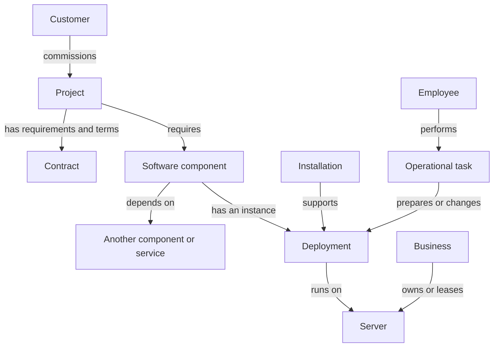

# Domain model

This is the product vocabulary and proposed relationship model. Existing engine entities are identified below; new concepts are not automatically new TypeScript classes, database tables, or UI nodes.

## People, business, and agreements

| Concept | Responsibility and relationships | Status |
|---|---|---|
| Player | Makes decisions for the infrastructure business; distinct from customer organizations | Existing role, not an engine entity |
| Business | Owns or leases infrastructure, earns revenue, pays costs, and develops reputation | Wallet/fleet exist; separate business entity undecided |
| Customer | Commissions projects and owns the resulting product or business outcome | Existing engine entity |
| Project | Groups a customer's requirements and the system or work delivered for them | Existing entity; meaning needs expansion |
| Contract | Defines what is supplied, how it is paid for, and the service or delivery commitment | Commercial terms exist on Project; separate entity undecided |
| Contract obligation | A measurable promise, such as service availability or a job completion deadline | Continuous-service and finite-job evaluation specified; runtime implementation pending |
| Reputation | Determines public standing and influences incoming opportunities | Delegated customer/offer policy; runtime integration pending |
| Trust | A customer's confidence in the provider; strongest relationship input to willingness to wait during setup | Retained; delegated customer policy supplies updates and scale |
| Hatred | A customer's negative feelings toward the provider, separate from trust | Retained; third in influence on setup cancellation, after trust and public reputation |
| Employee | Can be trained and assigned to manage a project, improving service, earnings, and resilience to demand spikes | Later direction after the initial playable product; training, work, costs, and limits pending |
| Configuration skill | A person's proficiency in configuration, influencing the random incident risk of configurations they perform | Applies to player and employees; current skill also benefits existing configurations, independently of Quality Checks |
| Training course | Improves a person's skills | Multiple courses with different personal skill effects; separate from technology research. Five families, five levels and monthly tuition specified in the balance baseline |

One customer can have several projects. Public reputation is not the same as one customer's trust. Do not derive success of the customer's business directly from the player's reputation or hardware purchases.

## Software, placement, and resources

| Concept | Meaning | Status |
|---|---|---|
| Workload | The work to execute: online requests, a finite computation, or another service pattern | Current traffic model is narrower |
| Demand generator | Produces a project's incoming demand from its traits, local time, and events | Per-project responsibility agreed; excludes infrastructure graph management and execution |
| Demand type | Defines the rules for a kind of incoming request or job, including waiting and deadline or timeout behavior | Type-specific rules agreed; exact policy fields and grouping representation pending |
| Demand batch | Groups incoming work with the same demand type, arrival tick, and compatible processing characteristics | Aggregate processing agreed; waiting groups retain arrival age and required progress across ticks |
| Queue | Holds waiting demand within finite memory or storage capacity | In-memory waiting work is lost on full process stop or server shutdown; durable stored work survives restart if data remains intact, retaining its original age |
| Software component | A required part of a project's system, such as an application, database, or worker | Proposed model |
| Project feature | A requirement trait such as email, chat, video streaming, or payments, supported by relevant researched technology | Agreed; a project may combine features, whose deployment and resource requirements remain to be designed |
| Dependency | A component's requirement for another component or service | Required direction; representation pending |
| Deployment | A prepared or running instance of a component on infrastructure, with independent readiness, health, and resource use | Instances of the same project service share configuration; one completed configuration task updates all at a tick boundary, without per-instance overrides |
| Server | Compute infrastructure available to host software; capacity may be shared | Existing entity |
| Power state | Whether owned hardware is powered on or fully shut down, separate from health and deployment readiness | Owned hardware incurs no hourly electricity or maintenance costs while fully powered off; power-on is immediate with no separate startup fee |
| Server specification | Resource characteristics of a hardware option, including CPU, memory, network, and GPU capacity | Meaningful specialization and adding GPU support agreed; authored hardware/demand catalog present; solver verification pending |
| Ownership / lease | How a server is acquired and paid for | Existing tenure model |
| Infrastructure asset | An infrastructure resource owned or leased by the business and referenced by project views | Shared asset identity agreed; hardware catalog supplied in the balance baseline |
| Inventory | Business-wide view of infrastructure assets and their project use | Agreed alternative management view; visiting it is optional for routine project operations |
| Load balancer | Automatically distributes demand among healthy configured targets in proportion to usable workload capacity | Target selection belongs to the player; algorithm and weights are automatic. Nested balancers are allowed without routing loops or duplicated capacity |
| Storage | Resources retaining data independently of request traffic | Disk data survives power-off; volatile running/waiting work and durable data follow Gameplay recovery rules |

An application and a database can share a server without becoming the same component. Conversely, one project can use multiple servers. Replication readiness, single-primary failover, and shared instance configuration follow Gameplay; their solver and lifecycle integration remains technical work.

The diagram is conceptual, not a class schema. Installations have an explicit host and project; logical service configuration is shared by its instances. Coverage can span selected components of that same project, as with Monitoring.

## Capabilities and operational work

| Concept | Meaning | Design boundary |
|---|---|---|
| Technology | Knowledge enabling the use of a capability | Research permission is distinct from installation |
| Installation | Software installed in a defined location with a defined project context | Can consume resources independently of other installations |
| Policy | Desired behavior such as a backup schedule | Distinct from the software and storage implementing it |
| Operational task | Work such as provisioning, configuration, or repair | One player operational queue; durations and prerequisites use the balance baseline; employee execution is deferred |
| Incident | An interruption or degradation of expected operation | Hardware incidents and component incidents have different scope |
| Observation | Information the player or customer has about system behavior | Actual occurrence and discovery time should be distinguishable; representation pending |
| Monitoring | Provides detailed resource visibility, retained errors, and alerts for selected components of one project across servers | One installation may cover multiple components; collection load increases resource use. Basic resource summaries remain available without it |
| Error record | A retained record of a project error | Monitoring responsibility agreed; retention and aggregated record baseline specified in Observation |
| Alert | A notification raised by monitoring about a detected condition | Observation policy supplies thresholds, grouping and Activity delivery; no dedicated Monitoring down alert |
| Metric sample | A measurement associated with a subject and simulation time | Current plus two completed billing periods; coverage and missing-data rules follow Observation |

Monitoring, logging, backups, and rollback should retain their different purposes. A server failure can be known to the player while monitoring coverage for a particular application is still absent. Learning about the shared asset must not magically install monitoring for all its projects.

## Example: two projects on one server

Project A and Project B each have an application deployment on Server S. Each project has its own monitoring installation. The server's available resources are shared; installations consume their own resources, and project views show the same physical asset.

A hardware failure of S affects both deployments. A configuration error in A need not affect B. Moving A must not silently move B or give A a second copy of S's resources. Software movement and data transfer are separate tasks. Disk data survives power-off; data left on a sold or released server is removed, with affected projects and data identified before the action. Backups enable recovery.

## Three different kinds of connection

- **Dependency:** the application needs its database to provide the intended service.
- **Placement:** a deployment runs on a particular server.
- **Traffic routing:** requests are directed through a load balancer or to a serving target.

These connections may be visible together but must not be treated as interchangeable edges. Routing through two components does not imply two customer requests. Layout coordinates belong to presentation rather than capacity or billing rules.

## Mapping from today's engine

Today, Project holds traffic traits, commercial terms, a lifecycle status, and one server route. Server processes demand slices attributed to projects. Game advances time, coordinates resource use, and applies financial and SLA effects.

The target model introduces components and preparation between Project and Server. Retain the engine's authority, shared resource constraints, and accounting foundations while redesigning placement, lifecycle, and end-to-end success attribution. See [Product direction](product-direction.md) for the transition boundary.
